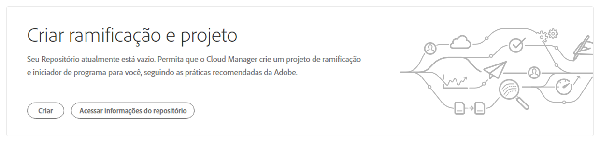
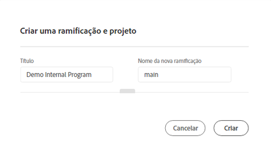
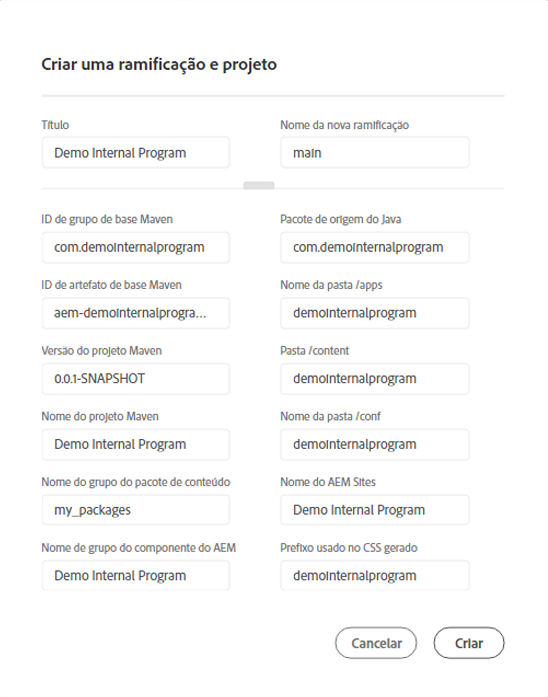
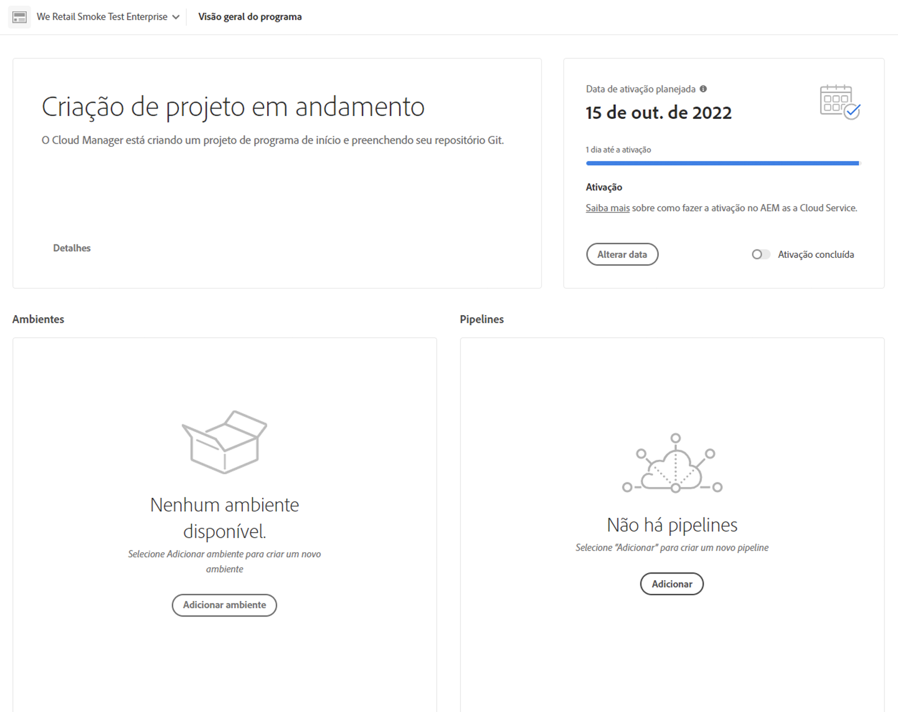
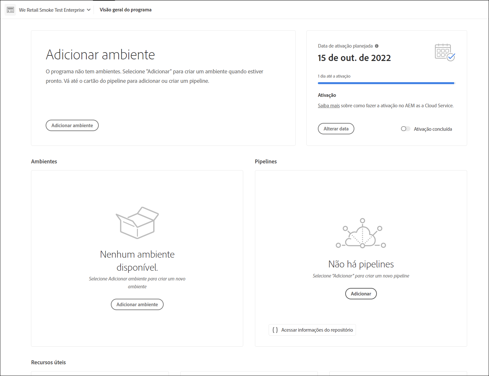

# Assistente de criação de projeto {#project-creation-wizard}

Após criar o programa de produção, o Cloud Manager oferece um assistente para criar um projeto AEM mínimo com base no [Arquétipo de projeto AEM](https://experienceleague.adobe.com/docs/experience-manager-core-components/using/developing/archetype/overview.html?lang=pt-BR) para começar rapidamente.

Siga estas etapas para criar um projeto de aplicativo AEM no Cloud Manager usando o assistente.

1. Crie um programa de produção seguindo as etapas descritas no documento [Criação de programas de produção](creating-production-programs.md)

1. Quando a configuração do programa for concluída, acesse a tela **Visão geral** do seu programa e veja o cartão de chamada para ação **Criar ramificação e projeto** na parte superior.

   

1. Clique em **Criar** para iniciar o assistente e confirmar o **Título** e o **Novo nome da ramificação** na janela **Criar ramificação e projeto**.

   

1. Opcionalmente, clique no divisor para revelar os parâmetros adicionais do seu projeto. Os valores padrão são fornecidos pelo Arquétipo de projeto AEM e geralmente não precisam ser alterados.

   

1. Clique em **Criar** para iniciar o processo de criação do projeto.

O cartão **Criação de projeto em andamento** substitui o cartão de chamada para ação **Criar ramificação e projeto** na parte superior da tela **Visão geral do programa**.

Uma vez concluída a criação do programa, o cartão **Adicionar ambiente** substitui o cartão **Criação de projeto em andamento** na parte superior da tela **Visão geral do programa**.

Agora, você tem um projeto AEM com base no arquétipo que foi adicionado ao seu repositório Git para servir como base para o desenvolvimento do seu próprio projeto. Em seguida, você pode criar seus ambientes, nos quais pode implantar o código do projeto.

Consulte [Gerenciamento de ambientes](/help/implementing/cloud-manager/manage-environments.md) para saber como adicionar ou gerenciar ambientes.

>[!NOTE]
>
>O assistente está disponível somente para programas de produção. Como os [programas de sandbox](introduction-sandbox-programs.md#auto-creation) incluem criação automática de projeto, o assistente não é necessário.