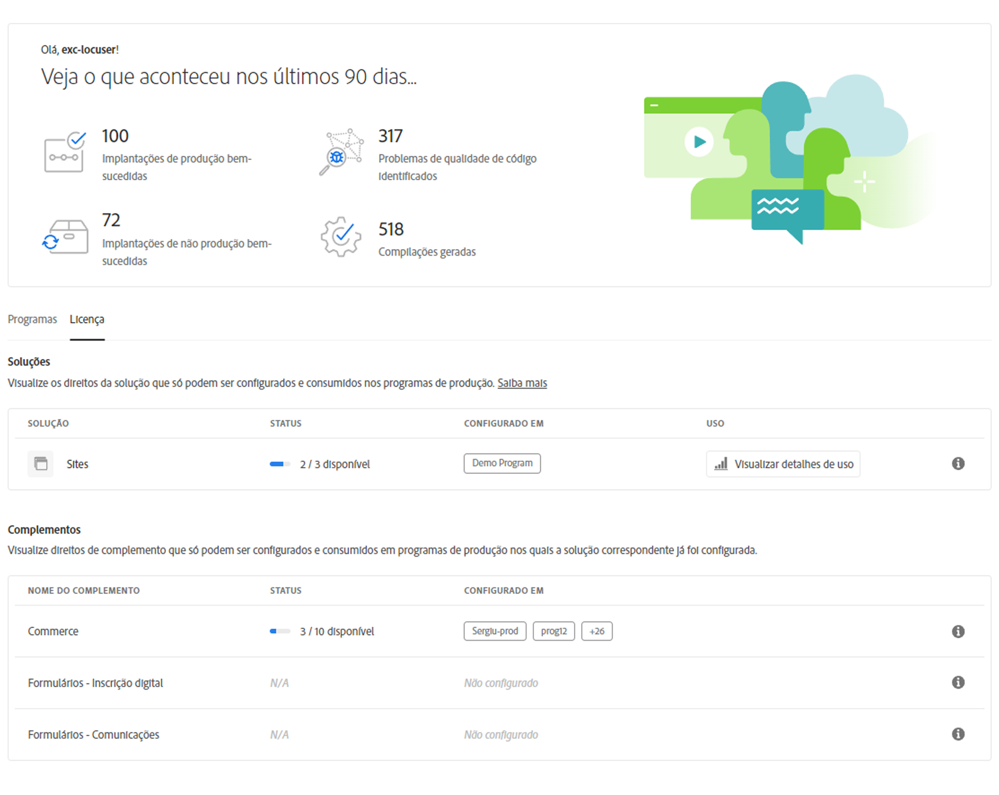
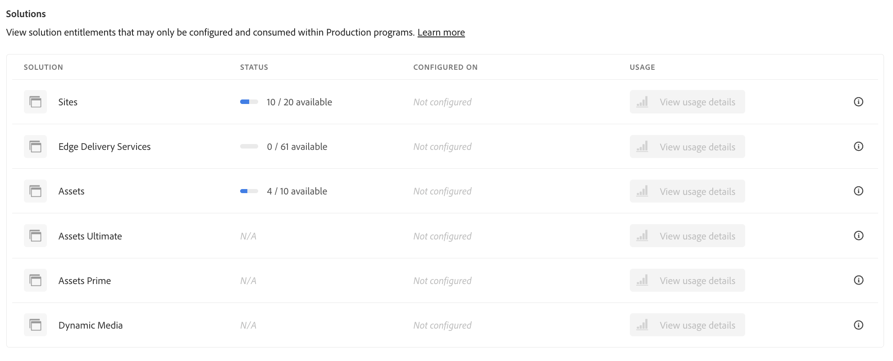

# Painel de licenças {#license-dashboard}

O Cloud Manager fornece um painel para facilitar a visualização dos direitos de produto do Adobe Experience Manager as a Cloud Service (AEMaaCS) disponíveis para sua organização ou locatário.

>[!IMPORTANT]
>
>O Painel de licenças se aplica somente aos programas do AEM as a Cloud Service. [Programas AMS](https://experienceleague.adobe.com/pt-br/docs/experience-manager-cloud-manager/content/introduction) não estão incluídos no Painel de licenças.
>
>Para determinar o tipo de serviço que seu programa tem (AMS ou AEMaaCS), consulte [Navegação na interface do Cloud Manager](/help/implementing/cloud-manager/navigation.md#program-cards).

## Visão geral {#overview}

O painel de licenças da Cloud Manager fornece acesso fácil aos direitos da solução disponíveis para você em todos os seus programas, incluindo o que é usado e o que está disponível. E as métricas de consumo de solicitação de conteúdo com tendência mensal para a solução Sites.

## Acessar o painel de licenças {#using-dashboard}

>[!NOTE]
>
>Um usuário com a função **Proprietário da empresa** deve estar conectado para exibir o painel de licenças.

1. Faça logon no Cloud Manager, em [my.cloudmanager.adobe.com](https://my.cloudmanager.adobe.com/), e selecione a organização apropriada.
1. No console **[Meus Programas](/help/implementing/cloud-manager/navigation.md#my-programs)**, clique em  no [Cabeçalho do Cloud Manager](/help/implementing/cloud-manager/navigation.md#cloud-manager-header). Essa ação revela as guias.
1. Clique na opção **Licença** na guia.

O painel é dividido em três seções que mostram:

* **Soluções** - Quais soluções você licenciou. Por exemplo, Sites, Edge Delivery Services e Assets, entre outros.

  

* **Complementos** - Quais complementos estão disponíveis para suas soluções licenciadas.
* **Outros direitos** - Que ambiente de sandbox e desenvolvimento e outros direitos podem ser consumidos em seu locatário.

Cada seção resume o que está disponível e como é usado, se for o caso. Atualmente, somente as soluções do Sites e do Assets são exibidas, mesmo se outras soluções existirem no locatário.

* A coluna **Status** exibe o número de direitos não utilizados em relação ao total disponível para o locatário.
* A coluna **Configurado em** indica os programas nos quais o direito da solução foi aplicado.
   * Um direito é considerado usado somente quando um ambiente de produção é criado. Ou, se existir, se um pipeline de atualização tiver sido executado nele.
   * Somente um número limitado de programas é listado individualmente na coluna com o restante representado por uma entrada `+x`.
   * Passe o mouse sobre a entrada `+x` para ver um pop-up com detalhes de todos os programas.
* A coluna **Uso** exibe um botão **[Exibir detalhes de uso](#view-usage-details)** para mostrar estatísticas de uso da solução.

>[!TIP]
>
>Para saber como gerenciar os direitos da Adobe em toda a organização pela Admin Console, consulte a [visão geral da Admin Console](https://helpx.adobe.com/br/enterprise/using/admin-console.html).

## Visualizar detalhes de uso {#view-usage-details}

<!--
The **View usage details** button gives access to the chosen solution's **Usage Details** window. This window gives a detailed breakdown including charts to show your solution's usage. How that usage is measured depends on the chosen solution. -->

O botão **Exibir detalhes de uso** na área de licença do Cloud Manager fornece um detalhamento do uso de recursos atual. Quando clicado, ele abre um relatório ou painel que mostra métricas importantes relacionadas à sua licença. <!-- ADD THIS SENTENCE IF ASSETS USAGE DETAILS GETS REINSTATED ", such as the number of users, storage consumption, or bandwidth usage, depending on the type of services you're using." --> Essa funcionalidade ajuda a monitorar e garantir que você permaneça nos limites do contrato, oferecendo insights para um melhor planejamento e otimização de recursos.

### Detalhes de uso de sites {#sites-usage-details}

A janela **Detalhes de uso do Sites** apresenta gráficos que fornecem uma visão geral do uso das licenças do Sites com base em [solicitações de conteúdo](#what-is-a-content-request).

O lado esquerdo da janela apresenta um gráfico de pizza que mostra o detalhamento do contrato para o ano do contrato selecionado na lista suspensa **Exibir ano do contrato**.

O lado direito da janela apresenta um gráfico de área que mostra o uso detalhado por programa ao longo do tempo para o ano do contrato selecionado. Um cursor do mouse revela um pop-up com detalhes por programa para o ponto no tempo selecionado.

Próximo ao canto superior direito da página do painel, você pode clicar em **Baixar relatório** para exportar seus dados como um arquivo CSV. Este download simplifica a análise e o compartilhamento de tendências de uso.

<!-- REMOVED AS PER CQDOC-21983
### Assets usage details {#assets-usage-details}

The **Assets usage details** window, presents graphs giving an overview of the usage of your Assets licenses based on [storage](#storage) and [standard users](#standard-users). Select the appropriate tab to toggle between the views.

For both storage and standard users views, you can use the **Environment Type** dropdown to toggle the view between production, stage, and development environments.

#### Storage {#storage}

The left side of the window presents a pie chart showing the contract breakdown for the contract year selected in the **View contract year** dropdown.

The right side of the window presents an area chart showing the usage broken down by program over time for the selected contract year. A hover reveals a popup with details per program for the selected point in time.

#### Standard Users {#standard-users}

The left side of the window presents a pie chart showing the contract breakdown for the contract year selected in the **View contract year** dropdown.

The right side of the window presents an area chart showing the usage broken down by program over time for the selected contract year. A hover reveals a popup with details per program for the selected point in time. -->

## Perguntas frequentes {#faq}

### O que é uma solicitação de conteúdo?{#what-is-a-content-request}

Uma solicitação de conteúdo é qualquer solicitação direcionada ao AEM Sites ou a um sistema de cache fornecido pelo cliente, como uma rede de entrega de conteúdo. Ele recupera conteúdo ou dados no formato HTML para exibições de página. Ou no formato JSON para chamadas de API.

Uma solicitação de conteúdo é contabilizada para cada exibição de página ou para cada cinco chamadas de API, medidas na entrada do primeiro sistema de cache a receber uma solicitação de conteúdo. As solicitações de conteúdo são contabilizadas somente em ambientes de produção.

As solicitações de conteúdo excluem solicitações ou atividades iniciadas pela Adobe ou em nome dela com o único objetivo de fornecer produtos e serviços. O tráfego de agente de usuário identificado pela Adobe como bots, crawlers e spiders relacionados a mecanismos de pesquisa comuns e serviços de redes sociais também são excluídos.

Consulte também [Entender as solicitações de conteúdo do Cloud Service](/help/implementing/cloud-manager/content-requests.md).

### Como o Adobe Experience Manager mede as solicitações de conteúdo?{#how-are-content-requests-measured}

As solicitações de conteúdo são rastreadas nos servidores de borda do AEM as a Cloud Service. O tráfego de origem não é contabilizado nas solicitações de conteúdo. O CDN incorporado ao AEM as a Cloud Service rastreia solicitações HTML e JSON válidas.

O AEM também tem regras em vigor para excluir bots conhecidos, incluindo serviços conhecidos que acessam o site regularmente para atualizar seu índice de pesquisa ou serviço.

Consulte também [Compreender as solicitações de conteúdo do Cloud Service](/help/implementing/cloud-manager/content-requests.md).

### Por que meu relatório do Analytics mostra resultados diferentes das solicitações de conteúdo do AEM?{#why-are-reports-different}

As solicitações de conteúdo podem ter variações entre as ferramentas de relatório de Analytics de uma organização. Para obter mais informações, consulte [Entendendo as solicitações de conteúdo do Cloud Service](/help/implementing/cloud-manager/content-requests.md).

### E se eu quiser saber mais sobre o volume de solicitação de conteúdo?{#current-request-volumes}

Se você quiser obter insights adicionais sobre o volume de solicitação de conteúdo mostrado no Painel de licenças, a equipe do Adobe pode fornecer um relatório que mostra os principais responsáveis pelo volume das solicitações de conteúdo. Entre em contato com a equipe da Adobe ou com o Suporte ao cliente da Adobe para solicitar um relatório de uso principal.

### E se eu estiver usando meu próprio CDN?{#using-own-cdn}

O painel de Licenças mostra apenas os dados rastreados pelo Cloud Service CDN. Se você optar por Trazer seu próprio CDN (BYOCDN), relate o volume de solicitações de conteúdo à Adobe anualmente, conforme declarado em seu contrato.

