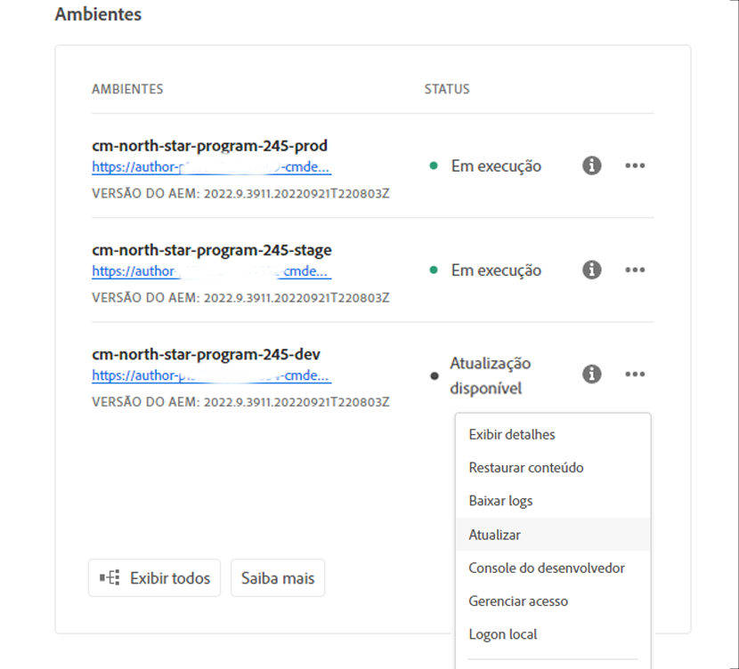
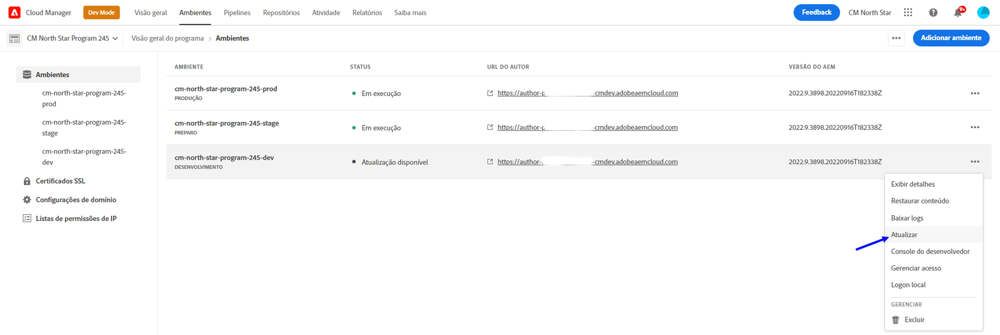
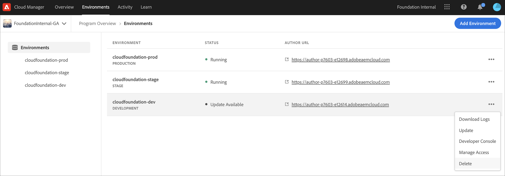
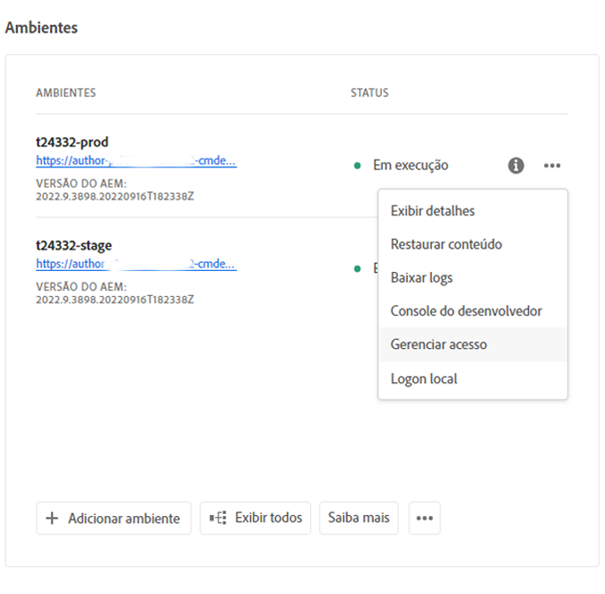
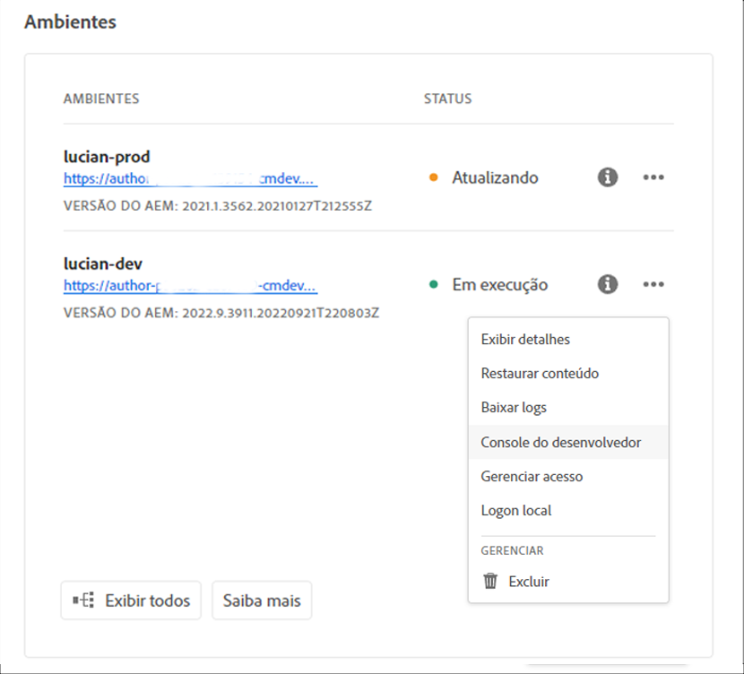

# Gerenciamento de ambientes {#manage-environments}

A seção a seguir descreve os tipos de ambientes que um usuário pode criar e como ele pode criar um ambiente.

## Tipos de ambientes {#environment-types}

Um usuário com as permissões necessárias pode criar os seguintes tipos de ambientes (dentro dos limites do que está disponível para o locatário específico).

* **Produção e Ambiente**de estágio:
A Produção e a Fase estão disponíveis como uma dupla e são utilizadas para fins de teste e produção.

* **Desenvolvimento**: Um ambiente de desenvolvimento pode ser criado para fins de desenvolvimento e teste e será associado apenas a pipelines de não-produção.

   >[!NOTE]
   >Um ambiente de desenvolvimento criado automaticamente em um programa Sandbox será configurado para incluir as soluções Sites e Ativos.

   A tabela a seguir resume os tipos de Ambientes e seus atributos:

   | Nome | Camada do autor | Publicar camada | O usuário pode criar | O usuário pode excluir | Pipeline que pode ser associado ao ambiente |
   |--- |--- |--- |--- |---|---|
   | Produção | Sim | Sim se os sites estiverem incluídos | Sim | Não | Gasoduto de produção |
   | Estágio | Sim | Sim se os sites estiverem incluídos | Sim | Não | Gasoduto de produção |
   | Desenvolvimento | Sim | Sim se os sites estiverem incluídos | Sim | Sim | Gasoduto de não produção |

   >[!NOTE]
   >A Produção e a Fase estão disponíveis como uma dupla e são utilizadas para fins de teste e produção.  O usuário não poderá criar apenas o Estágio ou somente o ambiente de Produção.

## Adicionar um Ambiente {#adding-environments}

1. Clique em **Adicionar Ambiente** para adicionar um ambiente. Esse botão estará acessível na tela **Ambientes** .
   

   A opção **Adicionar Ambiente** também está disponível na placa **Ambientes** quando não há nenhum ambiente no programa.

   

   >[!NOTE]
   >A opção **Adicionar Ambiente** será desativada com base na falta de permissões ou no que pode ser contratado.

1. A caixa de diálogo **Adicionar ambiente** é exibida. O usuário precisa enviar detalhes como **Tipo de ambiente** e **Nome do ambiente** e **Descrição do ambiente** (dependendo do objetivo do usuário ao criar o ambiente dentro dos limites do que está disponível para o locatário específico).

   

   >[!NOTE]
   >Ao criar um ambiente, uma ou mais *integrações* são criadas na E/S do Adobe. Eles estão visíveis para usuários clientes que têm acesso ao Console de E/S do Adobe e não devem ser excluídos. Isso é descartado na descrição no Console de E/S do Adobe.

   

1. Clique em **Salvar** para adicionar um ambiente com os critérios preenchidos.  Agora a tela *Visão geral* exibe o cartão de onde você pode configurar seu pipeline.

   >[!NOTE]
   >Caso ainda não tenha configurado o pipeline de não-produção, a tela *Visão geral* exibe o cartão de onde você pode criar o pipeline de não-produção.

## Atualização do Ambiente {#updating-dev-environment}

As atualizações de ambientes de Estágio e Produção são gerenciadas automaticamente pelo Adobe.

As atualizações dos ambientes de desenvolvimento são gerenciadas pelos usuários do programa. Quando um ambiente não estiver executando a versão mais recente do AEM disponível publicamente, o status na placa Ambientes na tela inicial mostrará **ATUALIZAÇÃO DISPONÍVEL**.

A opção **Atualizar** está disponível no Cartão de **Ambientes** .
Essa opção também está disponível se você clicar em **Detalhes** no cartão de **Ambientes** . A página **Ambientes** é aberta e, depois que você selecionar o ambiente de desenvolvimento, clique em **...** e selecione **Atualizar**, conforme mostrado na figura abaixo:

Selecionar essa opção permitirá que um Gerenciador de implantação atualize o pipeline associado a esse ambiente para a versão mais recente e execute o pipeline.

Se o pipeline já tiver sido atualizado, o usuário será solicitado a executar o pipeline.

## Excluindo Ambiente {#deleting-environment}

O usuário com as permissões necessárias poderá excluir um ambiente de desenvolvimento.

A opção **Excluir** está disponível no menu suspenso no Cartão de **Ambientes** . Clique em **...** para um ambiente de desenvolvimento que você deseja excluir.

A opção de exclusão também estará disponível se você clicar em **Detalhes** no cartão de **Ambientes** . A página **Ambientes** é aberta e, depois que você selecionar o ambiente de desenvolvimento, clique em **...** e selecione **Excluir**, conforme mostrado na figura abaixo:

>[!NOTE]
>
>Este recurso não está disponível para ambientes de produção/estágio definidos em uma configuração regular de programa para fins de produção. No entanto, o recurso está disponível para ambientes de produção/estágio em um programa Sandbox.

## Gerenciamento do acesso {#managing-access}

Selecione **Gerenciar acesso** no menu suspenso no Cartão de **Ambientes** . Você pode navegar para a instância do autor diretamente e gerenciar o acesso do seu ambiente.

Consulte [Gerenciamento do acesso à instância](/help/onboarding/getting-access-to-aem-in-cloud/navigation.md#manage-access-aem) do autor para saber mais.

## Acesso ao Console do desenvolvedor {#accessing-developer-console}

Selecione **Developer Console** no menu suspenso no Cartão de **Ambientes** . Isso abrirá uma nova guia no navegador com a página de logon no **Developer Console**.

Somente um usuário na função Desenvolvedor terá acesso ao **Developer Console**. A exceção é para Programas Sandbox, nos quais qualquer usuário com acesso ao Programa Sandbox do Cloud Manager terá acesso ao **Developer Console**.

Consulte [Hibernando e Deshibernando Ambientes](https://docs.adobe.com/content/help/en/experience-manager-cloud-service/onboarding/getting-access/cloud-service-programs/sandbox-programs.html#hibernating-introduction) Sandbox para obter mais detalhes.

Essa opção também está disponível se você clicar em **Detalhes** no cartão de **Ambientes** . A página **Ambientes** é aberta e, depois que você selecionar um ambiente, clique em **...** e selecione **Developer Console**.

