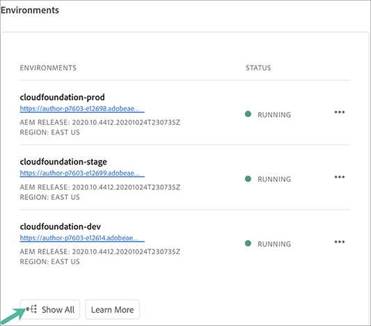
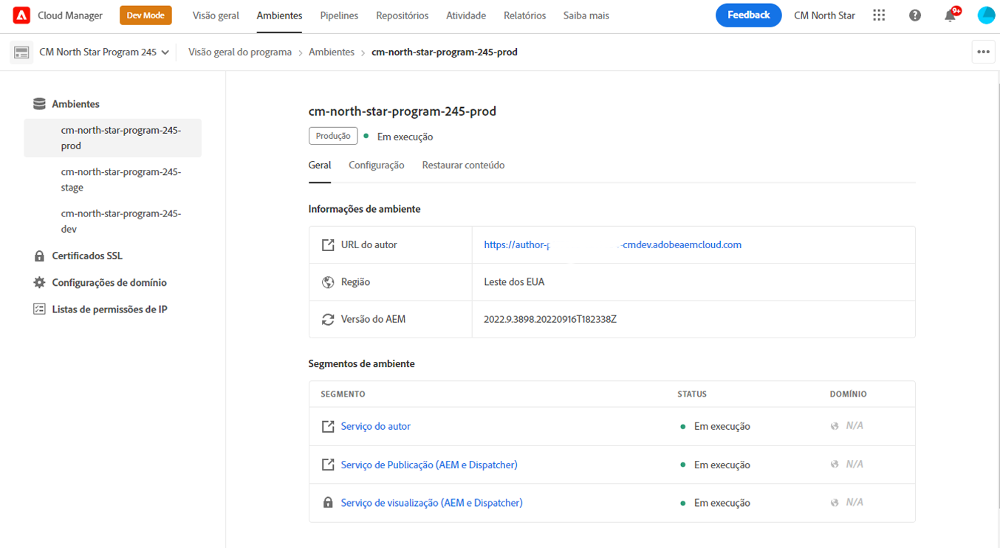

# Gerenciamento de ambientes {#manage-environments}

A seção a seguir descreve os tipos de ambiente que um usuário pode criar e como ele pode criar um ambiente.

## Tipos de ambiente {#environment-types}

Um usuário com as permissões necessárias pode criar os seguintes tipos de ambiente (dentro dos limites do que está disponível para o locatário específico).

* **Ambiente** de produção e preparo: A Produção e o Estágio estão disponíveis como um duo e são usados para fins de teste e produção.

* **Desenvolvimento**: Um ambiente de desenvolvimento pode ser criado para fins de desenvolvimento e teste e será associado apenas a pipelines não relacionados à produção.

   >[!NOTE]
   >Um ambiente de desenvolvimento criado automaticamente em um programa de sandbox será configurado para incluir soluções do Sites e do Assets.

   A tabela a seguir resume os tipos de ambientes e seus atributos:

   | Nome | Camada do autor | Publicar camada | O usuário pode criar | O usuário pode excluir | Pipeline que pode ser associado ao ambiente |
   |--- |--- |--- |--- |---|---|
   | Produção | Sim | Sim se Sites incluídos | Sim | Não | Gasoduto de produção |
   | Estágio | Sim | Sim se Sites incluídos | Sim | Não | Gasoduto de produção |
   | Desenvolvimento | Sim | Sim se Sites incluídos | Sim | Sim | Gasoduto de não produção |

   >[!NOTE]
   >A Produção e o Estágio estão disponíveis como um duo e são usados para fins de teste e produção.  O usuário não poderá criar somente o ambiente de Preparo ou Produção.

## Adicionar ambiente {#adding-environments}

1. Clique em **Adicionar ambiente** para adicionar um ambiente. Esse botão será acessível na tela **Ambientes**.
   

   A opção **Adicionar ambiente** também está disponível no cartão **Ambientes** quando há zero ambientes no programa.

   

   >[!NOTE]
   >A opção **Adicionar Ambiente** será desativada com base na falta de permissões ou no que pode ser contratado.

1. A caixa de diálogo **Adicionar ambiente** é exibida. O usuário precisa enviar detalhes como **Tipo de ambiente** e **Nome do ambiente** e **Descrição do ambiente** (dependendo do objetivo do usuário ao criar o ambiente dentro dos limites do que está disponível para o locatário específico).

   

   >[!NOTE]
   >Ao criar um ambiente, uma ou mais *integrações* são criadas no Adobe I/O. Elas estão visíveis para os usuários clientes que têm acesso ao console Adobe I/O e não devem ser excluídas. Isso é descartado na descrição no console do Adobe I/O.

   

1. Clique em **Save** para adicionar um ambiente com os critérios preenchidos.  Agora a tela *Visão geral* exibe o cartão de onde você pode configurar o pipeline.

   >[!NOTE]
   >Caso ainda não tenha configurado o pipeline de não produção, a tela *Visão geral* exibe o cartão de onde você pode criar o pipeline de não produção.

## Ambiente de visualização {#viewing-environment}

O cartão **Ambientes** na página Visão geral lista até três ambientes.

1. Selecione o botão **Mostrar tudo** para navegar até a página de resumo **Ambiente** para exibir uma tabela com uma lista completa de ambientes.

   

1. A página **Ambientes** exibe a lista de todos os ambientes existentes.

   

1. Selecione qualquer um dos ambientes na lista para exibir os detalhes do ambiente.

   

## Atualização do ambiente {#updating-dev-environment}

As atualizações de ambientes de Preparo e Produção são gerenciadas automaticamente pelo Adobe.

As atualizações para ambientes de desenvolvimento são gerenciadas pelos usuários do programa. Quando um ambiente não estiver executando a versão de AEM mais recente disponível publicamente, o status no Cartão de ambientes na tela inicial mostrará **ATUALIZAR DISPONÍVEL**.

A opção **Update** está disponível no cartão **Ambientes**.
Essa opção também estará disponível se você clicar em **Detalhes** no cartão **Ambientes**. A página **Ambientes** é aberta e, depois de selecionar o Ambiente de desenvolvimento, clique em **...** e selecione **Atualizar**, conforme mostrado na figura abaixo:

Selecionar essa opção permitirá que um Gerenciador de implantação atualize o pipeline associado a esse ambiente para a versão mais recente e, em seguida, execute o pipeline.

Se o pipeline já tiver sido atualizado, o usuário será solicitado a executar o pipeline.

## Excluindo o ambiente {#deleting-environment}

O usuário com as permissões necessárias poderá excluir um ambiente de desenvolvimento.

A opção **Delete** está disponível no menu suspenso no cartão **Ambientes**. Clique em **...** para um ambiente de desenvolvimento que você deseja excluir.

A opção de exclusão também estará disponível se você clicar em **Detalhes** no cartão **Ambientes**. A página **Ambientes** é aberta e, depois de selecionar o Ambiente de desenvolvimento, clique em **...** e selecione **Delete**, conforme mostrado na figura abaixo:

>[!NOTE]
>
>Esse recurso não está disponível para o ambiente de Produção/Estágio definido em um programa de Produção configurado para fins de produção. No entanto, o recurso está disponível para ambientes de Produção/Estágio em um programa de sandbox.

## Gerenciamento de acesso {#managing-access}

Selecione **Gerenciar acesso** no menu suspenso do cartão **Ambientes**. Você pode navegar diretamente para a instância do autor e gerenciar o acesso do seu ambiente.

Consulte [Gerenciando o Acesso à Instância do Autor](/help/onboarding/getting-access-to-aem-in-cloud/navigation.md#manage-access-aem) para saber mais.

## Acessar o Console do desenvolvedor {#accessing-developer-console}

Selecione **Console do Desenvolvedor** no menu suspenso do cartão **Ambientes**. Isso abrirá uma nova guia no navegador com a página de logon em **Console do desenvolvedor**.

Somente um usuário na função Desenvolvedor terá acesso ao **Console do Desenvolvedor**. A exceção é para Programas de sandbox, em que qualquer usuário com acesso ao Programa de sandbox do Cloud Manager terá acesso ao **Console do desenvolvedor**.

Consulte [Hibernando e removendo ambientes de sandbox](https://docs.adobe.com/content/help/en/experience-manager-cloud-service/onboarding/getting-access/cloud-service-programs/sandbox-programs.html#hibernating-introduction) para obter mais detalhes.

Essa opção também estará disponível se você clicar em **Detalhes** no cartão **Ambientes**. A página **Ambientes** é aberta e, depois de selecionar um ambiente, clique em **...** e selecione **Console do desenvolvedor**.

## Fazer logon localmente {#login-locally}

Selecione **Logon local** no menu suspenso do cartão **Ambientes** para fazer logon localmente no Adobe Experience Manager.

Além disso, você pode fazer logon localmente na página de resumo **Ambientes**.

## Gerenciando Nomes de Domínio Personalizados {#manage-cdn}

Navegue até a página de detalhes **Ambientes** na página Resumo dos ambientes .

As seguintes ações podem ser executadas no serviço de Publicação para o seu ambiente, conforme descrito abaixo:

1. [Adicionar um nome de domínio personalizado](/help/implementing/cloud-manager/custom-domain-names/add-custom-domain-name.md)

1. [Visualização e atualização de um nome de domínio personalizado](/help/implementing/cloud-manager/custom-domain-names/view-update-replace-custom-domain-name.md)

1. [Excluindo um Nome de Domínio Personalizado](/help/implementing/cloud-manager/custom-domain-names/delete-custom-domain-name.md)

1. [Verificando o status do ](/help/implementing/cloud-manager/custom-domain-names/check-domain-name-status.md#pre-existing-cdn) nome de domínio personalizado ou de um certificado  [SSL](/help/implementing/cloud-manager/managing-ssl-certifications/check-status-ssl-certificate.md#pre-existing-cdn).

1. [Verificando o status de uma Lista de permissões IP](/help/implementing/cloud-manager/ip-allow-lists/check-ip-allow-list-status.md#pre-existing-cdn)

## Gerenciando Listas de permissões IP {#manage-ip-allow-lists}

Navegue até a página Detalhes do ambiente na página Resumo dos ambientes . Você pode executar as seguintes ações no(s) serviço(s) de Publicação e/ou Autor para seu ambiente aqui.

### Aplicação de uma Lista de permissões IP {#apply-ip-allow-list}

A aplicação de uma Lista de permissões IP é o processo pelo qual todos os intervalos IP incluídos na definição da Lista de permissões são associados a um serviço de Autor ou Publicação em um ambiente. Um usuário na função Proprietário comercial ou Gerente de implantação deve estar conectado para poder aplicar uma Lista de permissões de IP.

>[!NOTE]
>A Lista de permissões IP deve existir no Cloud Manager para ser aplicada a um serviço do ambiente. Para saber mais sobre Listas de permissões de IP no Cloud Manager, navegue até [Introdução às Listas de permissões de IP no Cloud Manager](/help/implementing/cloud-manager/ip-allow-lists/introduction.md).

Siga as etapas abaixo para aplicar uma Lista de permissões IP:

1. Navegue até o ambiente específico na página de detalhes **Ambientes** e navegue até a tabela **Listas de permissões IP**.
1. Use os campos de entrada na parte superior da tabela Lista de permissões de IP para selecionar a Lista de permissões de IP e o serviço de Autor ou Publicação ao qual deseja aplicá-la.
1. Clique em **Aplicar** e confirme seu envio.

### Desaplicar uma Lista de permissões IP {#unapply-ip-allow-list}

Desaplicar uma Lista de permissões IP é o processo pelo qual todos os intervalos IP incluídos na definição da Lista de permissões são desassociados de um serviço Autor ou Editor em um ambiente. Um usuário na função Proprietário comercial ou Gerente de implantação deve estar conectado para poder Desaplicar uma Lista de permissões IP.

Siga as etapas abaixo para desaplicar uma Lista de permissões IP:

1. Navegue até a página de detalhes **Ambientes** específica da tela Ambientes e navegue até a tabela **Listas de permissões IP**.
1. Identifique a linha na qual a regra de Lista de permissões IP que você deseja desaplicar está listada.
1. Selecione o **...** a partir da extremidade direita da linha.
1. Selecione a opção **Unapply** e confirme seu envio.

