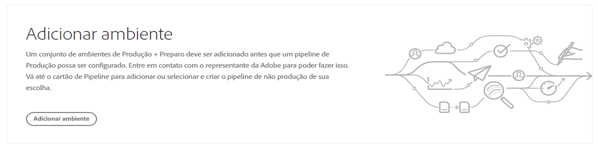
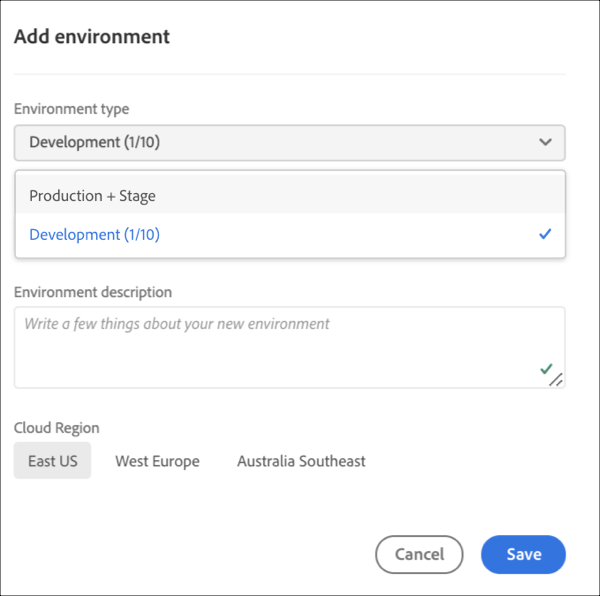
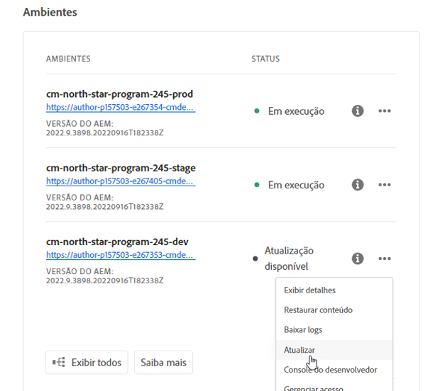
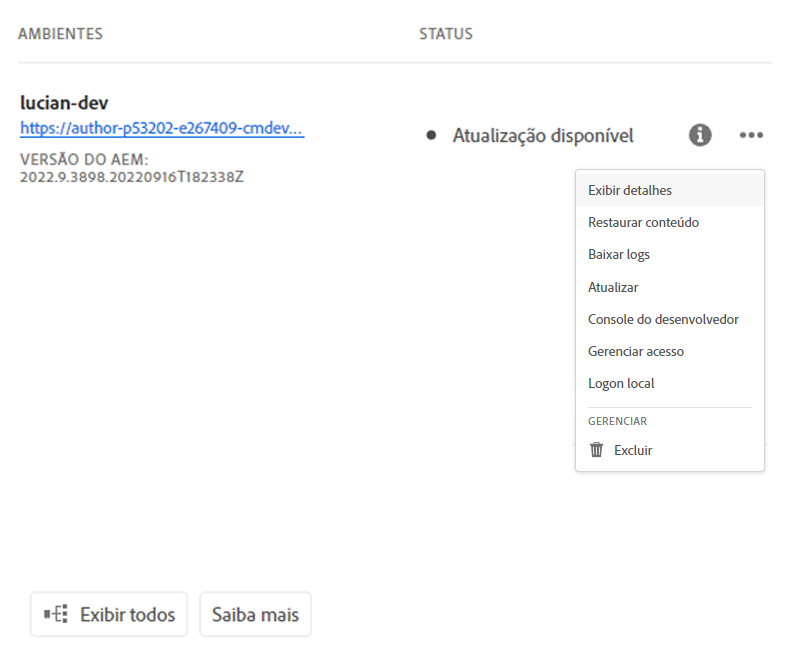

# Gerenciamento de ambientes {#manage-environments}

A seção a seguir descreve os tipos de ambientes que um usuário pode criar e como ele pode criar um ambiente.

## Tipos de Ambientes {#environment-types}

Um usuário com as permissões necessárias pode criar os seguintes tipos de ambientes (dentro dos limites do que está disponível para o locatário específico).

* **Produção e Ambiente**de estágio:
A Produção e a Fase estão disponíveis como uma dupla e são utilizadas para fins de teste e produção.

* **Desenvolvimento**: Um ambiente de desenvolvimento pode ser criado para fins de desenvolvimento e teste e será associado apenas a pipelines de não-produção.

   >[!NOTE]
   >Um ambiente de desenvolvimento criado automaticamente em um programa Sandbox será configurado para incluir as soluções Sites e Ativos.

   A tabela a seguir resume os tipos de Ambientes e seus atributos:

   | Nome | Camada do autor | Publicar camada | O usuário pode criar | O usuário pode excluir | Pipeline que pode ser associado ao ambiente |
   |--- |--- |--- |--- |---|---|
   | Produção | Sim | Sim se os sites estiverem incluídos | Sim | Não | Gasoduto de produção |
   | Estágio | Sim | Sim se os sites estiverem incluídos | Sim | Não | Gasoduto de produção |
   | Desenvolvimento | Sim | Sim se os sites estiverem incluídos | Sim | Sim | Gasoduto de não produção |

   >[!NOTE]
   >A Produção e a Fase estão disponíveis como uma dupla e são utilizadas para fins de teste e produção.  O usuário não poderá criar apenas o Estágio ou somente o ambiente de Produção.

## Adicionar um Ambiente {#adding-environments}

1. O usuário clica no botão **Adicionar ambiente** para adicionar um ambiente.

   >[!NOTE]
   >Esse botão também pode ser acessado da página Ambientes ou do cartão Ambientes. Como usuário, essa opção será exibida somente se você tiver a permissão necessária. Entre em contato com seu representante da Adobe em caso de dúvidas.

   

1. A caixa de diálogo **Adicionar ambiente** é exibida. O usuário precisa enviar detalhes como **Tipo de ambiente** e **Nome do ambiente** e **Descrição do ambiente** (dependendo do objetivo do usuário ao criar o ambiente dentro dos limites do que está disponível para o locatário específico).

   

   >[!NOTE]
   >Ao criar um ambiente, uma ou mais *integrações* são criadas em E/S da Adobe. Eles estão visíveis para usuários clientes que têm acesso ao console de E/S da Adobe e não devem ser excluídos. Isso é descartado na descrição no console de E/S da Adobe.

   

1. Clique em **Salvar** para adicionar um ambiente com os critérios preenchidos.  Agora a tela *Visão geral* exibe o cartão de onde você pode configurar seu pipeline.

   >[!NOTE]
   >Caso ainda não tenha configurado o pipeline de não-produção, a tela *Visão geral* exibe o cartão de onde você pode criar o pipeline de não-produção.

## Atualização do Ambiente {#updating-dev-environment}

As atualizações de ambientes de Estágio e Produção são gerenciadas automaticamente pela Adobe.

As atualizações dos ambientes de desenvolvimento são gerenciadas pelos usuários do programa. Quando um ambiente não estiver executando a versão mais recente do AEM disponível publicamente, o status na placa de Ambientes na tela inicial mostrará **ATUALIZAÇÃO DISPONÍVEL**.

)

Quando esse status for exibido, a opção **Atualizar** estará disponível no menu suspenso, tanto no Cartão de ambientes quanto no menu **Gerenciar**, se você clicar em **Detalhes** no cartão **AMBIENTES**.

Selecionar isso no menu suspenso permitirá que um Gerenciador de implantação atualize o pipeline associado a esse ambiente para a versão mais recente e execute o pipeline.

Se o pipeline já tiver sido atualizado, o usuário será solicitado a executar o pipeline.
