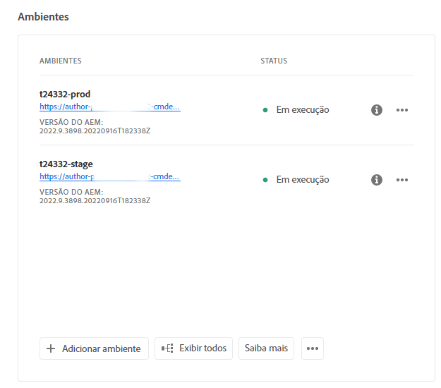
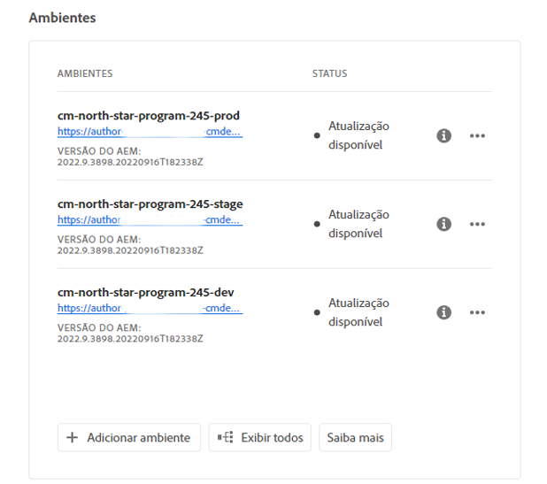

# Gerenciamento de ambientes {#managing-environments}

Saiba mais sobre os tipos de ambientes que você pode criar e como criá-los para o seu projeto do Cloud Manager.

## Tipos de ambientes {#environment-types}

Um usuário com as permissões necessárias pode criar os tipos de ambientes descritos a seguir (dentro dos limites do que está disponível para o locatário específico).

* **Produção + Preparo** - Os ambientes de produção e de preparo estão disponíveis como um par e são usados para fins de produção e teste, respectivamente. Realizar testes de desempenho e segurança no ambiente de preparo. Ele tem o mesmo tamanho da produção.

* **Desenvolvimento** - Um ambiente de desenvolvimento pode ser criado para fins de desenvolvimento e teste e pode ser associado apenas a pipelines de não produção.  Os ambientes de desenvolvimento não têm o mesmo tamanho que os de preparo e produção e não devem ser usados para realizar testes de desempenho e segurança.

* **Desenvolvimento rápido**: um ambiente de desenvolvimento rápido (RDE) permite que um desenvolvedor implante e revise alterações rapidamente, minimizando o tempo necessário para testar recursos que comprovadamente funcionam em um ambiente de desenvolvimento local. Consulte [a documentação de ambientes de desenvolvimento rápido](/help/implementing/developing/introduction/rapid-development-environments.md) para obter detalhes sobre como usar um RDE.

Os recursos de ambientes individuais dependem das soluções ativadas no [programa](/help/implementing/cloud-manager/getting-access-to-aem-in-cloud/program-types.md) do ambiente.

* [Sites](/help/overview/introduction.md)
* [Assets](/help/assets/overview.md)
* [Forms](/help/forms/home.md)
* [Screens](/help/screens-cloud/introduction/introduction.md)

>[!NOTE]
>
>Ambientes de produção e de preparo são criados apenas em pares. Não é possível criar apenas um ambiente de preparo ou de produção.

## Adição de um ambiente {#adding-environments}

Para adicionar ou editar um ambiente, o usuário deve ser membro do **Proprietário da empresa** função.

1. Faça logon no Cloud Manager, em [my.cloudmanager.adobe.com](https://my.cloudmanager.adobe.com/), e selecione a organização apropriada.

1. Clique no programa ao qual deseja adicionar um ambiente.

1. Na página **Visão geral do Programa**, clique em **Adicionar Ambiente** no cartão **Ambientes** para adicionar um ambiente.

   

   * A opção **Adicionar ambiente** também está disponível na guia **Ambientes**.

     

   * A opção **Adicionar ambiente** pode estar desativada devido à falta de permissões ou dependendo dos recursos licenciados.

1. Na caixa de diálogo **Adicionar ambiente**:

   * Selecione um [**tipo de ambiente**.](#environment-types)
      * O número de ambientes disponíveis/usados é exibido entre parênteses atrás do nome do tipo de ambiente.
   * Forneça um **nome** de ambiente.
   * Forneça uma **descrição** do ambiente.
   * Se estiver adicionando um ambiente de **Produção + Preparo**, é necessário fornecer um nome e uma descrição tanto para o ambiente de produção quanto para o de preparo.
   * Selecione uma **região principal** no menu suspenso.
      * A região principal não pode ser alterada após a criação.
      * Dependendo dos direitos disponíveis, talvez seja possível configurar [várias regiões](#multiple-regions).

   

1. Clique em **Salvar** para adicionar o ambiente especificado.

A tela **Visão geral** agora exibe seu novo ambiente no cartão **Ambientes**. Agora você pode configurar pipelines para seu novo ambiente.

## Várias regiões de publicação {#multiple-regions}

Usuários com a função **Proprietário de empresa** podem configurar ambientes de produção e de preparo incluindo até três regiões de publicação adicionais, além da região principal. Regiões de publicação adicionais podem melhorar a disponibilidade. Consulte a [documentação Regiões de publicação adicionais](/help/operations/additional-publish-regions.md) para obter mais detalhes.

>[!TIP]
>
>Você pode usar a [API do Cloud Manager](https://developer.adobe.com/experience-cloud/cloud-manager/guides/api-usage/creating-programs-and-environments/#creating-aem-cloud-service-environments) para consultar uma lista atualizada de regiões disponíveis.

### Adicionar várias regiões de publicação a um novo ambiente {#add-regions}

Ao adicionar um novo ambiente, é possível optar por configurar regiões adicionais, além da região principal.

1. Selecione a **Região principal**.
   * A região principal não pode ser alterada após a criação do ambiente.
1. Selecione a opção **Adicionar regiões de publicação adicionais** e será exibido um novo menu suspenso de **Regiões de publicação adicionais**.
1. No menu suspenso **Regiões de publicação adicionais**, selecione uma região adicional.
1. A região selecionada é adicionada abaixo do menu suspenso para indicar sua seleção.
   * Selecione o `X` ao lado da região selecionada, para que você possa desmarcá-la.
1. Para adicionar outra região, selecione-a no menu suspenso **Regiões de publicação adicionais**.
1. Selecionar **Salvar** quando estiver pronto para criar seu ambiente.

As regiões selecionadas serão aplicadas a ambos os ambientes, de produção e de preparo.

Se não especificar nenhuma região adicional, [é possível fazê-lo mais tarde, após a criação dos ambientes.](#edit-regions)

Se quiser provisionar uma [rede avançada](/help/security/configuring-advanced-networking.md) para o programa, é recomendável fazê-lo antes de adicionar outras regiões de publicação aos ambientes usando a API do Cloud Manager. Caso contrário, o tráfego das regiões de publicação adicionais passará pelo proxy da região principal.

### Editar várias regiões de publicação {#edit-regions}

Se não tiver especificado nenhuma região adicional previamente, é possível fazer isso após a criação dos ambientes, caso possua os direitos necessários.

Você também pode remover regiões de publicação adicionais. No entanto, só é possível adicionar ou remover regiões em uma transação. Se precisar adicionar uma região e remover outra, primeiro adicione, salve a alteração e depois remova (ou vice-versa).

1. No console Visão geral do programa, clique no botão de reticências do ambiente de produção e selecione **Editar** no menu.

   

1. Na caixa de diálogo **Editar ambiente de produção**, faça as alterações necessárias nas regiões de publicação adicionais.
   * Use o menu suspenso **Regiões de publicação adicionais** para selecionar regiões adicionais.
   * Clique no X ao lado das regiões de publicação adicionais selecionadas para desmarcá-las.

   

1. Selecionar **Salvar** para salvar as alterações.

As alterações feitas no ambiente de produção também serão aplicadas no ambiente de preparo. As alterações em várias regiões de publicação podem ser editadas somente no ambiente de produção.

Se quiser provisionar uma [rede avançada](/help/security/configuring-advanced-networking.md) para o programa, é recomendável fazê-lo antes de adicionar outras regiões de publicação aos ambientes. Caso contrário, o tráfego das regiões de publicação adicionais passará pelo proxy da região principal.

## Detalhes do ambiente {#viewing-environment}

É possível usar o cartão **Ambientes** na página de visão geral para acessar os detalhes de um ambiente de duas maneiras.

1. Na página **Visão Geral**, clique na guia **Ambientes** na parte superior da tela.

   

   * Como alternativa, clique no botão **Mostrar Tudo** no cartão **Ambientes** para ir diretamente para a guia **Ambientes**.

     

1. A tela **Ambientes** abre, listando todos os ambientes do programa.

   

1. Clique em um ambiente na lista para revelar seus detalhes.

   

Como alternativa, clique no botão de reticências do ambiente desejado e selecione **Exibir detalhes**.

>[!NOTE]
>
>O cartão **Ambientes** lista apenas três ambientes. Clique no botão **Mostrar Tudo** conforme descrito anteriormente para ver todos os ambientes do programa.

### Acesso ao serviço de visualização {#access-preview-service}

O Cloud Manager oferece um serviço de visualização (fornecido como um serviço de publicação adicional) para cada ambiente do AEM as a Cloud Service.

Usando o serviço, é possível visualizar a experiência final de um site antes que ele atinja o ambiente de publicação real e esteja disponível publicamente.

Após a criação, será aplicada uma lista de permissões de IP padrão ao serviço de visualização, identificada como `Preview Default [<envId>]`, que bloqueará todo o tráfego para o serviço de visualização. Desative a lista de permissões de IP padrão do serviço de visualização para poder habilitar o acesso.

Um usuário com as permissões necessárias deve concluir as etapas a seguir antes de compartilhar o URL do serviço de visualização para garantir o acesso a ele.

1. Crie uma lista de permissões IP apropriada, aplique-a ao serviço de visualização e desative imediatamente a lista de permissões `Preview Default [<envId>]`.

   * Consulte [Aplicação e desativação de listas de permissões de IP](/help/implementing/cloud-manager/ip-allow-lists/apply-allow-list.md) para obter mais detalhes.

1. Use o fluxo de trabalho **Lista de permissões de IP** para remover o IP padrão e adicionar IPs conforme necessário. Consulte [Gerenciamento de listas de permissões de IP](/help/implementing/cloud-manager/ip-allow-lists/managing-ip-allow-lists.md) para saber mais.

Quando o acesso ao serviço de visualização estiver desbloqueado, o ícone de cadeado na frente do nome do serviço de visualização não será mais exibido .

Uma vez ativado, será possível publicar conteúdo para o serviço de visualização usando a interface Gerenciar publicação no AEM. Consulte [Visualização de Conteúdo](/help/sites-cloud/authoring/fundamentals/previewing-content.md) para obter mais detalhes.

>[!NOTE]
>
>Seu ambiente deve estar na versão `2021.05.5368.20210529T101701Z` do AEM, ou mais recente, para usar o serviço de visualização. Certifique-se de que um pipeline de atualização foi executado com sucesso em seu ambiente para poder usar o serviço de visualização.

### Status de regiões de publicação adicionais {#additional-region-status}

Se você tiver ativado regiões de publicação adicionais, será possível verificar o status dessas regiões na **Ambientes** cartão.

1. No **Visão geral** localize a **Ambientes** cartão.

1. No **Ambientes** , o **Status** A coluna refletirá se houver problemas com as regiões de publicação adicionais configuradas. Clique em **Informações** ícone para obter detalhes das regiões.

   

Como alternativa, você pode acessar as mesmas informações no **Ambientes** guia.

1. No **Visão geral** selecione a **Ambientes** guia.

1. No **Ambientes** selecione o ambiente que deseja consultar no painel de navegação esquerdo.

1. Depois que um ambiente é selecionado:

   * A variável **Informações do ambiente** A tabela mostrará quais regiões estão configuradas para o ambiente selecionado.
   * A variável **Status** coluna da **Segmentos de ambiente** A tabela refletirá se há problemas com as regiões de publicação adicionais configuradas. Passe o mouse sobre o status para obter detalhes sobre qualquer problema.

   

Se houver problemas relatados com regiões de publicação adicionais:

1. Seja paciente. O Cloud Manager tenta continuamente recuperar a região e ela pode ficar disponível a qualquer momento.
1. Se o problema persistir após várias horas, é possível remover a região de publicação adicional e adicioná-la novamente (na mesma região ou em outra) para acionar uma implantação completa.

Quanto tempo você esperar até que o sistema se recupere por conta própria antes de tomar medidas adicionais depende do impacto que a falha dessa região tem em seus sistemas.

Em qualquer caso, [o tráfego é sempre roteado para a outra região mais próxima que esteja online.](/help/operations/additional-publish-regions.md) Se o problema persistir, entre em contato com o Atendimento ao cliente da Adobe.

## Atualização de ambientes {#updating-dev-environment}

Como um serviço de nuvem nativo, as atualizações dos ambientes de preparo e produção nos programas de produção são gerenciadas automaticamente pela Adobe.

No entanto, as atualizações para ambientes de desenvolvimento e de programas de sandbox são gerenciadas dentro dos programas. Quando um ambiente não estiver executando a versão mais recente do AEM disponível publicamente, o status no cartão **Ambientes** na tela **Visão Geral** do programa mostrará **Atualização Disponível**.

### Atualizações e pipelines {#updates-pipelines}

Os pipelines são a única maneira de [implantar código nos ambientes do AEM as a Cloud Service.](deploy-code.md) Por esse motivo, cada pipeline está associado a uma versão específica do AEM.

Se o Cloud Manager detectar que está disponível uma versão do AEM mais recente do que a implantada pela última vez no pipeline, ele mostrará o status **Atualização Disponível** para o ambiente.

O processo de atualização é, portanto, um processo de duas etapas:

1. Atualização do pipeline com a versão mais recente do AEM
1. Execução do pipeline para implantar a nova versão do AEM em um ambiente

### Atualização dos ambientes {#updating-your-environments}

A opção **Atualizar** estará disponível no cartão **Ambientes** para ambientes de desenvolvimento e de programas de sandbox, clicando no botão de reticências do ambiente.

Essa opção também está disponível selecionando a guia **Ambientes** do programa e clicando no botão de reticências do ambiente.

Um usuário com a variável **Gerente de implantação** ou **Proprietário da empresa** A função pode usar essa opção para atualizar o pipeline associado a esse ambiente para a versão mais recente do AEM.

Quando a versão do pipeline é atualizada para a versão mais recente do AEM disponível publicamente, o usuário é solicitado a executar o pipeline associado para implantar a nova versão no ambiente.

O comportamento da opção **Atualizar** varia dependendo da configuração e do estado atual do programa.

* Se o pipeline já tiver sido atualizado, a opção **Atualizar** solicitará que o usuário execute o pipeline.
* Se o pipeline estiver sendo atualizado, a variável **Atualizar** informará ao usuário que uma atualização já está em execução.
* Se um pipeline apropriado não existir, a opção **Atualizar** solicitará que o usuário crie um.

## Exclusão de ambientes de desenvolvimento {#deleting-environment}

Um usuário com a variável **Gerente de implantação** ou **Proprietário da empresa** a função pode excluir um ambiente de desenvolvimento.

Na tela **Visão geral** do programa no cartão **Ambientes**, clique no botão de reticências do ambiente de desenvolvimento que deseja excluir.

A opção de exclusão também está disponível na guia **Ambientes** da janela **Visão geral** do programa. Clique no botão de reticências do ambiente e selecione **Excluir**.

>[!NOTE]
>
>* Os ambientes de produção e de preparo criados em um programa de produção não podem ser excluídos.
>* Os ambientes de produção e de preparo em um programa de sandbox podem ser excluídos.

## Gerenciamento de acesso {#managing-access}

Selecione **Gerenciar acesso** no menu de reticências do ambiente no cartão **Ambientes**. Você pode navegar diretamente para a instância de autoria e gerenciar o acesso ao seu ambiente.

>[!TIP]
>
>Consulte [Perfis de produto e de equipe do AEM as a Cloud Service](/help/onboarding/aem-cs-team-product-profiles.md) se quiser saber como os perfis de produto e de equipe do AEM as a Cloud Service podem conceder e limitar o acesso às suas soluções licenciadas da Adobe.

## Acesso ao Developer Console {#accessing-developer-console}

Selecione **Developer Console** no menu de reticências do ambiente no cartão **Ambientes**. Uma nova guia é aberta no seu navegador com a página de logon do **Developer Console**.

Somente um usuário com a função **Desenvolvedor** terá acesso ao **Developer Console**. No entanto, para programas de sandbox, qualquer usuário com acesso ao programa de sandbox terá acesso ao **Developer Console**.

Consulte [Hibernação e cancelamento da hibernação de ambientes de sandbox](https://experienceleague.adobe.com/docs/experience-manager-cloud-service/content/implementing/using-cloud-manager/programs/introduction-sandbox-programs.html?lang=pt-BR#hibernation) para obter mais detalhes.

Essa opção também está disponível na guia **Ambiente** da janela **Visão geral** clicando no menu de reticências de um ambiente individual.

## Logon local {#login-locally}

Selecionar **Logon local** no menu de reticências do ambiente no **Ambientes** para fazer logon localmente no Adobe Experience Manager.

Além disso, é possível fazer logon localmente na guia **Ambientes** da página **Visão geral**.

## Gerenciar nomes de domínio personalizados {#manage-cdn}

Os nomes de domínio personalizados são suportados nos programas do Sites do Cloud Manager para serviços de publicação e visualização. Cada ambiente do Cloud Manager pode hospedar no máximo 250 domínios personalizados.

Para configurar nomes de domínio personalizados, navegue até a guia **Ambientes** e clique em um ambiente para exibir os detalhes.

O usuário deve ter uma função de **Proprietário da empresa** ou **Gerente de implantação** para adicionar um nome de domínio personalizado no Cloud Manager

As ações a seguir podem ser realizadas no serviço de publicação do seu ambiente.

* [Adicionar um nome de domínio personalizado](/help/implementing/cloud-manager/custom-domain-names/add-custom-domain-name.md)

* [Gerenciar nomes de domínio personalizados](/help/implementing/cloud-manager/custom-domain-names/managing-custom-domain-names.md)

* [Verificar o status do nome de domínio personalizado](/help/implementing/cloud-manager/custom-domain-names/check-domain-name-status.md#pre-existing-cdn) ou [Certificado SSL](/help/implementing/cloud-manager/managing-ssl-certifications/managing-certificates.md#pre-existing-cdn).

* [Gerenciamento de listas de permissões de IP](/help/implementing/cloud-manager/ip-allow-lists/managing-ip-allow-lists.md#pre-existing-cdn)

## Gerenciamento de listas de permissões de IP {#manage-ip-allow-lists}

As listas de permissões de IP são compatíveis com o Cloud Manager para serviços de criação, publicação e visualização de programas do Sites.

Para gerenciar listas de permissões de IP, navegue até a guia **Ambientes** da página **Visão geral** do seu programa. Clique em um ambiente individual para gerenciar seus detalhes.

### Aplicação de uma lista de permissões de IP {#apply-ip-allow-list}

A aplicação de uma lista de permissões de IP associa todos os intervalos de IPs incluídos na definição da lista de permissões a um serviço de autoria ou publicação em um ambiente. Um usuário com a função **Proprietário da empresa** ou **Gerente de implantação** deve estar conectado para poder aplicar uma lista de permissões de IP.

A lista de permissões de IP deve existir no Cloud Manager para ser aplicada a um ambiente. Para saber mais sobre as listas de permissões de IP no Cloud Manager, consulte [Introdução às Listas de permissões de IP no Cloud Manager](/help/implementing/cloud-manager/ip-allow-lists/introduction.md).

**Para aplicar uma lista de permissões de IP:**

1. Navegue até o ambiente específico na guia **Ambientes** da tela **Visão geral** do programa e acesse a tabela **Listas de permissões de IP**.
1. Use os campos de entrada na parte superior da tabela de inclui na lista de permissões de IP para poder selecionar o arquivo de inclui na lista de permissões de IP e o serviço de autoria ou publicação ao qual deseja aplicá-lo.
1. Clique em **Aplicar** e confirme o envio.

### Cancelamento da aplicação de uma lista de permissões de IP {#unapply-ip-allow-list}

O cancelamento da aplicação de uma lista de permissões de IP desassocia todos os intervalos de IPs incluídos na definição da lista de permissões de um serviço de autoria ou publicação em um ambiente. Um usuário com a função **Proprietário da empresa** ou **Gerente de implantação** deve estar conectado para poder cancelar a aplicação de uma lista de permissões de IP.

**Para cancelar a aplicação de uma lista de permissões de IP:**

1. Navegue até o ambiente específico na guia **Ambientes** da tela **Visão geral** do programa e acesse a tabela **Listas de permissões de IP**.
1. Identifique a linha na qual a regra da lista de permissões de IP que deseja cancelar a aplicação está listada.
1. Selecione o botão de reticências no final da linha.
1. Clique em **Cancelar aplicação** e confirme o envio.
