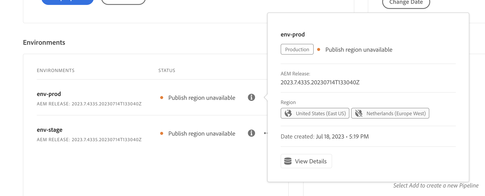

# Gerenciamento de ambientes {#managing-environments}

Saiba mais sobre os tipos de ambientes que você pode criar e como criá-los para o seu projeto do Cloud Manager.

## Tipos de ambiente {#environment-types}

Um usuário com as permissões necessárias pode criar os tipos de ambientes descritos a seguir (dentro dos limites do que está disponível para o locatário específico).

| Tipo de ambiente | Descrição |
| --- | --- |
| **Produção + Preparo** | Os ambientes de produção e de preparo estão disponíveis como um par e são usados para fins de produção e teste, respectivamente. Realizar testes de desempenho e segurança no ambiente de preparo. Ele tem o mesmo tamanho da produção. |
| **Desenvolvimento** | Um ambiente de desenvolvimento pode ser criado para fins de desenvolvimento e teste e pode ser associado apenas a pipelines de não produção. Os ambientes de desenvolvimento não têm o mesmo tamanho que os de preparo e produção e não devem ser usados para realizar testes de desempenho e segurança. |
| **Desenvolvimento rápido** | Um ambiente de desenvolvimento rápido (RDE) permite que os desenvolvedores implantem e revisem alterações rapidamente. Essa capacidade reduz o tempo necessário para testar recursos que já foram validados em um ambiente de desenvolvimento local. Consulte [a documentação de ambientes de desenvolvimento rápido](/help/implementing/developing/introduction/rapid-development-environments.md) para obter detalhes sobre como usar um RDE. |
| **Ambiente de teste especializado** | Os ambientes de teste especializados fornecem um espaço dedicado para validar recursos em condições próximas da produção, ideal para testes de tensão e verificações avançadas antes da implantação. Consulte [Adicionar um ambiente de teste especializado](/help/implementing/cloud-manager/specialized-test-environment.md) |

>[!NOTE]
>
>O recurso **Ambiente de teste especializado** está disponível no momento somente por meio do programa beta privado. Para se inscrever no beta privado, consulte [Ambiente de testes especializado](/help/implementing/cloud-manager/release-notes/current.md#specialized-test-environment).

Os recursos de ambientes individuais dependem das soluções habilitadas no [programa](/help/implementing/cloud-manager/getting-access-to-aem-in-cloud/program-types.md) do ambiente.

* [Sites](/help/overview/introduction.md)
* [Assets](/help/assets/overview.md)
* [Forms](/help/forms/home.md)
* [Screens](/help/screens-cloud/introduction/introduction.md)

>[!NOTE]
>
>Ambientes de produção e de preparo são criados apenas em pares. Não é possível criar um ambiente somente de produção ou somente de preparo.

## Adicionar um ambiente {#adding-environments}

Para adicionar ou editar um ambiente, o usuário deve ser membro da função **Proprietário da empresa**.

**Para adicionar um ambiente:**

1. Faça logon no Cloud Manager, em [my.cloudmanager.adobe.com](https://my.cloudmanager.adobe.com/), e selecione a organização apropriada.

1. No console **[Meus Programas](/help/implementing/cloud-manager/navigation.md#my-programs)**, clique no programa ao qual deseja adicionar um ambiente.

1. Siga uma das seguintes opções:

   Se a opção **Adicionar Ambiente** estiver esmaecida (desabilitada), talvez seja devido à falta de permissões ou dependente dos recursos licenciados.

   * No console **[Meus Programas](/help/implementing/cloud-manager/navigation.md#my-programs)**, no cartão **Ambientes**, clique em **Adicionar Ambiente**.

   

   * No painel lateral esquerdo, clique em  **Ambientes** e, na página Ambientes, próximo ao canto superior direito, clique em **Adicionar ambiente**.

     

1. Na caixa de diálogo **Adicionar ambiente**, faça o seguinte:

   * Selecione um [**tipo de ambiente**](#environment-types). O número de ambientes disponíveis/usados é exibido entre parênteses atrás do nome do tipo de ambiente.
   * Forneça um ambiente **Nome**. O nome do ambiente não pode ser alterado depois que o ambiente é criado.
   * Forneça uma **Descrição** opcional para o ambiente.
   * Se estiver adicionando um ambiente de **Produção + Preparo**, é necessário fornecer um nome e uma descrição tanto para o ambiente de produção quanto para o de preparo.
   * Selecione uma **Região principal** no menu suspenso. A região primária não pode ser alterada após a criação. Além disso, dependendo dos seus direitos disponíveis, talvez você possa configurar [várias regiões](#multiple-regions).

   

1. Clique em **Salvar**.

A página **Visão geral** agora exibe seu novo ambiente no cartão **Ambientes**. Agora você pode configurar pipelines para seu novo ambiente.

## Várias regiões de publicação {#multiple-regions}

Usuários com a função **Proprietário de empresa** podem configurar ambientes de produção e de preparo incluindo até três regiões de publicação adicionais, além da região principal. Regiões de publicação adicionais podem melhorar a disponibilidade. Consulte a [documentação Regiões de publicação adicionais](/help/operations/additional-publish-regions.md) para obter mais detalhes.

>[!TIP]
>
>Você pode usar a [API do Cloud Manager](https://developer.adobe.com/experience-cloud/cloud-manager/guides/api-usage/creating-programs-and-environments/#creating-aem-cloud-service-environments) para consultar uma lista atualizada de regiões disponíveis.

### Adicionar várias regiões de publicação a um novo ambiente {#add-regions}

Ao adicionar um novo ambiente, é possível optar por configurar regiões adicionais, além da região principal.

1. Selecione a **Região principal**.
   * A região principal não pode ser alterada após a criação do ambiente.
1. Selecione a opção **Adicionar regiões de publicação adicionais** e será exibido um novo menu suspenso de **Regiões de publicação adicionais**.
1. No menu suspenso **Regiões de publicação adicionais**, selecione uma região adicional.
1. A região selecionada é adicionada abaixo do menu suspenso para indicar sua seleção.
   * Selecione o `X` ao lado da região selecionada para que você possa desmarcá-la.
1. Para adicionar outra região, selecione-a no menu suspenso **Regiões de publicação adicionais**.
1. Selecione **Salvar** quando estiver pronto para criar seu ambiente.

As regiões selecionadas serão aplicadas a ambos os ambientes, de produção e de preparo.

Se você não especificar nenhuma região adicional, [você poderá fazer isso depois que os ambientes forem criados](#edit-regions).

Se quiser provisionar uma [rede avançada](/help/security/configuring-advanced-networking.md) para o programa, é recomendável fazê-lo antes de adicionar outras regiões de publicação aos ambientes usando a API do Cloud Manager. Caso contrário, o tráfego das regiões de publicação adicionais passará pelo proxy da região principal.

### Editar várias regiões de publicação {#edit-regions}

Inicialmente, se você não tiver especificado regiões adicionais, poderá fazer isso depois que o ambiente for criado e você tiver os direitos necessários.

Você também pode remover regiões de publicação adicionais. No entanto, você só pode adicionar ou remover regiões em uma transação. Se precisar adicionar uma região e remover outra, primeiro adicione, salve a alteração e depois remova (ou vice-versa).

1. No console Visão geral do programa do seu programa, clique no  do seu ambiente de produção e selecione **Editar** no menu.

   

1. Na caixa de diálogo **Editar ambiente de produção**, faça as alterações necessárias nas regiões de publicação adicionais.
   * Use o menu suspenso **Regiões de publicação adicionais** para selecionar regiões adicionais.
   * Clique no X ao lado das regiões de publicação adicionais selecionadas para desmarcá-las.

   

1. Selecione **Salvar** para salvar as alterações.

As alterações feitas no ambiente de produção também serão aplicadas no ambiente de preparo. As alterações em várias regiões de publicação podem ser editadas somente no ambiente de produção.

Se quiser provisionar uma [rede avançada](/help/security/configuring-advanced-networking.md) para o programa, é recomendável fazê-lo antes de adicionar outras regiões de publicação aos ambientes. Caso contrário, o tráfego das regiões de publicação adicionais passará pelo proxy da região principal.

## Exibir detalhes de um ambiente {#viewing-environment}

1. Faça logon no Cloud Manager, em [my.cloudmanager.adobe.com](https://my.cloudmanager.adobe.com/), e selecione a organização apropriada.

1. No console **[Meus Programas](/help/implementing/cloud-manager/navigation.md#my-programs)**, clique no programa para o qual deseja exibir detalhes de um ambiente.

1. Liste todos os ambientes do programa seguindo um destes procedimentos:

   * No menu do lado esquerdo, em **Serviços**, clique em  **Ambientes**.

   

   * No menu do lado esquerdo, em **Programa**, clique em **Visão Geral** e, no cartão **Ambientes**, clique em  **Mostrar Tudo**.

     

   >[!NOTE]
   >
   >O cartão **Ambientes** lista apenas três ambientes. Clique em **Mostrar tudo** no cartão para ver *todos* os ambientes do programa.

1. Na página Ambientes, siga um destes procedimentos:

   * Clique em um ambiente na lista para visualizar seus detalhes.

   

   * Clique no  do ambiente desejado e em **Exibir Detalhes**.

   

## Restaurar o conteúdo de um ambiente {#restore-environment}

Consulte [Restaurar conteúdo no AEM as a Cloud Service](/help/operations/restore.md).

## Restaurar código implantado anteriormente {#restore-previous-code-deployed}

Consulte [Restaurar código anterior implantado no AEM as a Cloud Service](/help/operations/restore-previous-code-deployed.md).

### Acessar o serviço de visualização {#access-preview-service}

O Cloud Manager oferece um serviço de visualização (fornecido como um serviço de publicação adicional) para cada ambiente do AEM as a Cloud Service.

Usando o serviço, é possível visualizar a experiência final de um site antes que ele atinja o ambiente de publicação real e esteja disponível publicamente.

Após a criação, será aplicada uma lista de permissões de IP padrão ao serviço de visualização, identificada como `Preview Default [<envId>]`, que bloqueará todo o tráfego para o serviço de visualização. Desative a lista de permissões de IP padrão do serviço de visualização para poder habilitar o acesso.

Um usuário com as permissões necessárias deve concluir as etapas a seguir antes de compartilhar a URL do serviço de visualização para garantir o acesso a ela.

1. Crie uma Lista de permissões de IP apropriada, aplique-a ao serviço de visualização e desaplique imediatamente a inclui na lista de permissões `Preview Default [<envId>]`.

   Consulte [Aplicar e desaplicar Listas de permissões de IP](/help/implementing/cloud-manager/ip-allow-lists/apply-allow-list.md) para obter mais detalhes.

1. Use o fluxo de trabalho de atualização da **Lista de permissões de IP** para remover o IP padrão e adicionar os IPs necessários. Consulte [Gerenciar Listas de permissões de IP](/help/implementing/cloud-manager/ip-allow-lists/managing-ip-allow-lists.md) para saber mais.

Depois que o acesso ao serviço de visualização é desbloqueado, o ícone de bloqueio na frente do nome do serviço de visualização não é mais exibido.

Após a ativação, é possível publicar conteúdo no serviço de visualização usando a interface de usuário **`Manage Publication`** no AEM. Consulte [Visualizar conteúdo](/help/sites-cloud/authoring/sites-console/previewing-content.md) para obter mais detalhes.

>[!NOTE]
>
>Seu ambiente deve estar na versão `2021.05.5368.20210529T101701Z` do AEM, ou mais recente, para usar o serviço de visualização. Certifique-se de que um pipeline de atualização foi executado com sucesso em seu ambiente para poder usar o serviço de visualização.

### Status de regiões de publicação adicionais {#additional-region-status}

Se você tiver ativado regiões de publicação adicionais, poderá verificar o status dessas regiões no cartão **Ambientes**.

1. Na página **Visão geral**, localize o cartão **Ambientes**.

1. No cartão **Ambientes**, a coluna **Status** refletirá se há problemas com as regiões de publicação adicionais configuradas. Clique no ícone **Info** para obter detalhes sobre as regiões.

   

Como alternativa, você pode acessar as mesmas informações na guia **Ambientes**.

1. Na página **Visão geral**, clique em  **Ambientes**.

1. Na página **Ambientes**, selecione o ambiente que deseja consultar no menu do lado esquerdo.

1. Depois que um ambiente for selecionado:

   * A tabela **Informações do Ambiente** mostra quais regiões estão configuradas para o ambiente selecionado.
   * A coluna **Status** da tabela **Segmentos de ambiente** reflete se há problemas com as regiões de publicação adicionais configuradas. Passe o mouse sobre o status para obter detalhes sobre qualquer problema.

   

Se houver problemas relatados com regiões de publicação adicionais, seja paciente. O Cloud Manager tenta continuamente recuperar a região e ela pode ficar disponível a qualquer momento. Se o problema persistir após várias horas, é possível remover a região de publicação adicional e adicioná-la novamente (na mesma região ou em outra) para acionar uma implantação completa.

Quanto tempo você esperar até que o sistema se recupere por conta própria antes de tomar medidas adicionais depende do impacto que a falha dessa região tem em seus sistemas.

Independentemente disso, o tráfego [é sempre roteado para a região mais próxima que está online](/help/operations/additional-publish-regions.md). Se o problema persistir, entre em contato com o Atendimento ao cliente da Adobe.

## Atualizar ambientes {#updating-dev-environment}

Como um serviço nativo em nuvem, o Adobe gerencia automaticamente atualizações para seus ambientes de desenvolvimento, preparo e produção nos programas de produção.

No entanto, as atualizações para ambientes em programas de sandbox são gerenciadas dentro dos programas. Quando um ambiente não estiver executando a versão mais recente do AEM disponível publicamente, o status no cartão **Ambientes** na tela **Visão Geral** do programa mostrará **Atualização Disponível**.

### Atualizações e pipelines {#updates-pipelines}

Os pipelines são a única maneira de [implantar código nos ambientes do AEM as a Cloud Service](deploy-code.md). Por esse motivo, cada pipeline está associado a uma versão específica do AEM.

Quando o Cloud Manager detecta uma versão do AEM mais recente do que a implantada pela última vez no pipeline, ele exibe o status **Atualização disponível** para o ambiente.

O processo de atualização é, portanto, um processo de duas etapas:

1. Atualização do pipeline com a versão mais recente do AEM
1. Execução do pipeline para implantar a nova versão do AEM em um ambiente

### Atualizar seus ambientes {#updating-your-environments}

>[!NOTE]
> A partir de 2024, as instâncias de desenvolvimento e alguns programas de sandbox já serão atualizados automaticamente para que não haja necessidade de gerenciar atualizações para eles manualmente. Como resultado dessa transição, a opção para Atualizar o ambiente manualmente para instâncias de desenvolvimento pode não estar disponível para _alguns_ de seus programas.

A opção **Atualizar** está disponível no cartão **Ambientes** para ambientes de sandbox e desenvolvimento específicos. Clique em  ao lado do ambiente para acessar **Atualização**.

Esta opção também está disponível clicando na guia **Ambientes** do programa e em  do ambiente.

Um usuário com a função **Gerente de Implantação** ou **Proprietário da Empresa** pode usar essa opção para atualizar o pipeline associado a esse ambiente para a versão mais recente do AEM.

Quando a versão do pipeline é atualizada para a versão mais recente do AEM disponível publicamente, o usuário é solicitado a executar o pipeline associado para implantar a nova versão no ambiente.

O comportamento da opção **Atualizar** varia dependendo da configuração e do estado atual do programa.

| Estado | A opção Atualizar... |
| --- | --- |
| O pipeline já foi atualizado | solicita que o usuário execute o pipeline. |
| O pipeline já está sendo atualizado | informa ao usuário que uma atualização já está em execução. |
| O pipeline não existe | solicita que o usuário crie um. |

## Excluir ambientes de desenvolvimento {#deleting-environment}

Um usuário com a função **Gerente de Implantação** ou **Proprietário da Empresa** pode excluir um ambiente de desenvolvimento.

Na tela **Visão geral** do programa no cartão **Ambientes**, clique no ícone  do ambiente de desenvolvimento que deseja excluir.

A opção **Excluir** também está disponível na guia **Ambientes** da janela **Visão Geral** do programa. Clique no ícone  do ambiente e selecione **Excluir**.

>[!NOTE]
>
>* Os ambientes de produção e de preparo criados em um programa de produção não podem ser excluídos.
>* Os ambientes de produção e de preparo em um programa de sandbox podem ser excluídos.

## Gerenciar acesso {#managing-access}

Selecione **Gerenciar acesso** no menu de reticências do ambiente no cartão **Ambientes**. Você pode navegar diretamente para a instância de criação e gerenciar o acesso ao seu ambiente.

>[!TIP]
>
>Consulte [Perfis de produto e de equipe do AEM as a Cloud Service](/help/onboarding/aem-cs-team-product-profiles.md) para saber como os perfis de produto e de equipe do AEM as a Cloud Service podem conceder e limitar o acesso às suas soluções licenciadas da Adobe.

## Acesse o console do Desenvolvedor {#accessing-developer-console}

1. No cartão **Ambiente**, clique no ícone  e em **Developer Console**.

Uma nova guia é aberta no navegador com a página de logon do **Developer Console**.

Somente um usuário com a função **Desenvolvedor** terá acesso ao **Developer Console**. No entanto, para programas de sandbox, qualquer usuário com acesso ao programa de sandbox tem acesso ao **Developer Console**.

Consulte [Hibernação e cancelamento da hibernação de ambientes de sandbox](https://experienceleague.adobe.com/en/docs/experience-manager-cloud-service/content/implementing/using-cloud-manager/programs/introduction-sandbox-programs#hibernation) para obter mais detalhes.

Esta opção também está disponível na guia **Ambiente** da janela **Visão geral** ao clicar no  de um ambiente individual.

## Fazer logon localmente {#login-locally}

1. Siga uma das seguintes opções:

   * No cartão **Ambiente**, clique no ícone  e em **Logon local**.

     

   * No painel lateral esquerdo, clique em  **Ambientes**. Na página **Ambientes**, clique no ícone  e em **Logon local**.

     

## Gerenciar nomes de domínio personalizados {#manage-cdn}

Os nomes de domínio personalizados são suportados nos programas do Cloud Manager para Sites, para serviços de publicação e visualização.

>[!TIP]
>
>Para obter mais informações, consulte [Introdução a nomes de domínio personalizados](/help/implementing/cloud-manager/custom-domain-names/introduction.md).

## Gerenciar listas de permissões de IP {#manage-ip-allow-lists}

Uma Lista de permissões IP é compatível com o Cloud Manager para criar, publicar e visualizar serviços para programas do Sites.

Para gerenciar Listas de permissões de IP, navegue até a página  **Ambientes** da página **Visão geral** do seu programa. Clique em um ambiente individual para gerenciar seus detalhes.

### Aplicar uma Lista de permissões de IP {#apply-ip-allow-list}

A aplicação de uma Lista de permissões de IP vincula todos os intervalos IP definidos a um serviço de autoria ou publicação no ambiente.

>[!TIP]
>
>Para obter mais informações, consulte [Introdução às Listas de permissões IP](/help/implementing/cloud-manager/ip-allow-lists/introduction.md).
