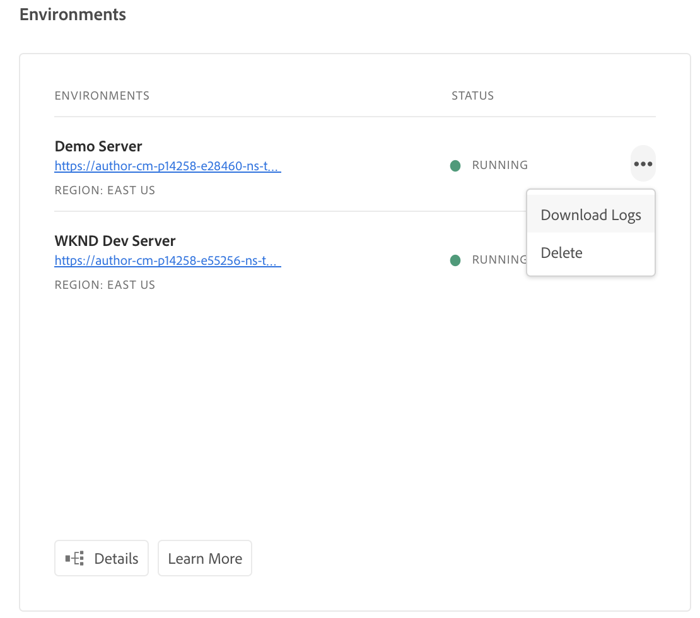
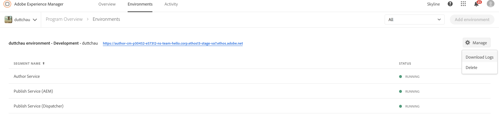

# Acesso e gerenciamento de registros {#manage-logs}

Os usuários podem acessar uma lista de arquivos de log disponíveis para o ambiente selecionado usando o Cartão de Ambiente.  Os usuários podem acessar uma lista de arquivos de log disponíveis para o ambiente selecionado.

Esses arquivos podem ser baixados por meio da interface do usuário, na página **Visão geral** .



Ou a página **Ambientes** :



>[!Nnota]
>Independentemente de onde ele esteja aberto, a mesma caixa de diálogo é exibida e permite que um arquivo de log individual seja baixado.


## Faz logon por meio da API {#logs-thorugh-api}

Além de fazer o download de logs por meio da interface do usuário, os registros estarão disponíveis por meio da API e da interface de linha de comando.

Por exemplo, para baixar os arquivos de log de um ambiente específico, o comando seria algo isolado nas linhas de

```java
$ aio cloudmanager:download-logs --programId 5 1884 author aemerror
```

O comando a seguir permite o ajuste dos registros:

```java
$ aio cloudmanager:tail-log --programId 5 1884 author aemerror
```

Para obter a ID do ambiente (neste caso, 1884) e as opções de serviço ou nome de registro disponíveis, você pode usar:

```java
$ aio cloudmanager:list-environments
Environment Id Name                     Type  Description                          
1884           FoundationInternal_dev   dev   Foundation Internal Dev environment  
1884           FoundationInternal_stage stage Foundation Internal STAGE environment
1884           FoundationInternal_prod  prod  Foundation Internal Prod environment
 
 
$ aio cloudmanager:list-available-log-options 1884
Environment Id Service    Name         
1884           author     aemerror     
1884           author     aemrequest   
1884           author     aemaccess    
1884           publish    aemerror     
1884           publish    aemrequest   
1884           publish    aemaccess    
1884           dispatcher httpderror   
1884           dispatcher aemdispatcher
1884           dispatcher httpdaccess
```

>[!Nnota]
>Embora os Downloads **de** Log estejam disponíveis por meio da interface do usuário e da API, o **Log Tail** é somente API/CLI.
