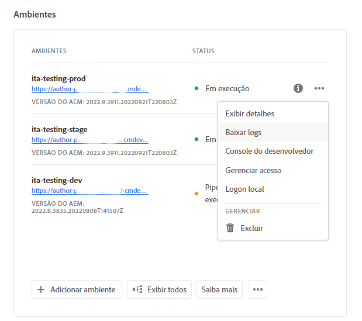

# Acesso e gerenciamento de registros {#manage-logs}

Saiba como acessar e gerenciar logs para auxiliar seu processo de desenvolvimento no AEM as a Cloud Service.

Você pode acessar uma lista de arquivos de log disponíveis para o ambiente selecionado usando o cartão **Ambientes** na página **Visão geral** ou na página Detalhes do ambiente.

## Download de logs {#download-logs}

Para baixar os logs, faça o seguinte.

1. Faça logon no Cloud Manager em [my.cloudmanager.adobe.com](https://my.cloudmanager.adobe.com/) e selecione a organização e o programa apropriado.

1. Navegue até o cartão **Ambientes** na página **Visão geral**.

1. Selecione **Baixar logs** no menu de reticências.

   

1. Na caixa de diálogo **Baixar logs**, selecione o **Serviço** apropriado no menu suspenso

   

1. Após selecionar o serviço, clique no ícone de download ao lado do log que deseja recuperar.

Você também pode acessar os logs na página **Ambientes**.


## Logs por meio da API {#logs-through-api}

Além de baixar logs por meio da interface do usuário, os logs também estão disponíveis por meio da API e da interface de linha de comando.

Para baixar os arquivos de log de um ambiente específico, o comando seria semelhante ao descrito a seguir.

```shell
$ aio cloudmanager:download-logs --programId 5 1884 author aemerror
```

Além disso, é possível rastrear logs por meio da interface de linha de comando.

```shell
$ aio cloudmanager:tail-log --programId 5 1884 author aemerror
```

Para obter a ID de ambiente (1884 neste exemplo) e as opções de serviço ou nome de log disponíveis, você pode usar os comandos a seguir.

```shell
$ aio cloudmanager:list-environments
Environment Id Name                     Type  Description                          
1884           FoundationInternal_dev   dev   Foundation Internal Dev environment  
1884           FoundationInternal_stage stage Foundation Internal STAGE environment
1884           FoundationInternal_prod  prod  Foundation Internal Prod environment
 
 
$ aio cloudmanager:list-available-log-options 1884
Environment Id Service    Name         
1884           author     aemerror     
1884           author     aemrequest   
1884           author     aemaccess    
1884           publish    aemerror     
1884           publish    aemrequest   
1884           publish    aemaccess    
1884           dispatcher httpderror   
1884           dispatcher aemdispatcher
1884           dispatcher httpdaccess
```

### Recursos adicionais {#resources}

Consulte os seguintes recursos adicionais para saber mais sobre a API do Cloud Manager e a CLI do Adobe I/O:

* [Documentação da API do Cloud Manager](https://developer.adobe.com/experience-cloud/cloud-manager/)
* [CLI do Adobe I/O](https://github.com/adobe/aio-cli-plugin-cloudmanager)
