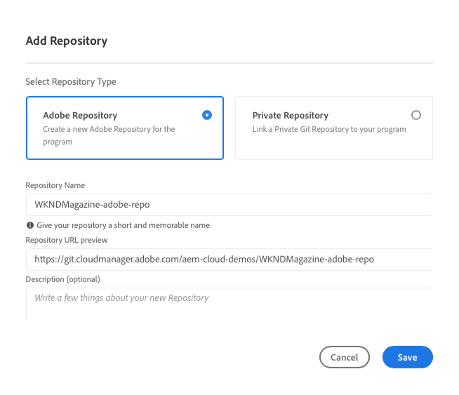

# Adição de repositórios da Adobe no Cloud Manager {#adobe-repositories}

Saiba como criar repositórios gerenciados pela Adobe no Cloud Manager.

## Adição de um repositório gerenciado pela Adobe {#add-adobe-repository}

A janela **Repositórios** facilita a adição de outros repositórios gerenciados pela Adobe para o seu programa.

1. Faça logon no Cloud Manager em [my.cloudmanager.adobe.com](https://my.cloudmanager.adobe.com/) e selecione a organização e o programa apropriados.

1. Na página **Visão geral do programa**, selecione a guia **Repositórios** para acessar a página **Repositórios**.

1. Clique em **Adicionar repositório** na barra de ferramentas.

   

1. Insira o nome e a descrição conforme solicitado e clique em **Salvar**.

   

Quando o assistente for fechado, seu novo repositório será exibido na tabela da janela **Repositórios**. Agora você pode associar um [Pipeline de CI/CD](/help/implementing/cloud-manager/configuring-pipelines/introduction-ci-cd-pipelines.md) ou gerenciá-lo na janela [**Repositórios**.](managing-repositories.md)

>[!TIP]
>
>Também é possível adicionar repositórios GitHub que você mesmo gerencia como [repositórios privados](private-repositories.md).
