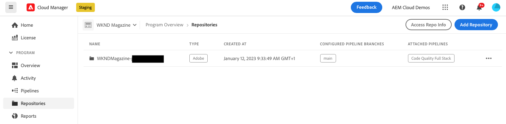

# Gerenciamento de repositórios no Cloud Manager {#managing-repos}

Saiba como criar, exibir e excluir repositórios Git no Cloud Manager.

## Visão geral {#overview}

Repositórios são usados para armazenar e gerenciar o código do seu projeto usando o Git. Todos os programas criados no Cloud Manager têm um repositório gerenciado pela Adobe criado para eles.

Você pode optar por criar repositórios adicionais gerenciados pela Adobe e também adicionar seus próprios repositórios privados. Todos os repositórios associados ao seu programa podem ser exibidos na janela **Repositórios**.

Os repositórios criados no Cloud Manager também estarão disponíveis para seleção ao adicionar ou editar pipelines. Consulte [Pipelines de CI-CD](/help/implementing/cloud-manager/configuring-pipelines/introduction-ci-cd-pipelines.md) para saber mais.

Há um único repositório principal ou uma ramificação para um determinado pipeline. Com o [suporte ao submódulo git,](git-submodules.md) muitas ramificações secundárias podem ser incluídas no momento da compilação.

## Janela Repositórios {#repositories-window}

1. Faça logon no Cloud Manager em [my.cloudmanager.adobe.com](https://my.cloudmanager.adobe.com/) e selecione a organização e o programa apropriado.

1. Na página **Visão geral do programa**, selecione a guia **Repositórios** para acessar a página **Repositórios** .

1. A janela **Repositórios** exibe todos os repositórios associados ao seu programa.

   

A janela **Repositórios** fornece detalhes sobre os repositórios:

* O tipo de repositório
   * **Adobe** indica repositórios gerenciados pela Adobe
   * **GitHub** indica repositórios privados do GitHub que você gerencia
* Quando foi criado
* Pipelines associados ao repositório

Você pode selecionar o repositório na janela e clicar no botão de reticências para realizar uma ação no repositório selecionado.

* **[Verificar ramificações/Criar projeto](#check-branches)** (disponível somente para repositórios da Adobe)
* **[Copiar URL do repositório](#copy-url)**
* **[Visualizar e atualizar](#view-update)**
* **[Excluir](#delete)**

## Adicionar repositórios {#adding-repositories}

Toque ou clique no botão **Adicionar repositório** na janela **Repositórios** para iniciar o assistente **Adicionar repositório**.

O Cloud Manager oferece suporte a repositórios gerenciados pela Adobe (**Repositório da Adobe**), bem como seus próprios repositórios autogerenciados (**Repositório privado**). Os campos obrigatórios diferem dependendo do tipo de repositório que você escolher adicionar. Consulte os documentos a seguir para obter mais detalhes.

* [Adição de repositórios da Adobe no Cloud Manager](adobe-repositories.md)
* [Adição de repositórios privados no Cloud Manager](private-repositories.md)

>[!NOTE]
>
>* Um usuário deve ter a função **Gerente de implantação** ou **Proprietário da empresa** para poder adicionar um repositório.
>* Há um limite de 300 repositórios em todos os programas em uma determinada empresa ou organização IMS.

## Acessar informações do repositório {#repo-info}

Ao visualizar os repositórios na janela **Repositórios**, você pode visualizar os detalhes sobre como acessar os repositórios gerenciados por Adobe de forma programática clicando no botão **Acessar informações do repositório** na barra de ferramentas.

A janela **Informações do repositório** é aberta com os detalhes. Para obter mais informações sobre como acessar informações do repositório, consulte o documento [Acessando Informações do Repositório](accessing-repos.md).

## Verificar ramificações/Criar projeto {#check-branches}

A ação **Verificar ramificações/Criar projeto** executa duas funções dependendo do estado do repositório.

* Se o repositório for recém-criado, a ação criará um projeto de amostra com base no [arquétipo do projeto do AEM](https://experienceleague.adobe.com/pt-br/docs/experience-manager-core-components/using/developing/archetype/overview).
* Se o repositório já tiver criado o projeto de amostra, ele verifica o estado do repositório e de suas ramificações e informa se o projeto de amostra já existe.

## Copiar URL de repositório {#copy-url}

A ação **Copiar URL do repositório** copia o URL do repositório selecionado na janela **Repositórios** para a área de transferência para ser usada em outro lugar.

## Exibir e atualizar {#view-update}

A ação **Exibir e atualizar** abre a caixa de diálogo **Atualizar repositório**. Ao usá-la, você pode ver o **Nome** e a **Visualização do URL do repositório** e atualizar a **Descrição** do repositório.

## Excluir {#delete}

A ação **Excluir** remove o repositório do seu projeto. Um repositório não pode ser excluído se estiver associado a um pipeline.

A exclusão de um repositório:

* Tornará o nome do repositório excluído inutilizável para novos repositórios que podem ser criados no futuro.
   * A mensagem de erro `Repository name should be unique within organization.` será mostrada nesses casos.
* Tornará o repositório excluído indisponível no Cloud Manager e indisponível para vinculação a um pipeline.
