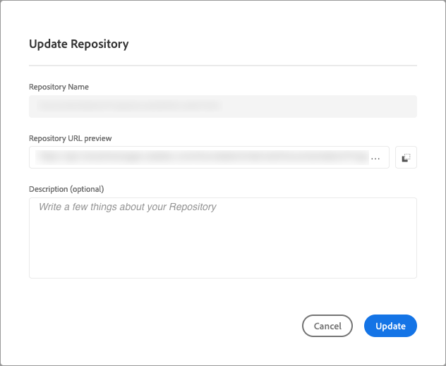

# Gerenciar repositórios no Cloud Manager {#managing-repos}

Saiba como visualizar, adicionar e excluir repositórios Git no Cloud Manager.

## Sobre repositórios no Cloud Manager {#overview}

Repositórios no Cloud Manager são usados para armazenar e gerenciar o código do seu projeto usando o Git. Para cada *programa* adicionado, um repositório gerenciado pela Adobe é automaticamente criado.

Além disso, você tem a opção de criar mais repositórios gerenciados pela Adobe ou adicionar seus próprios repositórios privados. Todos os repositórios vinculados ao seu programa podem ser exibidos na página **Repositórios**.

Os repositórios criados no Cloud Manager também podem ser selecionados ao adicionar ou editar pipelines. Para obter mais informações sobre como configurar pipelines, consulte [Pipelines de CI-CD](/help/implementing/cloud-manager/configuring-pipelines/introduction-ci-cd-pipelines.md).

Cada pipeline está vinculado a uma ramificação ou repositório principal. Entretanto, com o [suporte ao submódulo Git](git-submodules.md), várias ramificações secundárias podem ser incluídas durante o processo de compilação.

## Exibir a página Repositórios {#repositories-window}

Na página **Repositórios**, você pode exibir detalhes sobre o repositório selecionado. Essas informações incluem o tipo de repositório em uso. Se o repositório estiver marcado como **Adobe**, indica que é um repositório gerenciado pela Adobe. Se estiver rotulado como **GitHub**, refere-se a um repositório GitHub privado que você gerencia. Além disso, a página fornece detalhes como quando o repositório foi criado e os pipelines associados a ele.

Para executar ações em um repositório selecionado, clique nele e use o  para abrir um menu suspenso. Para repositórios gerenciados pela Adobe, você pode **[Verificar ramificações/Criar projeto](#check-branches)**.

*Menu suspenso na página Repositórios.*

Outras ações disponíveis no menu suspenso incluem **[Copiar URL do repositório](#copy-url)**, **[Exibir e atualizar](#view-update)** e **[Excluir](#delete)** o repositório.

**Para exibir a página Repositórios:**

1. Faça logon no Cloud Manager em [my.cloudmanager.adobe.com](https://my.cloudmanager.adobe.com/) e selecione a organização e o programa apropriados.

1. Na página **Visão geral do programa**, no menu lateral, clique no  **Repositórios**.

1. A página **Repositórios** exibe todos os repositórios associados ao programa selecionado.

   
   *A página Repositórios no Cloud Manager.*

## Adicionar um repositório {#adding-repositories}

Um usuário deve ter a função de **Gerente de implantação** ou **Proprietário da empresa** para adicionar um repositório.

Na página **Repositórios**, próximo ao canto superior direito, clique em **Adicionar repositório**

*Caixa de diálogo Adicionar Repositório.*

O Cloud Manager oferece suporte a dois tipos de repositórios: repositórios gerenciados pela Adobe (**Repositório da Adobe**) e repositórios autogerenciados (**Repositório privado**). Os campos necessários para configuração variam dependendo do tipo de repositório que você escolher adicionar. Para obter mais informações, consulte o seguinte:

* [Adicionar repositórios privados no Cloud Manager](adobe-repositories.md)
* [Adicionar repositórios privados no Cloud Manager](private-repositories.md)

Há um limite de 300 repositórios em todos os programas em uma determinada empresa ou organização IMS.

## Acessar informações do repositório {#repo-info}

Ao visualizar os repositórios na janela **Repositórios**, você pode visualizar os detalhes sobre como acessar os repositórios gerenciados pela Adobe de forma programática clicando no botão **Acessar informações do repositório** na barra de ferramentas.

A janela **Informações do repositório** é aberta com os detalhes. Para obter mais informações sobre o acesso às informações do repositório, consulte o documento [Acessar informações do repositório](/help/implementing/cloud-manager/managing-code/accessing-repos.md).

## Verificar ramificações/Criar projeto {#check-branches}

No **AEM Cloud Manager**, a ação **Verificar ramificações/Criar projeto** atende a duas finalidades, dependendo do estado atual do repositório.

* Se o repositório for criado recentemente, esta ação gerará um projeto de amostra usando [o arquétipo de projeto AEM](https://experienceleague.adobe.com/pt-br/docs/experience-manager-core-components/using/developing/archetype/overview).
* Se o projeto de amostra já tiver sido criado no repositório, a ação verificará o status do repositório e suas ramificações, fornecendo feedback sobre se o projeto de amostra já existe.

  

## Copiar URL de repositório {#copy-url}

A ação **Copiar URL do repositório** copia o URL do repositório selecionado na página **Repositórios** para a área de transferência para ser usada em outro lugar.

## Exibir e atualizar um repositório {#view-update}

A ação **Exibir e Atualizar** abre a caixa de diálogo **Atualizar repositório**, onde você pode exibir o **Nome** e a **Visualização do URL do repositório**. Além disso, permite atualizar a **Descrição** do repositório.

## Excluir um repositório {#delete}

A ação **Excluir** remove o repositório do seu projeto. Um repositório não pode ser excluído se estiver associado a um pipeline.

A exclusão de um repositório torna seu nome inutilizável para quaisquer novos repositórios criados no futuro. Se você tentar adicionar um repositório usando o mesmo nome de um repositório excluído, verá a seguinte mensagem de erro:

`Repository name should be unique within organization.`

Além disso, o repositório excluído não está mais disponível no Cloud Manager e não pode ser vinculado a nenhum pipeline.

