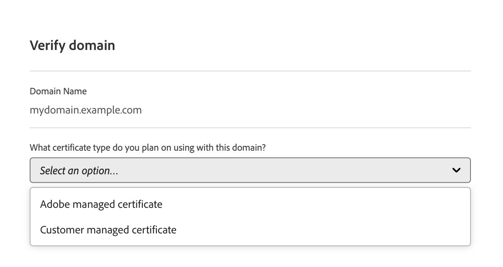

# Adicionar um certificado SSL {#add-ssl-cert}

Saiba como adicionar um certificado SSL gerenciado pelo cliente ou um certificado DV (Validação de domínio) gerado e gerenciado por Adobe usando as ferramentas de autoatendimento da Cloud Manager.

Consulte também [Solucionar problemas de erros de certificado SSL](/help/implementing/cloud-manager/managing-ssl-certifications/troubleshoot-ssl-cert.md).

## Adicionar um certificado SSL {#adding-an-ssl-certificate}

Um certificado pode levar alguns dias para ser provisionado. Assim, a Adobe recomenda que o certificado seja provisionado bem antes de qualquer prazo ou data de ativação.

Certifique-se de revisar os **Requisitos do certificado** em [Introdução ao Gerenciamento de Certificados SSL](/help/implementing/cloud-manager/managing-ssl-certifications/introduction.md#requirements) para verificar se a AEM as a Cloud Service oferece suporte ao certificado que você deseja adicionar.

O usuário deve ser membro da função **Proprietário da empresa** ou **Gerente de implantação** para concluir esta tarefa.

>[!NOTE]
>
>Os clientes não têm permissão para carregar certificados DV (Validação de domínio).

**Para adicionar um certificado SSL:**

1. Faça logon no Cloud Manager, em [my.cloudmanager.adobe.com](https://my.cloudmanager.adobe.com/), e selecione a organização apropriada.

1. No console **[Meus Programas](/help/implementing/cloud-manager/navigation.md#my-programs)**, selecione o programa.

1. Na página **Visão geral**, navegue até a tela **Ambientes**.

1. No painel de navegação esquerdo, em **Serviços**, clique em **Certificados SSL**. Se você não vir o painel de navegação esquerdo como visto na imagem a seguir, talvez seja necessário clicar no ícone de hambúrguer no canto superior esquerdo.

   

1. Próximo ao canto superior direito da página, clique em **Adicionar certificado SSL**.

1. Na caixa de diálogo **Adicionar certificado SSL**, com base em [seu caso de uso específico](/help/implementing/cloud-manager/managing-ssl-certifications/introduction.md), execute um dos procedimentos a seguir:

   | | Caso de uso | Etapas |
   | --- | --- | --- |
   | 1 | **Adicionar um DV (certificado gerenciado por Adobe)** | **Para adicionar um DV (certificado gerenciado por Adobe):**  a. Selecione o tipo de certificado **Adobe gerenciado (DV)**.  b. Na lista suspensa **Selecionar domínios**, selecione um ou mais domínios que deseja associar ao certificado DV. Nenhum domínio para selecionar? Em caso afirmativo, significa que você deve adicionar um domínio personalizado. Consulte [Adicionar um nome de domínio personalizado](/help/implementing/cloud-manager/custom-domain-names/add-custom-domain-name.md). Quando terminar de adicionar um nome de domínio personalizado, retorne a este tópico e comece na etapa 1 novamente. d Continue com a etapa 7. |
   | 2 | **Adicionar um certificado gerenciado pelo cliente (OV/EV)** | **Para adicionar um certificado gerenciado pelo cliente (OV/EV):**  a. Selecione o tipo de certificado **Gerenciado pelo cliente (OV/EV)**. b. No campo **Nome do certificado**, digite um nome para o certificado. Este campo é apenas para fins informativos e pode ser qualquer nome que o ajude a identificar o certificado com facilidade. c Nos campos **Certificado**, **Chave privada** e **Cadeia de certificados**, cole os valores necessários nos respectivos campos.  Todos os erros detectados nos valores são exibidos. Antes de salvar o certificado, é necessário corrigir todos os erros. Consulte [Erros de Certificado](#certificate-errors) para saber mais sobre como solucionar erros comuns. d Continue com a etapa 7. |

<!--
    **Add an SSL certificate:**
    1. Select the certificate type **Customer managed (OV/EV)**.
    1. In **Certificate name** field, enter a name for your certificate. This field is for informational purposes only and can be any name that helps you reference your certificate easily.
    1. In the **Certificate**, **Private key**, and **Certificate chain** fields, paste the required values into their respective fields.

        
  
    Any detected errors in values are displayed. Before you can save your certificate, you must address all errors. See [Certificate errors](#certificate-errors) to learn more about troubleshooting common errors.

    **Add a DV certificate:**
    1. Select the certificate type **Adobe managed (DV)**.

        

    1. In the **Select domains** drop-down list, select one or more domains that you want associated with the DV certificate.

        No domains to select? If so, it means that you must add a custom domain. See [Add a custom domain](#add-custom-domain). When you are finished, resume the steps from the beginning again. -->

1. No canto inferior direito da caixa de diálogo, clique em **Salvar**.

   Depois que o certificado for emitido com êxito, ele exibirá uma marca de seleção verde na tabela **Certificados SSL**.

Agora você adicionou um certificado SSL de trabalho ao projeto. Essa etapa geralmente é a primeira a configurar um nome de domínio personalizado.

* Para configurar um nome de domínio personalizado, consulte [Adicionar um nome de domínio personalizado](/help/implementing/cloud-manager/custom-domain-names/add-custom-domain-name.md).
* Para saber mais sobre como atualizar e gerenciar certificados SSL no Cloud Manager, consulte [Gerenciar certificados SSL](/help/implementing/cloud-manager/managing-ssl-certifications/managing-certificates.md).

<!--
### Add a custom domain {#add-custom-domain}

Before you can add an Adobe generated and managed Domain Validated (DV) certificate, you must first add a custom domain. The process for doing so is nearly the same as detailed in [Introduction to custom domain names](/help/implementing/cloud-manager/custom-domain-names/introduction.md) and [Add a custom domain name](/help/implementing/cloud-manager/custom-domain-names/add-custom-domain-name.md). However, that functionality is now slightly expanded, as described below.

1. When adding a custom domain name, in the **Verify domain** dialog box, select an **Adobe managed certificate**.

    

1. In the **Verify domain** dialog box, add a CNAME verification record to your DNS.

    

1. After the domain is created, click the ellipsis button in the list of domains and select **Verify** to verify the domain.

     

1. Resume the task [Add a DV certificate](#adding-an-ssl-certificate). -->

