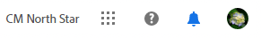
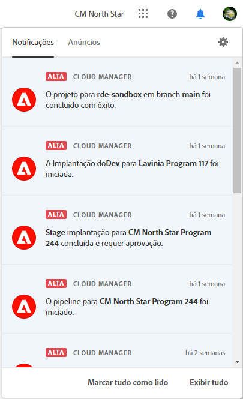
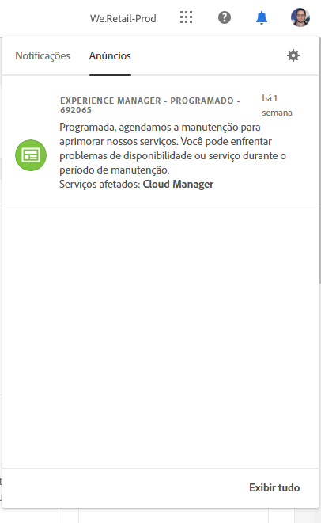
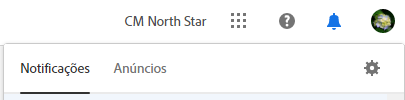
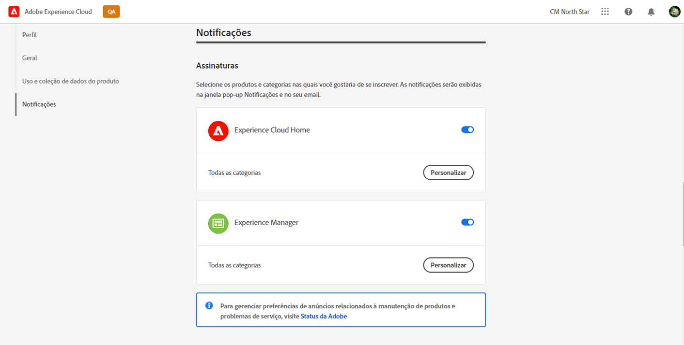
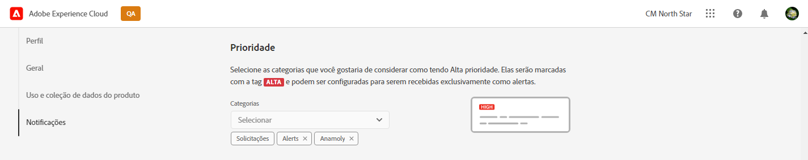
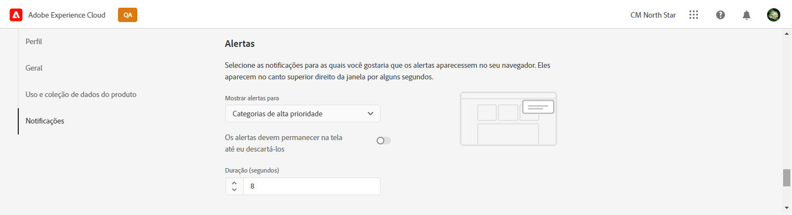
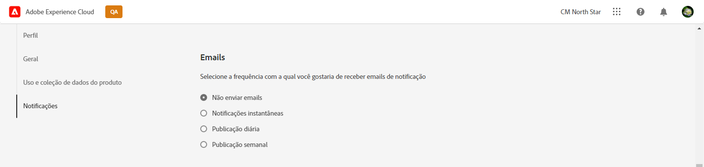

# Notificações {#notifications}

Saiba como o Cloud Manager notifica você sobre eventos importantes.

## Notificações no Cloud Manager {#cloud-manager-notifications}

O [!UICONTROL Cloud Manager] envia notificações quando um pipeline de produção é iniciado e concluído (com êxito ou sem êxito), no início de uma implantação de produção.

Essas notificações são enviadas por meio do sistema de notificação da [!UICONTROL Experience Cloud] para usuários com as funções de **Proprietário da empresa**, **Gerente de programas** e **Gerente de implantação**.

As notificações são exibidas em uma barra lateral no [!UICONTROL Cloud Manager] e em toda a Adobe [!UICONTROL Experience Cloud]. O ícone de sino no cabeçalho é destacado quando você tem novas notificações.

Clique no ícone de sino para abrir a barra lateral e exibir as notificações. A guia **Notificações** na barra lateral lista as notificações mais recentes, como confirmações de implantação. As notificações se referem aos seus ambientes.

A guia **Avisos** inclui avisos de produto da Adobe. Os avisos dizem respeito ao produto.

Clique em uma notificação ou anúncio para visualizar seus detalhes. As notificações vinculadas a atividades como implantações de pipeline levam você aos detalhes dessa atividade, como a janela de execução do pipeline.

Clique na opção **Exibir tudo** na parte inferior do painel para exibir todos os avisos na caixa de entrada.

Clique na opção **Marcar tudo como lido** na parte inferior do painel para marcar todas as notificações não lidas como lidas e limpar o símbolo do ícone de sino.

## Configuração de notificação {#configuration}

Você pode personalizar como recebe notificações e quais notificações recebe.

Clique no ícone de engrenagem na parte superior da barra lateral de notificações para abrir a janela **Preferências do Experience Cloud**. Aqui, você pode definir suas assinaturas de notificação e como recebe as notificações.

### Assinaturas {#subscriptions}

As assinaturas definem para quais produtos você recebe notificações e quais notificações.

Por padrão, você recebe todas as notificações para todos os produtos no aplicativo e por email. Clique na divisa ao lado do nome de um produto para exibir as opções detalhadas e definir os tipos de notificações que você recebe para esse produto. Ou marque ou desmarque as opções no nível do produto para marcar/desmarcar todas as opções do produto.

### Prioridade {#priority}

Os alertas de prioridade serão marcados com uma tag **ALTA**. Você pode configurá-los para serem recebidos exclusivamente como alertas. Na seção **Prioridade**, você pode definir quais categorias se qualificam como notificações de prioridade.

Use o menu suspenso para adicionar à lista de categorias que se qualificam como prioridade. Clique no X ao lado dos nomes das categorias para removê-las.

### Alertas {#alerts}

Os alertas são exibidos no canto superior direito da janela por alguns segundos. Use a seção **Alertas** para definir para quais notificações você recebe alertas.

Você pode definir o comportamento dos alertas.

* **Mostrar alertas para** - Define os tipos de notificações que acionam alertas
* **Os alertas devem ficar na tela até que eu os descarte** - Controla se os alertas devem persistir, a menos que você os ignore ativamente
* **Duração** - Define quanto tempo o alerta deve permanecer na tela caso você não tenha escolhido que eles fiquem na tela.

### Emails {#emails}

As notificações estão disponíveis na interface da web em todas as soluções da Adobe [!UICONTROL Experience Cloud]. Também é possível optar por enviar essas notificações por email na seção **Emails**.

Por padrão, nenhum email é enviado. Você pode optar por receber emails:

* Instantaneamente
* Diariamente
* Semanalmente

Quando você escolhe **Notificações instantâneas**, os emails são enviados imediatamente para cada notificação. Para as opções **Resumo diário** e **Resumo semanal**, você pode escolher quando o resumo diário é enviado e em que dia e quando o resumo semanal é enviado.