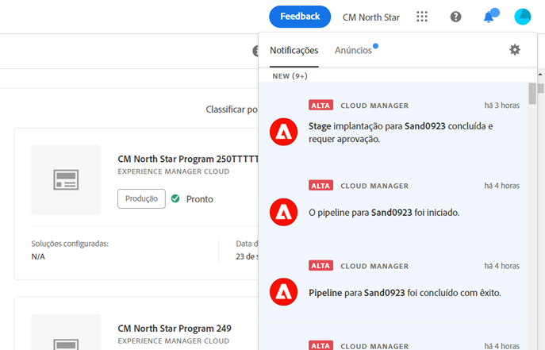
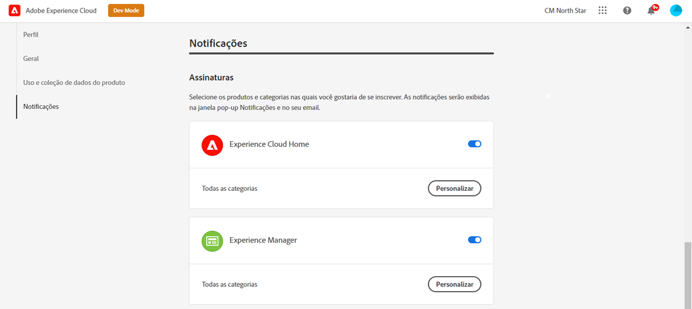
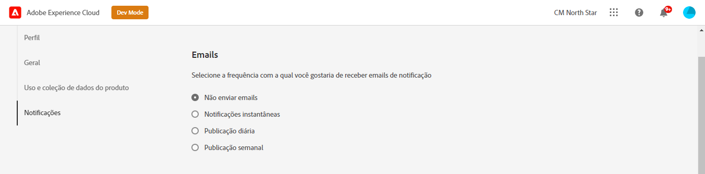

# Notificações {#notifications}

[!UICONTROL Cloud Manager] permite que o usuário receba notificações quando o pipeline de produção for iniciado e concluído (com êxito ou sem êxito), durante uma implantação de produção.

Essas notificações são enviadas por meio do Adobe [!UICONTROL Experience Cloud] sistema de notificação para usuários com as funções **Proprietário da empresa**, **Gerenciador de programas** e **Gerenciador de implantação**.

As notificações são exibidas na extremidade direita da barra de menus na guia [!UICONTROL Cloud Manager] Interface do usuário e em todo o Adobe [!UICONTROL Experience Cloud].

O ícone de sino aparece danificado quando há novas notificações. Clique nele para abrir um painel para exibir as notificações.

O painel lista apenas as notificações mais recentes. Clique em **Exibir todos** na parte inferior do painel para ver todas as suas notificações.

## Notificações por email {#email-notifications}

Por padrão, as notificações estão disponíveis na interface do usuário em todo o Adobe [!UICONTROL Experience Cloud] soluções. Os usuários individuais também podem optar pelo envio dessas notificações por email seguindo essas etapas.

1. Clique no ícone de sino para revelar as notificações.
1. Clique no botão **Editar preferências** ícone (em forma de uma engrenagem) na parte superior do painel de notificações.
1. Na janela que abre, clique em **Notificações** no painel de navegação esquerdo.
   
1. Role para baixo até a **Email** cabeçalho.
   
1. Selecione como deseja receber seus emails.
   * Não enviar emails (padrão)
   * Notificações instantâneas
   * Resumo diário
   * Resumo semanal

Depois de fazer a seleção, sua escolha é salva automaticamente, sem a necessidade de clicar em um botão Salvar ou aplicar.
