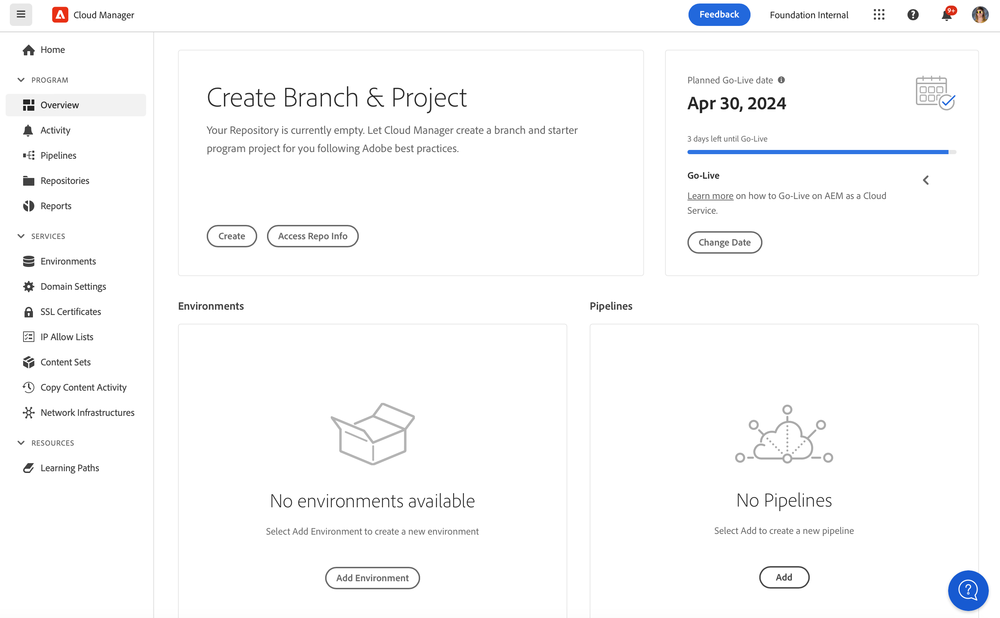

# Adicionar um ambiente de teste especializado{#add-special-test-enviro}

>[!NOTE]
>
>>O recurso descrito neste artigo só está disponível por meio do programa beta privado. Para se inscrever no beta privado, consulte [Ambiente de testes especializado](/help/implementing/cloud-manager/release-notes/current.md#specialized-test-environment).

O ambiente de teste especializado, ou DevXL, é um novo tipo de ambiente do Cloud Manager que você pode criar. Ele foi projetado para atender a casos de uso avançados, como testes de aceitação de usuários (UAT) e validação de desempenho. Diferentemente dos ambientes tradicionais de desenvolvimento, desenvolvimento rápido ou preparo, os ambientes DevXL operam fora do pipeline de implantação de produção. Dessa forma, eles oferecem maior flexibilidade e, ao mesmo tempo, mantêm um isolamento rigoroso para impedir a interferência nos workflows de produção.

O DevXL foi criado para refletir o tamanho, a escalabilidade e as configurações de um ambiente de preparo típico. Essa abordagem garante que os testes executados em DevXL possam fornecer insights realistas sobre como o código e o conteúdo são executados em condições semelhantes à produção. O ambiente também oferece suporte à cópia direta de conteúdo da produção ou do preparo. Ele também mantém a paridade com ambientes de desenvolvimento em termos de workflows de implantação, controles de acesso e configurações de rede.

## Principais recursos e configurações {#key-features}

| Categoria | Comportamento DevXL |
| --- | --- |
| Propósito | Testes de UAT e desempenho. |
| Tipo de pipeline | Não está no pipeline de produção. |
| Tamanho do ambiente | Corresponde ao ambiente de preparo. |
| Isolamento | Totalmente isolado de outros ambientes. |
| Pipelines de código | Igual ao ambiente de desenvolvimento (validação, criação, implantação). |
| Copiar conteúdo | Permitido a partir de ambiente de produção, preparo ou teste especializado. |
| Restauração de conteúdo | Igual ao ambiente de desenvolvimento. |
| Logs de acesso | Igual ao ambiente de desenvolvimento. |
| Console do desenvolvedor | Igual ao ambiente de desenvolvimento. |
| `IP Allow List` | Igual ao ambiente de desenvolvimento. |
| Rede | Igual ao ambiente de desenvolvimento (Serviços, Nome do domínio, Certificados SSL, Rede avançada). |

Consulte também [Gerenciar ambientes](/help/implementing/cloud-manager/manage-environments.md)

## Adicionar um ambiente de teste especializado {#add-specialized-testing-environment}

Para adicionar ou editar um ambiente, o usuário deve ser membro da função **Proprietário da empresa**.

**Para adicionar um ambiente de teste especializado:**

1. Faça logon no Cloud Manager, em [my.cloudmanager.adobe.com](https://my.cloudmanager.adobe.com/), e selecione a organização apropriada.

1. No console **[Meus Programas](/help/implementing/cloud-manager/navigation.md#my-programs)**, clique no programa ao qual deseja adicionar um ambiente.

1. Siga uma das seguintes opções:

   * No console **[Meus Programas](/help/implementing/cloud-manager/navigation.md#my-programs)**, no cartão **Ambientes**, clique em **Adicionar Ambiente**.
Se a opção **Adicionar Ambiente** estiver esmaecida (desabilitada), talvez seja devido à falta de permissões ou dependente dos recursos licenciados.

   

   * No painel lateral esquerdo, clique em  **Ambientes** e, na página Ambientes, próximo ao canto superior direito, clique em **Adicionar ambiente**.

     

1. Na caixa de diálogo **Adicionar ambiente**, faça o seguinte:

   * Clique em **Ambiente de teste especializado**.
   * Forneça um ambiente **Nome**. O nome do ambiente não pode ser alterado depois que o ambiente é criado.
   * (Opcional) Forneça uma **Descrição** para o ambiente.
   * Selecione uma **Região principal** na lista suspensa. Depois de criada, a região primária do ambiente DevXL (por exemplo, *Estados Unidos (Oeste dos EUA)*) é bloqueada e não pode ser alterada.

   

1. Clique em **Salvar**.

   A página **Visão geral** agora exibe seu novo ambiente no cartão **Ambientes**. Agora você pode configurar pipelines para seu novo ambiente.
