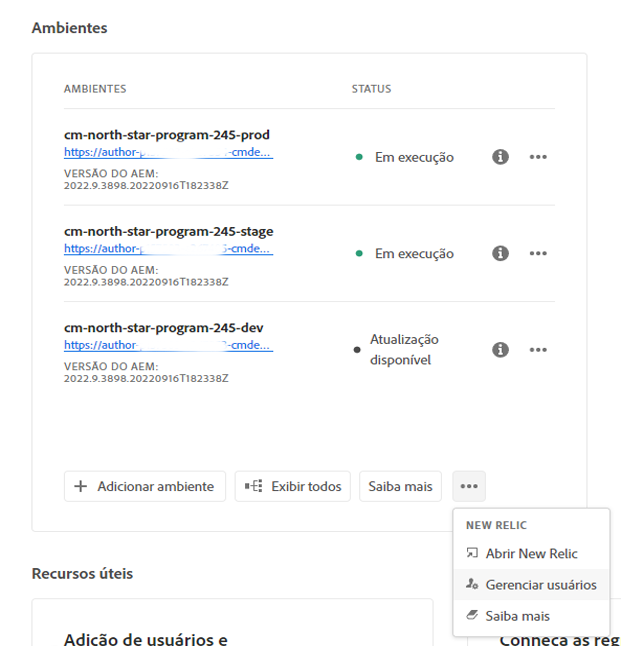
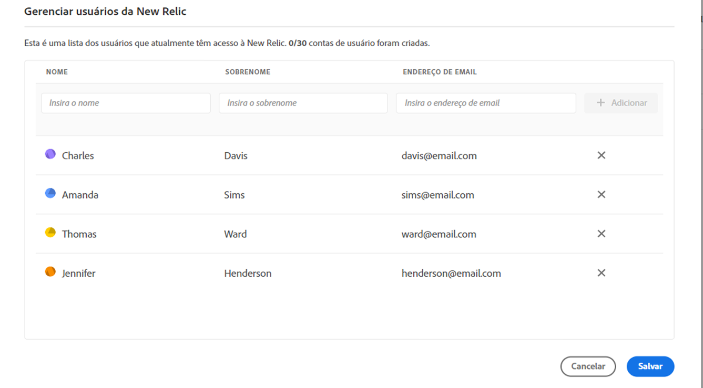
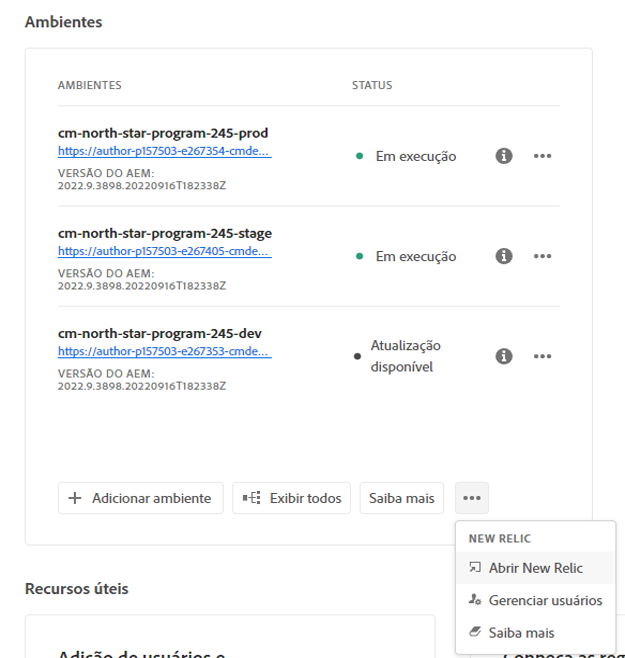

# New Relic One {#user-access}

Saiba mais sobre o serviço de monitoramento de desempenho de aplicativo (APM) da New Relic One para o AEM as a Cloud Service e como você pode acessá-lo.

## Introdução {#introduction}

A Adobe atribui grande importância ao monitoramento, disponibilidade e desempenho do seu aplicativo. O AEM as a Cloud Service fornece acesso a um novo conjunto de monitoramento personalizado da New Relic One como parte da oferta padrão de produtos para garantir que suas equipes tenham a máxima visibilidade sobre as métricas de desempenho de ambientes e sistemas do AEM as a Cloud Service.

Este documento descreve como gerenciar o acesso aos recursos de monitoramento de desempenho de aplicativo (APM) da New Relic One habilitados em seus ambientes do AEM as a Cloud Service para ajudar a oferecer suporte ao desempenho e permitir que você aproveite ao máximo o AEM as a Cloud Service.

Quando um novo programa de produção é criado, a subconta do New Relic One associada ao seu programa do AEM as a Cloud Service é criada automaticamente. [Esta subconta deve ser ativada](#activate-sub-account) para começar a assimilar dados.

## Recursos {#transaction-monitoring}

O APM da New Relic One para AEM as a Cloud Service inclui muitos recursos.

* Acesso direto a uma conta dedicada do New Relic One

* O agente APM instrumentado da New Relic One que mostra chamadas de método exatas com números de linha, incluindo dependências externas e bancos de dados

* Otimização integral do desempenho ao combinar métricas principais do monitoramento ao nível de infraestrutura e do monitoramento de aplicativos (Adobe Experience Manager)

* Exposição dos Mbeans JMX do AEM as a Cloud Service e verificações de integridade diretamente nas métricas da New Relic Insights, permitindo uma inspeção aprofundada do desempenho da pilha de aplicativos e das métricas de integridade.

## Ativar a subconta do New Relic One {#activate-sub-account}

Para um programa recém-criado, uma subconta do New Relic One é criada para você. No entanto, você deve ativá-lo para assimilar dados. Isso não é feito automaticamente. Siga estas etapas para ativar a subconta.

>[!NOTE]
>
>Um usuário na função de **Proprietário da empresa** ou **Gerente de implantação** deve estar conectado para gerenciar a subconta do New Relic One.

1. Faça logon no Cloud Manager, em [my.cloudmanager.adobe.com](https://my.cloudmanager.adobe.com/), e selecione a organização apropriada.

1. No console **[Meus Programas](/help/implementing/cloud-manager/navigation.md#my-programs)**, clique no programa para o qual você deseja gerenciar seus usuários do New Relic One.

1. Na parte inferior do cartão **Ambientes** na página de visão geral do programa, clique em https://spectrum.adobe.com/static/icons/workflow_18/Smock_More_18_N.svg e selecione **Ativar New Relic**.

   

   * Você também pode acessar a opção **Gerenciar usuários** clicando em https://spectrum.adobe.com/static/icons/workflow_18/Smock_More_18_N.svg na parte superior da tela **Ambientes** do seu programa.

1. [Execute um pipeline](/help/implementing/cloud-manager/configuring-pipelines/managing-pipelines.md#running-pipelines) para o mesmo ambiente para concluir com êxito a ativação da subconta.

Quando a subconta é desativada, não há assimilação de dados.

## Gerenciar usuários do New Relic One {#manage-users}

Siga estas etapas para definir os usuários da sua subconta da New Relic One associada ao seu programa do AEM as a Cloud Service.

>[!NOTE]
>
>Um usuário com a função **Proprietário da empresa** ou **Gerente de implantação** deve estar conectado para gerenciar os usuários da New Relic One.

1. Faça logon no Cloud Manager, em [my.cloudmanager.adobe.com](https://my.cloudmanager.adobe.com/), e selecione a organização apropriada.

1. Clique no programa para o qual você deseja gerenciar os usuários do New Relic One.

1. Na parte inferior do cartão **Ambientes** na página de visão geral do programa, clique em https://spectrum.adobe.com/static/icons/workflow_18/Smock_More_18_N.svg e selecione **Gerenciar usuários**.

   

   * Você também pode acessar a opção **Gerenciar usuários** clicando em https://spectrum.adobe.com/static/icons/workflow_18/Smock_More_18_N.svg na parte superior da tela **Ambientes** do seu programa.

1. Na caixa de diálogo **Gerenciar usuários do New Relic**, digite o nome e o sobrenome do usuário que deseja adicionar e clique no botão **Adicionar**. Repita essa etapa para todos os usuários que deseja adicionar.

   

1. Para remover usuários da New Relic One, clique no botão Excluir na extremidade direita da linha que representa o usuário.

1. Clique em **Salvar** para criar os usuários.

Depois de definir os usuários, a New Relic envia um email de confirmação para cada usuário ao qual você concedeu acesso, de modo que o indivíduo possa concluir o processo de configuração e fazer logon.

>[!NOTE]
>
>Se você estiver gerenciando os usuários da New Relic One, também deverá adicionar a si mesmo como usuário para ter acesso. Para ter acesso à New Relic One, não basta ter a função **Proprietário da empresa** ou **Gerente de implantação**. Você também deve criar a si mesmo como um usuário.

## Ativar sua conta de usuário do New Relic One {#activate-user-account}

Depois que uma conta de usuário da New Relic One é criada conforme descrito na seção de visualização [Gerenciar usuários da New Relic One](#manage-users), a New Relic envia a esses usuários um email de confirmação para o endereço fornecido. Para usar essas contas, os usuários devem primeiro ativar suas contas junto à New Relic, redefinindo suas senhas.

Siga estas etapas para ativar sua conta como um usuário da New Relic.

1. Clique no link fornecido por email pela New Relic. A página de logon da New Relic será aberta no navegador.

1. Na página de logon da New Relic, selecione **Esqueceu sua senha?**.

   

1. Digite o endereço de email no qual você recebeu o email de confirmação e selecione **Enviar meu link de redefinição**.

   

1. O New Relic envia um email contendo um link para confirmar a conta.

Se você não receber um email de confirmação da New Relic, consulte a [seção de solução de problemas](#troubshooting).

## Acessar o New Relic One {#accessing-new-relic}

Depois de [ativar sua conta do New Relic](#activate-account), você poderá acessar o New Relic One diretamente ou pela Cloud Manager.

**Para acessar o New Relic One by Cloud Manager:**

1. Faça logon no Cloud Manager, em [my.cloudmanager.adobe.com](https://my.cloudmanager.adobe.com/), e selecione a organização apropriada.

1. Clique no programa para o qual deseja acessar o New Relic One.

1. Na parte inferior do cartão **Ambientes** na página de visão geral do programa, clique em https://spectrum.adobe.com/static/icons/workflow_18/Smock_More_18_N.svg e selecione **Abrir New Relic**.

   

   * Você também pode acessar o New Relic clicando em https://spectrum.adobe.com/static/icons/workflow_18/Smock_More_18_N.svg na parte superior da tela **Ambientes** do seu programa.

1. Na nova guia do navegador que é aberta, faça logon na New Relic One.

**Para acessar o New Relic One diretamente:**

1. Acesse a página de logon do New Relic em [`https://login.newrelic.com/login`](https://login.newrelic.com/login)

1. Faça logon na New Relic One.

### Verificar seu email {#verify-email}

Se for solicitado que você verifique seu email ao fazer logon na New Relic One, isso significa que seu email está associado a várias contas. Você pode escolher qual conta acessar.

Se você não verificar seu endereço de email, a New Relic tentará fazer seu logon com o registro de usuário criado mais recentemente que esteja associado ao seu endereço de email. Para evitar a verificação do email em cada logon, clique na caixa de seleção **Lembrar-se de mim** na tela de logon.

Para obter mais ajuda, abra um tíquete de suporte por meio do [Portal de suporte do AEM](https://helpx.adobe.com/br/enterprise/using/support-for-experience-cloud.html).

## Solução de problemas de acesso de usuários ao New Relic One {#troubleshooting}

Se você foi adicionado como um usuário do New Relic One, conforme descrito na seção [Gerenciar usuários do New Relic One](#manage-users), e não puder localizar o email de confirmação da conta original, siga essas etapas.

1. Acesse a página de logon do New Relic em [`login.newrelic.com/login`](https://login.newrelic.com/login).

1. Selecione **Esqueceu sua senha?**.

   

1. Digite o endereço de email usado para criar sua conta e selecione **Enviar meu link de redefinição**.

   

1. O New Relic envia um email contendo um link para confirmar a conta.

Se você concluir o processo de inscrição e não conseguir fazer logon em sua conta devido a mensagens de erro relacionadas a email ou senha, registre um tíquete de suporte por meio do [Admin Console](https://adminconsole.adobe.com/).

Se você não receber um email do New Relic, faça o seguinte:

* Verifique seus [filtros de spam](https://docs.newrelic.com/docs/accounts/accounts-billing/account-setup/create-your-new-relic-account/).
* Se aplicável, [adicione a New Relic à sua lista de permissões de email](https://docs.newrelic.com/docs/accounts/accounts/account-maintenance/account-email-settings/#email-whitelist).
* Se nenhuma das sugestões ajudar, forneça feedback sobre o tíquete de suporte.

## Limitações {#limitations}

As seguintes limitações se aplicam à adição de usuários à New Relic One:

* É possível adicionar no máximo 30 usuários. Se o número máximo de usuários for atingido, remova alguns para poder adicionar novos.
* Os usuários adicionados ao New Relic são do tipo **Restrito**, consulte [a documentação do New Relic para obter detalhes](https://docs.newrelic.com/docs/accounts/original-accounts-billing/original-users-roles/users-roles-original-user-model/#:~:text=In%20general%2C%20Admins%20take%20responsibility,Restricted%20Users%20can%20use%20them.&amp;text=One%20or%20more%20individuals%20who,change).
* O AEM as a Cloud Service somente oferece a solução de APM da New Relic One e não oferece suporte a alertas, registros ou integrações de API.

>[!NOTE]
>
>Se nenhuma atividade for detectada na subconta da New Relic One por 90 dias ou mais, o agente APM será interrompido.
>
>Siga as mesmas etapas na seção [Ativar a subconta do New Relic One](#activate-sub-account) deste documento para reativar a subconta do New Relic One.

Para obter mais ajuda ou orientação sobre as ofertas da New Relic One para o seu programa AEM as a Cloud Service, abra um tíquete de suporte no [Portal de suporte do AEM](https://helpx.adobe.com/br/enterprise/using/support-for-experience-cloud.html).

## Perguntas frequentes {#faqs}

+++

### O que a Adobe monitora com a New Relic One? {#adobe-monitor}

A Adobe monitora os serviços de autoria, publicação e visualização do AEM as a Cloud Service (quando disponíveis) por meio do plug-in Java da New Relic One. A Adobe habilita a telemetria e o monitoramento personalizados da APM da New Relic One em ambientes de produção e não produção do AEM as a Cloud Service.

Sua conta da New Relic One é anexada a uma conta principal mantida pela Adobe e tem vários aplicativos subordinados a ela: três por ambiente do AEM as a Cloud Service.

* Um aplicativo para o serviço de autoria por ambiente
* Um aplicativo para o serviço de publicação por ambiente (incluindo o Golden Publish)
* Um aplicativo para o serviço de visualização por ambiente

Observação:

* Cada aplicativo usa uma chave de licença.
* Os ambientes do AEM as a Cloud Service são subordinados a apenas uma conta da New Relic One.
* As métricas e os eventos completos de monitoramento da New Relic One são retidos por sete dias.
+++

+++

### O Adobe envia notificações de alerta do New Relic One? {#alerting-new-relic}

O Adobe fornece acesso ao New Relic One somente para fins de observação e não o utiliza para alertas de clientes ou alertas operacionais internos. As notificações para qualquer incidente são enviadas usando [perfis de notificação de usuário](/help/journey-onboarding/notification-profiles.md).
+++

+++

### Quem pode acessar os dados do serviço de nuvem da New Relic One? {#access-new-relic-cloud}

O acesso integral para leitura será concedido para até 30 membros da sua equipe. O acesso de leitura inclui todas as métricas de APM coletadas pelo agente do New Relic One.
+++

+++

### Há suporte à configuração personalizada de SSO? {#custom-sso}

A configuração personalizada do SSO não é suportada para a conta da New Relic One provisionada pela Adobe.
+++

+++

### E se eu já tiver uma assinatura local da New Relic? {#new-relic-subscription}

A New Relic One é a nova plataforma de observabilidade da New Relic e permite que o suporte da Adobe e suas equipes observem, monitorem e visualizem métricas e eventos, tudo em um só lugar.

A New Relic One fornece aos usuários a capacidade de pesquisar em todas as contas, nas quais têm acesso e visualizam dados de todos os serviços e hosts em uma única visualização.

Embora o suporte ao Adobe monitore o aplicativo da AEM as a Cloud Service usando o New Relic One e outras ferramentas internas como parte de seu serviço, suas equipes podem continuar a usar o New Relic para serviços e infraestrutura hospedados no local. Eles poderão visualizar os dados de contas da New Relic One gerenciadas pela Adobe e de contas da New Relic gerenciadas pelo cliente.

>[!NOTE]
>
>Para visualizar ambos os conjuntos de dados na New Relic One, um usuário precisa ter as permissões certas e usar a mesma metodologia de logon para ambas as contas (contas da New Relic One gerenciadas pela Adobe e contas da New Relic gerenciadas pelo cliente).

+++

+++

### O agente APM da minha conta do New Relic One foi interrompido. O que aconteceu? {#deactivated}

[Os agentes APM serão interrompidos](#limitations) se nenhuma atividade for detectada por 90 dias ou mais. Siga as mesmas etapas na seção [Ativar a subconta do New Relic One](#activate-sub-account) deste documento para reativar a subconta do New Relic One.
+++
