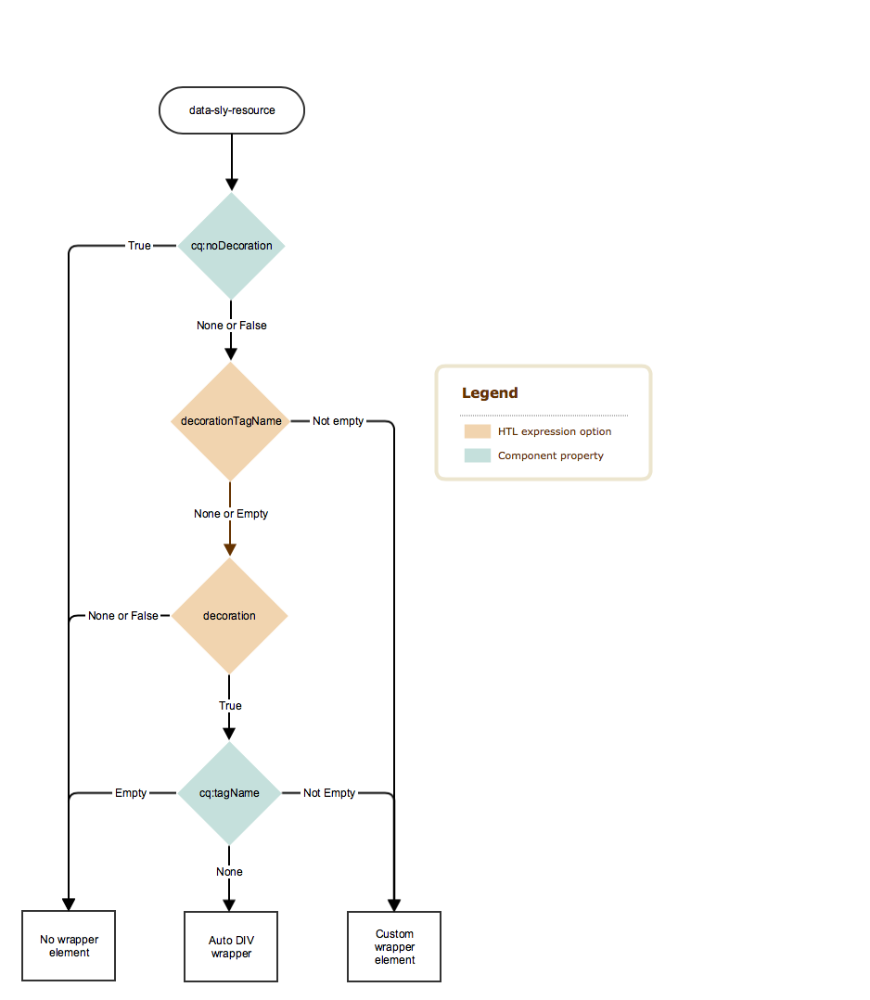

# Tag de decoração {#decoration-tag}

Quando um componente em uma página da Web é renderizado, um elemento HTML pode ser gerado, vinculando o componente renderizado dentro de si mesmo. Isso serve principalmente dois propósitos:

* Um componente só pode ser editado quando está envolvido com um elemento HTML.
* O elemento de encapsulamento é usado para aplicar classes HTML que fornecem:
   * Informações de layout
   * Informações de estilo

Para desenvolvedores, o AEM oferece lógica simples e clara controlando as tags de decoração que envolvem componentes incluídos. Se e como a tag de decoração é renderizada é definida pela combinação de dois fatores, que esta página mergulhará em:

* O próprio componente pode configurar sua tag de decoração com um conjunto de propriedades.
* Os scripts que incluem componentes podem definir os aspectos da tag de decoração com parâmetros de inclusão.

## Recomendações {#recommendations}

Estas são algumas recomendações gerais de quando incluir o elemento wrapper que devem ajudar a evitar problemas inesperados:

* A presença do elemento wrapper não deve diferir entre WCMModes (modo de edição ou visualização), instâncias (autor ou publicação) ou ambientes (preparação ou produção), para que o CSS e os JavaScripts da página funcionem de forma idêntica em todos os casos.
* O elemento wrapper deve ser adicionado a todos os componentes editáveis, para que o editor de páginas possa inicializá-los e atualizá-los corretamente.
* Para componentes não editáveis, o elemento wrapper pode ser evitado se não atender a nenhuma função específica, para que a marcação resultante não fique inchada desnecessariamente.

## Controles de componentes {#component-controls}

As seguintes propriedades e nós podem ser aplicados aos componentes para controlar o comportamento de sua tag de decoração:

* **`cq:noDecoration {boolean}`:** Essa propriedade pode ser adicionada a um componente e um valor real força AEM não gerar nenhum elemento wrapper sobre o componente.
* **`cq:htmlTag`node :** Esse nó pode ser adicionado em um componente e pode ter as seguintes propriedades:
   * **`cq:tagName {String}`:** Isso pode ser usado para especificar uma tag HTML personalizada a ser usada para vincular os componentes, em vez do elemento DIV padrão.
   * **`class {String}`:** Isso pode ser usado para especificar nomes de classe CSS a serem adicionados ao wrapper.
   * Outros nomes de propriedade serão adicionados como atributos HTML com o mesmo valor String fornecido.

## Controles de script {#script-controls}

Em geral, o comportamento do wrapper no HTL pode ser resumido da seguinte maneira:

* Nenhum DIV de invólucro é renderizado por padrão (apenas ao fazer `data-sly-resource="foo"`).
* Todos os wcm-modes (desativado, pré-visualização, editar autor e publicar) são renderizados de forma idêntica.

O comportamento do invólucro também pode ser totalmente controlado.

* O script HTL tem controle total sobre o comportamento resultante da tag wrapper.
* Propriedades do componente (como `cq:noDecoration` e `cq:tagName`) também pode definir a tag wrapper.

É possível controlar totalmente o comportamento das tags wrapper a partir de scripts HTL e sua lógica associada.

Para obter mais informações sobre o desenvolvimento no HTL, consulte [Documentação do HTL](https://experienceleague.adobe.com/docs/experience-manager-htl/using/overview.html?lang=pt-BR).

### Árvore de decisão {#decision-tree}

Essa árvore de decisão resume a lógica que determina o comportamento das tags wrapper.



### Casos de uso {#use-cases}

Os três casos de uso a seguir fornecem exemplos de como as tags wrapper são manipuladas e também ilustram como é simples controlar o comportamento desejado das tags wrapper.

Todos os exemplos a seguir pressupõem a seguinte estrutura de conteúdo e componentes:

```
/content/test/
  @resourceType = "test/components/one"
  child/
    @resourceType = "test/components/two"
```

```
/apps/test/components/
  one/
    one.html
  two/
    two.html
    cq:htmlTag/
      @cq:tagName = "article"
      @class = "component-two"
```

#### Caso de uso 1: Incluir um componente para reutilização do código {#use-case-include-a-component-for-code-reuse}

O caso de uso mais comum é quando um componente inclui outro componente por motivos de reutilização do código. Nesse caso, o componente incluído não é desejado para ser editável com sua própria barra de ferramentas e caixa de diálogo, portanto, nenhum wrapper é necessário e o componente `cq:htmlTag` serão ignoradas. Isso pode ser considerado o comportamento padrão.

`one.html: <sly data-sly-resource="child"></sly>`

`two.html: Hello World!`

Resultado na saída em `/content/test.html`:

**`Hello World!`**

Um exemplo seria um componente que inclui um componente de imagem principal para exibir uma imagem, normalmente nesse caso usando um recurso sintético, que consiste em incluir um componente filho virtual passando para data-sly-resource um objeto de mapa que representa todas as propriedades que o componente teria.

#### Caso de uso 2: Incluir um componente editável {#use-case-include-an-editable-component}

Outro caso de uso comum é quando os componentes do contêiner incluem componentes filhos editáveis, como um Contêiner de layout. Nesse caso, cada filho incluído precisa imperativamente de um invólucro para o editor funcionar (a menos que explicitamente desativado com o `cq:noDecoration` propriedade).

Como o componente incluído é, nesse caso, um componente independente, ele precisa de um elemento wrapper para que o editor funcione e defina seu layout e estilo para aplicar. Para acionar esse comportamento, há a variável `decoration=true` opção.

`one.html: <sly data-sly-resource="${'child' @ decoration=true}"></sly>`

`two.html: Hello World!`

Resultado na saída em `/content/test.html`:

**`<article class="component-two">Hello World!</article>`**

#### Caso de uso 3: Comportamento personalizado {#use-case-custom-behavior}

Pode haver vários casos complexos, que podem ser facilmente alcançados com a possibilidade de HTL fornecer explicitamente:

* **`decorationTagName='ELEMENT_NAME'`** Para definir o nome do elemento do wrapper.
* **`cssClassName='CLASS_NAME'`** Para definir os nomes de classe CSS a serem definidos.

`one.html: <sly data-sly-resource="${'child' @ decorationTagName='aside', cssClassName='child'}"></sly>`

`two.html: Hello World!`

Saída resultante `/content/test.html`:

**`<aside class="child">Hello World!</aside>`**
