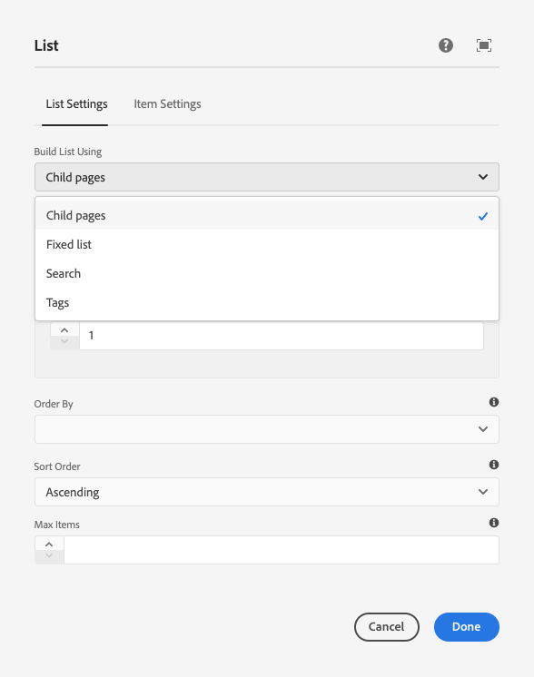
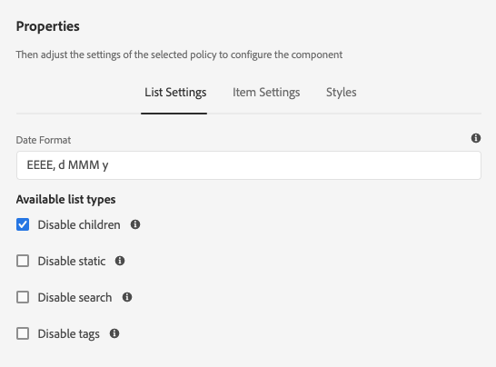

# Uso de condições de ocultação {#using-hide-conditions}

As condições de ocultação podem ser usadas para determinar se um recurso de componente é renderizado ou não. Um exemplo disso seria quando um autor de modelo configura o [componente de lista](https://experienceleague.adobe.com/docs/experience-manager-core-components/using/components/list.html?lang=pt-BR) do Componente principal no [editor de modelos](/help/sites-cloud/authoring/page-editor/templates.md) e decide desabilitar as opções para criar a lista com base em páginas secundárias. Desativar essa opção na caixa de diálogo de design define uma propriedade para que, quando o componente de lista for renderizado, a condição de ocultação seja avaliada e a opção para mostrar páginas secundárias não seja exibida.

## Visão geral {#overview}

Os diálogos podem se tornar muito complexos com várias opções para o usuário, que pode usar apenas uma fração das opções que estão à sua disposição. Isso pode causar experiências esmagadoras na interface do usuário.

Ao usar as condições de ocultação, administradores, desenvolvedores e superusuários têm uma maneira de ocultar recursos com base em um conjunto de regras. Esse recurso permite que eles decidam quais recursos devem ser exibidos quando um autor editar o conteúdo.

>[!NOTE]
>
>Ocultar um recurso com base em uma expressão não substitui as permissões de ACL. O conteúdo permanece editável, mas simplesmente não é exibido.

## Detalhes de implementação e uso {#implementation-and-usage-details}

`com.adobe.granite.ui.components.FilteringResourceWrapper` é responsável por filtrar os recursos com base na existência e no valor da propriedade `granite:hide`, localizada no campo a ser filtrado. A implementação de `/libs/cq/gui/components/authoring/dialog/dialog.jsp` inclui uma instância de `FilteringResourceWrapper.`

A implementação usa a [API ELResolver](https://helpx.adobe.com/experience-manager/6-5/sites/developing/using/reference-materials/granite-ui/api/jcr_root/libs/granite/ui/docs/server/el.html) do Granite e adiciona uma variável personalizada `cqDesign` por meio do ExpressionCustomizer.

Estes são alguns exemplos de condições de ocultação em um nó de design localizado em `etc/design` ou como uma Política de Conteúdo.

```
${cqDesign.myProperty}
${!cqDesign.myProperty}
${cqDesign.myProperty == 'someText'}
${cqDesign.myProperty != 'someText'}
${cqDesign.myProperty == true}
${cqDesign.myProperty == true}
${cqDesign.property1 == 'someText' && cqDesign.property2 || cqDesign.property3 != 1 || header.myHeader}
```

Ao definir a expressão ocultar, lembre-se:

* Para ser válido, o escopo no qual a propriedade é encontrada deve ser expresso (por exemplo, `cqDesign.myProperty`).
* Os valores são somente leitura.
* As funções (se necessário) devem ser limitadas a um determinado conjunto fornecido pelo serviço.

## Exemplo {#example}

Exemplos de condições de ocultação podem ser encontrados em todo o AEM e nos [componentes principais](https://experienceleague.adobe.com/pt-br/docs/experience-manager-core-components/using/introduction) em particular. Por exemplo, considere o [componente principal da lista](https://experienceleague.adobe.com/docs/experience-manager-core-components/using/components/list.html?lang=pt-BR) como implementado no [tutorial WKND](/help/implementing/developing/introduction/develop-wknd-tutorial.md).

[Usando o editor de modelo](/help/sites-cloud/authoring/page-editor/templates.md), o autor do modelo pode definir na caixa de diálogo de design quais opções do componente de lista estão disponíveis para o autor da página. É possível habilitar ou desabilitar opções como permitir que a lista seja uma lista estática, uma lista de páginas secundárias, uma lista de páginas marcadas etc.

Se um autor do modelo optar por desativar a opção de páginas secundárias, uma propriedade de design será definida e uma condição de ocultação será avaliada em relação a ela, o que faz com que a opção não seja renderizada para o autor da página.

1. Por padrão, o autor da página pode usar o componente principal da lista para criar uma lista usando páginas secundárias ao escolher a opção **Páginas secundárias**.

   

1. Na caixa de diálogo de design do componente principal da lista, o autor do modelo pode escolher a opção **Desativar secundárias** para impedir que a opção para gerar uma lista com base em páginas secundárias seja exibida ao autor da página.

   

1. Um nó de política foi criado em `/conf/wknd/settings/wcm/policies/wknd/components/list` com uma propriedade `disableChildren` definida como `true`.

   

1. A condição de ocultação é definida como o valor de uma propriedade `granite:hide` no nó de propriedade de diálogo `/libs/core/wcm/components/list/v2/list/cq:dialog/content/items/tabs/items/listSettings/items/columns/items/column/items/listFrom/items/children`

   

1. O valor de `disableChildren` é extraído da configuração de design e a expressão `${cqDesign.disableChildren}` é avaliada como `false`, o que significa que a opção não será renderizada como parte do componente.

1. A opção **Páginas secundárias** não é mais renderizada para o autor da página ao usar o componente de lista.

   
