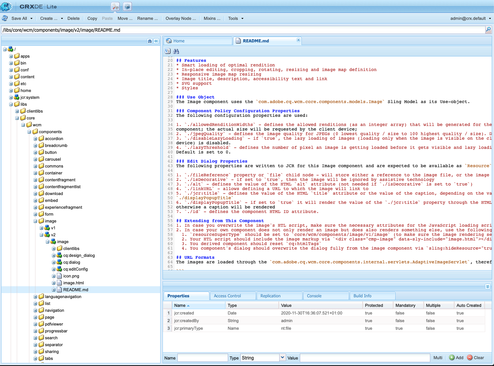

# Guia de referência de componentes {#components-reference-guide}

Os componentes estão no centro da criação de uma experiência no AEM. O [Componentes principais](https://experienceleague.adobe.com/docs/experience-manager-core-components/using/introduction.html?lang=pt-BR) e [Arquétipo de projeto AEM](https://experienceleague.adobe.com/docs/experience-manager-core-components/using/developing/archetype/overview.html?lang=pt-BR) facilita começar a usar um conjunto de ferramentas de componentes robustos e prontos. O [Tutorial WKND](/help/implementing/developing/introduction/develop-wknd-tutorial.md) O leva o desenvolvedor a usar essas ferramentas e como criar componentes personalizados para criar um novo site de AEM.

>[!TIP]
>
>Antes de fazer referência a este documento, verifique se você concluiu a [Tutorial WKND](/help/implementing/developing/introduction/develop-wknd-tutorial.md) e, portanto, familiarizar-se com a [Componentes principais](https://experienceleague.adobe.com/docs/experience-manager-core-components/using/introduction.html?lang=pt-BR) e [AEM Arquétipo de projeto.](https://experienceleague.adobe.com/docs/experience-manager-core-components/using/developing/archetype/overview.html?lang=pt-BR)

Como o tutorial WKND aborda a maioria dos casos de uso, este documento destina-se somente a complementar esses recursos. Ele fornece especificações técnicas detalhadas sobre como os componentes são estruturados e configurados em AEM e não se destina a ser um guia de introdução.

## Visão geral {#overview}

Esta seção aborda os principais conceitos e problemas como uma introdução aos detalhes necessários ao desenvolver seus próprios componentes.

### Planejamento {#planning}

Antes de começar a realmente configurar ou codificar seu componente, você deve perguntar:

* O que exatamente você precisa que o novo componente faça?
* Você precisa criar seu componente do zero ou pode herdar as noções básicas de um componente existente?
* Seu componente precisará de lógica para selecionar/manipular o conteúdo?
   * A lógica deve ser mantida separada da camada da interface do usuário. O HTL foi projetado para ajudar a garantir que isso aconteça.
* Seu componente precisará de formatação CSS?
   * A formatação de CSS deve ser mantida separada das definições do componente. Defina as convenções para nomear seus elementos HTML para que você possa modificá-los por meio de arquivos CSS externos.
* Quais implicações de segurança o novo componente pode apresentar?

### Reutilizar componentes existentes {#reusing-components}

Antes de investir tempo na criação de um componente totalmente novo, considere personalizar ou estender os componentes existentes. [Os componentes principais](https://experienceleague.adobe.com/docs/experience-manager-core-components/using/introduction.html?lang=pt-BR) oferecem um conjunto de componentes flexíveis, robustos e bem testados prontos para produção.

#### Extensão dos componentes principais {#extending-core-components}

Os Componentes principais também oferecem [limpar padrões de personalização](https://experienceleague.adobe.com/docs/experience-manager-core-components/using/developing/customizing.html?lang=pt-BR) que você pode usar para adaptá-las às necessidades do seu próprio projeto.

#### Sobreposição de componentes {#overlying-components}

Os componentes também podem ser redefinidos com um [sobreposição](/help/implementing/developing/introduction/overlays.md) com base na lógica do caminho de pesquisa. No entanto, nesse caso, o [Fusão de Recursos Sling](/help/implementing/developing/introduction/sling-resource-merger.md) não será acionado e `/apps` deve definir a sobreposição inteira.

#### Extensão de caixas de diálogo de componentes {#extending-component-dialogs}

Também é possível substituir uma caixa de diálogo de componente usando o Sling Resource Merger e definindo a propriedade `sling:resourceSuperType`.

Isso significa que você só precisa redefinir as diferenças necessárias, em vez de redefinir toda a caixa de diálogo.

### Lógica de conteúdo e marcação de renderização  {#content-logic-and-rendering-markup}

Seu componente será renderizado com [HTML.](https://www.w3schools.com/htmL/html_intro.asp) Seu componente precisa definir o HTML necessário para obter o conteúdo necessário e, em seguida, renderizá-lo conforme necessário, nos ambientes de autor e publicação.

É recomendável manter o código responsável pela marcação e renderização separadas do código que controla a lógica usada para selecionar o conteúdo do componente.

Essa filosofia é apoiada por [HTL](https://experienceleague.adobe.com/docs/experience-manager-htl/content/overview.html), uma linguagem de modelo que é propositalmente limitada para garantir uma linguagem de programação real é usada para definir a lógica comercial subjacente. Esse mecanismo destaca o código chamado para uma determinada visualização e, se necessário, permite uma lógica específica para diferentes visualizações do mesmo componente.

Essa lógica (opcional) pode ser implementada de diferentes maneiras e é invocada do HTL com comandos específicos:

* Uso do Java - [A API de uso do Java do HTL](https://experienceleague.adobe.com/docs/experience-manager-htl/content/java-use-api.html) permite que um arquivo HTL acesse métodos de ajuda em uma classe Java personalizada. Isso permite usar o código Java para implementar a lógica de seleção e configuração do conteúdo do componente.
* Uso do JavaScript - [A API de uso do JavaScript do HTL](https://experienceleague.adobe.com/docs/experience-manager-htl/using/htl/use-api-javascript.html) permite que um arquivo HTL acesse o código auxiliar gravado em JavaScript. Isso permite usar o código JavaScript para implementar a lógica de seleção e configuração do conteúdo do componente.
* Uso de bibliotecas do lado do cliente - Sites modernos dependem muito do processamento no lado do cliente impulsionado por códigos complexos de JavaScript e CSS. Consulte o documento [Usar bibliotecas do lado do cliente no AEM as a Cloud Service](/help/implementing/developing/introduction/clientlibs.md) para obter mais informações.

## Estrutura do componente {#structure}

A estrutura de um componente de AEM é poderosa e flexível. As principais partes são:

* [Tipo de recurso](#resource-type)
* [Definição do componente](#component-definition)
* [Propriedades e nós secundários de um componente](#properties-and-child-nodes-of-a-component)
* [Caixas de diálogo](#dialogs)
* [Caixas de diálogo de design](#design-dialogs)

### Tipo de recurso {#resource-type}

Um elemento-chave da estrutura é o tipo de recurso.

* A estrutura de conteúdo declara intenções.
* O tipo de recurso os implementa.

Essa é uma abstração que ajuda a garantir que, mesmo quando a aparência muda com o tempo, a intenção permanece o tempo.

### Definição do componente {#component-definition}

A definição de um componente pode ser dividida da seguinte maneira:

* AEM componentes se baseiam em [Sling.](https://sling.apache.org/documentation.html)
* AEM componentes estão localizados em `/libs/core/wcm/components`.
* Os componentes específicos do projeto/site estão localizados em `/apps/<myApp>/components`.
* AEM componentes padrão são definidos como `cq:Component` e ter os elementos principais:
   * propriedades do jcr - Uma lista de propriedades do jcr. Elas são variáveis e algumas podem ser opcionais se a estrutura básica de um nó de componente, suas propriedades e subnós forem definidos pela variável `cq:Component` definição.
   * Recursos - Eles definem elementos estáticos usados pelo componente.
   * Scripts - São usados para implementar o comportamento da instância resultante do componente.

#### Propriedades vitais {#vital-properties}

* **Nó raiz**:
   * `<mycomponent> (cq:Component)` - Nó de hierarquia do componente.
* **Propriedades vitais**:
   * `jcr:title` - Título do componente; por exemplo, usado como um rótulo quando o componente está listado no [Navegador de componentes](/help/sites-cloud/authoring/fundamentals/environment-tools.md#components-browser) e [Console de componentes](/help/sites-cloud/authoring/features/components-console.md)
   * `jcr:description` - Descrição do componente; usado como dica de mouse sobre o console Navegador de componentes e Componentes
   * Consulte a seção [Ícone do componente](#component-icon) para obter detalhes
* **Nós Secundários Vitais**:
   * `cq:editConfig (cq:EditConfig)` - Define as propriedades de edição do componente e permite que o componente apareça no Navegador de componentes
      * Se o componente tiver uma caixa de diálogo, ela aparecerá automaticamente no navegador Componentes ou no Sidekick, mesmo se cq:editConfig não existir.
   * `cq:childEditConfig (cq:EditConfig)` - Controla os aspectos da interface do usuário do autor para componentes filhos que não definem seus próprios `cq:editConfig`.
   * `cq:dialog (nt:unstructured)` - Caixa de diálogo desse componente. Define a interface que permite ao usuário configurar o componente e/ou editar conteúdo.
   * `cq:design_dialog (nt:unstructured)` - Edição de design para este componente

#### Ícone do componente {#component-icon}

O ícone ou a abreviação do componente é definido por meio das propriedades do JCR do componente quando ele é criado pelo desenvolvedor. Essas propriedades são avaliadas na ordem a seguir e a primeira propriedade válida encontrada é usada.

1. `cq:icon` - Propriedade da string que aponta para um ícone padrão na [Biblioteca da interface do usuário do Coral](https://opensource.adobe.com/coral-spectrum/examples/#icon) para exibir no navegador de componentes
   * Use o valor do atributo HTML do ícone Coral.
1. `abbreviation` - Propriedade String para personalizar a abreviação do nome do componente no navegador do componente
   * A abreviação deve ser limitada a dois caracteres.
   * Fornecer uma string vazia criará a abreviação dos dois primeiros caracteres do `jcr:title` propriedade.
      * Por exemplo, &quot;Im&quot; para &quot;Image&quot;
      * O título localizado será usado para criar a abreviação.
   * A abreviação só é traduzida se o componente tiver uma `abbreviation_commentI18n` , que é usada como dica de tradução.
1. `cq:icon.png` ou `cq:icon.svg` - Ícone para este componente, que é mostrado no Navegador de componentes
   * 20 x 20 pixels é o tamanho dos ícones dos componentes padrão.
      * Os ícones maiores serão baixados (no lado do cliente).
   * A cor recomendada é rgb(112, 112, 112) > #707070
   * O plano de fundo dos ícones de componentes padrão é transparente.
   * Somente `.png` e `.svg` os arquivos são suportados.
   * Ao importar do sistema de arquivos por meio do plug-in Eclipse, os nomes de arquivo precisam ser evitados como `_cq_icon.png` ou `_cq_icon.svg` por exemplo.
   * `.png` tem precedência sobre `.svg` se ambos estiverem presentes.

Se nenhuma das propriedades acima (`cq:icon`, `abbreviation`, `cq:icon.png` ou `cq:icon.svg`) são encontradas no componente :

* O sistema pesquisará as mesmas propriedades nos supercomponentes seguindo o `sling:resourceSuperType` propriedade.
* Se nada ou uma abreviação vazia for encontrada no nível do supercomponente, o sistema criará a abreviação das primeiras letras do `jcr:title` propriedade do componente atual.

Para cancelar a herança de ícones de supercomponentes, defina um valor vazio `abbreviation` no componente será revertido para o comportamento padrão.

O [Console do componente](/help/sites-cloud/authoring/features/components-console.md#component-details) exibe como o ícone de um componente específico é definido.

#### Exemplo de ícone SVG {#svg-icon-example}

```xml
<?xml version="1.0" encoding="utf-8"?>
<!DOCTYPE svg PUBLIC "-//W3C//DTD SVG 1.1//EN" "https://www.w3.org/Graphics/SVG/1.1/DTD/svg11.dtd">
<svg version="1.1" id="Layer_1" xmlns="https://www.w3.org/2000/svg" xmlns:xlink="https://www.w3.org/1999/xlink" x="0px" y="0px"
     width="20px" height="20px" viewBox="0 0 20 20" enable-background="new 0 0 20 20" xml:space="preserve">
    <ellipse cx="5" cy="5" rx="3" ry="3" fill="#707070"/>
    <ellipse cx="15" cy="5" rx="4" ry="4" fill="#707070"/>
    <ellipse cx="5" cy="15" rx="5" ry="5" fill="#707070"/>
    <ellipse cx="15" cy="15" rx="4" ry="4" fill="#707070"/>
</svg>
```

### Propriedades e nós secundários de um componente {#properties-and-child-nodes-of-a-component}

Muitos dos nós/propriedades necessários para definir um componente são comuns a ambas as interfaces do usuário, com diferenças que permanecem independentes para que seu componente possa funcionar em ambos os ambientes.

Um componente é um nó do tipo `cq:Component` e tem as seguintes propriedades e nós secundários:

| Nome | Tipo | Descrição |
|---|---|---|
| `.` | `cq:Component` | Representa o componente atual. Um componente é do tipo de nó `cq:Component`. |
| `componentGroup` | `String` | Representa o grupo sob o qual o componente pode ser selecionado no [Navegador de componentes.](/help/sites-cloud/authoring/fundamentals/environment-tools.md#components-browser) Um valor que começa com `.` é usada para componentes que não estão disponíveis para seleção na interface do usuário, como componentes base dos quais outros componentes herdam. |
| `cq:isContainer` | `Boolean` | Isso indica se o componente é um componente de contêiner e, portanto, pode conter outros componentes, como um sistema de parágrafo. |
| `cq:dialog` | `nt:unstructured` | Essa é a definição da caixa de diálogo de edição do componente. |
| `cq:design_dialog` | `nt:unstructured` | Esta é a definição da caixa de diálogo de design do componente. |
| `cq:editConfig` | `cq:EditConfig` | Isso define o [edite a configuração do componente.](#edit-behavior) |
| `cq:htmlTag` | `nt:unstructured` | Isso retorna atributos de tag adicionais que são adicionados à tag HTML ao redor. Permite a adição de atributos aos divs gerados automaticamente. |
| `cq:noDecoration` | `Boolean` | Se verdadeiro, o componente não é renderizado com classes div e css geradas automaticamente. |
| `cq:template` | `nt:unstructured` | Se encontrado, esse nó será usado como um modelo de conteúdo quando o componente for adicionado do Navegador de componentes. |
| `jcr:created` | `Date` | Esta é a data de criação do componente. |
| `jcr:description` | `String` | Esta é a descrição do componente. |
| `jcr:title` | `String` | Este é o título do componente. |
| `sling:resourceSuperType` | `String` | Quando definido, o componente herda desse componente. |
| `component.html` | `nt:file` | Este é o arquivo de script HTL do componente. |
| `cq:icon` | `String` | Esse valor aponta para a variável [ícone do componente](#component-icon) e é exibido no Navegador de componentes. |

Se olharmos para a **Texto** , podemos ver vários desses elementos:


As propriedades de interesses específicos incluem:

* `jcr:title` - Este é o título do componente usado para identificar o componente no Navegador de componentes.
* `jcr:description` - Esta é a descrição do componente.
* `sling:resourceSuperType` - Indica o caminho da herança ao estender um componente (substituindo uma definição).

Os nós filhos de interesse especial incluem:

* `cq:editConfig` - Isso controla os aspectos visuais do componente durante a edição.
* `cq:dialog` - Isso define a caixa de diálogo para edição de conteúdo desse componente.
* `cq:design_dialog` - Especifica as opções de edição de design para este componente.

### Caixas de diálogo {#dialogs}

As caixas de diálogo são um elemento essencial do seu componente, pois fornecem uma interface para os autores configurar o componente em uma página de conteúdo e fornecer entrada para esse componente. Consulte a [documentação de criação](/help/sites-cloud/authoring/fundamentals/editing-content.md) para obter detalhes sobre como os autores de conteúdo interagem com componentes.

Dependendo da complexidade do componente, a caixa de diálogo pode precisar de uma ou mais guias.

Caixas de diálogo para componentes AEM:

* São `cq:dialog` nós do tipo `nt:unstructured`.
* Estejam localizadas sob as suas `cq:Component` e ao lado de suas definições de componentes.
* Defina a caixa de diálogo para editar o conteúdo desse componente.
* São definidas usando componentes da interface do usuário do Granite.
* São renderizados do lado do servidor (como componentes do Sling), com base em sua estrutura de conteúdo e na variável `sling:resourceType` propriedade.
* Contém uma estrutura de nó que descreve os campos na caixa de diálogo
   * Esses nós são `nt:unstructured` com o `sling:resourceType` propriedade.


Na caixa de diálogo , campos individuais são definidos:


### Caixas de diálogo de design {#design-dialogs}

As caixas de diálogo de design são semelhantes às caixas de diálogo usadas para editar e configurar o conteúdo, mas fornecem a interface para os autores de modelo pró-configurar e fornecer detalhes de design para esse componente em um modelo de página. Os modelos de página são então usados pelos autores de conteúdo para criar páginas de conteúdo. Consulte a [documentação do modelo](/help/sites-cloud/authoring/features/templates.md) para obter detalhes sobre como os modelos são criados.

[As caixas de diálogo de design são usadas ao editar um modelo de página](/help/sites-cloud/authoring/features/templates.md), embora não sejam necessários para todos os componentes. Por exemplo, a variável **Título** e **Componentes de imagem** ambos têm diálogos de design, enquanto que a variável **Componente de compartilhamento de mídia social** não.

### Interface do usuário do Coral e do Granite {#coral-and-granite}

A interface do usuário do Coral e a interface do Granite definem a aparência do AEM.

* [Interface do usuário do Coral](https://opensource.adobe.com/coral-spectrum/documentation/) O fornece uma interface do usuário consistente em todas as soluções de nuvem.
* [Interface do usuário do Granite](https://helpx.adobe.com/experience-manager/6-5/sites/developing/using/reference-materials/granite-ui/api/jcr_root/libs/granite/ui/index.html) O fornece marcação de interface de usuário Coral embutida em componentes do Sling para criar consoles e caixas de diálogo de interface de usuário.

A interface do usuário do Granite fornece uma grande variedade de widgets básicos necessários para criar sua caixa de diálogo no ambiente de criação. Quando necessário, é possível estender essa seleção e criar seu próprio widget.

Para obter detalhes adicionais, consulte os seguintes recursos:

* [Estrutura da interface do AEM](/help/implementing/developing/introduction/ui-structure.md)

### Personalização de campos de diálogo {#customizing-dialog-fields}

<!--
Content not found

>[!TIP]
>
>See the [AEM Gems session](https://docs.adobe.com/content/ddc/en/gems/customizing-dialog-fields-in-touch-ui.html) on customizing dialog fields.
-->

Para criar um novo widget para uso em uma caixa de diálogo de componente, é necessário criar um novo componente de campo da interface do usuário do Granite.

Se sua caixa de diálogo for considerada um contêiner simples para um elemento de formulário, você também poderá ver o conteúdo principal do conteúdo da caixa de diálogo como campos de formulário. A criação de um novo campo de formulário requer a criação de um tipo de recurso; isso equivale a criar um novo componente. Para ajudar você nessa tarefa, a interface do usuário do Granite oferece um componente de campo genérico do qual herdar (usando `sling:resourceSuperType`):

`/libs/granite/ui/components/coral/foundation/form/field`

Mais especificamente, a interface do usuário do Granite fornece uma variedade de componentes de campo adequados para uso em caixas de diálogo ou, de modo mais geral, em [formulários.](https://helpx.adobe.com/experience-manager/6-5/sites/developing/using/reference-materials/granite-ui/api/jcr_root/libs/granite/ui/components/foundation/form/index.html)

Depois de criar o tipo de recurso, é possível instanciar o campo adicionando um novo nó na caixa de diálogo, com a propriedade `sling:resourceType` referência ao tipo de recurso que acabou de apresentar.

#### Acesso aos campos de diálogo {#access-to-dialog-fields}

Também é possível usar condições de renderização (`rendercondition`) para controlar quem tem acesso a guias/campos específicos na caixa de diálogo; por exemplo:

```text
+ mybutton
  - sling:resourceType = granite/ui/components/coral/foundation/button
  + rendercondition
    - sling:resourceType = myapp/components/renderconditions/group
    - groups = ["administrators"]
```

## Uso de componentes {#using-components}

Depois de criar um componente, é necessário ativá-lo para usá-lo. Usar isso mostra como a estrutura do componente está relacionada à estrutura do conteúdo resultante no repositório.

### Adicionar seu componente ao modelo {#adding-your-component-to-the-template}

Depois que um componente é definido, ele deve ser disponibilizado para uso. Para disponibilizar um componente para uso em um modelo, você deve habilitar o componente na política do contêiner de layout do modelo.

Consulte a [documentação do modelo](/help/sites-cloud/authoring/features/templates.md) para obter detalhes sobre como os modelos são criados.

### Componentes e o conteúdo que eles criam {#components-and-the-content-they-create}

Se criarmos e configurarmos uma instância do **Título** componente na página: `/content/wknd/language-masters/en/adventures/extreme-ironing.html`


Então podemos ver a estrutura do conteúdo criado no repositório:


Em particular, se você observar o texto real de uma **Componente de título**:

* O conteúdo contém um `jcr:title` propriedade contendo o texto real do título inserido pelo autor.
* Também contém um `sling:resourceType` referência à definição do componente.

As propriedades definidas dependem das definições individuais. Embora possam ser mais complexas do que acima, seguem ainda os mesmos princípios básicos.

## Hierarquia e herança de componentes {#component-hierarchy-and-inheritance}

Os componentes no AEM estão sujeitos ao **Hierarquia do Tipo de Recurso**. Isso é usado para estender componentes usando a propriedade `sling:resourceSuperType`. Isso permite que o componente herde de outro componente.

Consulte a seção [Reutilizar componentes](#reusing-components) para obter mais informações.

## Editar comportamento {#edit-behavior}

Esta seção explica como configurar o comportamento de edição de um componente. Isso inclui atributos como ações disponíveis para o componente, características do editor in.place e os ouvintes relacionados a eventos no componente.

O comportamento de edição de um componente é configurado ao adicionar um `cq:editConfig` nó do tipo `cq:EditConfig` abaixo do nó do componente (do tipo `cq:Component`) e adicionando propriedades específicas e nós secundários. As seguintes propriedades e nós secundários estão disponíveis:

* `cq:editConfig` propriedades do nó
* [`cq:editConfig` nós filhos](#configuring-with-cq-editconfig-child-nodes):
   * `cq:dropTargets` (tipo de nó) `nt:unstructured`): define uma lista de destinos de soltar que podem aceitar uma queda de um ativo do localizador de conteúdo (um único destino de soltar é permitido)
   * `cq:inplaceEditing` (tipo de nó) `cq:InplaceEditingConfig`): define uma configuração de edição no local para o componente
   * `cq:listeners` (tipo de nó) `cq:EditListenersConfig`): define o que acontece antes ou depois que uma ação ocorre no componente

Há muitas configurações existentes no AEM. Você pode pesquisar facilmente propriedades específicas ou nós secundários usando a ferramenta Query em **CRXDE Lite**.

### Marcadores de posição de componente {#component-placeholders}

Os componentes devem sempre renderizar algum HTML visível para o autor, mesmo quando o componente não tiver conteúdo. Caso contrário, pode desaparecer visualmente da interface do editor, tornando-a tecnicamente presente, mas invisível, na página e no editor. Nesse caso, os autores não poderão selecionar e interagir com o componente vazio.

Por isso, os componentes devem renderizar um espaço reservado, desde que não renderizem nenhuma saída visível quando a página for renderizada no editor de páginas (quando o modo WCM estiver `edit` ou `preview`).
A marcação de HTML típica para um espaço reservado é a seguinte:

```HTML
<div class="cq-placeholder" data-emptytext="Component Name"></div>
```

O script HTL típico que renderiza o HTML de espaço reservado acima é o seguinte:

```HTML
<div class="cq-placeholder" data-emptytext="${component.properties.jcr:title}"
     data-sly-test="${(wcmmode.edit || wcmmode.preview) && isEmpty}"></div>
```

No exemplo anterior, `isEmpty` é uma variável que é verdadeira somente quando o componente não tem conteúdo e é invisível para o autor.

Para evitar a repetição, o Adobe recomenda que os implementadores de componentes usem um template HTL para esses espaços reservados, [como o fornecido pelos Componentes principais.](https://github.com/adobe/aem-core-wcm-components/blob/master/content/src/content/jcr_root/apps/core/wcm/components/commons/v1/templates.html)

O uso do template no link anterior é feito com a seguinte linha de HTL:

```HTML
<sly data-sly-use.template="core/wcm/components/commons/v1/templates.html"
     data-sly-call="${template.placeholder @ isEmpty=!model.text}"></sly>
```

No exemplo anterior, `model.text` é a variável que é verdadeira somente quando o conteúdo tem conteúdo e é visível.

Um exemplo de uso desse modelo pode ser visto nos Componentes principais, [como no Componente de título.](https://github.com/adobe/aem-core-wcm-components/blob/master/content/src/content/jcr_root/apps/core/wcm/components/title/v2/title/title.html#L27)

### Configurar com nós filho cq:EditConfig {#configuring-with-cq-editconfig-child-nodes}

#### Soltar ativos em uma caixa de diálogo - cq:dropTargets {#cq-droptargets}

O `cq:dropTargets` nó (tipo de nó) `nt:unstructured`) define o público-alvo que pode aceitar uma queda de um ativo arrastado do localizador de conteúdo. É um nó do tipo `cq:DropTargetConfig`.

O nó filho do tipo `cq:DropTargetConfig` define um destino de soltar no componente.

### Edição no local - cq:inplaceEditing {#cq-inplaceediting}

Um editor local permite que o usuário edite conteúdo diretamente no fluxo de conteúdo, sem a necessidade de abrir uma caixa de diálogo. Por exemplo, o padrão **Texto** e **Título** ambos os componentes têm um editor no local.

Um editor local não é necessário/significativo para cada tipo de componente.

O `cq:inplaceEditing` nó (tipo de nó) `cq:InplaceEditingConfig`) define uma configuração de edição no local para o componente. Pode ter as seguintes propriedades:

| Nome da Propriedade | Tipo de propriedade | Valor da propriedade |
|---|---|---|
| `active` | `Boolean` | `true` para ativar a edição no local do componente. |
| `configPath` | `String` | Caminho da configuração do editor, que pode ser especificado por um nó de configuração |
| `editorType` | `String` | Os tipos disponíveis são: `plaintext` para conteúdo não HTML, `title` converte títulos gráficos em um texto simples antes do início da edição, e `text` O usa o Editor de Rich Text |

A configuração a seguir permite a edição do componente no local e define `plaintext` como tipo de editor:

```text
    <cq:inplaceEditing
        jcr:primaryType="cq:InplaceEditingConfig"
        active="{Boolean}true"
        editorType="plaintext"/>
```

### Tratamento de eventos de campo - cq:listeners {#cq-listeners}

O método de tratamento de eventos em campos de diálogo é feito com ouvintes em um [biblioteca do cliente.](/help/implementing/developing/introduction/clientlibs.md)

Para inserir lógica em seu campo, você deve:

* Marque seu campo com uma determinada classe CSS (o gancho).
* Defina na biblioteca do cliente um ouvinte JS vinculado ao nome da classe CSS (isso garante que a lógica personalizada tenha escopo somente para o campo e não afete outros campos do mesmo tipo).

Para isso, você precisa saber sobre a biblioteca de widgets subjacente com a qual deseja interagir. [Consulte a documentação da interface do usuário do Coral](https://opensource.adobe.com/coral-spectrum/documentation/) para identificar a qual evento você deseja reagir.

O `cq:listeners` nó (tipo de nó) `cq:EditListenersConfig`) define o que acontece antes ou depois de uma ação no componente. A tabela a seguir define suas possíveis propriedades.

| Nome da Propriedade | Valor da propriedade |
|---|---|
| `beforedelete` | O manipulador é acionado antes da remoção do componente. |
| `beforeedit` | O manipulador é acionado antes que o componente seja editado. |
| `beforecopy` | O manipulador é acionado antes que o componente seja copiado. |
| `beforeremove` | O manipulador é acionado antes que o componente seja movido. |
| `beforeinsert` | O manipulador é acionado antes da inserção do componente. |
| `beforechildinsert` | O manipulador é acionado antes que o componente seja inserido em outro componente (somente contêineres). |
| `afterdelete` | O manipulador é acionado após a remoção do componente. |
| `afteredit` | O manipulador é acionado após a edição do componente. |
| `aftercopy` | O manipulador é acionado após o componente ser copiado. |
| `afterinsert` | O manipulador é acionado após a inserção do componente. |
| `aftermove` | O manipulador é acionado após o componente ser movido. |
| `afterchildinsert` | O manipulador é acionado após o componente ser inserido em outro componente (somente contêineres). |

>[!NOTE]
>
>No caso de componentes aninhados, há certas restrições nas ações definidas como propriedades na variável `cq:listeners` nó . Para componentes aninhados, os valores das seguintes propriedades **must** be `REFRESH_PAGE`:
>
>* `aftermove`
>* `aftercopy`


O manipulador de eventos pode ser implementado com uma implementação personalizada. Por exemplo (onde `project.customerAction` é um método estático):

`afteredit = "project.customerAction"`

O exemplo a seguir é equivalente ao `REFRESH_INSERTED` configuração:

`afterinsert="function(path, definition) { this.refreshCreated(path, definition); }"`

Com a seguinte configuração, a página é atualizada após o componente ter sido excluído, editado, inserido ou movido:

```text
    <cq:listeners
        jcr:primaryType="cq:EditListenersConfig"
        afterdelete="REFRESH_PAGE"
        afteredit="REFRESH_PAGE"
        afterinsert="REFRESH_PAGE"
        afterMove="REFRESH_PAGE"/>
```

### Validação de campo {#field-validation}

A validação de campo na interface do usuário do Granite e nos widgets da interface do usuário do Granite é feita usando o `foundation-validation` API. Consulte a [`foundation-valdiation` Documentação do Granite](https://helpx.adobe.com/experience-manager/6-5/sites/developing/using/reference-materials/granite-ui/api/jcr_root/libs/granite/ui/components/coral/foundation/clientlibs/foundation/js/validation/index.html) para obter detalhes.

### Detectando Disponibilidade da Caixa de Diálogo {#dialog-ready}

Se você tiver um JavaScript personalizado que precisa ser executado somente quando a caixa de diálogo estiver disponível e pronta, você deve ouvir a `dialog-ready` evento.

Esse evento é acionado sempre que a caixa de diálogo é carregada (ou recarregada) e está pronta para uso, o que significa que sempre que há uma alteração (criar/atualizar) no DOM da caixa de diálogo.

`dialog-ready` pode ser usada para conectar o código personalizado JavaScript que executa personalizações nos campos dentro de uma caixa de diálogo ou tarefas semelhantes.

## Comportamento de visualização {#preview-behavior}

O [Modo WCM](https://www.adobe.io/experience-manager/reference-materials/cloud-service/javadoc/com/day/cq/wcm/api/WCMMode.html) é definido ao alternar para o modo de Visualização mesmo quando a página não é atualizada.

Para componentes com uma renderização que são sensíveis ao modo WCM, eles precisam ser definidos para serem atualizados especificamente e, em seguida, dependem do valor do cookie.

## Documentação de componentes {#documenting-components}

Como desenvolvedor, você deseja obter acesso fácil à documentação do componente, para que você possa entender rapidamente o componente:

* Descrição
* Utilização prevista
* Estrutura e propriedades do conteúdo
* APIs e pontos de extensão expostos
* Etc.

Por isso, é muito fácil tornar qualquer marcação de documentação existente disponível no próprio componente.

Tudo o que você precisa fazer é colocar um `README.md` na estrutura do componente.



Essa marcação será exibida no [Console de componentes.](/help/sites-cloud/authoring/features/components-console.md)


O Markdown suportado é igual ao do [Fragmentos de conteúdo](/help/sites-cloud/administering/content-fragments/content-fragments.md).
