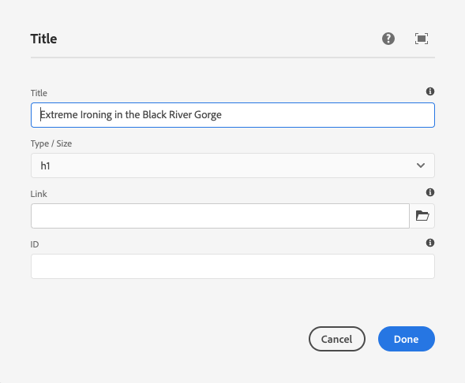

# Guia de referência de componentes {#components-reference-guide}

Os componentes estão no centro da construção de uma experiência em AEM. Os [Componentes principais](https://experienceleague.adobe.com/docs/experience-manager-core-components/using/introduction.html) e o [AEM Project Archetype](https://experienceleague.adobe.com/docs/experience-manager-core-components/using/developing/archetype/overview.html) simplificam a introdução a um conjunto de ferramentas de componentes avançados e prontos. O [Tutorial WKND](/help/implementing/developing/introduction/develop-wknd-tutorial.md) mostra ao desenvolvedor como usar essas ferramentas e como criar componentes personalizados para criar um novo site AEM.

>[!TIP]
>
>Antes de referenciar este documento, certifique-se de ter concluído o [Tutorial WKND](/help/implementing/developing/introduction/develop-wknd-tutorial.md) e, portanto, estar familiarizado com os [Componentes Principais](https://experienceleague.adobe.com/docs/experience-manager-core-components/using/introduction.html) e o [AEM Tipo de Arquivo do Projeto.](https://experienceleague.adobe.com/docs/experience-manager-core-components/using/developing/archetype/overview.html)

Como o Tutorial da WKND cobre a maioria dos casos de uso, esse documento é destinado apenas como um suplemento para esses recursos. Ele fornece especificações técnicas detalhadas sobre como os componentes são estruturados e configurados em AEM e não se destina a um guia de introdução.

## Visão geral {#overview}

Esta seção aborda os principais conceitos e problemas como uma introdução aos detalhes necessários ao desenvolver seus próprios componentes.

### Planejamento {#planning}

Antes de começar a configurar ou codificar seu componente, você deve perguntar:

* O que exatamente você precisa do novo componente para fazer?
* Você precisa criar seu componente do zero ou pode herdar as noções básicas de um componente existente?
* Seu componente exigirá lógica para selecionar/manipular o conteúdo?
   * A lógica deve ser mantida separada da camada da interface do usuário. HTL foi projetado para ajudar a garantir que isso aconteça.
* Seu componente precisará de formatação CSS?
   * A formatação de CSS deve ser mantida separada das definições de componentes. Defina as convenções para nomear seus elementos HTML para que você possa modificá-los por meio de arquivos CSS externos.
* Que implicações de segurança seu novo componente pode apresentar?

### Reutilizando Componentes Existentes {#reusing-components}

Antes de investir tempo na criação de um componente totalmente novo, considere personalizar ou estender os componentes existentes. [O principal ](https://experienceleague.adobe.com/docs/experience-manager-core-components/using/introduction.html) componente oferece um conjunto de componentes flexíveis, robustos e bem testados, prontos para produção.

#### Extensão dos componentes principais {#extending-core-components}

Os Componentes principais também ofertas [padrões de personalização claros](https://experienceleague.adobe.com/docs/experience-manager-core-components/using/developing/customizing.html) que você pode usar para adaptá-los às necessidades do seu próprio projeto.

#### Sobreposição de componentes {#overlying-components}

Os componentes também podem ser redefinidos com uma [sobreposição](/help/implementing/developing/introduction/overlays.md) com base na lógica do caminho de pesquisa. Entretanto, nesse caso, [Fusão de recursos Sling](/help/implementing/developing/introduction/sling-resource-merger.md) não será acionada e `/apps` deverá definir a sobreposição inteira.

#### Extensão de caixas de diálogo de componentes {#extending-component-dialogs}

Também é possível substituir uma caixa de diálogo de componente usando a Fusão de Recursos Sling e definindo a propriedade `sling:resourceSuperType`.

Isso significa que você só precisa redefinir as diferenças necessárias, em vez de redefinir toda a caixa de diálogo.

### Lógica de conteúdo e marcação de renderização {#content-logic-and-rendering-markup}

Seu componente será renderizado com [HTML.](https://www.w3schools.com/htmL/html_intro.asp) Seu componente precisa definir o HTML necessário para pegar o conteúdo necessário e, em seguida, renderizá-lo conforme necessário, nos ambientes de autor e publicação.

É recomendável manter o código responsável pela marcação e renderização separado do código que controla a lógica usada para selecionar o conteúdo do componente.

Essa filosofia é suportada por [HTL](https://experienceleague.adobe.com/docs/experience-manager-htl/using/overview.html), uma linguagem de modelo que é propositadamente limitada para garantir que uma linguagem de programação real seja usada para definir a lógica de negócios subjacente. Esse mecanismo realça o código chamado para uma determinada visualização e, se necessário, permite uma lógica específica para visualizações diferentes do mesmo componente.

Essa lógica (opcional) pode ser implementada de diferentes maneiras e é invocada do HTL com comandos específicos:

* Usando Java - [O HTL Java Use-API](https://helpx.adobe.com/experience-manager/htl/using/use-api-java.html) permite que um arquivo HTL acesse métodos auxiliares em uma classe Java personalizada. Isso permite usar o código Java para implementar a lógica de seleção e configuração do conteúdo do componente.
* Usando JavaScript - [A API de uso do JavaScript HTL](https://experienceleague.adobe.com/docs/experience-manager-htl/using/htl/use-api-javascript.html) permite que um arquivo HTL acesse o código auxiliar gravado no JavaScript. Isso permite usar o código JavaScript para implementar a lógica de seleção e configuração do conteúdo do componente.
* Usando bibliotecas do lado do cliente - os sites modernos dependem muito do processamento do lado do cliente, impulsionado por complexos códigos JavaScript e CSS. Consulte o documento [Usando bibliotecas do lado do cliente em AEM como Cloud Service](/help/implementing/developing/introduction/clientlibs.md) para obter mais informações.

### Desenvolver seus próprios componentes {#developing-your-own-components}

Desenvolver conteúdo aqui?

## Estrutura do componente {#structure}

A estrutura de um componente AEM é poderosa e flexível. As principais partes são:

* [Tipo de recurso](#resource-type)
* [Definição do componente](#component-definition)
* [Propriedades e nós secundários de um componente](#properties-and-child-nodes-of-a-component)
* [Caixas de diálogo](#dialogs)
* [Caixas de diálogo de design](#design-dialogs)

### Tipo de recurso {#resource-type}

Um elemento-chave da estrutura é o tipo de recurso.

* A estrutura de conteúdo declara intenções.
* O tipo de recurso os implementa.

Essa é uma abstração que ajuda a garantir que, mesmo quando a aparência muda com o tempo, a intenção é manter o tempo.

### Definição de componente {#component-definition}

A definição de um componente pode ser dividida da seguinte forma:

* AEM componentes são baseados em [Sling.](https://sling.apache.org/documentation.html)
* AEM componentes estão localizados em `/libs/core/wcm/components`.
* Os componentes específicos do projeto/site estão localizados em `/apps/<myApp>/components`.
* AEM componentes padrão são definidos como `cq:Component` e têm os principais elementos:
   * propriedades do jcr - uma lista de propriedades do jcr. São variáveis e algumas podem ser opcionais por meio da estrutura básica de um nó de componente, suas propriedades e subnós são definidos pela definição `cq:Component`.
   * Recursos - Definem elementos estáticos usados pelo componente.
   * Scripts - são usados para implementar o comportamento da instância resultante do componente.

#### Propriedades vitais {#vital-properties}

* **Nó raiz**:
   * `<mycomponent> (cq:Component)` - Nó de hierarquia do componente.
* **Propriedades** vitais:
   * `jcr:title` - Título do componente; por exemplo, usado como um rótulo quando o componente está listado no console  [Componentes ](/help/sites-cloud/authoring/fundamentals/environment-tools.md#components-browser) do navegador e  [Componentes](/help/sites-cloud/authoring/features/components-console.md)
   * `jcr:description` - Descrição do componente; usado como dica de mouse sobre o console Navegador de componentes e Componentes
   * Consulte a seção [Ícone de Componente](#component-icon) para obter detalhes
* **Nós** de Crianças Vitais:
   * `cq:editConfig (cq:EditConfig)` - Define as propriedades de edição do componente e permite que o componente apareça no Navegador de componentes
      * Se o componente tiver uma caixa de diálogo, ele aparecerá automaticamente no navegador Componentes ou no Sidekick, mesmo se o cq:editConfig não existir.
   * `cq:childEditConfig (cq:EditConfig)` - Controla os aspectos da interface do usuário do autor para componentes filhos que não definem seus próprios  `cq:editConfig`.
   * `cq:dialog (nt:unstructured)` - Caixa de diálogo para este componente. Define a interface que permite ao usuário configurar o componente e/ou editar o conteúdo.
   * `cq:design_dialog (nt:unstructured)` - Edição de design para este componente

#### Ícone do componente {#component-icon}

O ícone ou abreviação do componente é definido pelas propriedades do JCR do componente quando o componente é criado pelo desenvolvedor. Essas propriedades são avaliadas na seguinte ordem e a primeira propriedade válida encontrada é usada.

1. `cq:icon` - A propriedade String que aponta para um ícone padrão na biblioteca de IU  [Coral ](https://helpx.adobe.com/experience-manager/6-5/sites/developing/using/reference-materials/coral-ui/coralui3/Coral.Icon.html) para ser exibida no navegador de componentes
   * Use o valor do atributo HTML do ícone Coral.
1. `abbreviation` - Propriedade String para personalizar a abreviação do nome do componente no navegador do componente
   * A abreviação deve ser limitada a dois caracteres.
   * Fornecer uma string vazia criará a abreviação dos dois primeiros caracteres da propriedade `jcr:title`.
      * Por exemplo &quot;Im&quot; para &quot;Image&quot;
      * O título localizado será usado para criar a abreviação.
   * A abreviação só é traduzida se o componente tiver uma propriedade `abbreviation_commentI18n`, que é usada como dica de tradução.
1. `cq:icon.png` ou  `cq:icon.svg` - Ícone para este componente, que é mostrado no Navegador de componentes
   * 20 x 20 pixels é o tamanho dos ícones dos componentes padrão.
      * Os ícones maiores serão rebaixados (do lado do cliente).
   * A cor recomendada é rgb(112, 112, 112) > #707070
   * O plano de fundo dos ícones de componentes padrão é transparente.
   * Somente os arquivos `.png` e `.svg` são suportados.
   * Se importar do sistema de arquivos por meio do plug-in do Eclipse, os nomes de arquivo precisam ser escapados como `_cq_icon.png` ou `_cq_icon.svg`, por exemplo.
   * `.png` tem precedência sobre  `.svg` se ambos estiverem presentes.

Se nenhuma das propriedades acima (`cq:icon`, `abbreviation`, `cq:icon.png` ou `cq:icon.svg`) for encontrada no componente:

* O sistema pesquisará as mesmas propriedades nos supercomponentes após a propriedade `sling:resourceSuperType`.
* Se nada ou uma abreviação vazia for encontrada no nível do supercomponente, o sistema criará a abreviação das primeiras letras da propriedade `jcr:title` do componente atual.

Para cancelar a herança de ícones dos supercomponentes, definir uma propriedade vazia `abbreviation` no componente reverterá para o comportamento padrão.

O [Console de componentes](/help/sites-cloud/authoring/features/components-console.md#component-details) exibe como o ícone de um componente específico é definido.

#### Exemplo de ícone SVG {#svg-icon-example}

```xml
<?xml version="1.0" encoding="utf-8"?>
<!DOCTYPE svg PUBLIC "-//W3C//DTD SVG 1.1//EN" "https://www.w3.org/Graphics/SVG/1.1/DTD/svg11.dtd">
<svg version="1.1" id="Layer_1" xmlns="https://www.w3.org/2000/svg" xmlns:xlink="https://www.w3.org/1999/xlink" x="0px" y="0px"
     width="20px" height="20px" viewBox="0 0 20 20" enable-background="new 0 0 20 20" xml:space="preserve">
    <ellipse cx="5" cy="5" rx="3" ry="3" fill="#707070"/>
    <ellipse cx="15" cy="5" rx="4" ry="4" fill="#707070"/>
    <ellipse cx="5" cy="15" rx="5" ry="5" fill="#707070"/>
    <ellipse cx="15" cy="15" rx="4" ry="4" fill="#707070"/>
</svg>
```

### Propriedades e nós secundários de um componente {#properties-and-child-nodes-of-a-component}

Muitos dos nós/propriedades necessários para definir um componente são comuns a ambas as interfaces do usuário, com diferenças independentes que permanecem, para que seu componente possa funcionar em ambos os ambientes.

Um componente é um nó do tipo `cq:Component` e tem as seguintes propriedades e nós secundários:

| Nome | Tipo | Descrição |
|---|---|---|
| `.` | `cq:Component` | Isso representa o componente atual. Um componente é do tipo de nó `cq:Component`. |
| `componentGroup` | `String` | Isso representa o grupo no qual o componente pode ser selecionado no [Navegador de componentes.](/help/sites-cloud/authoring/fundamentals/environment-tools.md#components-browser) Um valor que começa com  `.` é usado para componentes que não estão disponíveis para seleção na interface do usuário, como componentes básicos dos quais outros componentes herdam. |
| `cq:isContainer` | `Boolean` | Isso indica se o componente é um componente de container e, portanto, pode conter outros componentes, como um sistema de parágrafo. |
| `cq:dialog` | `nt:unstructured` | Esta é a definição da caixa de diálogo de edição do componente. |
| `cq:design_dialog` | `nt:unstructured` | Esta é a definição da caixa de diálogo de design para o componente. |
| `cq:editConfig` | `cq:EditConfig` | Isso define a configuração [editar do componente.](#edit-behavior) |
| `cq:htmlTag` | `nt:unstructured` | Isso retorna atributos de tag adicionais que são adicionados à tag HTML adjacente. Permite a adição de atributos aos divs gerados automaticamente. |
| `cq:noDecoration` | `Boolean` | Se verdadeiro, o componente não é renderizado com classes div e css geradas automaticamente. |
| `cq:template` | `nt:unstructured` | Se encontrado, esse nó será usado como um modelo de conteúdo quando o componente for adicionado do Navegador de componentes. |
| `jcr:created` | `Date` | Esta é a data de criação do componente. |
| `jcr:description` | `String` | Esta é a descrição do componente. |
| `jcr:title` | `String` | Este é o título do componente. |
| `sling:resourceSuperType` | `String` | Quando definido, o componente é herdado deste componente. |
| `component.html` | `nt:file` | Este é o arquivo de script HTL do componente. |
| `cq:icon` | `String` | Esse valor aponta para o ícone [do componente](#component-icon) e aparece no Navegador de componentes. |

Se observarmos o componente **Text**, podemos ver vários destes elementos:


As propriedades de um interesse particular incluem:

* `jcr:title` - Este é o título do componente usado para identificar o componente no Navegador de componentes.
* `jcr:description` - Esta é a descrição do componente.
* `sling:resourceSuperType` - Isso indica o caminho da herança ao estender um componente (substituindo uma definição).

Os nós secundários de interesse especial incluem:

* `cq:editConfig` - Isso controla os aspectos visuais do componente durante a edição.
* `cq:dialog` - Isso define a caixa de diálogo para editar o conteúdo deste componente.
* `cq:design_dialog` - Especifica as opções de edição de design para este componente.

### Caixas de diálogo {#dialogs}

As caixas de diálogo são um elemento chave do seu componente, pois fornecem uma interface para os autores configurarem o componente em uma página de conteúdo e fornecerem entrada para esse componente. Consulte a [documentação de criação](/help/sites-cloud/authoring/fundamentals/editing-content.md) para obter detalhes sobre como os autores de conteúdo interagem com componentes.

Dependendo da complexidade do componente, a caixa de diálogo pode precisar de uma ou mais guias.

Diálogos para componentes AEM:

* São nós `cq:dialog` do tipo `nt:unstructured`.
* Estão localizados em seus nós `cq:Component` e ao lado de suas definições de componentes.
* Defina a caixa de diálogo para editar o conteúdo deste componente.
* São definidos usando componentes da interface do usuário do Granite.
* São renderizados no lado do servidor (como componentes Sling), com base em sua estrutura de conteúdo e na propriedade `sling:resourceType`.
* Contém uma estrutura de nó que descreve os campos na caixa de diálogo
   * Esses nós são `nt:unstructured` com a propriedade `sling:resourceType` necessária.



Na caixa de diálogo, os campos individuais são definidos:


### Caixas de diálogo de design {#design-dialogs}

As caixas de diálogo de design são semelhantes às caixas de diálogo usadas para editar e configurar o conteúdo, mas fornecem a interface para os autores de modelo para a pré-configuração e fornecer detalhes de design para esse componente em um modelo de página. Os modelos de página são usados pelos autores de conteúdo para criar páginas de conteúdo. Consulte a [documentação do modelo](/help/sites-cloud/authoring/features/templates.md) para obter detalhes sobre como os modelos são criados.

[As caixas de diálogo de design são usadas ao editar um modelo](/help/sites-cloud/authoring/features/templates.md) de página, embora não sejam necessárias para todos os componentes. Por exemplo, os **Título** e **Componentes de imagem** ambos têm caixas de diálogo de design, enquanto o **Componente de compartilhamento de mídia social** não tem.

### Interface do usuário Coral e Granite {#coral-and-granite}

A interface do usuário do Coral e a interface do usuário do Granite definem a aparência do AEM.

* [A ](https://helpx.adobe.com/experience-manager/6-5/sites/developing/using/reference-materials/coral-ui/coralui3/index.html) interface do usuário do Coral fornece uma interface consistente em todas as soluções de nuvem.
* [A ](https://helpx.adobe.com/experience-manager/6-5/sites/developing/using/reference-materials/granite-ui/api/jcr_root/libs/granite/ui/index.html) interface do usuário Granite fornece marcação da interface do usuário Coral embutida em componentes Sling para a criação de consoles e diálogos da interface do usuário.

A interface do usuário do Granite fornece uma grande variedade de widgets básicos necessários para criar sua caixa de diálogo no ambiente de criação. Quando necessário, você pode estender essa seleção e criar seu próprio widget.

Para obter detalhes adicionais, consulte os seguintes recursos:

* [Guia da interface do usuário do Coral](https://helpx.adobe.com/experience-manager/6-5/sites/developing/using/reference-materials/coral-ui/coralui3/index.html)
* [Documentação da interface do usuário do Granite](https://helpx.adobe.com/experience-manager/6-5/sites/developing/using/reference-materials/granite-ui/api/index.html)
* [Estrutura da IU AEM](/help/implementing/developing/introduction/ui-structure.md)

### Personalizar campos de diálogo {#customizing-dialog-fields}

>[!TIP]
>
>Consulte [AEM sessão Gems](https://docs.adobe.com/content/ddc/en/gems/customizing-dialog-fields-in-touch-ui.html) sobre como personalizar campos de diálogo.

Para criar um novo widget para uso em uma caixa de diálogo de componente, é necessário criar um novo componente de campo da interface do usuário do Granite.

Se você considerar sua caixa de diálogo como um container simples para um elemento de formulário, também poderá ver o conteúdo principal do conteúdo da caixa de diálogo como campos de formulário. A criação de um novo campo de formulário requer a criação de um tipo de recurso; isso equivale a criar um novo componente. Para ajudá-lo nessa tarefa, a interface do usuário do Granite oferta um componente de campo genérico do qual herdar (usando `sling:resourceSuperType`):

`/libs/granite/ui/components/coral/foundation/form/field`

Mais especificamente, a interface do usuário do Granite fornece uma variedade de componentes de campo adequados para uso em diálogos ou, de modo mais geral, em [formulários.](https://helpx.adobe.com/experience-manager/6-5/sites/developing/using/reference-materials/granite-ui/api/jcr_root/libs/granite/ui/components/foundation/form/index.html)

Depois de criar seu tipo de recurso, você pode instanciar seu campo adicionando um novo nó na caixa de diálogo, com a propriedade `sling:resourceType` referindo-se ao tipo de recurso que você acabou de apresentar.

#### Acesso aos campos de diálogo {#access-to-dialog-fields}

Você também pode usar condições de renderização (`rendercondition`) para controlar quem tem acesso a guias/campos específicos na caixa de diálogo; por exemplo:

```text
+ mybutton
  - sling:resourceType = granite/ui/components/coral/foundation/button
  + rendercondition
    - sling:resourceType = myapp/components/renderconditions/group
    - groups = ["administrators"]
```

## Uso de componentes {#using-components}

Depois de criar um componente, é necessário ativá-lo para usá-lo. O uso mostra como a estrutura do componente se relaciona à estrutura do conteúdo resultante no repositório.

### Adicionar seu componente ao modelo {#adding-your-component-to-the-template}

Uma vez definido, um componente deve ser disponibilizado para uso. Para disponibilizar um componente para uso em um modelo, é necessário ativar o componente na política do container de layout do modelo.

Consulte a [documentação do modelo](/help/sites-cloud/authoring/features/templates.md) para obter detalhes sobre como os modelos são criados.

### Componentes e o conteúdo que eles criam {#components-and-the-content-they-create}

Se criarmos e configurarmos uma instância do componente **Title** na página: `/content/wknd/language-masters/en/adventures/extreme-ironing.html`


Em seguida, podemos ver a estrutura do conteúdo criado no repositório:


Em particular, se você observar o texto real de um **Componente de Título**:

* O conteúdo contém uma propriedade `jcr:title` contendo o texto real do título que o autor inseriu.
* Também contém uma referência `sling:resourceType` para a definição do componente.

As propriedades definidas dependem das definições individuais. Embora possam ser mais complexos do que acima, continuam a seguir os mesmos princípios básicos.

## Hierarquia e herança do componente {#component-hierarchy-and-inheritance}

Os componentes dentro do AEM estão sujeitos à **Hierarquia de Tipo de Recurso**. Isso é usado para estender componentes usando a propriedade `sling:resourceSuperType`. Isso permite que o componente herde de outro componente.

Consulte a seção [Reutilizando componentes](#reusing-components) para obter mais informações.

## Editar comportamento {#edit-behavior}

Esta seção explica como configurar o comportamento de edição de um componente. Isso inclui atributos como ações disponíveis para o componente, características do editor in.place e os ouvintes relacionados a eventos no componente.

O comportamento de edição de um componente é configurado adicionando um nó `cq:editConfig` do tipo `cq:EditConfig` abaixo do nó do componente (do tipo `cq:Component`) e adicionando propriedades e nós secundários específicos. As seguintes propriedades e nós secundários estão disponíveis:

* `cq:editConfig` propriedades do nó
* [`cq:editConfig` nós](#configuring-with-cq-editconfig-child-nodes) secundários:
   * `cq:dropTargets` (tipo de nó  `nt:unstructured`): define uma lista de públicos alvos de soltar que podem aceitar uma queda de um ativo do localizador de conteúdo (um único público alvo de soltar é permitido)
   * `cq:inplaceEditing` (tipo de nó  `cq:InplaceEditingConfig`): define uma configuração de edição no local para o componente
   * `cq:listeners` (tipo de nó  `cq:EditListenersConfig`): define o que acontece antes ou depois de uma ação ocorrer no componente

Há muitas configurações existentes no AEM. Você pode pesquisar facilmente por propriedades específicas ou nós secundários usando a ferramenta Query em **CRXDE Lite**.

### Configuração com cq:EditConfig Child Nodes {#configuring-with-cq-editconfig-child-nodes}

#### Soltar ativos em uma caixa de diálogo - cq:dropTargets {#cq-droptargets}

O nó `cq:dropTargets` (tipo de nó `nt:unstructured`) define o público alvo de soltar que pode aceitar uma queda de um ativo arrastado do localizador de conteúdo. É um nó do tipo `cq:DropTargetConfig`.

O nó filho do tipo `cq:DropTargetConfig` define um público alvo drop no componente.

### Edição no local - cq:inplaceEditing {#cq-inplaceediting}

Um editor local permite que o usuário edite o conteúdo diretamente no fluxo de conteúdo, sem a necessidade de abrir uma caixa de diálogo. Por exemplo, os componentes padrão **Text** e **Title** têm um editor de inp-lace.

Um editor no local não é necessário/significativo para cada tipo de componente.

O nó `cq:inplaceEditing` (tipo de nó `cq:InplaceEditingConfig`) define uma configuração de edição no local para o componente. Pode ter as seguintes propriedades:

| Nome da Propriedade | Tipo de propriedade | Valor da propriedade |
|---|---|---|
| `active` | `Boolean` | `true` para ativar a edição no local do componente. |
| `configPath` | `String` | Caminho da configuração do editor, que pode ser especificado por um nó de configuração |
| `editorType` | `String` | Os tipos disponíveis são: `plaintext` para conteúdo não HTML, `title` converte títulos gráficos em um texto simples antes do início da edição e `text` usa o Editor de Rich Text |

A configuração a seguir permite a edição no local do componente e define `plaintext` como o tipo de editor:

```text
    <cq:inplaceEditing
        jcr:primaryType="cq:InplaceEditingConfig"
        active="{Boolean}true"
        editorType="plaintext"/>
```

### Manuseio de Eventos de campo - cq:ouvintes {#cq-listeners}

O método de manipulação de eventos em campos de diálogo é feito com ouvintes em uma biblioteca personalizada [cliente.](/help/implementing/developing/introduction/clientlibs.md)

Para injetar lógica no seu campo, deve:

* Tenha seu campo marcado com uma determinada classe CSS (o gancho).
* Defina na biblioteca do cliente um ouvinte JS vinculado ao nome da classe CSS (isso garante que a lógica personalizada tenha escopo somente para o campo e não afete outros campos do mesmo tipo).

Para isso, é necessário saber mais sobre a biblioteca de widgets subjacente com a qual você deseja interagir. [Consulte a ](https://helpx.adobe.com/experience-manager/6-5/sites/developing/using/reference-materials/coral-ui/coralui3/index.html) documentação da interface do usuário do Coral para identificar a qual evento você deseja reagir.

O nó `cq:listeners` (tipo de nó `cq:EditListenersConfig`) define o que acontece antes ou depois de uma ação no componente. A tabela a seguir define suas possíveis propriedades.

| Nome da Propriedade | Valor da propriedade |
|---|---|
| `beforedelete` | O manipulador é acionado antes da remoção do componente. |
| `beforeedit` | O manipulador é acionado antes da edição do componente. |
| `beforecopy` | O manipulador é acionado antes que o componente seja copiado. |
| `beforeremove` | O manipulador é acionado antes de o componente ser movido. |
| `beforeinsert` | O manipulador é acionado antes de o componente ser inserido. |
| `beforechildinsert` | O manipulador é acionado antes que o componente seja inserido dentro de outro componente (somente container). |
| `afterdelete` | O manipulador é acionado depois que o componente é removido. |
| `afteredit` | O manipulador é acionado depois que o componente é editado. |
| `aftercopy` | O manipulador é acionado depois que o componente é copiado. |
| `afterinsert` | O manipulador é acionado depois que o componente é inserido. |
| `aftermove` | O manipulador é acionado depois que o componente é movido. |
| `afterchildinsert` | O manipulador é acionado depois que o componente é inserido dentro de outro componente (somente container). |

>[!NOTE]
>
>No caso de componentes aninhados, há certas restrições em ações definidas como propriedades no nó `cq:listeners`. Para componentes aninhados, os valores das seguintes propriedades **devem** ser `REFRESH_PAGE`:
>
>* `aftermove`
>* `aftercopy`


O manipulador de eventos pode ser implementado com uma implementação personalizada. Por exemplo (onde `project.customerAction` é um método estático):

`afteredit = "project.customerAction"`

O exemplo a seguir equivale à configuração `REFRESH_INSERTED`:

`afterinsert="function(path, definition) { this.refreshCreated(path, definition); }"`

Com a seguinte configuração, a página é atualizada depois que o componente é excluído, editado, inserido ou movido:

```text
    <cq:listeners
        jcr:primaryType="cq:EditListenersConfig"
        afterdelete="REFRESH_PAGE"
        afteredit="REFRESH_PAGE"
        afterinsert="REFRESH_PAGE"
        afterMove="REFRESH_PAGE"/>
```

### Validação de campo {#field-validation}

A validação de campo na interface do usuário do Granite e nos widgets da interface do usuário do Granite é feita usando a API `foundation-validation`. Consulte a [`foundation-valdiation` documentação do Granite](https://helpx.adobe.com/experience-manager/6-5/sites/developing/using/reference-materials/granite-ui/api/jcr_root/libs/granite/ui/components/coral/foundation/clientlibs/foundation/js/validation/index.html) para obter detalhes.

## Comportamento da pré-visualização {#preview-behavior}

O cookie [WCM Mode](https://helpx.adobe.com/experience-manager/6-5/sites/developing/using/reference-materials/javadoc/com/day/cq/wcm/api/WCMMode.html) é definido ao alternar para o modo de Pré-visualização mesmo quando a página não é atualizada.

Para componentes com uma renderização que são sensíveis ao Modo WCM, eles precisam ser definidos para se atualizarem especificamente e, em seguida, dependem do valor do cookie.

## Documentação de componentes {#documenting-components}

Como desenvolvedor, você deseja obter acesso fácil à documentação do componente para que você possa entender rapidamente o componente:

* Descrição
* Utilização prevista
* Estrutura e propriedades do conteúdo
* APIs e pontos de extensão expostos
* Etc.

Por essa razão, é muito fácil disponibilizar qualquer marcação de documentação existente no próprio componente.

Tudo o que você precisa fazer é colocar um arquivo `README.md` na estrutura do componente.


Esta marcação será então exibida no [Console de Componentes.](/help/sites-cloud/authoring/features/components-console.md)


A marcação suportada é a mesma para [fragmentos de conteúdo.](/help/assets/content-fragments/content-fragments.md)