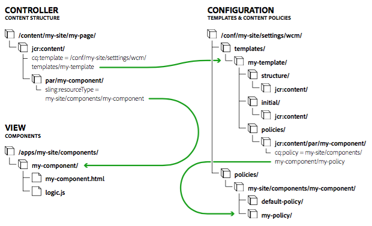

# Modelos de páginas {#page-templates}

Ao criar uma página, é necessário selecionar um modelo. O modelo de página é usado como a base para a nova página. O modelo define a estrutura da página resultante, qualquer conteúdo inicial e os componentes que podem ser usados (propriedades de design). Isso tem várias vantagens:

* Os Modelos de página permitem que autores especializados [criem e editem modelos](/help/sites-cloud/authoring/features/templates.md).
   * Esses autores especializados são chamados de autores **modelo**
   * Os autores do modelo devem ser membros do `template-authors` grupo.
* Os Modelos de página retêm uma conexão dinâmica com quaisquer páginas criadas a partir deles. Isso garante que quaisquer alterações no modelo sejam refletidas nas próprias páginas.
* Os Modelos de página tornam o componente de página mais genérico para que o componente de página principal possa ser usado sem personalização.

Com os Modelos de página, as partes que fazem uma página são isoladas dentro dos componentes. Você pode configurar as combinações necessárias de componentes em uma interface do usuário, eliminando a necessidade de um novo componente de página ser desenvolvido para cada variação de página.

Este documento:

* Fornece uma visão geral da criação de um modelo de página
* Descreve as tarefas de administrador/desenvolvedor necessárias para criar modelos editáveis
* Descreve os fundamentos técnicos dos modelos editáveis
* Descreve como AEM avalia a disponibilidade de um modelo

>[!NOTE]
>
>Este documento supõe que você já esteja familiarizado com a criação e edição de modelos. Consulte o documento de criação [Criando modelos](/help/sites-cloud/authoring/features/templates.md)de página, que detalha os recursos de modelos editáveis como expostos ao autor do modelo.

>[!TIP]
>
>[O tutorial](/help/implementing/developing/introduction/develop-wknd-tutorial.md) da WKND detalha como usar os Modelos de página implementando um exemplo e é útil para entender como configurar um modelo em um novo projeto

## Creating a New Template {#creating-a-new-template}

A criação de Modelos de página é feita principalmente com o console de [modelo e o editor](/help/sites-cloud/authoring/features/templates.md) de modelo por um autor de modelo. Esta seção apresenta uma visão geral deste processo e apresenta uma descrição do que ocorre a nível técnico.

Ao criar um novo modelo editável:

1. Crie uma [pasta para os modelos](#template-folders). Isso não é obrigatório, mas é uma prática recomendada.
1. Selecione um tipo [de](#template-type)modelo. Isso é copiado para criar a definição [do](#template-definitions)modelo.

   >[!NOTE]
   >
   >Uma seleção de tipos de modelo é fornecida prontamente. Você também pode [criar seus próprios tipos](#creating-template-types) de modelo específicos do site, se necessário.

1. Configure a estrutura, as políticas de conteúdo, o conteúdo inicial e o layout do novo modelo.

   **Estrutura**

   * A estrutura permite que você defina componentes e conteúdo para seu modelo.
   * Os componentes definidos na estrutura do modelo não podem ser movidos em uma página resultante ou excluídos de qualquer página resultante.
   * Se desejar que os autores da página possam adicionar e remover componentes, adicione um sistema de parágrafo ao modelo.
   * Os componentes podem ser desbloqueados e bloqueados novamente para permitir que você defina o conteúdo inicial.

   Para obter detalhes sobre como um autor de modelo define a estrutura, consulte [Criação de modelos](/help/sites-cloud/authoring/features/templates.md#editing-a-template-structure-template-author)de página.

   Para obter detalhes técnicos da estrutura, consulte [Estrutura](#structure) neste documento.

   **Políticas**

   * As políticas de conteúdo definem as propriedades de design de um componente.

      * Por exemplo, os componentes disponíveis ou as dimensões mínimas/máximas.
   * Eles são aplicáveis ao modelo (e às páginas criadas com o modelo).

   Para obter detalhes sobre como um autor de modelo define políticas, consulte [Criação de modelos](/help/sites-cloud/authoring/features/templates.md#editing-a-template-structure-template-author)de página.

   Para obter detalhes técnicos das políticas, consulte Políticas [de](#content-policies) conteúdo neste documento.

   **Conteúdo inicial**

   * O Conteúdo inicial define o conteúdo que será exibido quando uma página for criada pela primeira vez com base no modelo.
   * O conteúdo inicial pode ser editado pelos autores da página.

   Para obter detalhes sobre como um autor de modelo define a estrutura, consulte [Criação de modelos](/help/sites-cloud/authoring/features/templates.md#editing-a-template-initial-content-author)de página.

   Para obter detalhes técnicos sobre o conteúdo inicial, consulte Conteúdo [](#initial-content) inicial neste documento.

   **Layout**

   * É possível definir o layout do modelo para um intervalo de dispositivos.
   * O Layout responsivo para modelos funciona como na criação de página.

   Para obter detalhes sobre como um autor de modelo define o layout do modelo, consulte [Criação de modelos](/help/sites-cloud/authoring/features/templates.md#editing-a-template-layout-template-author)de página.

   Para obter detalhes técnicos sobre o layout do modelo, consulte [Layout](#layout) neste documento.

1. Habilite o modelo e, em seguida, permita-o para árvores de conteúdo específicas.

   * Um modelo pode ser ativado ou desativado para torná-lo disponível ou indisponível para autores de página.
   * Um modelo pode ser disponibilizado ou indisponibilizado para determinadas ramificações de página.

   Para obter detalhes sobre como um autor de modelo ativa um modelo, consulte [Criação de modelos](/help/sites-cloud/authoring/features/templates.md#enabling-and-allowing-a-template-template-author)de página.

   Para obter detalhes técnicos sobre como habilitar um modelo, consulte [Habilitar e permitir um modelo para](#enabling-and-allowing-a-template-for-use)uso neste documento

1. Use-o para criar páginas de conteúdo.

   * Ao usar um modelo para criar uma nova página, não há diferenças visíveis e nenhuma indicação entre os modelos estáticos e editáveis.
   * Para o autor da página, o processo é transparente.

   Para obter detalhes sobre como um autor de página usa modelos para criar uma página, consulte [Criação e organização de páginas](/help/sites-cloud/authoring/fundamentals/organizing-pages.md#templates).

   Para obter detalhes técnicos sobre como criar páginas com modelos editáveis, consulte Páginas [de conteúdo](#resultant-content-pages) resultante neste documento.

>[!NOTE]
>
>A biblioteca do cliente do editor assume a presença da `cq.shared` namespace nas páginas de conteúdo e, se ela não estiver presente, o erro do JavaScript `Uncaught TypeError: Cannot read property 'shared' of undefined` resultará.
>
>Todas as páginas de conteúdo de amostra contêm `cq.shared`, portanto, qualquer conteúdo baseado nelas inclui automaticamente `cq.shared`. No entanto, se você decidir criar suas próprias páginas de conteúdo do zero sem baseá-las no conteúdo de amostra, deverá incluir a `cq.shared` namespace.
>
>Consulte [Uso de bibliotecas](/help/implementing/developing/introduction/clientlibs.md) do lado do cliente para obter mais informações.

>[!CAUTION]
>
>Nunca insira qualquer informação que precise ser internacionalizada em um modelo.

## Pastas de modelo {#template-folders}

Para organizar seus modelos, você pode usar as seguintes pastas:

* `global`
* Específico do site

>[!NOTE]
>
>Mesmo que você possa aninhar suas pastas, quando o usuário as visualização no console **Modelos** , elas são apresentadas como uma estrutura simples.

Em uma instância padrão do AEM, a pasta `global` já existe no console modelo. Isso mantém modelos padrão e atua como um fallback se nenhuma política e/ou tipo de modelo for localizado na pasta atual. Você pode adicionar seus modelos padrão a esta pasta ou criar uma nova pasta (recomendado).

>[!NOTE]
>
>É prática recomendada criar uma nova pasta para manter seus modelos personalizados e não usar a `global` pasta.

>[!CAUTION]
>
>As pastas devem ser criadas por um usuário com `admin` direitos.

Os tipos de modelo e as políticas são herdados em todas as pastas de acordo com a seguinte ordem de precedência:

1. A pasta atual
1. Pai(s) da pasta atual
1. `/conf/global`
1. `/apps`
1. `/libs`

Uma lista de todas as entradas permitidas é criada. Se qualquer configuração se sobrepuser ( `path`/ `label`), somente a instância mais próxima à pasta atual será apresentada ao usuário.

Para criar uma nova pasta, você pode:

* Programaticamente ou com CRXDE Lite
* Usando o navegador [de configuração](/help/implementing/developing/introduction/configurations.md#using-configuration-browser)

## Uso do CRXDE Lite {#using-crxde-lite}

1. Uma nova pasta (em /conf) pode ser criada para sua instância de forma programática ou com CRXDE Lite.

   Deve ser utilizada a seguinte estrutura:

   ```xml
   /conf
       <your-folder-name> [sling:Folder]
           settings [sling:Folder]
               wcm [cq:Page]
                   templates [cq:Page]
                   policies [cq:Page]
   ```

1. Em seguida, é possível definir as seguintes propriedades no nó raiz da pasta:

   `<your-folder-name> [sling:Folder]`

   * Nome: `jcr:title`
   * Tipo: `String`
   * Valor: O título (para a pasta) que você deseja exibir no console **Modelos** .

1. Além das permissões e privilégios de criação padrão (por exemplo, `content-authors`), agora é necessário atribuir grupos e definir os direitos de acesso (ACLs) necessários para que seus autores possam criar modelos na nova pasta.

   O `template-authors` grupo é o grupo padrão que precisa ser atribuído. Consulte a seção [ACLs e grupos](#acls-and-groups) para obter detalhes.

   <!--See [Access Right Management](/help/sites-administering/user-group-ac-admin.md#access-right-management) for full details on managing and assigning access rights.-->

### Usando o navegador de configuração {#using-the-configuration-browser}

1. Vá para Navegação **** global -> **Ferramentas** > Navegador [**de** configuração.](/help/implementing/developing/introduction/configurations.md#using-configuration-browser)

   As pastas existentes são listadas à esquerda, incluindo a `global` pasta.

1. Clique em **Criar**.
1. Na caixa de diálogo **Criar configuração** , os seguintes campos precisam ser configurados:

   * **Título**: Fornecer um título para a pasta de configuração
   * **Modelos** editáveis: Clique para permitir modelos editáveis nesta pasta

1. Clique em **Criar**

>[!NOTE]
>
>No Navegador [de configuração,](/help/implementing/developing/introduction/configurations.md#using-configuration-browser) você pode editar a pasta global e ativar a opção Modelos **** editáveis se desejar criar modelos dentro dessa pasta, no entanto, essa não é a prática recomendada.

### ACLs e grupos {#acls-and-groups}

Depois que as pastas de modelo são criadas (via CRXDE ou com o Navegador de configuração), as ACLs devem ser definidas para os grupos apropriados para as pastas de modelo para garantir a segurança adequada.

As pastas de modelo para o tutorial [](/help/implementing/developing/introduction/develop-wknd-tutorial.md) WKND podem ser usadas como exemplo.

#### O Grupo de autores-modelo {#the-template-authors-group}

O `template-authors` grupo é o grupo usado para gerenciar o acesso aos modelos e vem como padrão com AEM, mas está vazio. Os usuários devem ser adicionados ao grupo para o projeto/site.

>[!CAUTION]
>
>O `template-authors` grupo é apenas para usuários que precisam criar novos modelos.
>
>A edição de modelos é muito poderosa e, se não for feita corretamente, os modelos existentes podem ser quebrados. Portanto, essa função deve ser focada e incluir apenas usuários qualificados.

A tabela a seguir detalha as permissões necessárias para a edição de modelos.

<table>
 <tbody>
  <tr>
   <th>Caminho</th>
   <th>Função / Grupo</th>
   <th>Permissões <br /> </th>
   <th>Descrição</th>
  </tr>
  <tr>
   <td rowspan="3"><code>/conf/&lt;<i>your-folder</i>&gt;/settings/wcm/templates</code></td>
   <td>Autores do modelo<br /> </td>
   <td>ler, escrever, replicar</td>
   <td>Criadores de modelos que criam, leem, atualizam, excluem e replicam modelos em um <code>/conf</code> espaço específico do site</td>
  </tr>
  <tr>
   <td>Usuário da Web anônimo</td>
   <td>leitura</td>
   <td>Usuário da Web anônimo deve ler modelos ao renderizar uma página</td>
  </tr>
  <tr>
   <td>Autores de conteúdo</td>
   <td>replicar</td>
   <td>replicateOs autores de conteúdo precisam ativar os modelos de uma página ao ativar uma página</td>
  </tr>
  <tr>
   <td rowspan="3"><code>/conf/&lt;<i>your-folder</i>&gt;/settings/wcm/policies</code></td>
   <td><code>Template Author</code></td>
   <td>ler, escrever, replicar</td>
   <td>Criadores de modelos que criam, leem, atualizam, excluem e replicam modelos em um <code>/conf</code> espaço específico do site</td>
  </tr>
  <tr>
   <td>Usuário da Web anônimo</td>
   <td>leitura</td>
   <td>Usuário da Web anônimo deve ler as políticas ao renderizar uma página</td>
  </tr>
  <tr>
   <td>Autores de conteúdo</td>
   <td>replicar</td>
   <td>Os autores de conteúdo precisam ativar as políticas de um modelo de página ao ativar uma página</td>
  </tr>
  <tr>
   <td rowspan="2"><code>/conf/&lt;site&gt;/settings/template-types</code></td>
   <td>Autor do modelo</td>
   <td>leitura</td>
   <td>O autor do modelo cria um novo modelo com base em um dos tipos de modelo predefinidos.</td>
  </tr>
  <tr>
   <td>Usuário da Web anônimo</td>
   <td>nenhum</td>
   <td>O Usuário Anônimo da Web não deve acessar os tipos de modelo</td>
  </tr>
 </tbody>
</table>

Este `template-authors` grupo padrão cobre apenas as configurações do projeto, onde todos os `template-authors` membros têm permissão para acessar e criar todos os modelos. Para configurações mais complexas, onde vários grupos de autores de modelo são necessários para separar o acesso a modelos, mais grupos de autores de modelo personalizados devem ser criados. No entanto, as permissões para os grupos de autores de modelo ainda seriam as mesmas.

## Template Type {#template-type}

Ao criar um novo modelo, é necessário especificar um tipo de modelo:

* Os tipos de modelo fornecem modelos para um modelo. Ao criar um novo modelo, a estrutura e o conteúdo inicial do tipo de modelo selecionado são usados para criar o novo modelo.

   * O tipo de modelo é copiado para criar o modelo.
   * Após a cópia, a única conexão entre o modelo e o tipo de modelo é uma referência estática para fins de informação.

* Os tipos de modelo permitem que você defina:

   * O tipo de recurso do componente de página.
   * A política do nó raiz, que define os componentes permitidos no editor de modelo.
   * É recomendável definir os pontos de interrupção para a grade responsiva e a configuração do emulador móvel no tipo de modelo.

* AEM fornece uma pequena seleção de tipos de modelo prontos para uso, como Página HTML5 e Página de formulário adaptável.

   * Exemplos adicionais são fornecidos como parte do tutorial [WKND.](/help/implementing/developing/introduction/develop-wknd-tutorial.md)

* Os tipos de modelo são tipicamente definidos pelos desenvolvedores.

Os tipos de modelo predefinidos são armazenados em:

* `/libs/settings/wcm/template-types`

>[!CAUTION]
>
>Você não deve alterar nada no `/libs` caminho. Isso ocorre porque o conteúdo do `/libs` pode ser substituído a qualquer momento por uma atualização para AEM.

Os tipos de modelo específicos do site devem ser armazenados no local comparável de:

* `/apps/settings/wcm/template-types`

As definições para seus tipos de modelos personalizados devem ser armazenadas em pastas definidas pelo usuário (recomendado) ou, alternativamente, em `global`. Por exemplo:

* `/conf/<my-folder-01>/<my-folder-02>/settings/wcm/template-types`
* `/conf/<my-folder>/settings/wcm/template-types`
* `/conf/global/settings/wcm/template-types`

>[!CAUTION]
>
>Os tipos de modelo devem respeitar a estrutura correta de pastas (ou seja, `/settings/wcm/...`), caso contrário, os tipos de modelo não serão encontrados.

<!--
### Template Type and Mobile Device Groups {#template-type-and-mobile-device-groups-br}

The [device groups](/help/sites-developing/mobile.md#device-groups) used for an editable template (set as relative path of the property `cq:deviceGroups`) define which mobile devices are available as emulators in the [layout mode](/help/sites-authoring/responsive-layout.md) of page authoring. This value can be set in two places:

* On the editable template type
* On the editable template

When creating a new editable template, the value is copied from the template type to the individual template. If the value is not set on the type, it can be set on the template. Once a template is created, there is no inheritance from the type to the template.

>[!CAUTION]
>
>The value of `cq:deviceGroups` must be set as a relative path such as `mobile/groups/responsive` and not as an absolute path such as `/etc/mobile/groups/responsive`.

>[!NOTE]
>
>With static templates /help/sites-developing/page-templates-static.md, the value of `cq:deviceGroups` could be set at the root of the site.
>
>With editable templates, this value is now stored at the template level and is not supported at the page root level.
-->

### Criando Tipos de Modelo {#creating-template-types}

Se você tiver criado um modelo que possa servir como a base de outros modelos, poderá copiar esse modelo como um tipo de modelo.

1. Crie um modelo como faria com qualquer Modelo de página [como documentado aqui](/help/sites-cloud/authoring/features/templates.md#creating-a-new-template-template-author), que servirá de base para o seu tipo de modelo.
1. Usando o CRXDE Lite, copie o modelo recém-criado do `templates` nó para o `template-types` nó na pasta [](#template-folders)template.
1. Exclua o modelo do `templates` nó na pasta [](#template-folders)de modelo.
1. Na cópia do modelo que está sob o `template-types` nó, exclua todas as `cq:template` propriedades e `cq:templateType``jcr:content` .

Você também pode desenvolver seu próprio tipo de modelo usando um modelo editável de exemplo como base, disponível no GitHub.

CÓDIGO NO GITHUB

Você pode encontrar o código desta página no GitHub

* [Abrir um projeto aem-sites-example-custom-template-type no GitHub](https://github.com/Adobe-Marketing-Cloud/aem-sites-example-custom-template-type)
* Baixar o projeto como [um arquivo ZIP](https://github.com/Adobe-Marketing-Cloud/aem-sites-example-custom-template-type/archive/master.zip)

## Definições de modelo {#template-definitions}

As definições para modelos editáveis são pastas [armazenadas definidas pelo](#template-folders) usuário (recomendado) ou, alternativamente, em `global`. Por exemplo:

* `/conf/<my-folder>/settings/wcm/templates`
* `/conf/<my-folder-01>/<my-folder-02>/settings/wcm/templates`
* `/conf/global/settings/wcm/templates`

O nó raiz do modelo é do tipo `cq:Template` com uma estrutura de esqueleto de:

```xml
<template-name>
  initial
    jcr:content
      root
        <component>
        ...
        <component>
  jcr:content
    @property status
  policies
    jcr:content
      root
        @property cq:policy
        <component>
          @property cq:policy
        ...
        <component>
          @property cq:policy
  structure
    jcr:content
      root
        <component>
        ...
        <component>
      cq:responsive
        breakpoints
  thumbnail.png
```

Os principais elementos são:

* `<template-name>`

   * ` [initial](#initial-content)`
   * `jcr:content`
   * ` [structure](#structure)`
   * ` [policies](#policies)`
   * `thumbnail.png`

### jcr:content {#jcr-content}

Este nó contém propriedades para o modelo:

* **Nome**: `jcr:title`
* **Nome**: `status`
   * ``**Tipo**: `String`
   * **Valor**: `draft`, `enabled` ou `disabled`

### Estrutura {#structure}

Define a estrutura da página resultante:

* É unido ao conteúdo inicial ( `/initial`) ao criar uma nova página.
* As alterações feitas na estrutura serão refletidas em qualquer página criada com o modelo.
* O nó `root` ( `structure/jcr:content/root`) define a lista dos componentes que estarão disponíveis na página resultante.
   * Os componentes definidos na estrutura do modelo não podem ser movidos para nenhuma página resultante ou excluídos dela.
   * Quando um componente é desbloqueado, a `editable` propriedade é definida como `true`.
   * Quando um componente que já contém conteúdo for desbloqueado, esse conteúdo será movido para a `initial` ramificação.

* O `cq:responsive` nó contém definições para o layout responsivo.

### Conteúdo inicial {#initial-content}

Define o conteúdo inicial que uma nova página terá na criação:

* Contém um `jcr:content` nó que é copiado para qualquer página nova.
* É unida à estrutura ( `/structure`) ao criar uma nova página.
* Nenhuma página existente será atualizada se o conteúdo inicial for alterado após a criação.
* O `root` nó contém uma lista de componentes para definir o que estará disponível na página resultante.
* Se o conteúdo for adicionado a um componente no modo de estrutura e esse componente for desbloqueado posteriormente (ou vice-versa), esse conteúdo será usado como conteúdo inicial.

### Layout {#layout}

Ao [editar um modelo, você pode definir o layout](/help/sites-cloud/authoring/features/templates.md), isso usa o layout [responsivo](/help/sites-cloud/authoring/features/responsive-layout.md)padrão.

<!-- that can also be [configured](/help/sites-administering/configuring-responsive-layout.md). -->

### Content Policies {#content-policies}

As políticas de conteúdo definem as propriedades de design de um componente. Por exemplo, os componentes disponíveis ou as dimensões mínimas/máximas. Eles são aplicáveis ao modelo (e às páginas criadas com o modelo). As políticas de conteúdo podem ser criadas e selecionadas no editor de modelos.

* A propriedade `cq:policy`, no `root` nó
   `/conf/<your-folder>/settings/wcm/templates/<your-template>/policies/jcr:content/root`
Fornece uma referência relativa à política de conteúdo para o sistema de parágrafo da página.

* A propriedade `cq:policy`, nos nós explícitos do componente em `root`, fornece links para as políticas dos componentes individuais.

* As definições de política reais são armazenadas em:
   `/conf/<your-folder>/settings/wcm/policies/wcm/foundation/components`

>[!NOTE]
>
>Os caminhos das definições de política dependem do caminho do componente. `cq:policy` contém uma referência relativa à configuração propriamente dita.

### Políticas da página {#page-policies}

As políticas de página permitem que você defina a política [de](#content-policies) conteúdo para a página (parsys principal), no modelo ou nas páginas resultantes.

### Habilitar e permitir um modelo para uso {#enabling-and-allowing-a-template-for-use}

1. **Ativar o modelo**

   Antes que um modelo possa ser usado, ele deve ser habilitado por:

   * [Habilitando o modelo](/help/sites-cloud/authoring/features/templates.md) do console **Modelos** .

   * Definindo a propriedade status no `jcr:content` nó.

      * Por exemplo, em:
         `/conf/<your-folder>/settings/wcm/templates/<your-template>/jcr:content`

      * Defina a propriedade:

         * Nome: status
         * Tipo: String
         * Valor: `enabled`

1. **Modelos permitidos**

   * [Defina os caminhos de modelo permitidos nas Propriedades **da**](/help/sites-cloud/authoring/features/templates.md#allowing-a-template-author) página da página ou da página raiz apropriada de uma subramificação.
   * Defina a propriedade:
      `cq:allowedTemplates`
Na 
`jcr:content` nó da ramificação necessária.
   Por exemplo, com um valor de:

   `/conf/<your-folder>/settings/wcm/templates/.*`

## Páginas de conteúdo resultantes {#resultant-content-pages}

Páginas criadas a partir de modelos editáveis:

* São criados com uma subárvore que é unida de `structure` e `initial` no modelo

* Ter referências às informações contidas no modelo e no tipo de modelo. Isso é obtido com um `jcr:content` nó com as propriedades:

   * `cq:template` - Fornece a referência dinâmica ao modelo real; permite que as alterações no modelo sejam refletidas nas páginas reais.

   * `cq:templateType` - Fornece uma referência ao tipo de modelo.



O diagrama acima mostra como os modelos, o conteúdo e os componentes se interrelacionam:

* Controller - `/content/<my-site>/<my-page>` - a página resultante que faz referência ao modelo. O conteúdo controla todo o processo. De acordo com as definições, acessa o modelo e os componentes apropriados.
* Configuração - `/conf/<my-folder>/settings/wcm/templates/<my-template>` - O [modelo e as políticas](#template-definitions) de conteúdo relacionadas definem a configuração da página.
* Modelo - pacotes OSGi - Os pacotes [OSGI](/help/implementing/deploying/configuring-osgi.md) implementam a funcionalidade.
* Visualização - `/apps/<my-site>/components` - nos ambientes de autor e publicação, o conteúdo é renderizado pelos componentes.

Ao renderizar uma página:

* **Modelos**:

   * A `cq:template` propriedade de seu `jcr:content` nó será referenciada para acessar o modelo que corresponde a essa página.

* **Componentes**:

   * O componente de página mesclará a `structure/jcr:content` árvore do modelo com a `jcr:content` árvore da página.
      * O componente de página permitirá que o autor edite apenas os nós da estrutura do modelo que foram sinalizados como editáveis (bem como quaisquer filhos).
      * Ao renderizar um componente em uma página, o caminho relativo desse componente será retirado do `jcr:content` nó; o mesmo caminho sob o `policies/jcr:content` nó do modelo será então pesquisado.
         * A `cq:policy` propriedade desse nó aponta para a política de conteúdo real (isto é, ela contém a configuração de design desse componente).
            * Isso permite que você tenha vários modelos que reusam as mesmas configurações de política de conteúdo.

### Disponibilidade do modelo {#template-availability}

Ao criar uma nova página na interface do administrador do site, a lista de modelos disponíveis depende do local da nova página e das restrições de posicionamento especificadas em cada modelo.

As propriedades a seguir determinam se um modelo `T` pode ser usado para uma nova página ser colocada como um filho da página `P`. Cada uma dessas propriedades é uma string de vários valores contendo zero ou mais Expressões Regulares usadas para correspondência com caminhos:

* A `cq:allowedTemplates` propriedade do `jcr:content` subnó de `P` ou um ancestral de `P`.

* A `allowedPaths` propriedade de `T`.

* A `allowedParents` propriedade de `T`.

* A `allowedChildren` propriedade do modelo de `P`.

A avaliação funciona do seguinte modo:

* A primeira propriedade não vazia encontrada ao aumentar a hierarquia da página que começa com `cq:allowedTemplates` corresponde ao caminho de `P` `T`. Se nenhum dos valores corresponder, `T` será rejeitado.

* Se `T` tiver uma `allowedPaths` propriedade não vazia, mas nenhum dos valores corresponder ao caminho de `P`, `T` será rejeitado.

* Se ambas as propriedades acima estiverem vazias ou inexistentes, `T` será rejeitado, a menos que pertença ao mesmo aplicativo `P`. `T` pertence ao mesmo aplicativo como `P` se e somente se o nome do segundo nível do caminho `T` for o mesmo do nome do segundo nível do caminho `P`. Por exemplo, o modelo `/apps/geometrixx/templates/foo` pertence ao mesmo aplicativo que a página `/content/geometrixx`.

* Se `T` tiver uma `allowedParents` propriedade não vazia, mas nenhum dos valores corresponder ao caminho de `P`, `T` será rejeitado.

* Se o modelo de `P` tiver uma `allowedChildren` propriedade não vazia, mas nenhum dos valores corresponder ao caminho de `T`, `T` será rejeitado.

* Em todos os outros casos, `T` é permitido.

O diagrama a seguir descreve o processo de avaliação do modelo:


>[!CAUTION]
>
>AEM oferta várias propriedades para controlar os modelos permitidos em **Sites**. No entanto, combiná-las pode levar a regras muito complexas que são difíceis de rastrear e gerenciar.
>
>Portanto, o Adobe recomenda que você start de forma simples, definindo:
>
>* somente a `cq:allowedTemplates` propriedade
   >
   >
* somente na raiz do site
>
>
Para ver um exemplo, consulte o conteúdo do tutorial [](/help/implementing/developing/introduction/develop-wknd-tutorial.md) WKND: `/content/wknd/jcr:content`
>
>As propriedades `allowedPaths`, `allowedParents`e `allowedChildren` também podem ser colocadas nos modelos para definir regras mais sofisticadas. No entanto, quando possível, é *muito* mais simples definir outras `cq:allowedTemplates` propriedades em subseções do site se houver necessidade de restringir ainda mais os modelos permitidos.
>
>Uma vantagem adicional é que as `cq:allowedTemplates` propriedades podem ser atualizadas por um autor na guia **Avançado** das Propriedades **da** página. As outras propriedades do modelo não podem ser atualizadas usando a interface do usuário (padrão), portanto, seria necessário um desenvolvedor para manter as regras e uma implantação de código para cada alteração.

#### Limitação de modelos usados em páginas secundárias {#limiting-templates-used-in-child-pages}

Para limitar quais modelos podem ser usados para criar páginas secundárias em uma determinada página, use a `cq:allowedTemplates` propriedade do nó `jcr:content` da página para especificar a lista de modelos a serem permitidos como páginas secundárias. Cada valor na lista deve ser um caminho absoluto para um modelo para uma página secundária permitida, por exemplo `/apps/wknd/templates/page-content`.

Você pode usar a `cq:allowedTemplates` propriedade no `jcr:content` nó do modelo para aplicar essa configuração a todas as páginas recém-criadas que usam esse modelo.

Se desejar adicionar mais restrições, por exemplo, em relação à hierarquia do modelo, você pode usar as `allowedParents/allowedChildren` propriedades no modelo. Você pode especificar explicitamente que as páginas criadas a partir de um modelo T devem ser pais/filhos de páginas criadas a partir de um modelo T.
