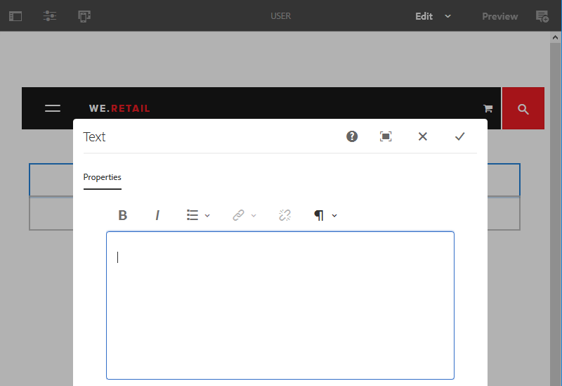

# Configurar o editor de rich text {#configure-the-rich-text-editor}

O Editor de Rich Text (RTE) fornece aos autores uma grande variedade de funcionalidades para editar conteúdo de texto. Ícones, caixas de seleção, barra de ferramentas e menus são fornecidos para uma experiência de edição de texto WYSIWYG. Os administradores configuram o RTE para ativar, desativar e estender os recursos disponíveis nos componentes de criação. Veja como os autores [usar o RTE para criação](/help/sites-cloud/authoring/fundamentals/rich-text-editor.md) conteúdo da Web.

Os conceitos e as etapas do RTE necessários para configurá-lo estão listados abaixo.

| Entender os conceitos de RTE | Habilitar recursos necessários | Configurar funcionalidades individuais |
|---|---|---|
| [Entender a interface](#understand-rte-ui) | [Compreender e definir locais de configuração](#understand-the-configuration-paths-and-locations) | [Configurar plug-ins](#enable-rte-functionalities-by-activating-plug-ins) |
| [Tipos de modos de edição](#editingmodes) | [Ativar plug-ins](/help/implementing/developing/extending/configure-rich-text-editor-plug-ins.md#activateplugin) | [Definir propriedades do recurso](#aboutplugins) |
| [Sobre plug-ins](#aboutplugins) | [Configurar barras de ferramentas do RTE](#dialogfullscreen) | [Configurar os modos de colagem](/help/implementing/developing/extending/configure-rich-text-editor-plug-ins.md#textstyles) |

## Compreender a interface do usuário disponível para autores {#understand-rte-ui}

A interface do RTE oferece uma [design responsivo](/help/sites-cloud/authoring/features/responsive-layout.md) para ambiente de criação. A interface foi projetada para ser usada em dispositivos de toque e desktop.


*Figura: barra de ferramentas do Editor de rich text com todas as opções disponíveis ativadas.*

A barra de ferramentas fornece as opções para a experiência de criação WYSIWYG. [!DNL Experience Manager] os administradores podem configurar as opções disponíveis na barra de ferramentas na interface. Um conjunto abrangente de opções de edição está disponível por padrão no [!DNL Experience Manager]. Os desenvolvedores podem personalizar [!DNL Experience Manager] para adicionar mais opções de edição.

## Vários modos de edição {#editingmodes}

Os autores podem criar e editar conteúdo textual no [!DNL Experience Manager] usando os diferentes modos de componentes. As opções da barra de ferramentas para criação e formatação de conteúdo e a experiência do usuário de componentes habilitados para RTE em modos de edição diferentes variam de acordo com as configurações de RTE.

| Modo de edição | Área de edição | Recursos recomendados para serem habilitados |
|--- |--- |--- |
| Inline | Edição no local para edições pequenas e rápidas; Formatar sem abrir uma caixa de diálogo. | Recursos mínimos de RTE. |
| Tela cheia do RTE | Abrange a página inteira. | Todos os recursos de RTE necessários. |
| Caixa de diálogo | Caixa de diálogo na parte superior do conteúdo da página, mas não cobre a página inteira. | Ative os recursos criteriosamente. |
| Tela cheia do diálogo | Igual ao modo de tela cheia; contém campos da caixa de diálogo junto com o RTE. | Todos os recursos de RTE necessários. |

>[!NOTE]
>
>O recurso de edição de origem não está disponível no modo de edição em linha. Não é possível arrastar imagens no modo de tela cheia. Todos os outros recursos funcionam em todos os modos.

### Edição em linha {#inline-editing}

Para editar o conteúdo em uma página, abra-o com um clique duplo lento. Uma barra de ferramentas compacta com opções básicas é apresentada.


*Figura: edição em linha com opções básicas na barra de ferramentas.*

### Edição em tela cheia {#full-screen-editing}

[!DNL Experience Manager] os componentes podem ser abertos na exibição de tela cheia que oculta o conteúdo da página e ocupa a tela disponível. Considere a edição em tela cheia como uma versão detalhada da edição em linha, pois ela oferece a maioria das opções de edição. Ele pode ser aberto clicando em , na barra de ferramentas compacta, ao usar o modo de edição em linha.

No modo de tela cheia da caixa de diálogo, juntamente com uma barra de ferramentas detalhada do RTE, as opções e os componentes disponíveis em uma caixa de diálogo também estão disponíveis. Ela é aplicável somente para uma caixa de diálogo que contém o RTE junto com outros componentes.


*Figura: a barra de ferramentas detalhada do RTE ao editar no modo de tela cheia.*

### Edição de diálogo {#dialog-editing}

Quando um componente é clicado duas vezes, uma caixa de diálogo é aberta para editar o conteúdo. A caixa de diálogo é aberta na parte superior da página existente. Em alguns cenários específicos, a caixa de diálogo é aberta como uma janela pop-up. Por exemplo, quando um componente de Texto faz parte de uma coluna em um layout de página de várias colunas e a área disponível para a caixa de diálogo é menor.



*Figura: Modo de edição do diálogo.*

## Sobre plug-ins do RTE e os recursos associados {#aboutplugins}

A funcionalidade é disponibilizada por meio de uma série de plug-ins, cada um com:

* A `features` propriedade que é,

   * Usado para ativar ou desativar a funcionalidade básica desse plug-in.
   * Configurado usando um procedimento padronizado.

* Quando apropriado, mais propriedades e opções que exigem configuração especializada.

Os recursos básicos do RTE são ativados ou desativados pelo valor do `features` em um nó específico do plug-in apropriado.

A tabela a seguir lista os plug-ins atuais, mostrando:

* IDs de plug-in com um link para a documentação da API. A ID é usada como o nome do nó quando [ativação de um plug-in](/help/implementing/developing/extending/configure-rich-text-editor-plug-ins.md#activateplugin).
* Valores permitidos para o `features` propriedade.
* Uma descrição da funcionalidade fornecida pelo plug-in.

| ID do plug-in | recursos | Descrição |
|--- |--- |--- |
| editar | `cut`, `copy`, `paste-default`, `paste-plaintext`, `paste-wordhtml` | [Recortar, copiar e, os três modos de colagem](/help/implementing/developing/extending/configure-rich-text-editor-plug-ins.md#textstyles). |
| [findreplace](https://helpx.adobe.com/experience-manager/6-5/sites/developing/using/reference-materials/widgets-api/index.html?class=CQ.form.rte.plugins.FindReplacePlugin) | `find`, `replace` | Localizar e substituir. |
| [format](https://helpx.adobe.com/experience-manager/6-5/sites/developing/using/reference-materials/widgets-api/index.html?class=CQ.form.rte.plugins.FormatPlugin) | `bold`, `italic`, `underline` | [Formatação básica de texto](configure-rich-text-editor-plug-ins.md#textstyles). |
| [imagem](https://helpx.adobe.com/experience-manager/6-5/sites/developing/using/reference-materials/widgets-api/index.html?class=CQ.form.rte.plugins.ImagePlugin) | `image` | Suporte básico de imagem (arrastar do conteúdo ou do Localizador de conteúdo). Dependendo do navegador, o suporte tem comportamentos diferentes para autores |
| [chaves](https://helpx.adobe.com/experience-manager/6-5/sites/developing/using/reference-materials/widgets-api/index.html?class=CQ.form.rte.plugins.KeyPlugin) | - | Para definir esse valor, consulte [tamanho da guia](configure-rich-text-editor-plug-ins.md#tabsize). |
| [justify](https://helpx.adobe.com/experience-manager/6-5/sites/developing/using/reference-materials/widgets-api/index.html?class=CQ.form.rte.plugins.JustifyPlugin) | `justifyleft`, `justifycenter`, `justifyright` | Alinhamento de parágrafo. |
| [links](https://helpx.adobe.com/experience-manager/6-5/sites/developing/using/reference-materials/widgets-api/index.html?class=CQ.form.rte.plugins.LinkPlugin) | `modifylink`, `unlink`, `anchor` | [Hiperlinks e âncoras](configure-rich-text-editor-plug-ins.md#linkstyles). |
| [listas](https://helpx.adobe.com/experience-manager/6-5/sites/developing/using/reference-materials/widgets-api/index.html?class=CQ.form.rte.plugins.ListPlugin) | `ordered`, `unordered`, `indent`, `outdent` | Este plug-in controla os dois [recuo e listas](configure-rich-text-editor-plug-ins.md#indentmargin); incluindo listas aninhadas. |
| [misctools](https://helpx.adobe.com/experience-manager/6-5/sites/developing/using/reference-materials/widgets-api/index.html?class=CQ.form.rte.plugins.MiscToolsPlugin) | `specialchars`, `sourceedit` | Ferramentas diversas permitem que os autores insiram [caracteres especiais](configure-rich-text-editor-plug-ins.md#spchar) ou edite a origem do HTML. Além disso, é possível adicionar um [intervalo de caracteres especiais](configure-rich-text-editor-plug-ins.md#definerangechar) se quiser definir sua própria lista. |
| Paraformat | `paraformat` | Os formatos de parágrafo padrão são Parágrafo, Cabeçalho 1, Cabeçalho 2 e Cabeçalho 3 (`<p>`, `<h1>`, `<h2>`, e `<h3>`). Você pode [adicionar mais formatos de parágrafo](configure-rich-text-editor-plug-ins.md#paraformats) ou estenda a lista. |
| spellcheck | `checktext` | [Verificador ortográfico com reconhecimento de idioma](configure-rich-text-editor-plug-ins.md#adddict). |
| estilos | `styles` | Suporte para estilo usando uma classe CSS. [Adicionar novos estilos de texto](configure-rich-text-editor-plug-ins.md#textstyles) se quiser adicionar (ou estender) sua própria variedade de estilos para usar com texto. |
| subsobrescrito | `subscript`, `superscript` | Extensões para os formatos básicos, adicionando sub-script e super-script. |
| tabela | `table`, `removetable`, `insertrow`, `removerow`, `insertcolumn`, `removecolumn`, `cellprops`, `mergecells`, `splitcell`, `selectrow`, `selectcolumns` | Consulte [configurar estilos de tabela](configure-rich-text-editor-plug-ins.md#tablestyles) para adicionar estilos próprios a tabelas inteiras ou células individuais. |
| desfazer | `undo`, `redo` | Tamanho do histórico de [desfazer e refazer](configure-rich-text-editor-plug-ins.md#undohistory) operações. |

>[!NOTE]
>
>O plug-in de tela cheia não é compatível com o modo de caixa de diálogo. Utilização do `dialogFullScreen` configuração para configurar a barra de ferramentas para o modo de tela cheia.

## Compreender os caminhos e os locais de configuração {#understand-the-configuration-paths-and-locations}

A variável [modo de edição do RTE e a interface](#editingmodes) que você fornece aos autores, decida o local para os detalhes de configuração quando estiver [ativação de plug-ins do RTE](configure-rich-text-editor-plug-ins.md#activateplugin). As localizações são:

* Modo em linha: `cq:editConfig/cq:inplaceEditing`.
* Modo de tela cheia: `cq:editConfig/cq:inplaceEditing`.
* Modo de diálogo: `cq:dialog`.
* Modo de caixa de diálogo de tela cheia: `cq:dialog`.

>[!NOTE]
>
>Não nomeie o nó sob `cq:inplaceEditing` as `config`. Ligado `cq:inplaceEditing` defina as seguintes propriedades:
>
>* **Nome**: `configPath`
>* **Tipo**: `String`
>* **Valor**: caminho do nó que contém a configuração real
>
>Não nomeie o nó de configuração do RTE como `config`. Caso contrário, as configurações do RTE serão aplicadas apenas aos administradores e não aos usuários do grupo `content-author`.

Configure as seguintes propriedades que se aplicam ao modo de edição da caixa de diálogo:

* `useFixedInlineToolbar`: é possível tornar a barra de ferramentas do RTE fixa em vez de flutuante. Defina essa propriedade booleana definida no nó RTE com sling:resourceType= `cq/gui/components/authoring/dialog/richtext` para `True`. Quando essa propriedade é definida como `True`, a edição de rich text é iniciada no `foundation-contentloaded` evento. Para evitar que isso aconteça, defina a propriedade `customStart` para `True` e acionar o `rte-start` evento para iniciar a edição do RTE. Quando esta propriedade é `true`, o RTE não é iniciado ao clicar e esse é o comportamento padrão.

* `customStart`: Defina essa propriedade Booliana definida no nó RTE como `True`, para controlar quando iniciar o RTE acionando o evento `rte-start`.

* `rte-start`: Acione esse evento no `contenteditable-div` do RTE, quando iniciar a edição do RTE. Funciona somente se `customStart` foi definido como `true`.

Quando o RTE for usado na caixa de diálogo habilitada para toque, defina a propriedade `useFixedInlineToolbar` para `true` para evitar problemas.

## Ativar funcionalidades do RTE ativando plug-ins {#enable-rte-functionalities-by-activating-plug-ins}

As funcionalidades do RTE são disponibilizadas por meio de uma série de plug-ins, cada um com a propriedade de recursos. É possível configurar a propriedade features para ativar ou desativar os vários recursos de cada plug-in.

Para obter configurações detalhadas dos plug-ins do RTE, consulte [como ativar e configurar os plug-ins do RTE](configure-rich-text-editor-plug-ins.md).

<!-- TBD ENGREVIEW: To confirm if the sample works in CS or not?
**Sample**: Download [this sample configuration](/help/sites-administering/assets/rte-sample-all-features-enabled-10.zip) that illustrates how to configure RTE. In this package all the features are enabled. -->

A variável [Componente de texto dos Componentes principais](https://experienceleague.adobe.com/docs/experience-manager-core-components/using/components/text.html#the-text-component-and-the-rich-text-editor) O permite que os editores de modelo configurem muitos plug-ins RTE usando a interface do usuário como políticas de conteúdo, eliminando a necessidade de configuração técnica. As políticas de conteúdo podem funcionar com as configurações da interface do usuário de RTE conforme descrito neste documento. Para obter mais informações, consulte [criar modelos de página](/help/sites-cloud/authoring/features/templates.md) e a variável [Documentação do desenvolvedor dos Componentes principais](https://experienceleague.adobe.com/docs/experience-manager-core-components/using/developing/developing.html).

>Para fins de referência, os componentes de Texto padrão (fornecidos como parte de uma instalação padrão) podem ser encontrados em:
>
>* `/libs/wcm/foundation/components/text`
>* `/libs/foundation/components/text`
>
>Para criar seu próprio componente de texto, copie o componente acima em vez de editar esses componentes.

## Configurar a barra de ferramentas do RTE {#dialogfullscreen}

[!DNL Experience Manager] permite configurar a interface do Editor de Rich Text de forma diferente para os diferentes modos de edição. As configurações padrão são fornecidas abaixo. Você pode sobrepor esses valores-padrão com base em suas necessidades. Você personaliza apenas os recursos da barra de ferramentas que deseja fornecer aos autores. Não é necessário especificar todas as configurações da barra de ferramentas.

Para configurar a barra de ferramentas para `dialogFullScreen`, use o exemplo de configuração a seguir.

```java
<uiSettings jcr:primaryType="nt:unstructured">
  <cui jcr:primaryType="nt:unstructured">
    <inline
      jcr:primaryType="nt:unstructured"
      toolbar="[format#bold,format#italic,format#underline,#justify,#lists,links#modifylink,links#unlink,#paraformat]">
      <popovers jcr:primaryType="nt:unstructured">
        <justify
          jcr:primaryType="nt:unstructured"
          items="[justify#justifyleft,justify#justifycenter,justify#justifyright,justify#justifyjustify]"
          ref="justify"/>
        <lists
          jcr:primaryType="nt:unstructured"
          items="[lists#unordered,lists#ordered,lists#outdent,lists#indent]"
          ref="lists"/>
        <paraformat
          jcr:primaryType="nt:unstructured"
          items="paraformat:getFormats:paraformat-pulldown"
          ref="paraformat"/>
      </popovers>
    </inline>
    <dialogFullScreen
      jcr:primaryType="nt:unstructured"
      toolbar="[format#bold,format#italic,format#underline,justify#justifyleft,justify#justifycenter,justify#justifyright,justify#justifyjustify,lists#unordered,lists#ordered,lists#outdent,lists#indent,links#modifylink,links#unlink,table#createoredit,#paraformat,image#imageProps]">
      <popovers jcr:primaryType="nt:unstructured">
        <paraformat
          jcr:primaryType="nt:unstructured"
          items="paraformat:getFormats:paraformat-pulldown"
          ref="paraformat"/>
      </popovers>
    </dialogFullScreen>
    <tableEditOptions
      jcr:primaryType="nt:unstructured"
      toolbar="[table#insertcolumn-before,table#insertcolumn-after,table#removecolumn,-,table#insertrow-before,table#insertrow-after,table#removerow,-,table#mergecells-right,table#mergecells-down,table#mergecells,table#splitcell-horizontal,table#splitcell-vertical,-,table#selectrow,table#selectcolumn,-,table#ensureparagraph,-,table#modifytableandcell,table#removetable,-,undo#undo,undo#redo,-,table#exitTableEditing,-]">
    </tableEditOptions>
  </cui>
</uiSettings>
```

Diferentes configurações da interface do usuário são usadas para o modo em linha e o modo de tela cheia. A propriedade da barra de ferramentas especifica a opção da barra de ferramentas.

Por exemplo, se a própria opção for um recurso (por exemplo, `Bold`), é especificado como `PluginName#FeatureName` (por exemplo, `links#modifylink`).

Se a opção for um pop-over (contendo alguns recursos de um plug-in), ela será especificada como `#PluginName` (por exemplo, `#format`).

Separadores (`|`) entre um grupo de opções pode ser especificado com `-`.

O nó pop-up no modo em linha ou tela cheia contém uma lista das janelas pop-up que estão sendo usadas. Cada nó filho sob o `popovers` O nó é nomeado com base no plug-in (por exemplo, formato ). Ele tem uma propriedade &quot;items&quot; contendo uma lista de recursos do plug-in (por exemplo, format#bold).

## Configurações da interface do usuário e políticas de conteúdo do RTE {#rtecontentpolicies}

Os administradores podem controlar as opções de RTE usando políticas de conteúdo, digamos, em vez de fazer a configuração conforme descrito acima. As políticas de conteúdo definem as propriedades de design de um componente quando usado como parte de um [modelo editável](/help/sites-cloud/authoring/features/templates.md). Por exemplo, se um componente de texto que usa o RTE for usado com um modelo editável, a política de conteúdo poderá definir que a opção de negrito esteja disponível e que algumas opções de formatação de parágrafo estejam disponíveis. As políticas de conteúdo são reutilizáveis e podem ser aplicadas a vários modelos.

As opções disponíveis no fluxo de RTE downstream das configurações da interface do usuário para as políticas de conteúdo.

* As configurações da interface do usuário definem quais opções estão disponíveis para as políticas de conteúdo.
* Se a configuração da interface do usuário do RTE tiver sido removida ou não tiver habilitado um item, a política de conteúdo não poderá configurá-lo.
* Um autor tem acesso somente a essas funcionalidades, conforme disponibilizado pelas configurações da interface do usuário e pelas políticas de conteúdo.

Como exemplo, você pode ver a variável [Documentação do componente principal de Texto](https://experienceleague.adobe.com/docs/experience-manager-core-components/using/components/text.html#the-text-component-and-the-rich-text-editor).

## Personalizar o mapeamento entre ícones e comandos da barra de ferramentas {#iconstoolbar}

Você pode personalizar o mapeamento entre ícones Coral exibidos na barra de ferramentas do RTE e os comandos disponíveis. Você não pode usar outros ícones além dos ícones Coral.

1. Crie um nó chamado `icons` em `uiSettings/cui`.

1. Crie nós para ícones individuais abaixo dele.
1. Em cada um dos nós de ícone individuais, especifique um ícone Coral e um comando para mapear para o ícone.

Abaixo está um trecho de amostra para mapear o comando `Bold` ao ícone Coral chamado `textItalic`.

```java
<text jcr:primaryType="nt:unstructured" sling:resourceType="cq/gui/components/authoring/dialog/richtext" name="./text" useFixedInlineToolbar="{Boolean}true">
    <rtePlugins jcr:primaryType="nt:unstructured">
        <format jcr:primaryType="nt:unstructured" features="bold,italic"/>
    </rtePlugins>
    <uiSettings jcr:primaryType="nt:unstructured">
        <cui jcr:primaryType="nt:unstructured">
            <inline jcr:primaryType="nt:unstructured"
                toolbar="[format#bold,format#italic,format#underline,links#modifylink,links#unlink]">
            </inline>
            <icons jcr:primaryType="nt:unstructured">
                <bold jcr:primaryType="nt:unstructured"
                    command="format#bold"
                    icon="textItalic"/>
            </icons>
        </cui>
    </uiSettings>
</text>
```

## Limitações conhecidas {#known-limitations}

[!DNL Experience Manager] O recurso RTE tem as seguintes limitações:

* Os recursos de RTE são compatíveis somente com [!DNL Experience Manager] caixas de diálogo do componente. RTE não é suportado em assistentes ou formulários de Fundação.

* [!DNL Experience Manager] não funciona em dispositivos híbridos. <!-- TBD: Check. This is not mentioned in Known Issue /help/release-notes/known-issues.md-->

* Não nomeie o nó de configuração do RTE `config`. Caso contrário, a configuração do RTE será aplicada somente para os administradores e não para os usuários do grupo `content-author`.

* O RTE não é compatível com a incorporação de conteúdo em um quadro incorporado ou um iframe.

## Práticas recomendadas e dicas {#best-practices-and-tips}

* Em uma caixa de diálogo flutuante, ative somente os plug-ins sem uma caixa de diálogo pop-up. Plug-ins sem pop-up são menores em tamanho e são mais adequados para uma caixa de diálogo flutuante.
* Ative os plug-ins com pop-ups maiores, como o `Paste` plug-in, somente no modo de caixa de diálogo de tela cheia ou no modo de tela cheia. Os plug-ins com pop-ups grandes precisam de mais espaço na tela para fornecer uma boa experiência de criação.
* Se você estiver usando plug-ins personalizados para CoralUI3 RTE, use `rte.coralui3` biblioteca.

>[!MORELIKETHIS]
>
>* [Configurar plug-ins do RTE](configure-rich-text-editor-plug-ins.md)
>* [Usar editor de rich text para criação](/help/sites-cloud/authoring/fundamentals/rich-text-editor.md)
>* [Configurar o RTE para sites acessíveis](rte-accessible-content.md)

