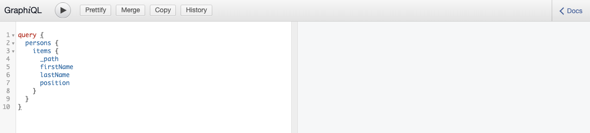

# Guia de início rápido sem cabeçalho para acessar e entregar fragmentos de conteúdo {#accessing-delivering-content-fragments}

Saiba como usar AEM API REST do Assets para gerenciar Fragmentos de conteúdo e a API GraphQL para entrega sem interface do conteúdo do Fragmento de conteúdo.

## O que são APIs REST de GraphQL e Assets? {#what-are-the-apis}

[Agora que você criou alguns fragmentos de conteúdo,](create-content-fragment.md) você pode usar AEM APIs para entregá-las sem periféricos.

* [A API GraphQL](/help/assets/content-fragments/graphql-api-content-fragments.md) O permite criar solicitações para acessar e fornecer Fragmentos de conteúdo.
   * Para usar isso, [os endpoints precisam ser definidos e ativados no AEM](/help/assets/content-fragments/graphql-api-content-fragments.md#enabling-graphql-endpoint)e, se necessário, a variável [Interface GraphiQL instalada](/help/assets/content-fragments/graphql-api-content-fragments.md#installing-graphiql-interface).
* [A API REST do Assets](/help/assets/content-fragments/assets-api-content-fragments.md) O permite criar e modificar Fragmentos de conteúdo (e outros ativos).

O restante deste guia terá como foco o acesso GraphQL e a entrega do Fragmento de conteúdo.

## Como entregar um fragmento de conteúdo usando GraphQL {#how-to-deliver-a-content-fragment}

Os arquitetos de informações precisarão projetar consultas para seus pontos de extremidade de canal para fornecer conteúdo. Geralmente, esses queries só precisarão ser considerados uma vez por endpoint por modelo. Para os fins deste guia de introdução, só será necessário criar um.

1. Faça logon AEM as a Cloud Service e acesse a interface GraphiQL:
   * Por exemplo: `https://<host>:<port>/content/graphiql.html`.

1. O GraphiQL é um editor de consultas do navegador para GraphQL. Você pode usá-lo para criar consultas para recuperar Fragmentos de conteúdo para entregá-los com facilidade como JSON.
   * O painel esquerdo permite criar o query.
   * O painel direito exibe os resultados.
   * O Editor de consultas apresenta a conclusão de código e teclas de atalho para executar facilmente a consulta.
      

1. Supondo que o modelo que criamos era chamado `person` com campos `firstName`, `lastName`e `position`, podemos criar uma consulta simples para recuperar o conteúdo do Fragmento de conteúdo.

   ```text
   query 
   {
     personList {
       items {
         _path
         firstName
         lastName
         position
       }
     }
   }
   ```

1. Insira o query no painel esquerdo.
   

1. Clique no botão **Executar Consulta** ou use o `Ctrl-Enter` A tecla de atalho e os resultados são exibidos como JSON no painel direito.
   

1. Clique no botão **Documentação** link na parte superior direita da página para mostrar a documentação contextual para ajudá-lo a criar suas consultas que se adaptam aos seus próprios modelos.
   

O GraphQL permite consultas estruturadas que podem direcionar não apenas conjuntos de dados específicos ou objetos de dados individuais, mas também fornecer elementos específicos dos objetos, resultados aninhados, oferecer suporte para variáveis de consulta e muito mais.

O GraphQL pode evitar solicitações de API iterativas, bem como entrega excessiva e, em vez disso, permite a entrega em massa do que é necessário para renderização como resposta a uma única consulta de API. O JSON resultante pode ser usado para fornecer dados a outros sites ou aplicativos.

## Próximas etapas {#next-steps}

Pronto! Agora você tem uma compreensão básica do gerenciamento de conteúdo sem periféricos no AEM. É claro que há muito mais recursos onde você pode aprofundar um entendimento abrangente dos recursos disponíveis.

* **Navegador de configuração** - Para obter detalhes sobre o Navegador de configuração de AEM
* **[Fragmentos de conteúdo](/help/assets/content-fragments/content-fragments.md)** - Para obter detalhes sobre a criação e o gerenciamento dos Fragmentos de conteúdo
* **[Suporte a fragmentos de conteúdo na API HTTP do AEM Assets](/help/assets/content-fragments/assets-api-content-fragments.md)** - Para obter detalhes sobre como acessar AEM conteúdo diretamente pela API HTTP, por meio de operações CRUD (Criar, Ler, Atualizar, Excluir)
* **[API GraphQL](/help/assets/content-fragments/graphql-api-content-fragments.md)** - Para obter detalhes sobre como fornecer fragmentos de conteúdo sem interrupções
