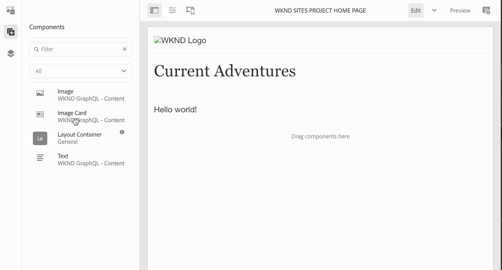

# Composite Components em SPAs {#composite-components-in-spas}

Os componentes compostos usam a natureza modular dos componentes AEM ao combinar vários componentes básicos em um único componente. Um caso de uso comum de componente composto é o componente de cartão, composto por uma combinação dos componentes de imagem e texto.

Quando os componentes compostos são implementados corretamente na estrutura do Editor de aplicativo de página única (SPA) do AEM, os autores de conteúdo podem arrastar e soltar esses componentes como fariam com qualquer outro componente, mas ainda podem editar individualmente cada componente que compõe o componente composto.

Este artigo demonstra como você pode adicionar um componente composto ao aplicativo de página única para funcionar perfeitamente com o Editor SPA do AEM.

{{ue-over-spa}}

## Caso de uso {#use-case}

Este artigo usará o componente de cartão típico como exemplo de caso de uso. Os cartões são um elemento comum da interface do usuário para muitas experiências digitais e geralmente são compostos de uma imagem e texto ou legenda associados. Um autor deseja poder arrastar e soltar todo o cartão, mas poder editar individualmente a imagem do cartão e personalizar o texto associado.

## Pré-requisitos {#prerequisites}

Os seguintes modelos de suporte para casos de uso de componentes compostos exigem os seguintes pré-requisitos.

* Sua instância de desenvolvimento do AEM está sendo executada localmente na porta 4502 com um projeto de amostra.
* Você tem um aplicativo externo de trabalho do React [habilitado para edição no AEM](editing-external-spa.md).
* O aplicativo React é carregado no editor AEM [usando o componente RemotePage](remote-page.md).

## Adicionar componentes compostos a um SPA {#adding-composite-components}

Há três modelos diferentes para implementar seu componente composto, dependendo de sua implementação de SPA no AEM.

* [O componente não existe em seu projeto do AEM](#component-does-not-exist).
* [O componente existe em seu projeto do AEM, mas o conteúdo necessário não](#content-does-not-exist).
* [O componente e seu conteúdo obrigatório existem no seu projeto do AEM](#both-exist).

As seções a seguir fornecem exemplos de implementação de cada caso usando o componente de cartão como exemplo.

### O componente não existe em seu projeto do AEM. {#component-does-not-exist}

Comece criando os componentes que compõem o componente composto, ou seja, os componentes da imagem e seu texto.

1. Crie o componente de texto em seu projeto do AEM.
1. Adicione o `resourceType` correspondente do projeto no nó `editConfig` do componente.

   ```text
    resourceType: 'wknd-spa/components/text' 
   ```

1. Use o auxiliar do `withMappable` para habilitar a edição do componente.

   ```text
   export const AEMText = withMappable(Text, TextEditConfig); 
   ```

O componente de Texto é semelhante ao seguinte.

```javascript
import React from 'react';
import { withMappable } from '@adobe/aem-react-editable-components';

export const TextEditConfig = {
  emptyLabel: 'Text',
  isEmpty: function(props) {
    return !props || !props.text || props.text.trim().length < 1;
  },
  resourceType: 'wknd-spa/components/text'
};

export const Text = ({ cqPath, richText, text }) => {
  const richTextContent = () => (
    <div className="aem_text"
      id={cqPath.substr(cqPath.lastIndexOf('/') + 1)}
      data-rte-editelement
      dangerouslySetInnerHTML={{__html: text}} />
  );
  return richText ? richTextContent() : (
     <div className="aem_text">{text}</div>
  );
};

export const AEMText = withMappable(Text, TextEditConfig);
```

Se você criar um componente de imagem de maneira semelhante, poderá combiná-lo com o componente `AEMText` em um novo componente de cartão, usando os componentes de imagem e texto como filhos.

```javascript
import React from 'react';
import { AEMText } from './AEMText';
import { AEMImage } from './AEMImage';

export const AEMCard = ({ pagePath, itemPath}) => (
  <div>
    <AEMText
       pagePath={pagePath}
       itemPath={`text`} />
    <AEMImage
       pagePath={pagePath}
       itemPath={`image`} />
   </div>
);
```

Esse componente composto resultante agora pode ser colocado em qualquer lugar no aplicativo e o adicionará espaços reservados para um componente de texto e imagem no Editor de SPA. Na amostra abaixo, o componente de cartão é adicionado ao componente inicial abaixo do título.

```javascript
function Home() {
  return (
    <div className="Home">
      <h2>Current Adventures</h2>
      <AEMCard
        pagePath='/content/wknd-spa/home' />
    </div>
  );
}
```

Isso exibirá um espaço reservado vazio para um texto e uma imagem no editor. Ao inserir valores para eles usando o editor, eles são armazenados no caminho de página especificado, ou seja, `/content/wknd-spa/home` no nível raiz com os nomes especificados em `itemPath`.


### O componente existe em seu projeto do AEM, mas o conteúdo necessário não existe. {#content-does-not-exist}

Nesse caso, o componente de cartão já foi criado no projeto do AEM que contém os nós de título e imagem. Os nós secundários (texto e imagem) têm os tipos de recursos correspondentes.


Em seguida, é possível adicioná-lo ao SPA e recuperar o conteúdo.

1. Crie um componente correspondente no SPA para isso. Verifique se os componentes secundários estão mapeados para os tipos de recursos correspondentes do AEM no projeto de SPA. Neste exemplo, usamos os mesmos componentes `AEMText` e `AEMImage` que foram detalhados [no caso anterior](#component-does-not-exist).

   ```javascript
   import React from 'react';
   import { Container, withMappable, MapTo } from '@adobe/aem-react-editable-components';
   import { Text, TextEditConfig } from './AEMText';
   import Image, { ImageEditConfig } from './AEMImage';
   
   export const AEMCard = withMappable(Container, {
     resourceType: 'wknd-spa/components/imagecard'
   });
   
   MapTo('wknd-spa/components/text')(Text, TextEditConfig);
   MapTo('wknd-spa/components/image')(Image, ImageEditConfig);
   ```

1. Como não há conteúdo para o componente `imagecard`, adicione o cartão à página. Inclua o container existente do AEM no SPA.
   * Se já houver um contêiner no projeto do AEM, podemos incluí-lo no SPA e adicionar o componente ao contêiner do AEM.
   * Verifique se o componente de cartão está mapeado para o tipo de recurso correspondente no SPA.

   ```javascript
   <ResponsiveGrid
    pagePath='/content/wknd-spa/home'
    itemPath='root/responsivegrid' />
   ```

1. Adicione o componente `wknd-spa/components/imagecard` criado aos componentes permitidos para o componente de contêiner [no modelo de página](/help/sites-cloud/authoring/page-editor/templates.md).

Agora, o componente `imagecard` pode ser adicionado diretamente ao contêiner no editor do AEM.



### O componente e seu conteúdo necessário existem no projeto do AEM. {#both-exist}

Se o conteúdo existir no AEM, ele poderá ser incluído diretamente no SPA fornecendo o caminho para o conteúdo.

```javascript
<AEMCard
    pagePath='/content/wknd-spa/home'
    itemPath='root/responsivegrid/imagecard' />
```


O componente `AEMCard` é o mesmo definido [no caso de uso anterior](#content-does-not-exist). Aqui, o conteúdo definido no local acima no projeto do AEM está incluído no SPA.
