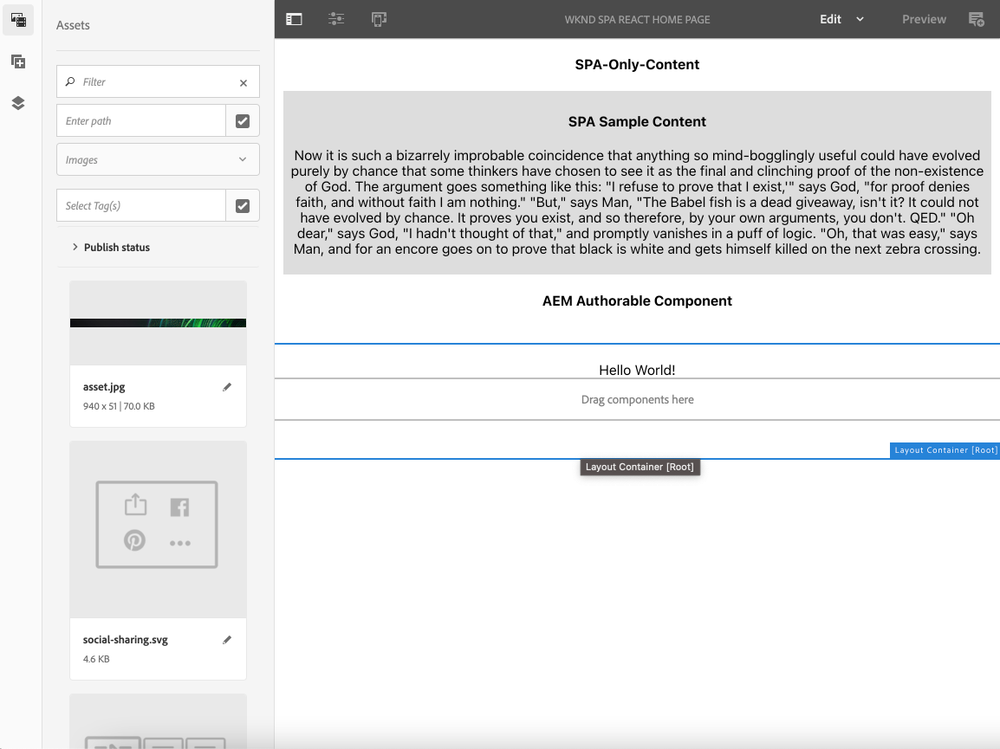

# Edição de um SPA externo no AEM {#editing-external-spa-within-aem}

Ao decidir [que nível de integração](/help/implementing/developing/headful-headless.md) você gostaria de ter entre seu SPA externo e AEM, considere que você deve ser capaz de editar e visualizar o SPA dentro do AEM, muitas vezes.

## Visão geral {#overview}

Este documento descreve as etapas recomendadas para fazer upload de um SPA independente em uma instância AEM, adicionar seções editáveis de conteúdo e ativar a criação.

## Pré-requisitos {#prerequisites}

Os pré-requisitos são simples.

* Verifique se uma instância do AEM está sendo executada localmente.
* AEM Criar um projeto base de SPA usando [o Arquétipo do Projeto AEM](https://experienceleague.adobe.com/docs/experience-manager-core-components/using/developing/archetype/overview.html?#available-properties).
   * Forms é a base do projeto AEM, que é atualizado para incluir o SPA externo.
   * Para as amostras neste documento, o Adobe está usando o ponto de partida de [o projeto WKND SPA](https://experienceleague.adobe.com/docs/experience-manager-learn/sites/spa-editor/spa-editor-framework-feature-video-use.html#spa-editor).
* Tenha em mãos o SPA React externo e funcional que você deseja integrar.

## Fazer upload do AEM para o projeto SPA {#upload-spa-to-aem-project}

Primeiro, você deve carregar o SPA externo para seu projeto AEM.

1. Substituir `src` no `/ui.frontend` pasta do projeto com o aplicativo React `src` pasta.
1. Inclua quaisquer dependências adicionais no do aplicativo `package.json` no `/ui.frontend/package.json` arquivo.
   * Verifique se as dependências do SDK do SPA estão [versões recomendadas](/help/implementing/developing/hybrid/getting-started-react.md#dependencies).
1. Incluir quaisquer personalizações no `/public` pasta.
1. Incluir qualquer script ou estilo incorporado adicionado no `/public/index.html` arquivo.

## Configurar o SPA remoto {#configure-remote-spa}

Agora que o SPA externo é parte do projeto AEM, ele deve ser configurado dentro do AEM.

### Incluir pacotes SDK do Adobe SPA {#include-spa-sdk-packages}

AEM Para aproveitar os recursos do SPA, há dependências nos três pacotes a seguir.

* [`@adobe/aem-react-editable-components`](https://github.com/adobe/aem-react-editable-components)
* [`@adobe/aem-spa-component-mapping`](https://www.npmjs.com/package/@adobe/aem-spa-component-mapping)
* [`@adobe/aem-spa-page-model-manager`](https://www.npmjs.com/login?next=/package/@adobe/aem-spa-model-manager)

A variável `@adobe/aem-spa-page-model-manager` O pacote fornece a API para inicializar um Gerenciador de modelos e recuperar o modelo da instância do AEM. Esse modelo pode ser usado para renderizar componentes AEM usando APIs de `@adobe/aem-react-editable-components` e `@adobe/aem-spa-component-mapping`.

#### Instalação {#installation}

Execute o seguinte `npm` para que você possa instalar os pacotes necessários.

```shell
npm install --save @adobe/aem-spa-component-mapping @adobe/aem-spa-page-model-manager @adobe/aem-react-editable-components
```

### Inicialização do ModelManager {#model-manager-initialization}

Antes que o aplicativo seja renderizado, a variável [`ModelManager`](/help/implementing/developing/hybrid/blueprint.md#pagemodelmanager) deve ser inicializado para lidar com a criação do AEM `ModelStore`.

Essa inicialização deve ser feita dentro do `src/index.js` do aplicativo ou onde quer que a raiz do aplicativo seja renderizada.

Para fazer essa inicialização, você pode usar `initializationAsync` API fornecida pela `ModelManager`.

A captura de tela a seguir mostra como habilitar a inicialização do `ModelManager` em um aplicativo simples do React. A única restrição é que `initializationAsync` deve ser chamado antes de `ReactDOM.render()`.


Neste exemplo, a variável `ModelManager` é inicializado e um está vazio `ModelStore` é criado.

A variável `initializationAsync` pode, opcionalmente, aceitar uma `options` objeto como parâmetro:

* `path` - Na inicialização, o modelo no caminho definido é buscado e armazenado no `ModelStore`. Esse caminho pode ser usado para buscar o `rootModel` na inicialização, se necessário.
* `modelClient` - Permite fornecer um cliente personalizado responsável por buscar o modelo.
* `model` - A `model` objeto passado como parâmetro normalmente preenchido quando [uso do SSR](/help/implementing/developing/hybrid/ssr.md).

### Componentes de folha autoráveis do AEM {#authorable-leaf-components}

1. Crie/identifique um componente do AEM para o qual um componente autorável do React é criado. Neste exemplo, ele está usando o componente de texto do projeto WKND.

   

1. Crie um componente de texto simples do React no SPA. Neste exemplo, um novo arquivo `Text.js` foi criado com o conteúdo a seguir.

   

1. Crie um objeto de configuração para especificar os atributos necessários para habilitar a edição do AEM.

   

   * `resourceType` é obrigatório mapear o componente React ao componente AEM e habilitar a edição ao abri-lo no Editor de AEM.

1. Usar a função wrapper `withMappable`.

   

   Esta função de empacotamento mapeia o componente React para o AEM `resourceType` especificado na configuração e habilita recursos de edição quando abertos no Editor de AEM. Para componentes independentes, ela também busca o conteúdo do modelo para o nó específico.

   >[!NOTE]
   >
   >Neste exemplo, há versões separadas do componente: AEM encapsulado e componentes React não encapsulados. A versão encapsulada deve ser usada ao usar explicitamente o componente. Quando o componente é parte de uma página, você pode continuar usando o componente padrão, como feito atualmente no editor de SPA.

1. Renderizar conteúdo no componente.

   As propriedades JCR do componente de texto aparecem da seguinte maneira no AEM.

   

   Esses valores são transmitidos como propriedades para o `AEMText` O componente React e pode ser usado para renderizar o conteúdo.

   ```javascript
   import React from 'react';
   import { withMappable } from '@adobe/aem-react-editable-components';
   
   export const TextEditConfig = {
       // Empty component placeholder label
       emptyLabel:'Text', 
       isEmpty:function(props) {
          return !props || !props.text || props.text.trim().length < 1;
       },
       // resourcetype of the AEM counterpart component
       resourceType:'wknd-spa-react/components/text'
   };
   
   const Text = ({ text }) => (<div>{text}</div>);
   
   export default Text;
   
   export const AEMText = withMappable(Text, TextEditConfig);
   ```

   Veja a seguir como o componente aparece quando as configurações do AEM são concluídas.

   ```javascript
   const Text = ({ cqPath, richText, text }) => {
      const richTextContent = () => (
         <div className="aem_text" id={cqPath.substr(cqPath.lastIndexOf('/') + 1)} data-rte-editelement dangerouslySetInnerHTML={{__html: text}}/>
      );
      return richText ? richTextContent() : (<div className="aem_text">{text}</div>);
   };
   ```

   >[!NOTE]
   >
   >Neste exemplo, mais personalizações foram feitas no componente renderizado para corresponder ao componente de texto existente. Não está relacionado à criação no AEM.

#### Adicionar componentes autoráveis à página {#add-authorable-component-to-page}

Depois que os componentes autoráveis do React forem criados, você poderá usá-los em todo o aplicativo.

Vamos ver um exemplo de página em que você deve adicionar um texto do projeto SPA WKND. Neste exemplo, você deseja exibir o texto &quot;Olá, mundo!&quot; ligado `/content/wknd-spa-react/us/en/home.html`.

1. Determine o caminho do nó a ser exibido.

   * `pagePath`: a página que contém o nó, neste exemplo `/content/wknd-spa-react/us/en/home`
   * `itemPath`: Caminho para o nó na página, neste exemplo `root/responsivegrid/text`
      * Consiste nos nomes dos itens que contêm itens na página.

   

1. Adicionar componente na posição desejada na página.

   

   A variável `AEMText` componente pode ser adicionado na posição desejada na página com `pagePath` e `itemPath` valores definidos como propriedades. `pagePath` é uma propriedade obrigatória.

#### Verificar edição de conteúdo de texto no AEM {#verify-text-edit}

Agora, teste o componente na instância AEM em execução.

1. Execute o seguinte comando Maven no `aem-guides-wknd-spa` para que você possa criar e implantar o projeto no AEM.

```shell
mvn clean install -PautoInstallSinglePackage
```

1. Na instância do AEM, navegue até `http://<host>:<port>/editor.html/content/wknd-spa-react/us/en/home.html`.


A variável `AEMText` O componente agora pode ser criado no AEM.

### Páginas para autoria do AEM {#aem-authorable-pages}

1. Identifique uma página a ser adicionada para criação no SPA. Este exemplo usa `/content/wknd-spa-react/us/en/home.html`.
1. Criar um arquivo (por exemplo, `Page.js`) para o componente de Página autorável. usar o componente de Página fornecido na `@adobe/cq-react-editable-components`.
1. Repita a etapa quatro na seção [Componentes de folha autoráveis do AEM](#authorable-leaf-components). Usar a função wrapper `withMappable` no componente.
1. Como foi feito anteriormente, aplique `MapTo` aos tipos de recursos AEM para todos os componentes filhos na página.

   ```javascript
   import { Page, MapTo, withMappable } from '@adobe/aem-react-editable-components';
   import Text, { TextEditConfig } from './Text';
   
   export default withMappable(Page);
   
   MapTo('wknd-spa-react/components/text')(Text, TextEditConfig);
   ```

   >[!NOTE]
   >
   >Neste exemplo, o componente de texto React não encapsulado é usado em vez do componente de texto ajustado `AEMText` criado anteriormente. O motivo é que, quando o componente faz parte de uma página/contêiner e não é independente, o contêiner cuida do mapeamento recursivo do componente. E ativar os recursos de criação e o invólucro adicional não é necessário para cada criança.

1. Para adicionar uma página para criação no SPA, siga as mesmas etapas na seção [Adicionar componentes autoráveis à página](#add-authorable-component-to-page). Aqui, você pode pular a variável `itemPath` propriedade.

#### Verificar conteúdo da página no AEM {#verify-page-content}

Para verificar se a página pode ser editada, siga as mesmas etapas na seção [Verificar edição de conteúdo de texto no AEM](#verify-text-edit).



Agora a página pode ser editada no AEM com um contêiner de layout e um componente de Texto filho.

### Componentes da folha virtual {#virtual-leaf-components}

Nos exemplos anteriores, você adicionou componentes ao SPA com conteúdo existente de AEM. No entanto, há casos em que o conteúdo ainda não foi criado no AEM, mas deve ser adicionado posteriormente pelo autor de conteúdo. Para acomodar esse cenário, o desenvolvedor de front-end pode adicionar componentes nos locais apropriados no SPA. Esses componentes exibem espaços reservados quando abertos no editor no AEM. Depois que o conteúdo é adicionado nesses espaços reservados pelo autor de conteúdo, os nós são criados na estrutura JCR e o conteúdo é mantido. O componente criado permite o mesmo conjunto de operações que os componentes folha independentes.

Neste exemplo, você está reutilizando a variável `AEMText` componente criado anteriormente. Você deseja que um novo texto seja adicionado abaixo do componente de texto existente na página inicial da WKND. A adição de componentes é a mesma para componentes de folha normais. No entanto, a `itemPath` pode ser atualizado para o caminho onde o novo componente deve ser adicionado.

Como o novo componente deve ser adicionado abaixo do texto existente em `root/responsivegrid/text`, o novo caminho é `root/responsivegrid/{itemName}`.

```html
<AEMText
 pagePath='/content/wknd-spa-react/us/en/home'
 itemPath='root/responsivegrid/text_20' />
```

A variável `TestPage` é semelhante ao seguinte depois de adicionar o componente virtual.


>[!NOTE]
>
>Assegure a `AEMText` o componente tem sua `resourceType` definido na configuração para que você possa habilitar esse recurso.

Agora você pode implantar as alterações no AEM seguindo as etapas da seção [Verificar edição de conteúdo de texto no AEM](#verify-text-edit). Um espaço reservado é exibido para o item não existente no momento `text_20` nó.


Quando o autor de conteúdo atualizar esse componente, um novo `text_20` o nó é criado em `root/responsivegrid/text_20` in `/content/wknd-spa-react/us/en/home`.


#### Requisitos e limitações {#limitations}

Há vários requisitos para adicionar componentes de folha virtual e algumas limitações.

* A variável `pagePath` é obrigatória para criar um componente virtual.
* O nó da página fornecido no caminho em `pagePath` deve existir no projeto AEM.
* O nome do nó a ser criado deve ser fornecido na variável `itemPath`.
* O componente pode ser criado em qualquer nível.
   * Se você fornecer um `itemPath='text_20'` no exemplo anterior, o novo nó é criado diretamente na página, ou seja, `/content/wknd-spa-react/us/en/home/jcr:content/text_20`
* O caminho para o nó onde um novo nó é criado deve ser válido quando fornecido via `itemPath`.
   * Neste exemplo, `root/responsivegrid` deve existir para que o novo nó `text_20` pode ser criado lá.
* Somente a criação de componente folha é suportada. O container virtual e a página serão compatíveis em versões futuras.

### Contêineres virtuais {#virtual-containers}

A capacidade de adicionar contêineres, mesmo que o contêiner correspondente ainda não tenha sido criado no AEM, é compatível. O conceito e a abordagem são [componentes de folha virtual](#virtual-leaf-components).

O desenvolvedor de front-end pode adicionar os componentes do contêiner em locais apropriados no SPA e esses componentes exibem espaços reservados quando abertos no editor no AEM. O autor pode então adicionar componentes e seu conteúdo ao contêiner que cria os nós necessários na estrutura JCR.

Por exemplo, se um contêiner existir em `/root/responsivegrid`, e o desenvolvedor deseja adicionar um contêiner filho:


A variável `newContainer` ainda não existe no AEM.

Ao editar a página que contém esse componente no AEM, um espaço reservado vazio para um contêiner é exibido no qual o autor pode adicionar conteúdo.


Depois que o autor adiciona um componente secundário ao contêiner, o novo nó do contêiner é criado com o nome correspondente na estrutura JCR.


Mais componentes e conteúdo podem ser adicionados ao contêiner agora, conforme exigido pelo autor, e as alterações são persistentes.

#### Requisitos e limitações {#container-limitations}

Há vários requisitos para adicionar contêineres virtuais e algumas limitações.

* A política para determinar quais componentes podem ser adicionados é herdada do container principal.
* O pai imediato do contêiner a ser criado deve existir no AEM.
   * Se o container `root/responsivegrid` existir no contêiner AEM, um novo contêiner poderá ser criado fornecendo o caminho `root/responsivegrid/newContainer`.
   * No entanto `root/responsivegrid/newContainer/secondNewContainer` não é possível.
* Somente um novo nível de componente pode ser criado de cada vez.

## Personalizações adicionais {#additional-customizations}

Se você seguiu os exemplos anteriores, seu SPA externo agora é editável dentro do AEM. No entanto, há aspectos adicionais do SPA externo que você pode personalizar ainda mais.

### ID do nó raiz {#root-node-id}

Por padrão, você pode supor que o aplicativo React é renderizado em um `div` da ID do elemento `spa-root`. Se necessário, essa sintaxe pode ser personalizada.

Por exemplo, suponha que você tenha um SPA no qual o aplicativo é renderizado dentro de um `div` da ID do elemento `root`. Essa sintaxe deve ser refletida nos três arquivos.

1. No `index.js` do pedido React (ou quando `ReactDOM.render()` é chamado)

   

1. No `index.html` do pedido React

   

1. No corpo do componente da página do aplicativo AEM, por meio de duas etapas:

   1. Criar um `body.html` para o componente de página.

   

   1. Adicionar o elemento raiz no novo `body.html` arquivo.

   

### Edição de um SPA React com Roteamento {#editing-react-spa-with-routing}

Se o aplicativo externo SPA do React tiver várias páginas, [ele pode usar o roteamento para determinar a página/componente a ser renderizado](/help/implementing/developing/hybrid/routing.md). O caso de uso básico é corresponder o URL ativo no momento com o caminho fornecido para uma rota. Para habilitar a edição nesses aplicativos habilitados para roteamento, o caminho no qual corresponder deve ser transformado para acomodar informações específicas do AEM.

No exemplo a seguir, você tem um aplicativo simples do React com duas páginas. A página a ser renderizada é determinada pela correspondência do caminho fornecido ao roteador com o URL ativo. Por exemplo, se você estiver em `mydomain.com/test`, `TestPage` é renderizado.


Para habilitar a edição no AEM para este exemplo SPA, as seguintes etapas são necessárias.

1. Identifique o nível que atuaria como raiz no AEM.

   * Para sua amostra, considere wknd-spa-response/us/en como a raiz do SPA. Essa raiz significa que tudo antes desse caminho é somente páginas/conteúdo AEM.

1. Crie uma página no nível necessário.

   * Neste exemplo, a página a ser editada é `mydomain.com/test`. `test` está no caminho raiz do aplicativo. Esse caminho raiz também deve ser preservado ao criar a página no AEM. Portanto, é possível criar uma página no nível raiz definido na etapa anterior.
   * A nova página criada deve ter o mesmo nome da página a ser editada. Neste exemplo, para `mydomain.com/test`, a nova página criada deve ser `/path/to/aem/root/test`.

1. Adicione auxiliares no roteamento SPA.

   * A página criada ainda não pode renderizar o conteúdo esperado no AEM. O motivo é porque o roteador espera um caminho de `/test` Considerando que o caminho ativo do AEM é `/wknd-spa-react/us/en/test`. Para acomodar a parte específica do AEM do URL, você deve adicionar alguns auxiliares no lado do SPA.

   

   * A variável `toAEMPath` auxiliar fornecido por `@adobe/cq-spa-page-model-manager` pode ser usado. Ele transforma o caminho fornecido para roteamento para incluir partes específicas do AEM quando o aplicativo está aberto em uma instância AEM. Ele aceita três parâmetros:
      * O caminho necessário para roteamento
      * O URL de origem da instância do AEM em que o SPA é editado
      * A raiz do projeto no AEM conforme determinado na primeira etapa

   * Esses valores podem ser definidos como variáveis de ambiente para obter mais flexibilidade.

1. Verifique a edição da página no AEM.

   * Implante o projeto no AEM e navegue até o criado `test` página. O conteúdo da página agora é renderizado e os componentes de AEM são editáveis.

## Limitações da estrutura {#framework-limitations}

O componente RemotePage espera que a implementação forneça um manifesto de ativo como o [encontrado aqui](https://github.com/shellscape/webpack-manifest-plugin). O componente RemotePage, no entanto, só foi testado para funcionar com a estrutura React (e Next.js por meio do componente remote-page-next) e, portanto, não oferece suporte ao carregamento remoto de aplicativos de outras estruturas, como o Angular.

## Recursos adicionais {#additional-resources}

O material de referência a seguir pode ser útil para entender o SPA no contexto do AEM.

* [Headful e Headless no AEM](/help/implementing/developing/headful-headless.md)
* [O Arquétipo do Projeto AEM](https://experienceleague.adobe.com/docs/experience-manager-core-components/using/developing/archetype/overview.html?lang=pt-BR)
* [O projeto SPA WKND](https://experienceleague.adobe.com/docs/experience-manager-learn/sites/spa-editor/spa-editor-framework-feature-video-use.html?lang=pt-BR)
* [Introdução a SPAs no AEM usando o React](/help/implementing/developing/hybrid/getting-started-react.md)
* [Materiais de referência de SPA (referências de API)](/help/implementing/developing/hybrid/reference-materials.md)
* [Blueprint SPA e PageModelManager](/help/implementing/developing/hybrid/blueprint.md#pagemodelmanager)
* [Roteamento de modelo SPA](/help/implementing/developing/hybrid/routing.md)
* [Renderização do SPA e do servidor](/help/implementing/developing/hybrid/ssr.md)
