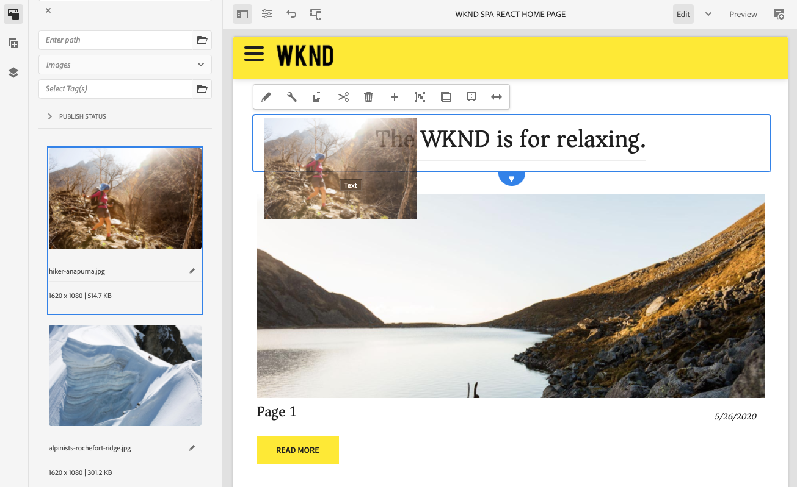
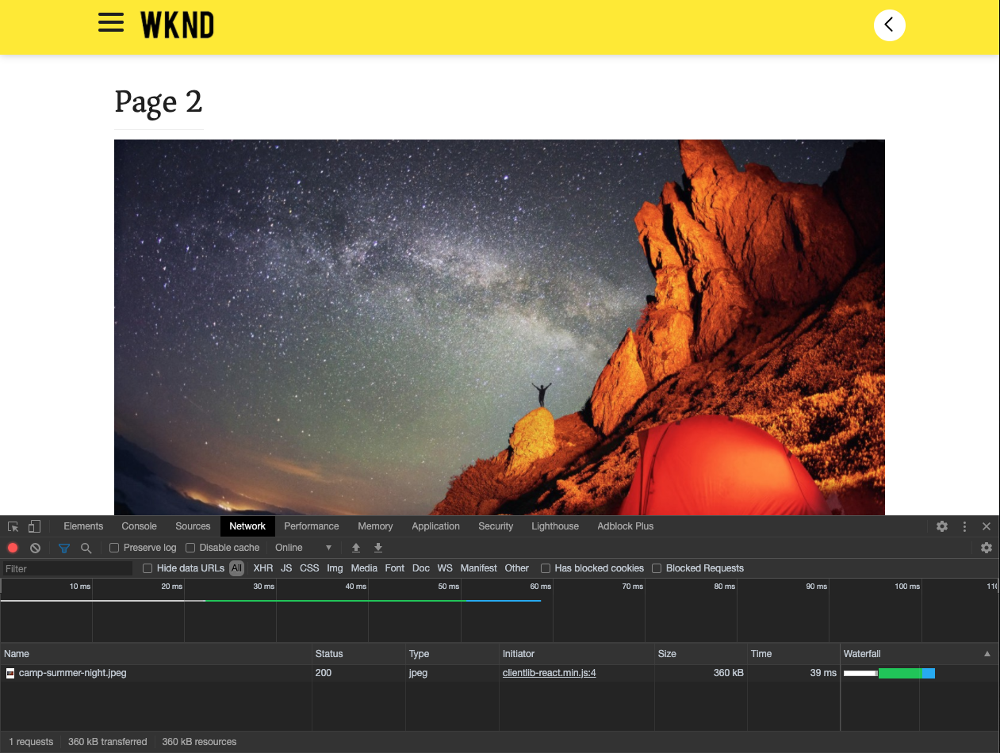

# Introdução SPA e Walkthrough {#spa-introduction}

Aplicativos de página única (SPA) podem oferta experiências interessantes para usuários de sites. Os desenvolvedores querem ser capazes de criar sites usando estruturas SPA e os autores querem editar o conteúdo no AEM para um site criado usando essas estruturas.

O Editor de SPA oferta uma solução abrangente para suporte a SPA no AEM. Este artigo aborda o uso de um aplicativo SPA básico para criação e mostra como ele está relacionado ao AEM subjacente SPA Editor.

## Introdução {#introduction}

### Objetivo do artigo {#article-objective}

Este artigo apresenta os conceitos básicos de SPA antes de conduzir o leitor por uma apresentação do editor de SPA usando um aplicativo de SPA simples para demonstrar a edição básica de conteúdo. Em seguida, ele mergulha na construção da página e como o aplicativo SPA se relaciona e interage com o Editor de SPA AEM.

O objetivo desta introdução e apresentação é demonstrar a um desenvolvedor AEM por que SPA são relevantes, como eles geralmente funcionam, como um SPA é manipulado pelo editor de SPA AEM e como é diferente de um aplicativo AEM padrão.

A apresentação baseia-se na funcionalidade de AEM padrão e na amostra do aplicativo WKND SPA Project. Para seguir em frente, [baixe e instale o aplicativo SPA Project WKND de amostra do GitHub aqui.](https://github.com/adobe/aem-guides-wknd-spa)

>[!CAUTION]
>
>Este documento usa o [aplicativo SPA Projeto WKND](https://github.com/adobe/aem-guides-wknd-spa) apenas para fins de demonstração. Não deve ser utilizado para qualquer trabalho de projeto.

>[!TIP]
>
>Qualquer projeto AEM deve aproveitar o [AEM Project Archetype](https://docs.adobe.com/content/help/pt-BR/experience-manager-core-components/using/developing/archetype/overview.html), que suporta projetos SPA usando React ou Angular e aproveita o SPA SDK.

### O que é um SPA? {#what-is-a-spa}

Um aplicativo de página única (SPA) é diferente de uma página convencional, pois é renderizado no lado do cliente e é principalmente controlado pelo Javascript, contando com chamadas do Ajax para carregar dados e atualizar dinamicamente a página. A maioria ou todo o conteúdo é recuperado uma vez em um único carregamento de página com recursos adicionais carregados de forma assíncrona, conforme necessário, com base na interação do usuário com a página.

Isso reduz a necessidade de atualizações de página e apresenta uma experiência ao usuário que é simples, rápida e se parece mais com uma experiência de aplicativo nativa.

O AEM SPA Editor permite que desenvolvedores front-end criem SPA que podem ser integrados a um site AEM, permitindo que os autores de conteúdo editem o conteúdo SPA tão facilmente quanto qualquer outro conteúdo AEM.

### Por que um SPA? {#why-a-spa}

Ao ser mais rápido, fluido e mais parecido com um aplicativo nativo, um SPA torna-se uma experiência muito atraente não apenas para o visitante da página da Web, mas também para profissionais de marketing e desenvolvedores devido à natureza de como o SPA funciona.


#### Visitantes {#visitors}

* Os visitantes querem experiências nativas quando interagem com o conteúdo.
* Há dados claros de que quanto mais rápida uma página, mais provável uma conversão ocorrerá.

#### Comerciantes {#marketers}

* Os profissionais de marketing querem oferta de experiências ricas e nativas para incentivar os visitantes a se envolverem totalmente com o conteúdo.
* A personalização pode tornar essas experiências ainda mais atraentes.

#### Desenvolvedores {#developers}

* Os desenvolvedores querem uma separação clara entre as preocupações do conteúdo e da apresentação.
* A separação nítida torna o sistema mais extensível e permite o desenvolvimento de front-end independente.

### Como funciona um SPA? {#how-does-a-spa-work}

A ideia principal por trás de uma SPA é que as chamadas e a dependência em um servidor sejam reduzidas para minimizar os atrasos causados pela latência do servidor, de modo que a SPA se aproxime da capacidade de resposta de um aplicativo nativo.

Em uma página da Web tradicional e sequencial, somente os dados necessários para a página imediata são carregados. Isso significa que quando o visitante se move para outra página, o servidor é chamado para os recursos adicionais. Chamadas adicionais podem ser necessárias à medida que o visitante interage com elementos na página. Essas chamadas múltiplas podem dar uma sensação de atraso ou atraso, pois a página precisa acompanhar as solicitações do visitante.


Para uma experiência mais fluida, que se aproxima do que um visitante espera de aplicativos móveis nativos, um SPA carrega todos os dados necessários para o visitante na primeira carga. Embora isso possa demorar um pouco mais no início, elimina a necessidade de chamadas de servidor adicionais.

Ao renderizar no lado do cliente, os elementos da página reagem mais rapidamente e as interações com a página pelo visitante são imediatas. Quaisquer dados adicionais que possam ser necessários são chamados de forma assíncrona para maximizar a velocidade da página.

>[!TIP]
>
>Para obter detalhes técnicos sobre como SPA trabalhar em AEM, consulte os artigos:
>* [Introdução ao SPA no AEM usando React](getting-started-react.md)
>* [Introdução ao SPA no AEM usando o Angular](getting-started-angular.md)

>
>
Para obter uma visão mais detalhada do design, arquitetura e fluxo de trabalho técnico do Editor de SPA, consulte o artigo:
>* [Visão geral](editor-overview.md) do editor SPA.


## Experiência de edição de conteúdo com SPA {#content-editing-experience-with-spa}

Quando um SPA é criado para aproveitar o AEM Editor de SPA, o autor do conteúdo não percebe diferença ao editar e criar conteúdo. Funcionalidade de AEM comum disponível e nenhuma alteração no fluxo de trabalho do autor é necessária.

1. Edite o aplicativo SPA Projeto WKND no AEM.

   `http://localhost:4502/editor.html/content/wknd-spa-react/us/en/home.html`

   

1. Selecione um componente de texto e observe que uma barra de ferramentas aparece como em qualquer outro componente. Selecione **Editar**.

   

1. Edite o conteúdo como normal no AEM e observe que as alterações são persistentes.

   

1. Use o Navegador de ativos para arrastar e soltar uma nova imagem em um componente de imagem.

   

1. A alteração é persistente.

   

Ferramentas de criação adicionais, como arrastar e soltar componentes adicionais na página, reorganizar componentes e modificar o layout, são suportadas como em qualquer aplicativo não SPA AEM.

>[!NOTE]
>
>O Editor de SPA não modifica o DOM do aplicativo. O próprio SPA é responsável pelo DOM.
>
>Para ver como isso funciona, prossiga para a próxima seção deste artigo [SPA Aplicativos e o AEM SPA Editor](#spa-apps-and-the-aem-spa-editor).

## Aplicativos SPA e o editor de SPA AEM {#spa-apps-and-the-aem-spa-editor}

Experimentar como um SPA se comporta para o usuário final e, em seguida, inspecionar a página de SPA ajuda a entender melhor como um aplicativo SAP funciona com o Editor de SPA na AEM.

### Uso de um aplicativo SPA {#using-an-spa-application}

1. Carregue o aplicativo SPA Projeto WKND no servidor de publicação ou usando a opção **Visualização como Publicada** do menu **Informações da página** no editor de páginas.

   `http://<host>:<port>/content/wknd-spa-react/us/en/home.html`

   

   Observe a estrutura das páginas, incluindo a navegação para páginas filhas, menus e cartões de artigos.

1. Navegue até uma página secundária usando o menu e veja se a página é carregada imediatamente sem a necessidade de uma atualização.

   

1. Abra as ferramentas integradas do desenvolvedor do navegador e monitore a atividade da rede à medida que você navega nas páginas secundárias.

   

   Há muito pouco tráfego à medida que você muda de página para página no aplicativo. A página não é recarregada e somente as novas imagens são solicitadas.

   O SPA gerencia o conteúdo e o roteamento totalmente no lado do cliente.

Então, se a página não é recarregada ao navegar pelas páginas secundárias, como ela é carregada?

A próxima seção, [Carregando um aplicativo SPA](#loading-a-spa-application), aprofunda os mecanismos de carregamento do SPA e como o conteúdo pode ser carregado de forma síncrona e assíncrona.

### Carregando um aplicativo SPA {#loading-a-spa-application}

1. Se ainda não tiver sido carregado, carregue o aplicativo SPA Projeto WKND no servidor de publicação ou usando a opção **Visualização como Publicada** do menu **Informações da página** no editor de páginas.

   `http://<host>:<port>/content/wknd-spa-react/us/en/home.html`

   

1. Use a ferramenta integrada do seu navegador para visualização da fonte da página.
1. Observe que o conteúdo da fonte é limitado.

   ```html
    <!DOCTYPE html>
    <html lang="en">
    <head>
        <meta charset="UTF-8"/>
        <title>WKND SPA React Home Page</title>
   
        <meta name="template" content="spa-page-template"/>
        <meta name="viewport" content="width=device-width, initial-scale=1"/>
   
    <link rel="stylesheet" href="/etc.clientlibs/wknd-spa-react/clientlibs/clientlib-base.min.css" type="text/css">
   
    <meta name="theme-color" content="#000000"/>
    <link rel="icon" href="/etc.clientlibs/wknd-spa-react/clientlibs/clientlib-react/resources/favicon.ico"/>
    <link rel="apple-touch-icon" href="/etc.clientlibs/wknd-spa-react/clientlibs/clientlib-react/resources/logo192.png"/>
    <link rel="manifest" href="/etc.clientlibs/wknd-spa-react/clientlibs/clientlib-react/resources/manifest.json"/>
   
    <!-- AEM page model -->
    <meta property="cq:pagemodel_root_url" content="/content/wknd-spa-react/us/en.model.json"/>
    <link href="//fonts.googleapis.com/css?family=Source+Sans+Pro:400,600|Asar&display=swap" rel="stylesheet"/>
    <meta property="cq:datatype" content="JSON"/>
    <meta property="cq:wcmmode" content="edit"/>
   
    <link rel="stylesheet" href="/libs/cq/gui/components/authoring/editors/clientlibs/internal/page.min.css" type="text/css">
    <link rel="stylesheet" href="/etc.clientlibs/wcm/foundation/clientlibs/main.min.css" type="text/css">
    <script type="text/javascript" src="/libs/cq/gui/components/authoring/editors/clientlibs/internal/messaging.min.js"></script>
    <script type="text/javascript" src="/libs/cq/gui/components/authoring/editors/clientlibs/utils.min.js"></script>
    <script type="text/javascript" src="/libs/granite/author/deviceemulator/clientlibs.min.js"></script>
    <script type="text/javascript" src="/libs/cq/gui/components/authoring/editors/clientlibs/internal/page.min.js"></script>
    <script type="text/javascript" src="/etc.clientlibs/wcm/foundation/clientlibs/main.min.js"></script>
    <script type="text/javascript" src="/etc.clientlibs/clientlibs/granite/jquery.min.js"></script>
    <script type="text/javascript" src="/etc.clientlibs/clientlibs/granite/utils.min.js"></script>
    <script type="text/javascript" src="/etc.clientlibs/clientlibs/granite/jquery/granite.min.js"></script>
    <script type="text/javascript" src="/etc.clientlibs/foundation/clientlibs/jquery.min.js"></script>
    <script type="text/javascript" src="/etc.clientlibs/foundation/clientlibs/shared.min.js"></script>
   
    <!--cq{"decorated":false,"type":"cq/cloudconfig/components/scripttags/header","path":"/content/wknd-spa-react/us/en/home/jcr:content/cloudconfig-header","structurePath":"/content/wknd-spa-react/us/en/home/jcr:content/cloudconfig-header","selectors":null,"servlet":"Script /libs/cq/cloudconfig/components/scripttags/header/header.html","totalTime":2,"selfTime":2}-->
   
    <link rel="stylesheet" href="/etc.clientlibs/wknd-spa-react/clientlibs/clientlib-react.min.css" type="text/css">
   
    </head>
   
    <body class="page basicpage">
        <noscript>You need to enable JavaScript to run this app.</noscript>
    <div id="spa-root"></div>
   
    <script type="text/javascript" src="/etc.clientlibs/wknd-spa-react/clientlibs/clientlib-react.min.js"></script>
   
    <script type="text/javascript" src="/etc.clientlibs/core/wcm/components/commons/site/clientlibs/container.min.js"></script>
    <script type="text/javascript" src="/etc.clientlibs/wknd-spa-react/clientlibs/clientlib-base.min.js"></script>
   
    <script type="text/javascript" src="/libs/cq/gui/components/authoring/editors/clientlibs/internal/pagemodel/messaging.min.js"></script>
   
    <link rel="stylesheet" href="/etc.clientlibs/wknd-spa-react/clientlibs/clientlib-author.min.css" type="text/css">
   
    <!--cq{"decorated":true,"type":"cq/cloudserviceconfigs/components/servicecomponents","path":"/content/wknd-spa-react/us/en/home/jcr:content/cloudservices","selectors":null,"servlet":"Script /libs/cq/cloudserviceconfigs/components/servicecomponents/servicecomponents.jsp","totalTime":2,"selfTime":2}-->
   
    <!--cq{"decorated":false,"type":"cq/cloudconfig/components/scripttags/footer","path":"/content/wknd-spa-react/us/en/home/jcr:content/cloudconfig-footer","structurePath":"/content/wknd-spa-react/us/en/home/jcr:content/cloudconfig-footer","selectors":null,"servlet":"Script /libs/cq/cloudconfig/components/scripttags/footer/footer.html","totalTime":2,"selfTime":2}-->
   
    </body>
    </html>
    <!--cq{"decorated":false,"type":"wknd-spa-react/components/page","path":"/content/wknd-spa-react/us/en/home/jcr:content","selectors":null,"servlet":"Script /apps/spa-project-core/components/page/page.html","totalTime":39,"selfTime":33}-->
   ```

   A página não tem nenhum conteúdo em seu corpo. Ele é formado principalmente por folhas de estilo e uma chamada para vários scripts, como `clientlib-react.min.js`.

   Esses scripts são os principais drivers desse aplicativo e são responsáveis pela renderização de todo o conteúdo.

1. Use as ferramentas incorporadas do seu navegador para inspecionar a página. Consulte o conteúdo do DOM totalmente carregado.

   

1. Alterne para a guia Rede no Inspetor e recarregue a página.

   Ignorando solicitações de imagem, observe que os recursos primários carregados para a página são a própria página, o CSS, o Javascript React, suas dependências, bem como os dados JSON para a página.

   

1. Carregue `home.model.json` em uma nova guia.

   `http://<host>:<port>/content/wknd-spa-react/us/en/home.model.json`

   

   O AEM SPA Editor aproveita [AEM Content Services](/help/assets/content-fragments/content-fragments.md) para fornecer todo o conteúdo da página como um modelo JSON.

   Ao implementar interfaces específicas, os Modelos Sling fornecem as informações necessárias para o SPA. O delivery dos dados JSON é delegado para baixo em cada componente (da página, ao parágrafo, ao componente, etc.).

   Cada componente escolhe o que expõe e como é renderizado (lado do servidor com HTL ou lado do cliente com React ou Angular). Este artigo foca na renderização no cliente com React.

1. O modelo também pode agrupar as páginas para que elas sejam carregadas de forma síncrona, reduzindo o número de recarregamentos de página necessários.

   No exemplo do aplicativo SPA Projeto WKND, as páginas `home`, `page-1`, `page-2` e `page-3` são carregadas de forma síncrona, já que os visitantes visitam todas essas páginas.

   Este comportamento não é obrigatório e é totalmente definível.

   

1. Para visualização dessa diferença de comportamento, recarregue a página `home` e limpe a atividade de rede do inspetor. Navegue até `page-1` no menu da página e veja se a única atividade de rede é uma solicitação para a imagem de `page-1`. `page-1` ela mesma não precisa carregar.

   

### Interação com o Editor de SPA {#interaction-with-the-spa-editor}

Usando a amostra do aplicativo SPA Projeto WKND, fica claro como o aplicativo se comporta e é carregado quando publicado, aproveitando os serviços de conteúdo para o delivery de conteúdo JSON, bem como o carregamento assíncrono de recursos.

Além disso, para o autor do conteúdo, a criação de conteúdo usando um editor de SPA é perfeita dentro da AEM.

Na seção a seguir, exploraremos o contrato que permite ao Editor de SPA relacionar componentes dentro do SPA a componentes AEM e obter essa experiência de edição contínua.

1. Carregue o aplicativo SPA Projeto WKND no editor e alterne para o modo **Pré-visualização**.

   `http://<host>:<port>/editor.html/content/wknd-spa-react/us/en/home.html`

1. Usando as ferramentas de desenvolvedor incorporadas do seu navegador, inspecione o conteúdo da página. Usando a ferramenta de seleção, selecione um componente editável na página e visualização os detalhes do elemento.

   Observe que o componente tem um novo atributo de dados `data-cq-data-path`.

   

   Por exemplo

   `data-cq-data-path="/content/wknd-spa-react/us/en/home/jcr:content/root/responsivegrid/text`

   Esse caminho permite a recuperação e a associação do objeto de configuração de contexto de edição de cada componente.

   Este é o único atributo de marcação necessário para que o editor reconheça isso como um componente editável dentro do SPA. Com base nesse atributo, o Editor de SPA determinará qual configuração editável está associada ao componente, para que o quadro, a barra de ferramentas etc. estejam corretos. está carregado.

   Alguns nomes de classe específicos também são adicionados para marcar espaços reservados e para a funcionalidade de arrastar e soltar do ativo.

   >[!NOTE]
   >
   >Esse comportamento difere das páginas renderizadas do lado do servidor no AEM, onde há um elemento `cq` inserido para cada componente editável.
   >
   >Essa abordagem no Editor de SPA elimina a necessidade de inserir elementos personalizados, contando somente com um atributo de dados adicional, tornando a marcação mais simples para o desenvolvedor de front-end.

## Próximas etapas {#next-steps}

Agora que você entende a experiência de edição de SPA em AEM e como um SPA se relaciona ao Editor SPA, aprofunde o entendimento de como um SPA é criado.

* [Introdução ao SPA no AEM usando o ](getting-started-react.md) React mostra como um SPA básico foi criado para funcionar com o SPA Editor no AEM usando React
* [Introdução ao SPA no AEM usando o ](getting-started-angular.md) Angularense mostra como um SPA básico é criado para funcionar com o Editor SPA no AEM usando o Angular
* [SPA Editor ](editor-overview.md) Visão geral aprofunda o modelo de comunicação entre AEM e o SPA.
* [Desenvolver SPA para o ](developing.md) AEM descreve como envolver desenvolvedores front-end para desenvolver uma SPA para AEM, bem como como como SPA interagir com AEM arquitetura.
