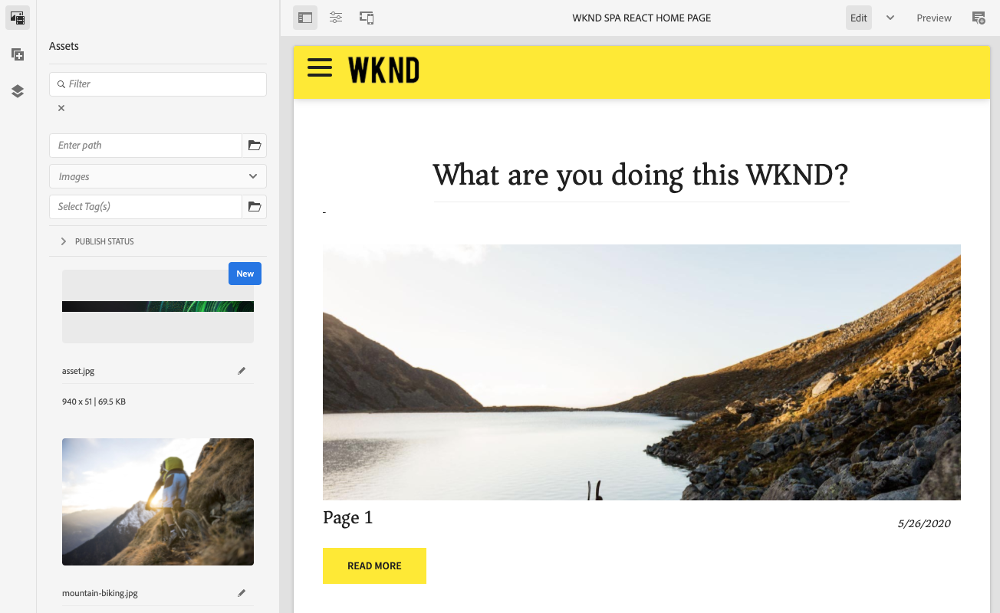
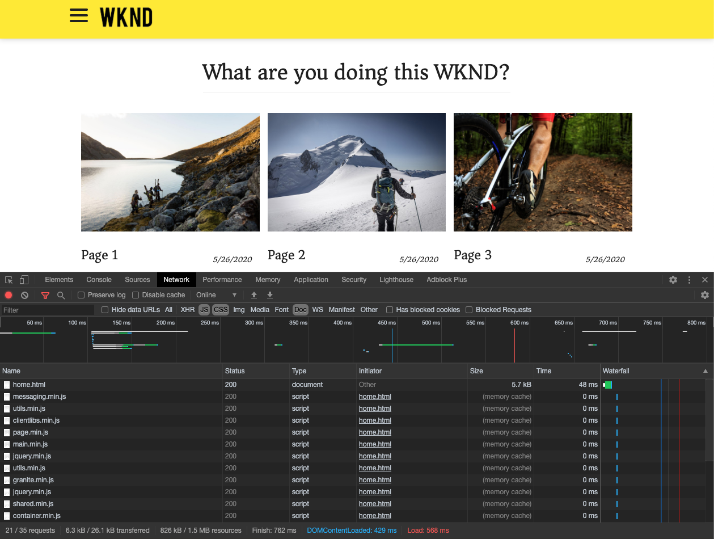

# Introdução e passo a passo do SPA {#spa-introduction}

Aplicativos de página única (SPAs) podem oferecer experiências interessantes para usuários de sites. Os desenvolvedores desejam criar sites usando estruturas de SPA, e os autores desejam editar o conteúdo de um site criado usando essas estruturas diretamente no AEM.

O editor de SPA oferece uma solução abrangente para permitir o uso de SPAs no AEM. Este artigo aborda o uso de um SPA básico para criação e mostra como ele se relaciona ao editor de SPA integrado do AEM.

{{ue-over-spa}}

## Introdução {#introduction}

### Objetivo do artigo {#article-objective}

Este artigo apresenta os conceitos básicos sobre SPAs antes de conduzir o leitor por um passo a passo do editor de SPA, usando um SPA simples para demonstrar a edição básica de conteúdo. Em seguida, ele se aprofunda na construção da página e em como o SPA se relaciona e interage com o editor de SPA do AEM.

A meta desta introdução e passo a passo é demonstrar a um desenvolvedor do AEM por que SPAs são relevantes, como eles geralmente funcionam, como um SPA é manipulado pelo editor de SPA do AEM e como ele é diferente de um aplicativo padrão do AEM.

## Requisitos {#requirements}

O passo a passo é baseado na funcionalidade padrão do AEM e no aplicativo de exemplo Projeto SPA WKND. Para acompanhar esse passo a passo, você deve ter o seguinte disponível.

* [SDK de desenvolvimento mais recente do AEMaaCS](/help/release-notes/release-notes-cloud/release-notes-current.md)
   * Ele deve funcionar como um ambiente de desenvolvimento local.
   * Você deve ter direitos de administrador no sistema.
* [O aplicativo de exemplo Projeto SPA WKND está disponível no GitHub](https://github.com/adobe/aem-guides-wknd-spa)
   * Baixe a [última versão do aplicativo React](https://github.com/adobe/aem-guides-wknd-spa/releases), que tem um nome semelhante a `wknd-spa-react.all-X.Y.Z-SNAPSHOT.zip`.
   * Baixe as [imagens de amostra mais recentes para o aplicativo](https://github.com/adobe/aem-guides-wknd-spa/releases), que têm um nome semelhante a `wknd-spa-sample-images-X.Y.Z.zip`.
   * [Use o gerenciador de pacotes](/help/implementing/developing/tools/package-manager.md) para instalar ambos os pacotes, assim como faria com qualquer outro pacote no AEM.
   * O aplicativo não precisa ser instalado usando o Maven para fins deste passo a passo.

>[!CAUTION]
>
>Este documento usa o [aplicativo Projeto SPA WKND](https://github.com/adobe/aem-guides-wknd-spa) apenas para fins de demonstração. Não o use para nenhum trabalho de projeto.

>[!TIP]
>
>Qualquer projeto do AEM deve utilizar o [Arquétipo de projeto do AEM](https://experienceleague.adobe.com/docs/experience-manager-core-components/using/developing/archetype/overview.html?lang=pt-BR), que aceita projetos SPA que usam o React ou o Angular e utiliza o SDK de SPA.

### O que é um SPA? {#what-is-a-spa}

Um aplicativo de página única (SPA) é diferente de uma página convencional, no sentido de que ele é renderizado no lado do cliente e orientado principalmente por Javascript, dependendo das chamadas Ajax para carregar dados e atualizar dinamicamente a página. A maior parte ou todo o conteúdo é recuperado uma vez em um único carregamento de página, com os recursos adicionais sendo carregados de forma assíncrona conforme necessário, com base na interação do usuário com a página.

Isso reduz a necessidade de atualizações de página e apresenta uma experiência ao usuário que é contínua, rápida e se parece mais com uma experiência de aplicativo nativo.

O editor de SPA do AEM permite que desenvolvedores de front-end criem SPAs que possam ser integrados a um site do AEM, possibilitando que os autores de conteúdo editem o conteúdo do SPA tão facilmente quanto qualquer outro conteúdo do AEM.

### Por que um SPA? {#why-a-spa}

Devido a ser mais rápido, fluido e semelhante a um aplicativo nativo, um SPA apresenta uma experiência muito atrativa não apenas para o visitante da página da web, mas também para profissionais de marketing e desenvolvedores, devido à natureza do funcionamento dos SPAs.

#### Visitantes {#visitors}

* Os visitantes desejam experiências nativas quando interagem com o conteúdo.
* Dados claros informam que quanto mais rapidamente uma página é exibida, maior é a possibilidade de uma conversão.

#### Profissionais de marketing {#marketers}

* Os profissionais de marketing desejam oferecer experiências nativas e relevantes para atrair visitantes a se envolverem totalmente com o conteúdo.
* A personalização pode tornar essas experiências ainda mais atrativas.

#### Desenvolvedores {#developers}

* Os desenvolvedores desejam uma separação clara entre o conteúdo e a apresentação.
* A separação limpa torna o sistema mais extensível e permite o desenvolvimento de front-end independente.

### Como funciona um SPA? {#how-does-a-spa-work}

A ideia principal por trás de um SPA é que as chamadas realizadas para um servidor, bem como a dependência dele, sejam reduzidas para minimizar os atrasos causados pela latência do servidor, de modo que o SPA se aproxime da capacidade de resposta de um aplicativo nativo.

Em uma página da web tradicional e sequencial, somente os dados necessários para a página imediata são carregados. Isso significa que quando o visitante se move para outra página, o servidor é chamado para os recursos adicionais. Pode ser necessário realizar chamadas adicionais à medida que o visitante interage com elementos na página. Essas várias chamadas podem criar uma sensação de defasagem ou atraso na página, pois ela precisa acompanhar as solicitações do visitante.

Para fornecer uma experiência mais fluida, que se aproxima do que um visitante espera de aplicativos móveis e nativos, o SPA carrega todos os dados necessários para o visitante no primeiro carregamento. Embora possa ser um pouco mais demorado no início, isso elimina a necessidade de chamadas de servidor adicionais.

Ao renderizar no lado do cliente, os elementos da página reagem mais rapidamente, e as interações do visitante com a página são imediatas. Quaisquer dados adicionais que possam ser necessários são chamados de forma assíncrona para maximizar a velocidade da página.

>[!TIP]
>
>Para obter detalhes técnicos sobre como SPAs funcionam no AEM, consulte os artigos:
>
>* [Introdução a SPAs no AEM usando o React](getting-started-react.md)
>* [Introdução a SPAs no AEM usando o Angular](getting-started-angular.md)
>
>Para uma análise mais detalhada do design, arquitetura e fluxo de trabalho técnico do editor de SPA, consulte o artigo:
>
>* [Visão geral do editor de SPA](editor-overview.md).

## Experiência de edição de conteúdo com SPA {#content-editing-experience-with-spa}

Quando um SPA é criado para utilizar o editor de SPA do AEM, o autor de conteúdo não percebe diferença alguma ao editar ou criar conteúdo. A funcionalidade comum do AEM pode ser utilizada e nenhuma alteração no fluxo de trabalho do autor é necessária.

1. Edite o aplicativo Projeto SPA WKND no AEM.

   `http://localhost:4502/editor.html/content/wknd-spa-react/us/en/home.html`

   

1. Selecione um componente de texto e observe que uma barra de ferramentas aparece assim como em qualquer outro componente. Selecione **Editar**.

   

1. Edite o conteúdo normalmente no AEM e observe que as alterações são mantidas.

   

1. Use o Navegador de ativos para arrastar e soltar uma nova imagem em um componente de imagem.

   

1. A alteração é mantida.

   

Outras operações de criação são permitidas, como arrastar e soltar componentes adicionais na página, reorganizar componentes e modificar o layout, assim como acontece em qualquer outro aplicativo do AEM que não seja um SPA.

>[!NOTE]
>
>O editor de SPA não modifica o DOM do aplicativo. O próprio SPA é responsável pelo DOM.
>
>Para ver como isso funciona, prossiga para a próxima seção deste artigo: [SPAs e o editor de SPA do AEM](#spa-apps-and-the-aem-spa-editor).

## SPAs e o editor de SPA do AEM {#spa-apps-and-the-aem-spa-editor}

Experimentar como um SPA se comporta para o usuário e, em seguida, inspecionar a página de SPA ajuda a entender melhor como um aplicativo SAP funciona com o Editor de SPA no AEM.

### Usando um SPA {#using-an-spa-application}

1. Carregue o aplicativo Projeto SPA WKND no servidor de publicação ou usando a opção **Exibir como publicado**, no menu **Informações da página** do editor de páginas.

   `http://<host>:<port>/content/wknd-spa-react/us/en/home.html`

   

   Observe a estrutura das páginas, incluindo a navegação por páginas filhas, menus e cartões de artigo.

1. Navegue até uma página filha usando o menu e veja que a página é carregada imediatamente sem a necessidade de uma atualização.

   

1. Abra as ferramentas do desenvolvedor integradas ao seu navegador e monitore a atividade da rede à medida que navega pelas páginas filhas.

   

   Há muito pouco tráfego ao mudar de uma página para outra no aplicativo. A página não é recarregada e somente as novas imagens são solicitadas.

   O SPA gerencia o conteúdo e o roteamento totalmente no lado do cliente.

Mas se a página não é recarregada ao navegar pelas páginas filhas, como ela é carregada?

A próxima seção, [Carregar um SPA](#loading-a-spa-application), aprofunda-se nos mecanismos de carregamento de SPA e em como o conteúdo pode ser carregado de forma síncrona e assíncrona.

### Carregar um SPA {#loading-a-spa-application}

1. Se ainda não o tiver carregado, carregue o aplicativo Projeto SPA WKND no servidor de publicação ou usando a opção **Exibir como publicado**, no menu **Informações da página** do editor de páginas.

   `http://<host>:<port>/content/wknd-spa-react/us/en/home.html`

   

1. Use a ferramenta incorporada do seu navegador para visualizar a fonte da página.
1. O conteúdo da fonte é limitado.
   * A página não possui conteúdo em seu corpo. Ele é composto principalmente de folhas de estilo e uma chamada para vários scripts, como `clientlib-react.min.js`.
   * Esses scripts são os principais acionadores desse aplicativo e são responsáveis por renderizar todo o conteúdo.

1. Use as ferramentas internas do seu navegador para inspecionar a página. Veja o conteúdo do DOM totalmente carregado.

   

1. Alterne para a guia Rede no Inspetor e recarregue a página.

   Ignorando solicitações de imagem, observe que os recursos primários carregados para a página são a página em si, o CSS, o React Javascript, suas dependências, bem como os dados JSON da página.

   

1. Carregue o `home.model.json` em uma nova guia.

   `http://<host>:<port>/content/wknd-spa-react/us/en/home.model.json`

   

   O editor de SPA do AEM utiliza os [serviços de conteúdo do AEM](/help/sites-cloud/administering/content-fragments/overview.md#content-fragments-and-content-services) para fornecer todo o conteúdo da página como um modelo JSON.

   Ao implementar interfaces específicas, os modelos do Sling fornecem as informações necessárias para o SPA. A entrega dos dados JSON é delegada de cima para baixo a cada componente (da página, ao parágrafo, ao componente, e assim por diante).

   Cada componente escolhe o que expõe e como isso é renderizado (no lado do servidor com HTL ou no lado do cliente com React ou Angular). Este artigo se concentra na renderização do lado do cliente com o React.

1. O modelo também pode agrupar as páginas para que elas sejam carregadas de forma síncrona, reduzindo o número de recarregamentos de página necessários.

   No exemplo do aplicativo Projeto SPA WKND, as páginas `home`, `page-1`, `page-2` e `page-3` são carregadas de forma síncrona, já que os visitantes normalmente visitam todas essas páginas.

   Esse comportamento não é obrigatório e é totalmente configurável.

   

1. Para ver essa diferença de comportamento, recarregue a página `home` e limpe as atividades de rede do inspetor. Navegue para `page-1` no menu da página e veja que a única atividade de rede é uma solicitação de imagem da `page-1`. A `page-1` em si não precisa ser carregada.

   

### Interação com o editor de SPA {#interaction-with-the-spa-editor}

Usando o aplicativo de amostra Projeto WKND SPA, fica claro como o aplicativo se comporta e é carregado quando publicado, usando serviços de conteúdo para entrega de conteúdo JSON e carregamento assíncrono de recursos.

Além disso, para o autor de conteúdo, a criação de conteúdo usando um editor de SPA é contínua no AEM.

Na seção a seguir, exploraremos o contrato que permite que o editor de SPA relacione componentes dentro do SPA aos componentes do AEM, o que garante essa experiência de edição contínua.

1. Carregue o aplicativo Projeto SPA WKND no editor e alterne para o modo de **Visualização**.

   `http://<host>:<port>/editor.html/content/wknd-spa-react/us/en/home.html`

1. Usando as ferramentas de desenvolvedor integradas do seu navegador, inspecione o conteúdo da página. Usando a ferramenta de seleção, selecione um componente editável na página e visualize os detalhes do elemento.

   O componente tem um novo atributo de dados `data-cq-data-path`.

   

   Por exemplo

   `data-cq-data-path="/content/wknd-spa-react/us/en/home/jcr:content/root/responsivegrid/text`

   Esse caminho permite a recuperação e a associação do objeto de configuração de contexto de edição de cada componente.

   Esse é o único atributo de marcação necessário para que o editor reconheça esse componente como editável no SPA. Com base nesse atributo, o Editor de SPA determinará qual configuração editável está associada ao componente, para que o quadro, a barra de ferramentas e assim por diante corretos sejam carregados.

   Alguns nomes de classe específicos também são adicionados para marcar espaços reservados e para a funcionalidade de arrastar e soltar ativos.

   >[!NOTE]
   >
   >Esse comportamento é diferente das páginas renderizadas pelo servidor no AEM, onde há um elemento `cq` inserido para cada componente editável.
   >
   >Essa abordagem no editor de SPA remove a necessidade de inserir elementos personalizados, dependendo apenas de um atributo de dados adicional, o que facilita a marcação para o desenvolvedor de front-end.

## Headful e Headless no AEM {#headful-headless}

SPAs podem ser habilitados com níveis flexíveis de integração no AEM, incluindo SPAs desenvolvidos e mantidos fora do AEM. Além disso, os SPAs podem ser usados no AEM e também no AEM para fornecer conteúdo a endpoints adicionais de forma headless.

>[!TIP]
>
>Consulte o documento [Headful e Headless no AEM](/help/implementing/developing/headful-headless.md) para obter mais informações.

## Próximas etapas {#next-steps}

Agora que você entende a experiência de edição de SPA no AEM e como um SPA se relaciona ao editor de SPA, aprofunde-se ainda mais para entender como um SPA é criado.

* O artigo [Introdução aos SPAs no AEM usando o React](getting-started-react.md) mostra como um SPA básico é desenvolvido para funcionar com o editor de SPA no AEM usando o React
* O artigo [Introdução aos SPAs no AEM usando o Angular](getting-started-angular.md) mostra como um SPA básico é desenvolvido para funcionar com o editor de SPA no AEM usando o Angular
* A [Visão geral do editor de SPA](editor-overview.md) aborda em detalhes o modelo de comunicação do AEM e do SPA.
* [Desenvolvimento de SPAs para o AEM](developing.md) descreve como engajar desenvolvedores de front-end no desenvolvimento de um SPA para o AEM e como os SPAs interagem com a arquitetura do AEM.
