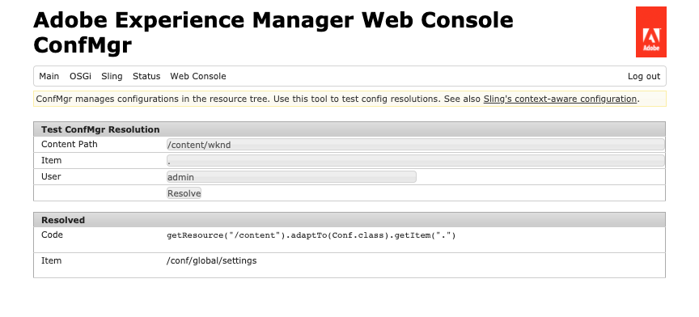

# Configurações e o navegador de configuração {#configuration-browser}

As configurações do Adobe Experience Manager (AEM) servem para gerenciar configurações no AEM e servem como espaços de trabalho.

## O que é uma configuração? {#what-is-a-configuration}

Uma configuração pode ser considerada a partir de dois pontos de vista diferentes.

* [Um administrador](#configurations-administrator) O usa configurações como espaços de trabalho dentro do AEM para definir e gerenciar grupos de configurações.
* [Um desenvolvedor](#configurations-developer) O usa o mecanismo de configuração subjacente que implementa as configurações para persistir e pesquisar configurações no AEM.

Em resumo: do ponto de vista de um administrador, as configurações são a forma como você cria espaços de trabalho para gerenciar configurações no AEM, enquanto o desenvolvedor deve entender como o AEM usa e gerencia essas configurações no repositório.

Independentemente da sua perspectiva, as configurações atendem a dois objetivos principais no AEM:

* As configurações ativam determinados recursos para determinados grupos de usuários.
* As configurações definem direitos de acesso para esses recursos.

## Configurações como administrador {#configurations-administrator}

O administrador e os autores do AEM podem considerar as configurações como espaços de trabalho. Esses espaços de trabalho podem ser usados para coletar grupos de configurações e seu conteúdo associado para fins organizacionais, implementando direitos de acesso para esses recursos.

Configurações podem ser criadas para vários recursos diferentes dentro do AEM.

* [Segmentos do Context Hub](/help/sites-cloud/authoring/personalization/contexthub-segmentation.md)
* [Modelos de fragmentos do conteúdo](/help/sites-cloud/administering/content-fragments/content-fragment-models.md)
* [Modelos editáveis](/help/sites-cloud/authoring/sites-console/templates.md)
* várias configurações de nuvem

### Exemplo {#administrator-example}

Por exemplo, um administrador pode criar duas configurações para Modelos editáveis.

* WKND-Geral
* WKND-Magazine

O administrador pode criar modelos de página gerais usando a configuração geral da WKND e, em seguida, modelos específicos para a revista em WKND-Magazine.

O administrador pode então associar o WKND-General a todo o conteúdo do site WKND. No entanto, a configuração WKND-Magazine seria associada somente ao site do periódico.

Ao fazer isso:

* Quando um autor de conteúdo cria uma página para a revista, ele pode escolher entre modelos gerais (WKND-Geral) ou modelos de revista (WKND-Revista).
* Quando um autor de conteúdo cria uma página para outra parte do site que não é a revista, ele só pode escolher entre os modelos gerais (WKND-Geral).

Configurações semelhantes são possíveis não apenas para modelos editáveis, mas também para configurações em nuvem, segmentos do ContextHub e modelos de fragmento de conteúdo.

### Usar o navegador de configuração {#using-configuration-browser}

O Navegador de configuração permite que um administrador crie, gerencie e configure facilmente direitos de acesso a configurações no AEM.

>[!NOTE]
>
>Somente é possível criar configurações usando o Navegador de configuração se o usuário tiver `admin` direitos. Tais `admin` Os direitos de também são necessários para atribuir direitos de acesso à configuração ou modificar uma configuração de outra forma.

#### Criação de uma configuração {#creating-a-configuration}

É simples criar uma configuração no AEM usando o Navegador de configuração.

1. Faça logon no AEM as a Cloud Service e, no menu principal, selecione **Ferramentas** > **Geral** > **Navegador de configuração**.
1. Selecione **Criar**.
1. Forneça um **Título** e um **Nome** para sua configuração.

   

   * O **Título** deve ser descritivo.
   * O **Nome** se tornará o nome do nó no repositório.
      * Ele é gerado automaticamente com base no título e ajustado de acordo com [Convenções de nomenclatura do AEM.](naming-conventions.md)
      * Ele pode ser ajustado, se necessário.
1. Verifique o tipo de configurações que deseja permitir.
   * [Segmentos do Context Hub](/help/sites-cloud/authoring/personalization/contexthub-segmentation.md)
   * [Modelos de fragmentos do conteúdo](/help/sites-cloud/administering/content-fragments/content-fragment-models.md)
   * [Modelos editáveis](/help/sites-cloud/authoring/sites-console/templates.md)
   * várias configurações de nuvem
1. Selecione **Criar**.

>[!TIP]
>
>As configurações podem ser aninhadas.

#### Edição de configurações e seus direitos de acesso {#access-rights}

Se você pensar nas configurações como espaços de trabalho, os direitos de acesso poderão ser definidos nessas configurações para impor quem pode ou não acessar esses espaços de trabalho.

1. Faça logon no AEM as a Cloud Service e, no menu principal, selecione **Ferramentas** > **Geral** > **Navegador de configuração**.
1. Selecione a configuração que deseja editar e selecione **Propriedades** na barra de ferramentas.
1. Selecione os recursos adicionais que deseja adicionar à configuração.

   >[!NOTE]
   >
   >Não é possível desmarcar um recurso depois que a configuração é criada.

1. Use o **Permissões eficazes** botão para visualizar uma matriz de funções e quais permissões estão concedidas atualmente às configurações.
   
1. Para atribuir novas permissões, digite o nome do usuário ou do grupo na caixa **Selecionar usuário ou grupo** no campo **Adicionar novas permissões** seção.
   * A variável  **Selecionar usuário ou grupo** O campo oferece preenchimento automático com base nos usuários e funções existentes.
1. Selecione o usuário ou a função apropriada nos resultados de preenchimento automático.
   * É possível selecionar mais de um usuário ou função.
1. Verifique as opções de acesso que um ou mais usuários ou funções selecionados devem ter e clique em **Adicionar**.
   
1. Repita as etapas para poder selecionar usuários ou funções e atribuir direitos de acesso adicionais conforme necessário.
1. Selecionar **Salvar e fechar** quando terminar.

## Configurações como desenvolvedor {#configurations-developer}

Como desenvolvedor, é importante saber como o AEM as a Cloud Service funciona com configurações e como ele processa a resolução de configurações.

### Separação de configuração e conteúdo {#separation-of-config-and-content}

Embora a [o administrador e os usuários podem considerar as configurações como locais de trabalho](#configurations-administrator) para gerenciar diferentes configurações e conteúdo, é importante entender que as configurações e o conteúdo são armazenados e gerenciados separadamente pelo AEM no repositório.

* `/content` é o lar de todo o conteúdo.
* `/conf` O é o lar de todas as configurações.

O conteúdo faz referência à sua configuração associada por meio de um `cq:conf` propriedade. O AEM faz uma pesquisa com base no conteúdo e em seu contexto `cq:conf` para encontrar a configuração apropriada.

### Exemplo {#developer-example}

Neste exemplo, vamos supor que você tenha algum código de aplicativo interessado nas configurações do DAM.

```java
Conf conf = resource.adaptTo(Conf.class);
ValueMap imageServerSettings = conf.getItem("dam/imageserver");
String bgkcolor = imageServerSettings.get("bgkcolor", "FFFFFF");
```

O ponto inicial de toda a pesquisa de configuração é um recurso de conteúdo em algum lugar em `/content`. Pode ser uma página, um componente dentro de uma página, um ativo ou uma pasta DAM. Este é o conteúdo real para o qual você está procurando a configuração correta que se aplica neste contexto.

Agora com o `Conf` objeto em mãos, você pode recuperar o item de configuração específico em que está interessado. No caso em apreço, `dam/imageserver`, que é uma coleção de configurações relacionadas à `imageserver`. A variável `getItem` a chamada retorna um `ValueMap`. Então, você lê um `bgkcolor` e forneça um valor padrão de &quot;FFFFFF&quot; caso a propriedade (ou o item de configuração inteiro) não esteja presente.

Agora vamos observar o conteúdo JCR correspondente:

```text
/content/dam/wknd
    + jcr:content
      - cq:conf = "/conf/wknd"
    + image.png [dam:Asset]

/conf/wknd
    + settings
      + dam
        + imageserver [cq:Page]
          + jcr:content
            - bgkcolor = "FF0000"
```

Neste exemplo, você pode assumir uma pasta DAM específica do WKND aqui e uma configuração correspondente. Iniciando nessa pasta `/content/dam/wknd`, você pode ver que há uma propriedade de string chamada `cq:conf` que faz referência à configuração que se aplica à subárvore. A propriedade é definida no campo `jcr:content` de uma pasta ou página de ativos. Esses `conf` Os links são explícitos, portanto, é fácil segui-los apenas observando o conteúdo no CRXDE.

Pulando para dentro `/conf`, siga a referência e verifique se há uma `/conf/wknd` nó. Esta é uma configuração. Sua pesquisa é transparente para o código do aplicativo. O código de exemplo nunca tem uma referência dedicada a ele, ele está oculto atrás do `Conf` objeto. A configuração que se aplica é controlada por meio do conteúdo JCR.

Você pode ver que a configuração contém uma variável com nome fixo `settings` nó que contém os itens reais, incluindo o `dam/imageserver` você precisa neste caso. Esse item pode ser considerado um &quot;documento de configurações&quot; e é representado por um `cq:Page` incluindo um `jcr:content` retenção do conteúdo real.

Finalmente, você vê a propriedade `bgkcolor` que este código de amostra precisa. A variável `ValueMap` você retorna de `getItem` é baseado no da página `jcr:content` nó.

### Resolução da configuração {#configuration-resolution}

O exemplo básico acima mostrava uma única configuração. Mas há muitos casos em que você deseja ter configurações diferentes, como uma configuração global padrão, uma diferente para cada marca e talvez uma específica para seus subprojetos.

Para oferecer suporte a isso na pesquisa de configuração, o AEM tem um mecanismo de herança e fallback na seguinte ordem de preferência:

1. `/conf/<siteconfig>/<parentconfig>/<myconfig>`
   * Configuração específica referenciada de `cq:conf` em algum lugar em `/content`
   * A hierarquia é arbitrária e pode ser projetada exatamente como a estrutura do site, não é o negócio do código do aplicativo saber isso
   * Alterável no tempo de execução por usuários com privilégios de configuração
1. `/conf/<siteconfig>/<parentconfig>`
   * Percorrer pais para configurações de fallback
   * Alterável no tempo de execução por usuários com privilégios de configuração
1. `/conf/<siteconfig>`
   * Percorrer pais para configurações de fallback
   * Alterável no tempo de execução por usuários com privilégios de configuração
1. `/conf/global`
   * Configurações globais do sistema
   * Padrões globais para sua instalação
   * Definido por um `admin` função
   * Alterável no tempo de execução por usuários com privilégios de configuração
1. `/apps`
   * Padrões do aplicativo
   * Corrigido na implantação do aplicativo
   * Somente leitura em tempo de execução
1. `/libs`
   * Padrões de produto para AEM
   * Alterável somente pelo Adobe, acesso ao projeto não permitido
   * Corrigido na implantação do aplicativo
   * Somente leitura em tempo de execução

### Usar configurações {#using-configurations}

As configurações no AEM são baseadas em configurações sensíveis ao contexto do Sling. Os pacotes Sling fornecem uma API de serviço que pode ser usada para obter configurações sensíveis ao contexto. As configurações sensíveis ao contexto são configurações relacionadas a um recurso de conteúdo ou a uma árvore de recursos como foi [descrito no exemplo anterior](#developer-example).

Para obter mais detalhes sobre configurações sensíveis ao contexto, exemplos e como usá-las, consulte a [Documentação do Sling.](https://sling.apache.org/documentation/bundles/context-aware-configuration/context-aware-configuration.html).

### Console da Web do ConfMgr {#confmgr-web-console}

Para fins de depuração e teste, há uma **ConfMgr** console da web em `https://<host>:<port>/system/console/conf`, que pode mostrar configurações para um determinado caminho/item.



Basta fornecer:

* **Caminho do conteúdo**
* **Item**
* **Usuário**

Clique em **Resolver** assim, você pode ver quais configurações são resolvidas e obter amostras de código que ajudam a resolver essas configurações.

### Console da Web de configuração com reconhecimento de contexto {#context-aware-web-console}

Para fins de depuração e teste, há uma **Configuração sensível ao contexto** console da web em `https://<host>:<port>/system/console/slingcaconfig`, que permite consultar configurações sensíveis ao contexto no repositório e visualizar suas propriedades.


Basta fornecer:

* **Caminho do conteúdo**
* **Nome da configuração**

Clique em **Resolver** para que você possa recuperar os caminhos de contexto associados e as propriedades da configuração selecionada.
