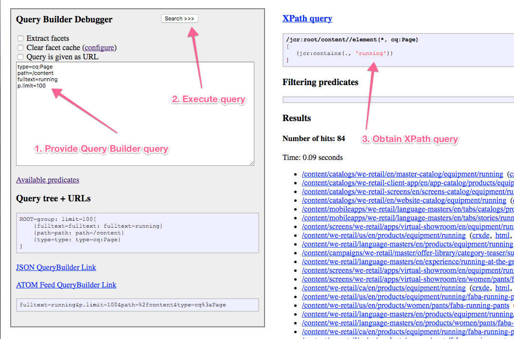

# API do Construtor de consulta {#query-builder-api}

O Construtor de consultas oferece uma maneira fácil de consultar o repositório de conteúdo do AEM. A funcionalidade é exposta por meio de uma API Java™ e uma API REST. Este documento descreve essas APIs.

O construtor de consultas do lado do servidor ([`QueryBuilder`](https://developer.adobe.com/experience-manager/reference-materials/cloud-service/javadoc/com/day/cq/search/QueryBuilder.html)) aceita uma descrição de consulta, cria e executa uma consulta XPath, filtra opcionalmente o conjunto de resultados e também extrai facetas, se desejado.

A descrição da consulta é simplesmente um conjunto de predicados ([`Predicate`](https://developer.adobe.com/experience-manager/reference-materials/cloud-service/javadoc/com/day/cq/search/Predicate.html)). Os exemplos incluem um predicado de texto completo, que corresponde à função `jcr:contains()` no XPath.

Para cada tipo de predicado, há um componente avaliador ([`PredicateEvaluator`](https://developer.adobe.com/experience-manager/reference-materials/cloud-service/javadoc/com/day/cq/search/eval/PredicateEvaluator.html)) que sabe como lidar com esse predicado específico para XPath, filtragem e extração de facetas. É fácil criar avaliadores personalizados, que são conectados por meio do tempo de execução do componente OSGi.

A API REST fornece acesso aos mesmos recursos por meio do HTTP, com respostas sendo enviadas em JSON.

>[!NOTE]
>
>A API do QueryBuilder é criada usando a API JCR. Você também pode consultar o JCR do AEM usando a API JCR de um pacote OSGi. Para obter informações, consulte [Consulta de dados do Adobe Experience Manager usando a API JCR](https://experienceleague.adobe.com/docs/experience-manager-65/developing/platform/query-builder/querybuilder-api.html?lang=pt-BR).

## Sessão Gem {#gem-session}

[AEM Gems](https://experienceleague.adobe.com/docs/events/experience-manager-gems-recordings/overview.html?lang=pt-BR) é uma série de aprofundamentos técnicos fornecidos por especialistas da Adobe Experience Manager Adobe.

Você pode [revisar a sessão dedicada ao construtor de consultas](https://experienceleague.adobe.com/docs/events/experience-manager-gems-recordings/gems2017/aem-search-forms-using-querybuilder.html?lang=pt-BR) para obter uma visão geral e usar a ferramenta.

## Exemplos de consulta {#sample-queries}

Essas amostras são fornecidas na notação de estilo das propriedades do Java™. Para usá-los com a API Java™, use um Java™ `HashMap` como na amostra de API a seguir.

Para o Servlet JSON `QueryBuilder`, cada exemplo inclui um link de amostra para uma instalação do AEM (no local padrão, `http://<host>:<port>`). Faça logon na instância do AEM antes de usar esses links.

>[!CAUTION]
>
>Por padrão, o servlet JSON do construtor de consultas exibe no máximo dez ocorrências.
>
>Adicionar o seguinte parâmetro permite que o servlet exiba todos os resultados da consulta:
>
>`p.limit=-1`

>[!NOTE]
>
>Para visualizar os dados JSON retornados em seu navegador, você pode usar um plug-in, como o JSONView para Firefox.

### Retornando Todos os Resultados {#returning-all-results}

A consulta a seguir **retorna dez resultados** (ou, para ser mais preciso, no máximo dez), mas informa o **Número de ocorrências:** que estão disponíveis:

`http://<host>:<port>/bin/querybuilder.json?path=/content&1_property=sling:resourceType&1_property.value=wknd/components/structure/page&1_property.operation=like&orderby=path`

```xml
path=/content
1_property=sling:resourceType
1_property.value=wknd/components/structure/page
1_property.operation=like
orderby=path
```

A mesma consulta (com o parâmetro `p.limit=-1`) **retorna todos os resultados** (pode ser um número alto dependendo da sua instância):

`http://<host>:<port>/bin/querybuilder.json?path=/content&1_property=sling:resourceType&1_property.value=wknd/components/structure/page&1_property.operation=like&orderby=path&p.limit=-1`

```xml
path=/content
1_property=sling:resourceType
1_property.value=wknd/components/structure/page
1_property.operation=like
p.limit=-1
orderby=path
```

### Utilização de p.guessTotal para retornar os resultados {#using-p-guesstotal-to-return-the-results}

A finalidade do parâmetro `p.guessTotal` é retornar o número apropriado de resultados que podem ser mostrados combinando os valores mínimos viáveis de `p.offset` e `p.limit`. A vantagem de usar esse parâmetro é o melhor desempenho com conjuntos de resultados grandes. Esse parâmetro também evita calcular o total completo (por exemplo, chamar `result.getSize()`) e ler todo o conjunto de resultados, otimizado até o mecanismo e índice do Oak. Esse processo pode ser uma diferença significativa quando há centenas de milhares de resultados, tanto em tempo de execução quanto em uso de memória.

A desvantagem do parâmetro é que os usuários não veem o total exato. Mas você pode definir um número mínimo como `p.guessTotal=1000`, de modo que a leitura sempre seja de até 1000. Dessa forma, você obtém os totais exatos para conjuntos de resultados menores, mas se for maior, você só poderá mostrar &quot;e mais&quot;.

Adicione `p.guessTotal=true` à consulta abaixo para ver como funciona:

`http://<host>:<port>/bin/querybuilder.json?path=/content&1_property=sling:resourceType&1_property.value=wknd/components/structure/page&1_property.operation=like&p.guessTotal=true&orderby=path`

```xml
path=/content
1_property=sling:resourceType
1_property.value=wknd/components/structure/page
1_property.operation=like
p.guessTotal=true
orderby=path
```

A consulta retorna o padrão `p.limit` de `10` resultados com um deslocamento `0`:

```xml
"success": true,
"results": 10,
"total": 10,
"more": true,
"offset": 0,
```

Você também pode usar um valor numérico para contar até um número personalizado de resultados máximos. Use a mesma consulta acima, mas altere o valor de `p.guessTotal` para `50`:

`http://<host>:<port>/bin/querybuilder.json?path=/content&1_property=sling:resourceType&1_property.value=wknd/components/structure/page&1_property.operation=like&p.guessTotal=50&orderby=path`

Ele retorna um número com o mesmo limite padrão de 10 resultados com um deslocamento 0, mas exibe apenas um máximo de 50 resultados:

```xml
"success": true,
"results": 10,
"total": 50,
"more": true,
"offset": 0,
```

### Implementar paginação {#implementing-pagination}

Por padrão, o Query Builder também forneceria o número de ocorrências. Dependendo do tamanho do resultado, esse número pode levar muito tempo, pois a determinação da contagem precisa envolve a verificação de cada resultado por controle de acesso. Geralmente, o total é usado para implementar a paginação para a interface do usuário final. Como a determinação da contagem exata pode ser lenta, é recomendável usar o recurso guessTotal para implementar a paginação.

Por exemplo, a interface pode adaptar a seguinte abordagem:

* Obter e exibir a contagem precisa do número total de ocorrências ([SearchResult.getTotalMatches()](https://developer.adobe.com/experience-manager/reference-materials/cloud-service/javadoc/com/day/cq/search/result/SearchResult.html#getTotalMatches) ou total na resposta `querybuilder.json`) é menor que ou igual a 100;
* Defina `guessTotal` como 100 chamando o Construtor de Consultas.

* A resposta pode ter o seguinte resultado:

   * `total=43`, `more=false` - Indica que o número total de ocorrências é 43. A interface do usuário pode mostrar até dez resultados como parte da primeira página e fornecer paginação para as próximas três páginas. Você também pode usar essa implementação para exibir um texto descritivo como **&quot;43 resultados encontrados&quot;**.
   * `total=100`, `more=true` - Indica que o número total de ocorrências é maior que 100 e que a contagem exata não é conhecida. A interface do usuário pode exibir até dez como parte da primeira página e fornecer paginação para as próximas dez páginas. Você também pode usar este recurso para exibir um texto como **&quot;mais de 100 resultados encontrados&quot;**. Conforme o usuário vai para as próximas páginas, as chamadas feitas para o Construtor de Consultas aumentariam o limite de `guessTotal` e também dos parâmetros `offset` e `limit`.

Além disso, use `guessTotal` nos casos em que a interface do usuário deve usar rolagem infinita para evitar que o Construtor de consultas determine a contagem exata de ocorrências.

### Localizar arquivos jar e ordená-los, os mais recentes primeiro {#find-jar-files-and-order-them-newest-first}

`http://<host>:<port>/bin/querybuilder.json?type=nt:file&nodename=*.jar&orderby=@jcr:content/jcr:lastModified&orderby.sort=desc`

```xml
type=nt:file
nodename=*.jar
orderby=@jcr:content/jcr:lastModified
orderby.sort=desc
```

### Localizar todas as páginas e ordená-las pela última modificação {#find-all-pages-and-order-them-by-last-modified}

`http://<host>:<port>/bin/querybuilder.json?type=cq:Page&orderby=@jcr:content/cq:lastModified`

```xml
type=cq:Page
orderby=@jcr:content/cq:lastModified
```

### Localizar todas as páginas e ordená-las por Última modificação, em ordem decrescente {#find-all-pages-and-order-them-by-last-modified-but-descending}

`http://<host>:<port>/bin/querybuilder.json?type=cq:Page&orderby=@jcr:content/cq:lastModified&orderby.sort=desc`

```xml
type=cq:Page
orderby=@jcr:content/cq:lastModified
orderby.sort=desc
```

### Pesquisa de texto completo, ordenada por pontuação {#fulltext-search-ordered-by-score}

`http://<host>:<port>/bin/querybuilder.json?fulltext=Management&orderby=@jcr:score&orderby.sort=desc`

```xml
fulltext=Management
orderby=@jcr:score
orderby.sort=desc
```

### Pesquisar páginas com uma determinada tag {#search-for-pages-tagged-with-a-certain-tag}

`http://<host>:<port>/bin/querybuilder.json?type=cq:Page&tagid=wknd:activity/cycling&tagid.property=jcr:content/cq:tags`

```xml
type=cq:Page
tagid=wknd:activity/cycling
tagid.property=jcr:content/cq:tags
```

Use o predicado `tagid` como no exemplo, se você souber a ID de tag explícita.

Use o predicado `tag` para o caminho do título da marca (sem espaços).

No exemplo anterior, como você está procurando páginas (`cq:Page` nós), use o caminho relativo desse nó para o predicado `tagid.property`, que é `jcr:content/cq:tags`. Por padrão, o `tagid.property` seria `cq:tags`.

### Pesquisar vários caminhos (usando grupos) {#search-under-multiple-paths-using-groups}

`http://<host>:<port>/bin/querybuilder.json?fulltext=Experience&group.1_path=/content/wknd/us/en/magazine&group.2_path=/content/wknd/us/en/adventures&group.p.or=true`

```xml
fulltext=Experience
group.p.or=true
group.1_path=/content/wknd/us/en/magazine
group.2_path=/content/wknd/us/en/adventures
```

Esta consulta usa um *grupo* (chamado `group`), que atua para delimitar subexpressões dentro de uma consulta, da mesma forma que os parênteses fazem em notações mais padrão. Por exemplo, a consulta anterior pode ser expressa em um estilo mais familiar como:

`"Experience" and ("/content/wknd/us/en/magazine" or "/content/wknd/us/en/adventures")`

Dentro do grupo no exemplo, o predicado `path` é usado várias vezes. Para diferenciar e ordenar as duas instâncias do predicado (a ordenação é necessária para alguns predicados), você deve prefixar os predicados com `N_`, onde `N` é o índice de ordenação. No exemplo anterior, os predicados resultantes são `1_path` e `2_path`.

O `p` em `p.or` é um delimitador especial que indica que o seguinte (neste caso, um `or`) é um *parâmetro* do grupo, ao contrário de um subpredicado do grupo, como `1_path`.

Se nenhum `p.or` for fornecido, todos os predicados serão ANDed juntos, ou seja, cada resultado deve satisfazer todos os predicados.

>[!NOTE]
>
>Não é possível usar o mesmo prefixo numérico em uma única consulta, mesmo para predicados diferentes.

### Pesquisar propriedades {#search-for-properties}

Aqui você está procurando todas as páginas de um determinado modelo, usando a propriedade `cq:template`:

`http://<host>:<port>/bin/querybuilder.json?property=cq%3atemplate&property.value=%2fconf%2fwknd%2fsettings%2fwcm%2ftemplates%2fadventure-page-template&type=cq%3aPageContent`

```xml
type=cq:PageContent
property=cq:template
property.value=/conf/wknd/settings/wcm/templates/adventure-page-template
```

A desvantagem é que os nós `jcr:content` das páginas, não as próprias páginas, são retornados. Para resolver esse problema, você pode pesquisar por caminho relativo:

`http://<host>:<port>/bin/querybuilder.json?property=jcr%3acontent%2fcq%3atemplate&property.value=%2fconf%2fwknd%2fsettings%2fwcm%2ftemplates%2fadventure-page-template&type=cq%3aPage`

```xml
type=cq:Page
property=jcr:content/cq:template
property.value=/conf/wknd/settings/wcm/templates/adventure-page-template
```

### Pesquisar por várias propriedades {#search-for-multiple-properties}

Ao usar o predicado da propriedade várias vezes, é necessário adicionar os prefixos de número novamente:

`http://<host>:<port>/bin/querybuilder.json?1_property=jcr%3acontent%2fcq%3atemplate&1_property.value=%2fconf%2fwknd%2fsettings%2fwcm%2ftemplates%2fadventure-page-template&2_property=jcr%3acontent%2fjcr%3atitle&2_property.value=Cycling%20Tuscany&type=cq%3aPage`

```xml
type=cq:Page
1_property=jcr:content/cq:template
1_property.value=/conf/wknd/settings/wcm/templates/adventure-page-template
2_property=jcr:content/jcr:title
2_property.value=Cycling Tuscany
```

### Procurar Vários Valores de Propriedade {#search-for-multiple-property-values}

Para evitar grupos grandes quando quiser pesquisar vários valores de uma propriedade (`"A" or "B" or "C"`), você pode fornecer vários valores ao predicado `property`:

`http://<host>:<port>/bin/querybuilder.json?property=jcr%3atitle&property.1_value=Cycling%20Tuscany&property.2_value=Ski%20Touring&property.3_value=Whistler%20Mountain%20Biking`

```xml
property=jcr:title
property.1_value=Cycling Tuscany
property.2_value=Ski Touring
property.3_value=Whistler Mountain Biking
```

Para propriedades de vários valores, você também pode exigir que vários valores correspondam a (`"A" and "B" and "C"`):

`http://<host>:<port>/bin/querybuilder.json?property=jcr%3atitle&property.and=true&property.1_value=Cycling%20Tuscany&property.2_value=Ski%20Touring&property.3_value=Whistler%20Mountain%20Biking`

```xml
property=jcr:title
property.and=true
property.1_value=Cycling Tuscany
property.2_value=Ski Touring
property.3_value=Whistler Mountain Biking
```

## Refinando o que é Retornado {#refining-what-is-returned}

Por padrão, o Servlet JSON do QueryBuilder retorna um conjunto padrão de propriedades para cada nó no resultado da pesquisa (por exemplo, caminho, nome e título). Para obter controle sobre quais propriedades são retornadas, você pode executar um dos seguintes procedimentos:

Especificar

```xml
p.hits=full
```

Nesse caso, todas as propriedades são incluídas para cada nó:

`http://<host>:<port>/bin/querybuilder.json?p.hits=full&property=jcr%3atitle&property.value=Cycling%20Tuscany`

```xml
property=jcr:title
property.value=Cycling Tuscany
p.hits=full
```

Utilização

```xml
p.hits=selective
```

E especifique as propriedades que deseja obter em

```xml
p.properties
```

Separado por um espaço:

`http://<host>:<port>/bin/querybuilder.json?p.hits=selective&p.properties=sling%3aresourceType%20jcr%3aprimaryType&property=jcr%3atitle&property.value=Cycling%20Tuscany`

```xml
property=jcr:title
property.value=Cycling Tuscany
p.hits=selective
p.properties=sling:resourceType jcr:primaryType
```

Outra coisa que você pode fazer é incluir nós filhos na resposta do Construtor de consultas. Especificar

```xml
p.nodedepth=n
```

Onde `n` é o número de níveis que a consulta deve retornar. Para que um nó filho seja retornado, ele deve ser especificado pelo seletor de propriedades

```xml
p.hits=full
```

Exemplo:

`http://<host>:<port>/bin/querybuilder.json?p.hits=full&p.nodedepth=5&property=jcr%3atitle&property.value=Cycling%20Tuscany`

```xml
property=jcr:title
property.value=Cycling Tuscany
p.hits=full
p.nodedepth=5
```

## Mais predicados {#morepredicates}

Para obter mais predicados, consulte a [página Referência de predicado do Query Builder](query-builder-predicates.md).

Você também pode verificar o [Javadoc das `PredicateEvaluator` classes](https://developer.adobe.com/experience-manager/reference-materials/cloud-service/javadoc/com/day/cq/search/eval/PredicateEvaluator.html). O Javadoc dessas classes contém a lista de propriedades que podem ser usadas.

O prefixo do nome da classe (por exemplo, `similar` em [`SimilarityPredicateEvaluator`](https://developer.adobe.com/experience-manager/reference-materials/cloud-service/javadoc/com/day/cq/search/eval/SimilarityPredicateEvaluator.html)) é a *propriedade principal* da classe. Essa propriedade também é o nome do predicado a ser usado na query (em minúsculas).

Para essas propriedades principais, você pode encurtar a consulta e usar `similar=/content/en` em vez da variante totalmente qualificada `similar.similar=/content/en`. O formulário totalmente qualificado deve ser usado para todas as propriedades não principais de uma classe.

## Exemplo de uso da API do Query Builder {#example-query-builder-api-usage}

```java
   String fulltextSearchTerm = "WKND";

    // create query description as hash map (simplest way, same as form post)
    Map<String, String> map = new HashMap<String, String>();

// create query description as hash map (simplest way, same as form post)
    map.put("path", "/content");
    map.put("type", "cq:Page");
    map.put("group.p.or", "true"); // combine this group with OR
    map.put("group.1_fulltext", fulltextSearchTerm);
    map.put("group.1_fulltext.relPath", "jcr:content");
    map.put("group.2_fulltext", fulltextSearchTerm);
    map.put("group.2_fulltext.relPath", "jcr:content/@cq:tags");

    // can be done in map or with Query methods
    map.put("p.offset", "0"); // same as query.setStart(0) below
    map.put("p.limit", "20"); // same as query.setHitsPerPage(20) below

    Query query = builder.createQuery(PredicateGroup.create(map), session);
    query.setStart(0);
    query.setHitsPerPage(20);

    SearchResult result = query.getResult();

    // paging metadata
    int hitsPerPage = result.getHits().size(); // 20 (set above) or lower
    long totalMatches = result.getTotalMatches();
    long offset = result.getStartIndex();
    long numberOfPages = totalMatches / 20;

    //Place the results in XML to return to client
    DocumentBuilderFactory factory = DocumentBuilderFactory.newInstance();
    DocumentBuilder builder = factory.newDocumentBuilder();
    Document doc = builder.newDocument();

    //Start building the XML to pass back to the AEM client
    Element root = doc.createElement( "results" );
    doc.appendChild( root );

    // iterating over the results
for (Hit hit : result.getHits()) {
       String path = hit.getPath();

      //Create a result element
      Element resultel = doc.createElement( "result" );
      root.appendChild( resultel );

      Element pathel = doc.createElement( "path" );
      pathel.appendChild( doc.createTextNode(path ) );
      resultel.appendChild( pathel );
    }
```

A mesma consulta executada por HTTP usando o Servlet do Construtor de consultas (JSON):

`http://<host>:<port>/bin/querybuilder.json?path=/content&type=cq:Page&group.p.or=true&group.1_fulltext=WKND&group.1_fulltext.relPath=jcr:content&group.2_fulltext=WKND&group.2_fulltext.relPath=jcr:content/@cq:tags&p.offset=0&p.limit=20`

## Armazenamento e carregamento de consultas {#storing-and-loading-queries}

As consultas podem ser armazenadas no repositório para que você possa usá-las posteriormente. O `QueryBuilder` fornece o método `storeQuery` com a seguinte assinatura:

```java
void storeQuery(Query query, String path, boolean createFile, Session session) throws RepositoryException, IOException;
```

Ao usar o método [`QueryBuilder#storeQuery`](https://developer.adobe.com/experience-manager/reference-materials/cloud-service/javadoc/com/day/cq/search/QueryBuilder.html#storeQuery-com.day.cq.search.Query-java.lang.String-boolean-javax.jcr.Session-), o `Query` fornecido é armazenado no repositório como um arquivo ou como uma propriedade de acordo com o valor do argumento `createFile`. O exemplo a seguir mostra como salvar um `Query` no caminho `/mypath/getfiles` como um arquivo:

```java
builder.storeQuery(query, "/mypath/getfiles", true, session);
```

Qualquer consulta armazenada anteriormente pode ser carregada do repositório usando o método [`QueryBuilder#loadQuery`](https://developer.adobe.com/experience-manager/reference-materials/cloud-service/javadoc/com/day/cq/search/QueryBuilder.html#loadQuery-java.lang.String-javax.jcr.Session-):

```java
Query loadQuery(String path, Session session) throws RepositoryException, IOException
```

Por exemplo, um `Query` armazenado no caminho `/mypath/getfiles` pode ser carregado pelo seguinte trecho:

```java
Query loadedQuery = builder.loadQuery("/mypath/getfiles", session);
```

## Teste e depuração {#testing-and-debugging}

Para reproduzir e depurar consultas do Construtor de consultas, você pode usar o console do Depurador do Construtor de consultas em

`http://<host>:<port>/libs/cq/search/content/querydebug.html`

Ou, como alternativa, o servlet JSON do Construtor de consultas em

`http://<host>:<port>/bin/querybuilder.json?path=/tmp`

O `path=/tmp` é apenas um exemplo.

### Recomendações gerais de depuração {#general-debugging-recommendations}

### Obter XPath explicável por meio de registro {#obtain-explain-able-xpath-via-logging}

Explicar **todas** as consultas durante o ciclo de desenvolvimento em relação ao conjunto de índices de destino.

1. Habilitar logs DEBUG para o QueryBuilder a fim de obter consulta XPath subjacente e explicável
   * Navegue até `https://<host>:<port>/system/console/slinglog`. Criar um agente de log para `com.day.cq.search.impl.builder.QueryImpl` em **DEBUG**.
1. Depois que DEBUG é ativado para a classe acima, os logs exibem o XPath gerado pelo Construtor de consultas.
1. Copie a consulta XPath da entrada de log da consulta associada do Construtor de Consultas. Por exemplo:
   * `com.day.cq.search.impl.builder.QueryImpl XPath query: /jcr:root/content//element(*, cq:Page)[(jcr:contains(jcr:content, "WKND") or jcr:contains(jcr:content/@cq:tags, "WKND"))]`
1. Cole a consulta XPath na Explicar consulta como XPath para que você possa obter o plano de consulta.

### Obter XPath explicável por meio do depurador do construtor de consultas {#obtain-explain-able-xpath-via-the-query-builder-debugger}

Use o depurador do Construtor de consultas do AEM para gerar uma consulta XPath explicável.



1. Fornecer a consulta do Construtor de consultas no Depurador do Construtor de consultas
1. Executar a pesquisa
1. Obter o XPath gerado
1. Cole a consulta XPath na Explicar consulta como XPath para que você possa obter o plano de consulta

>[!NOTE]
>
>Consultas que não sejam do Construtor de consultas (XPath, JCR-SQL2) podem ser fornecidas diretamente para Explicar consulta.

## Depuração de consultas com registro {#debugging-queries-with-logging}

>[!NOTE]
>
>A configuração dos agentes de log está descrita no documento [Logging](/help/implementing/developing/introduction/logging.md).

A saída de log (nível INFO) da implementação do construtor de consultas ao executar a consulta descrita na seção anterior [Teste e Depuração](#testing-and-debugging)

```xml
com.day.cq.search.impl.builder.QueryImpl executing query (predicate tree):
null=group: limit=20, offset=0[
    {group=group: or=true[
        {1_fulltext=fulltext: fulltext=WKND, relPath=jcr:content}
        {2_fulltext=fulltext: fulltext=WKND, relPath=jcr:content/@cq:tags}
    ]}
    {path=path: path=/content}
    {type=type: type=cq:Page}
]
com.day.cq.search.impl.builder.QueryImpl XPath query: /jcr:root/content//element(*, cq:Page)[(jcr:contains(jcr:content, "WKND") or jcr:contains(jcr:content/@cq:tags, "WKND"))]
com.day.cq.search.impl.builder.QueryImpl no filtering predicates
com.day.cq.search.impl.builder.QueryImpl query execution took 69 ms
```

Se você tiver uma consulta usando avaliadores de predicado que filtram ou que usam uma ordem personalizada por comparador, ela será anotada na consulta:

```xml
com.day.cq.search.impl.builder.QueryImpl executing query (predicate tree):
null=group: [
    {nodename=nodename: nodename=*.jar}
    {orderby=orderby: orderby=@jcr:content/jcr:lastModified}
    {type=type: type=nt:file}
]
com.day.cq.search.impl.builder.QueryImpl custom order by comparator: jcr:content/jcr:lastModified
com.day.cq.search.impl.builder.QueryImpl XPath query: //element(*, nt:file)
com.day.cq.search.impl.builder.QueryImpl filtering predicates: {nodename=nodename: nodename=*.jar}
com.day.cq.search.impl.builder.QueryImpl query execution took 272 ms
```

## Links Javadoc {#javadoc-links}

| **Javadoc** | **Descrição** |
|---|---|
| [com.day.cq.search](https://developer.adobe.com/experience-manager/reference-materials/cloud-service/javadoc/com/day/cq/search/package-summary.html) | Construtor básico de consultas e API de consulta |
| [com.day.cq.search.result](https://developer.adobe.com/experience-manager/reference-materials/cloud-service/javadoc/com/day/cq/search/result/package-summary.html) | API de resultado |
| [com.day.cq.search.facets](https://developer.adobe.com/experience-manager/reference-materials/cloud-service/javadoc/com/day/cq/search/facets/package-summary.html) | Facetas |
| [com.day.cq.search.facets.buckets](https://developer.adobe.com/experience-manager/reference-materials/cloud-service/javadoc/com/day/cq/search/facets/buckets/package-summary.html) | Compartimentos (contidos nas facetas) |
| [com.day.cq.search.eval](https://developer.adobe.com/experience-manager/reference-materials/cloud-service/javadoc/com/day/cq/search/eval/package-summary.html) | Avaliadores de predicado |
| [com.day.cq.search.facets.extractors](https://developer.adobe.com/experience-manager/reference-materials/cloud-service/javadoc/com/day/cq/search/facets/extractors/package-summary.html) | Extratores de facetas (para avaliadores) |
| [com.day.cq.search.writer](https://developer.adobe.com/experience-manager/reference-materials/cloud-service/javadoc/com/day/cq/search/writer/package-summary.html) | Gravador de Ocorrência de Resultado JSON para servlet do Construtor de Consultas (`/bin/querybuilder.json`) |
