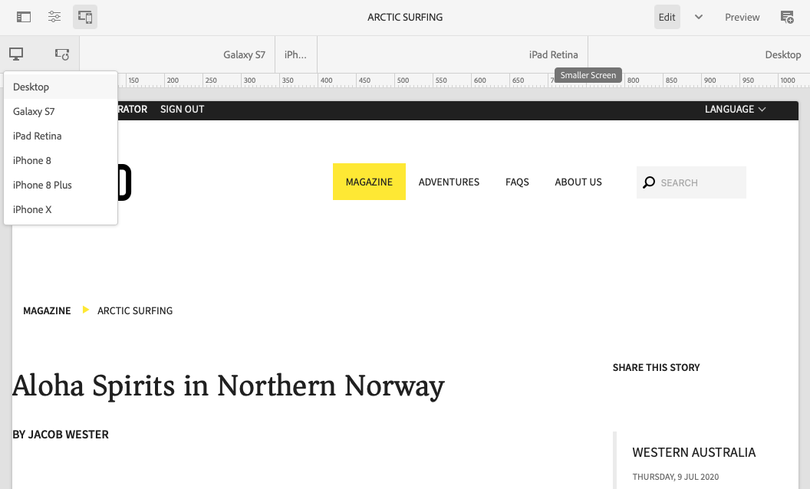

# Design responsivo {#responsive-design}

Projete suas experiências para que elas se adaptem à janela de visualização do cliente em que são exibidas. Com um design responsivo, as mesmas páginas podem ser exibidas efetivamente em vários dispositivos em ambas as orientações. A imagem a seguir demonstra algumas maneiras pelas quais uma página pode responder às alterações no tamanho da janela de visualização:

* Layout: use layouts de coluna única para visores menores e layouts de várias colunas para visores maiores.
* Tamanho do texto: use um tamanho de texto maior (quando apropriado, como cabeçalhos) em visores maiores.
* Conteúdo: inclua apenas o conteúdo mais importante ao exibir em dispositivos menores.
* Navegação: ferramentas específicas de dispositivos são fornecidas para acessar outras páginas.
* Imagens: exibe representações de imagens apropriadas para a janela de visualização do cliente de acordo com as dimensões da janela.


Desenvolva aplicativos Adobe Experience Manager (AEM) que geram HTML5 que se adapta a vários tamanhos de janela e orientações. Por exemplo, os seguintes intervalos de larguras de visor correspondem a vários tipos e orientações de dispositivo

* Largura máxima de 480 pixels (telefone, retrato)
* Largura máxima de 767 pixels (telefone, paisagem)
* Largura entre 768 pixels e 979 pixels (tablet, retrato)
* Largura entre 980 pixels e 1199 pixels (tablet, paisagem)
* Largura de 1200 px ou superior (desktop)

Consulte os seguintes tópicos para obter informações sobre como implementar um comportamento de design responsivo:

* [Consultas de mídia](#using-media-queries)
* [Grades fluídas](#developing-a-fluid-grid)
* [Imagens adaptáveis](#using-adaptive-images)

Conforme você projeta, use o **Emulador** barra de ferramentas para visualizar as páginas de vários tamanhos de tela.

## Antes de desenvolver {#before-you-develop}

Antes de desenvolver o aplicativo AEM compatível com suas páginas da Web, várias decisões de design devem ser tomadas. Por exemplo, você precisa ter as seguintes informações:

* Os dispositivos que você está direcionando
* Os tamanhos das janelas de visualização de destino
* Os layouts de página para cada tamanho de visor direcionado

### Estrutura do aplicativo {#application-structure}

A estrutura típica do aplicativo AEM é compatível com todas as implementações de design responsivas:

* Os componentes da página residem abaixo `/apps/<application_name>/components`
* Os modelos ficam abaixo `/apps/<application_name>/templates`

## Uso de consultas de mídia {#using-media-queries}

As consultas de mídia permitem o uso seletivo de estilos CSS para renderização da página. As ferramentas e os recursos de desenvolvimento do AEM permitem que você implemente de forma eficaz e eficiente as consultas de mídia em seus aplicativos.

O grupo W3C fornece a [Consultas de mídia](https://www.w3.org/TR/css3-mediaqueries/) recomendação que descreve esse recurso CSS3 e a sintaxe.

### Criação do arquivo CSS {#creating-the-css-file}

No arquivo CSS, defina consultas de mídia com base nas propriedades dos dispositivos que você está direcionando. A seguinte estratégia de implementação é eficaz para gerenciar estilos para cada consulta de mídia:

* Use um [Pasta Biblioteca do cliente](clientlibs.md) para definir o CSS que é montado quando a página é renderizada.
* Defina cada consulta de mídia e os estilos associados em arquivos CSS separados. É útil usar nomes de arquivo que representem os recursos do dispositivo da query de mídia.
* Defina estilos comuns a todos os dispositivos em um arquivo CSS separado.
* No arquivo css.txt da pasta Biblioteca do cliente, ordene os arquivos CSS da lista conforme necessário no arquivo CSS montado.

A variável [Tutorial WKND](develop-wknd-tutorial.md) O usa essa estratégia para definir estilos no design do site. O arquivo CSS usado pela WKND está localizado em `/apps/wknd/clientlibs/clientlib-grid/less/grid.less`.

### Uso de consultas de mídia com páginas AEM {#using-media-queries-with-aem-pages}

[O projeto de amostra WKND](/help/implementing/developing/introduction/develop-wknd-tutorial.md) e [Arquétipo de projeto AEM](https://experienceleague.adobe.com/docs/experience-manager-core-components/using/developing/archetype/overview.html?lang=pt-BR) use o [Componente principal de página,](https://experienceleague.adobe.com/docs/experience-manager-core-components/using/wcm-components/page.html) que inclui clientlibs por meio da política da página.

Se o seu próprio componente de página não for baseado no Componente principal de página, você também poderá incluir a pasta da biblioteca do cliente no script HTL ou JSP dele. Isso gerará e referenciará o arquivo CSS com as consultas de mídia necessárias para que a grade responsiva funcione.

#### HTL {#htl}

```html
<sly data-sly-use.clientlib="${'/libs/granite/sightly/templates/clientlib.html'}">
<sly data-sly-call="${clientlib.all @ categories='apps.weretail.all'}"/>
```

#### JSP {#jsp}

```xml
<ui:includeClientLib categories="apps.weretail.all"/>
```

O script JSP gera o seguinte código de HTML que faz referência às folhas de estilos:

```xml
<link rel="stylesheet" href="/etc/designs/weretail/clientlibs-all.css" type="text/css">
<link href="/etc/designs/weretail.css" rel="stylesheet" type="text/css">
```

## Visualização de dispositivos específicos {#previewing-for-specific-devices}

O emulador permite visualizar as páginas em diferentes tamanhos de visor para testar o comportamento do design responsivo. Ao editar uma página no Console Sites, toque ou clique no **Emulador** ícone para revelar o emulador.


Na barra de ferramentas do emulador, toque ou clique no **Dispositivos** ícone para exibir um menu suspenso onde é possível selecionar um dispositivo. Ao selecionar um dispositivo, a página muda para se adaptar ao tamanho do visor.



### Especificando Grupos de Dispositivos {#specifying-device-groups}

Para especificar os grupos de dispositivos que aparecem no **Dispositivos** adicionar uma `cq:deviceGroups` para a propriedade `jcr:content` nó da página de modelo do site. O valor da propriedade é uma matriz de caminhos para os nós do grupo de dispositivos.

Por exemplo, a página de modelo do site WKND é `/conf/wknd/settings/wcm/template-types/empty-page/structure`. E a variável `jcr:content` abaixo dele, inclui a seguinte propriedade:

* Nome: `cq:deviceGroups`
* Tipo: `String[]`
* Valor: `mobile/groups/responsive`

Os nós do grupo de dispositivos estão no estado `/etc/mobile/groups` pasta.

## Imagens responsivas {#responsive-images}

Páginas responsivas se adaptarão dinamicamente ao dispositivo no qual são renderizadas, oferecendo uma melhor experiência para o usuário. No entanto, também é importante que os ativos sejam otimizados para o ponto de interrupção e o dispositivo para minimizar o tempo de carregamento da página.

[O componente de imagem, dos Componentes principais](https://experienceleague.adobe.com/docs/experience-manager-core-components/using/wcm-components/image.html?lang=pt-BR) recursos como seleção de imagem adaptável.

* Por padrão, o componente de Imagem usa a variável [Servlet de imagem adaptável](https://experienceleague.adobe.com/docs/experience-manager-core-components/using/developing/adaptive-image-servlet.html) para entregar a representação adequada.
* [Entrega de imagens otimizadas para a Web](https://experienceleague.adobe.com/docs/experience-manager-core-components/using/developing/web-optimized-image-delivery.html?lang=pt-BR) O também está disponível por meio de uma caixa de seleção simples em sua política, que fornece ativos de imagem do DAM em formato WebP e pode reduzir o tamanho de download de uma imagem em cerca de 25%, em média.

## O Contêiner de layout {#layout-container}

O Contêiner de layout AEM permite implementar com eficiência e eficácia o layout responsivo para adaptar as dimensões da página à janela de visualização do cliente.

Consulte o documento [Configurar o contêiner de layout e o modo de layout](/help/sites-cloud/administering/responsive-layout.md) para obter mais informações sobre como o Contêiner de layout funciona e como ativar layouts responsivos para o seu conteúdo.
