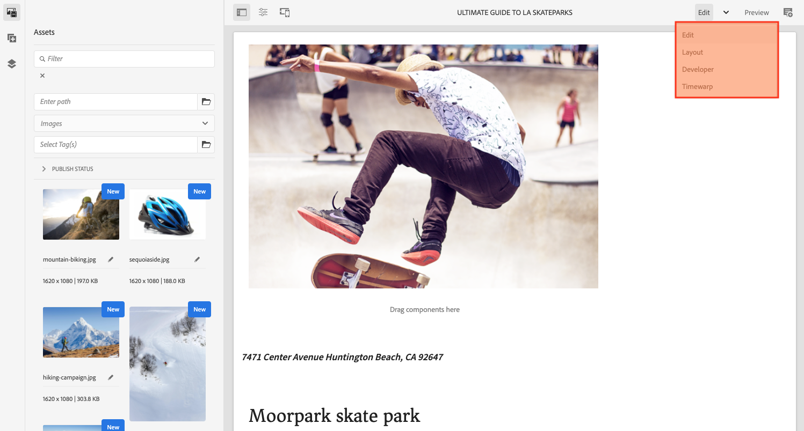

# Estrutura da interface do AEM {#structure-of-the-aem-ui}

A interface do usuário do AEM tem vários princípios subjacentes e é composta por vários elementos-chave:

## Consoles {#consoles}

### Layout básico e redimensionamento {#basic-layout-and-resizing}

A interface do usuário atende aos dispositivos móveis e de desktop, embora, em vez de criar dois estilos, o AEM use um estilo que funciona para todas as telas e dispositivos.

Todos os módulos usam o mesmo layout básico:

O layout segue um estilo de design responsivo e se acomoda ao tamanho do dispositivo, da janela ou de ambos que você está usando.

Por exemplo, quando a resolução é inferior a 1024 pixels (como em um dispositivo móvel), a exibição é ajustada de acordo:

### Barra do cabeçalho {#header-bar}

A barra de cabeçalho mostra elementos globais incluindo:

* O logotipo e o produto/solução específica que você está usando no momento. Para o AEM, esse elemento também forma um link para a Navegação global
* Pesquisar
* Ícone para acessar os recursos de ajuda
* Ícone para acessar outras soluções
* Um indicador - e acesso a - todos os alertas ou itens da Caixa de entrada que estão esperando por você
* O ícone do usuário, junto com um link para o gerenciamento do perfil

### Barra de ferramentas {#toolbar}

A barra de ferramentas é contextual ao seu local e supera ferramentas relevantes para controlar a exibição ou os ativos na página abaixo. A barra de ferramentas é específica do produto, mas há alguns elementos em comum.

Em qualquer local, a barra de ferramentas mostra as ações disponíveis no momento:

Também depende se um recurso está selecionado:

### Painel esquerdo {#left-rail}

O painel esquerdo pode ser aberto/oculto, conforme necessário, para mostrar:

* **Somente conteúdo**
* **Árvore de conteúdo**
* **Linha do tempo**
* **Referências**
* **Filtro**

O padrão é **Somente conteúdo** (painel oculto).

## Criação de páginas {#page-authoring}

Ao criar páginas, as áreas estruturais são as seguintes.

### Quadro de conteúdo {#content-frame}

O conteúdo da página é renderizado no quadro de conteúdo. O quadro de conteúdo é independente do editor, para garantir que não haja conflitos devido ao CSS ou ao JavaScript.

O quadro de conteúdo está na seção à direita da janela, na barra de ferramentas.

### Quadro do editor {#editor-frame}

O quadro do editor ativa os recursos de edição.

O quadro do editor é um container (abstrato) para todos os elementos de criação de página. Ela fica na parte superior do quadro de conteúdo e inclui:

* A barra de ferramentas superior
* O painel lateral
* Todas as sobreposições
* Qualquer outro elemento de criação da página; por exemplo, a barra de ferramentas do componente

### Painel lateral {#side-panel}

Contém três guias padrão. As guias **Assets** e **Componentes** permitem selecionar esses elementos e arrastá-los do painel e soltá-los na página. A guia **Árvore de conteúdo** permite inspecionar a hierarquia de conteúdo na página.

O painel lateral fica oculto por padrão. Quando selecionada, ela é exibida no lado esquerdo ou quando a largura da janela é inferior a 1024 pixels, ela desliza para cobrir a janela inteira como, por exemplo, em um dispositivo móvel.

### Painel lateral - Assets {#side-panel-assets}

Na guia Assets, é possível selecionar dentre uma variedade de ativos. Além disso, você pode filtrar por um termo específico ou selecionar um grupo.

### Painel lateral - Grupos de ativos {#side-panel-asset-groups}

Na guia Assets, há uma lista suspensa que você pode usar para selecionar os grupos de ativos específicos.

### Painel lateral - Componentes {#side-panel-components}

Na guia Componentes, é possível selecionar dentre uma variedade de componentes. Além disso, você pode filtrar por um termo específico ou selecionar um grupo.

### Painel lateral - Árvore de conteúdo {#side-panel-content-tree}

Na guia Árvore de conteúdo, é possível visualizar a hierarquia do conteúdo na página. Clicar em uma entrada na guia salta para e seleciona o item na página no editor.

### Sobreposições {#overlays}

Sobrepõe o quadro de conteúdo e são usados pelas [camadas](#layer) para compreender os mecanismos de como você pode interagir de forma transparente com os componentes e seu conteúdo.

As sobreposições ficam no quadro do editor (com todos os outros elementos de criação de página), embora elas realmente sobreponham os componentes apropriados no quadro de conteúdo.

### Camada {#layer}

Uma camada é um conjunto independente de funcionalidades que pode ser ativada para:

* Fornecer uma visualização diferente da página
* Permite manipular e/ou interagir com uma página

As camadas fornecem funcionalidade sofisticada para a página inteira, em vez de ações específicas em um componente individual.

O AEM vem com várias camadas já implementadas para a criação de páginas, incluindo, por exemplo, editar, visualizar e anotar camadas.

>[!NOTE]
>
>As camadas são um conceito eficiente que afeta a visualização e a interação do usuário com o conteúdo da página. Ao desenvolver suas próprias camadas, certifique-se de que a camada seja limpa ao sair.

### Alternador de camada {#layer-switcher}

O alternador de camadas permite escolher a camada que deseja usar. Quando fechada, indica a camada em uso no momento.

O alternador de camadas está disponível como uma lista suspensa na barra de ferramentas (na parte superior da janela, dentro do quadro do editor).

### Component Toolbar {#component-toolbar}

Cada instância de um componente revela sua barra de ferramentas quando clicado (uma vez ou com um clique duplo lento). A barra de ferramentas contém as ações específicas (por exemplo, copiar, colar, abrir editor) que estão disponíveis para a instância do componente na página.

Dependendo do espaço disponível, as barras de ferramentas do componente são posicionadas no canto superior ou inferior direito do componente apropriado.

## Informações adicionais {#further-information}

<!--For more details about the concepts around the touch-enabled UI, continue to the article [Concepts of the AEM Touch-Enabled UI](/help/sites-developing/touch-ui-concepts.md).-->

Para obter mais informações técnicas, consulte o [conjunto de documentação JS](https://developer.adobe.com/experience-manager/reference-materials/6-5/jsdoc/ui-touch/editor-core/index.html) para o editor de páginas.

### Shell unificado {#unified-shell}

Consulte [AEM as a Cloud Service no Unified Shell](/help/overview/aem-cloud-service-on-unified-shell.md) se estiver usando o Unified Shell como a interface do usuário do AEM.

Se você precisar fazer, ou já tiver feito, qualquer personalização, o Unified Should pode ser desativado:

* [da interface](/help/overview/aem-cloud-service-on-unified-shell.md#disabling-unified-shell)

* do código do projeto, por:

   * em `/conf/global/setting/unifiedshell`

      * definindo a propriedade `Boolean` de `enable` como `false`
