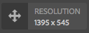

# Exemplos de tipos de módulo da interface do usuário do ContextHub {#sample-contexthub-ui-module-types}

O ContextHub fornece vários módulos de interface do usuário de amostra que você pode usar em suas soluções. As seguintes informações são fornecidas:

* Os principais recursos do módulo de interface do usuário.
* Onde encontrar o código-fonte para poder abri-lo para fins de aprendizado.
* Como configurar o módulo da interface do usuário.

Para obter informações sobre como adicionar módulos de interface ao ContextHub, consulte [Adição de um módulo de interface](configuring-contexthub.md#adding-a-ui-module). Para obter informações sobre como desenvolver módulos de interface, consulte [Criação de tipos de módulo da interface do usuário do ContextHub](extending-contexthub.md#creating-contexthub-ui-module-types).

## Tipo de módulo da interface do usuário contexthub.base {#contexthub-base-ui-module-type}

O tipo de módulo contexthub.base UI é o tipo base para todos os outros tipos de módulo UI. Dessa forma, ele fornece recursos genéricos para renderizar dados do armazenamento.

Os seguintes recursos estão disponíveis:

* **Título e ícone:** Especifique um título para o módulo de interface do usuário e um ícone. O ícone pode ser referenciado usando um URL ou na biblioteca de ícones da interface do Coral.
* **Armazenar dados:** Identifique um ou mais armazenamentos dos quais recuperar dados.
* **Conteúdo:** Especifique o conteúdo que aparece no módulo da interface do usuário como ele aparece na barra de ferramentas do ContextHub.
* **Popover conteúdo:** Especifique o conteúdo que aparece em um popover quando o módulo de interface do usuário é clicado ou tocado.
* **Modo de tela cheia:** Controla se o modo de tela cheia é permitido.

O código-fonte está localizado em `/libs/granite/contexthub/code/ui/container/js/ContextHub.UI.BaseModuleRenderer.js`.

### Configuração {#configuration}

Configure o módulo da interface contexthub.base usando um objeto JavaScript no formato JSON. Inclua qualquer uma das seguintes propriedades para configurar os recursos do módulo da interface do usuário:

* **imagem:** Um URL para uma imagem a ser exibida como o ícone.
* **ícone:** O nome de um [Ícone da Coral UI](https://helpx.adobe.com/experience-manager/6-4/sites/developing/using/reference-materials/coral-ui/coralui3/Coral.Icon.html) classe. Se você especificar um valor para as propriedades icon e image, a imagem será usada.
* **título:** Um título para o módulo de interface do usuário. O título é exibido quando o ponteiro é pausado sobre o ícone do módulo da interface do usuário.
* **tela cheia:** Um valor booliano que indica se o módulo de interface do usuário oferece suporte ao modo de tela cheia. Uso `true` para oferecer suporte a tela cheia e `false` para impedir o modo de tela cheia.
* **modelo:** A [Handlebars](https://handlebarsjs.com/) modelo que especifica o conteúdo a ser renderizado na barra de ferramentas do ContextHub. Use no máximo dois `<p>` específicos.
* **storeMapping:** Um mapeamento de chave/armazenamento. Use a chave nos modelos de Handlebar para acessar os dados de armazenamento do ContextHub associados.
* **lista:** Uma matriz de itens para exibir como uma lista em um popover quando o módulo de interface do usuário for clicado. Se você incluir esse item, não inclua popoverTemplate. O valor é uma matriz de objetos com as seguintes chaves:
   * título: o texto a ser exibido para este item
   * image: (opcional) um URL para uma imagem que deve ser exibida à esquerda
   * ícone: (opcional) uma classe de ícone CUI que deve ser exibida à esquerda; ignorado se uma imagem for especificada
   * selecionado: (opcional) um valor booleano que especifica se esse item deve ser exibido como selecionado (true=seleted). Por padrão, os itens selecionados aparecem usando uma fonte em negrito. Use um `listType` para configurar outras aparências (veja abaixo).
* **listType:** O estilo a ser usado para itens de lista de pop-over. Use um dos seguintes valores:
   * marca de seleção
   * caixa de seleção
   * rádio
* **popoverTemplate:** Um modelo Handlebars que especifica o conteúdo a ser renderizado no popover quando o módulo de interface do usuário for clicado. Se você incluir este item, não inclua o `list` item.

### Exemplo {#example}

O exemplo a seguir configura um c`ontexthub.base` Módulo de interface do usuário para exibir informações de um [contexthub.emulators](sample-stores.md#granite-emulators-sample-store-candidate) armazenamento. A variável `template` demonstra como obter dados do armazenamento usando a chave que o `storeMapping` Estabelece.

```javascript
{
   "icon": "coral-Icon--move",
    "title": "Screen Resolution",
    "storeMapping": {
      "emulator": "emulators"
    },
    "template": "<p>{{{ i18n \"Resolution\"}}}</p><p>{{{emulator.currentDevice.width}}} x {{{emulator.currentDevice.height}}}</p>"
}
```



## Tipo de módulo da interface do usuário contexthub.browserinfo {#contexthub-browserinfo-ui-module-type}

A variável `contexthub.browserinfo` O módulo da interface do usuário exibe informações sobre o navegador da Web do cliente e o sistema operacional. As informações são obtidas na loja surferinfo, com base no [contexthub.surferinfo](sample-stores.md#contexthub-surferinfo-sample-store-candidate) candidato ao armazenamento.


O código-fonte do módulo da interface do usuário está localizado em `/libs/granite/contexthub/components/modules/browserinfo`. Embora `contexthub.browserinfo` estende a `contexthub.base` não substitui nem fornece funções adicionais. A implementação fornece uma configuração padrão para renderizar informações do navegador.

### Configuração {#configuration-1}

As instâncias do módulo de interface do usuário contexthub.browserinfo não exigem um valor para a Configuração de detalhes. O texto JSON a seguir representa a configuração padrão do módulo.

```javascript
{
   "icon":"coral-Icon--globe",
   "title":"Browser/OS Information",
   "storeMapping":{"surferinfo":"surferinfo"},
   "template":"<p>{{surferinfo.browser.family}} {{surferinfo.browser.version}}</p><p>{{surferinfo.os.name}} {{surferinfo.os.version}}</p>"
}
```

## Tipo de módulo da interface do usuário contexthub.datetime {#contexthub-datetime-ui-module-type}

A variável `contexthub.datetime` O módulo da interface do usuário exibe a data e a hora armazenadas em um armazenamento chamado datetime com base na variável `contexthub.datetime` candidato ao armazenamento.


O módulo fornece um formulário popover que permite alterar a data e a hora na loja.

A origem do `contexthub.datetime` O módulo da interface do usuário está localizado em `/libs/granite/contexthub/components/modules/datetime`.

### Configuração {#configuration-2}

As instâncias do módulo de interface do usuário contexthub.datetime não exigem um valor para a Configuração detalhada. O texto JSON a seguir representa a configuração padrão do módulo.

```javascript
{
   "icon":"coral-Icon--clock",
   "title":"DATE&TIME",
   "clickable":true,
   "storeMapping":{"d":"datetime"},
   "template":"<p class=\"contexthub-module-line1\">{{i18n \"Date&Time\"}}</p><p class=\"contexthub-module-line2\">{{d.formatted.locale.date}} {{d.formatted.locale.time}}</p>",
   "popoverTemplate":"<div class=\"datetime center\"><div class=\"coral-DatePicker-calendar\" data-init=\"datepicker\"><input class=\"coral-Textfield\" type=\"datetime\" value=\"{{d.formatted.iso}}\"><button class=\"coral-Button coral-Button--secondary coral-Button--square\" title=\"{{i18n \"Datetime picker\"}}\"><i class=\"coral-Icon coral-Icon--calendar coral-Icon--sizeS\"></i></button></div></div>"
}
```

## Tipo de módulo da interface do usuário contexthub.location {#contexthub-location-ui-module-type}

A variável `contexthub.location` O módulo da interface do usuário exibe a longitude e latitude do cliente. O módulo fornece um popover que exibe um mapa de Google no qual você pode clicar para alterar a localização atual. O módulo obtém informações de um armazenamento do ContextHub chamado geolocalização que é baseado no [contexthub.geolocation](sample-stores.md#contexthub-geolocation-sample-store-candidate) candidato ao armazenamento.


A origem do módulo de interface do usuário está localizada em `/etc/cloudsettings/default/contexthub/geolocation`.

### Configuração {#configuration-4}

As instâncias do módulo de interface do usuário contexthub.location não exigem um valor para a Configuração de detalhes. O texto JSON a seguir representa a configuração padrão do módulo.

```javascript
{
 "icon":"coral-Icon--compass",
 "title":"Location",
 "clickable":true,
 "editable":{"key":"/geolocation","disabled":[],"hidden":["/geolocation/generatedThumbnail","/geolocation/city","/geolocation/country"]},
 "fullscreen":true,
 "storeMapping":{"g":"geolocation"},
 "template":"<p>{{i18n \"Location\"}}</p><p>{{g.address.postalCode}} {{g.address.city}}{{#if g.address.city}}{{#if g.address.region}},{{/if}}{{/if}} {{g.address.region}}</p>",
 "list":[
  {"title":"Basel, Switzerland",
  "data":{"longitude":7.58929,"latitude":47.554746,"city":"Basel","country":"Switzerland"}},
  {"title":"Melbourne, Australia",
  "data":{"longitude":144.96328,"latitude":-37.814107,"city":"Melbourne","country":"Australia"}},
  {"title":"Beijing, China",
  "data":{"longitude":116.407526,"latitude":39.90403,"city":"Beijing","country":"China"}},
  {"title":"New York, NY, USA",
  "data":{"longitude":-74.005973,"latitude":40.714353,"city":"New York","country":"United States"}},
  {"title":"Paris, France",
  "data":{"longitude":2.352222,"latitude":48.856614,"city":"Paris","country":"France"}},
  {"title":"Rio de Janeiro, Brazil",
  "data":{"longitude":-43.20071,"latitude":-22.913395,"city":"Rio","country":"Brazil"}},
  {"title":"San Jose, CA, USA",
  "data":{"longitude":-121.894955,"latitude":37.339386,"city":"San Jose","country":"United States"}},
  {"title":"Tokyo, Japan",
  "data":{"longitude":139.691706,"latitude":35.689487,"city":"Shinjuku","country":"Japan"}}
 ],
 "listType":"checkmark"
}
```

## Tipo de módulo da interface do usuário contexthub.screen-orientation {#contexthub-screen-orientation-ui-module-type}

A variável `contexthub.screen-orientation` O módulo da interface do usuário exibe a orientação atual da tela do cliente. Embora desativado por padrão, o módulo fornece um popover que permite selecionar uma orientação. O módulo obtém informações de um armazenamento do ContextHub chamado emuladores, que é baseado no [granite.emulators](sample-stores.md#granite-emulators-sample-store-candidate) candidato ao armazenamento.


A origem do módulo de interface do usuário está localizada em `/libs/granite/contexthub/components/modules/screen-orientation`.

### Configuração {#configuration-5}

Instâncias do `contexthub.screen-orientation` O módulo da interface do usuário não requer um valor para a Configuração detalhada. O texto JSON a seguir representa a configuração padrão do módulo. A variável `clickable` propriedade é `false` por padrão. Se você substituir a configuração padrão para definir `clickable` para `true`, clicar no módulo revela um pop-up no qual você pode selecionar a orientação.

```javascript
{
   "icon":"coral-Icon--rotateRight",
   "title":"Screen Orientation",
   "clickable":false,
   "storeMapping":{"emulator":"emulators"},
   "template":"<p>{{{ i18n \"Screen Orientation\" }}}</p><p>{{{ emulator.currentDevice.orientation }}}",
   "listReference":"/emulators/orientations",
   "listType":"checkmark"
}
```

## Tipo de módulo da interface do usuário do contexthub.tagcloud {#contexthub-tagcloud-ui-module-type}

A variável `contexthub.tagcloud` O módulo da interface do usuário exibe informações sobre tags. Na barra de ferramentas, o módulo da interface mostra o número de tags. O pop-up revela uma nuvem de tag e uma caixa de texto para adicionar novas tags. O módulo de interface do usuário obtém informações de um armazenamento do ContextHub chamado tagcloud que é baseado no `contexthub.tagcloud` candidato ao armazenamento.


A origem do módulo de interface do usuário está localizada em `/libs/granite/contexthub/components/modules/tagcloud`.

### Configuração {#configuration-6}

Instâncias do `contexthub.tagcloud` O módulo da interface do usuário não requer um valor para a Configuração detalhada. O texto JSON a seguir representa a configuração padrão do módulo.

```javascript
{
   "icon":"coral-Icon--tag",
   "title":"TagCloud",
   "clickable":true,
   "storeMapping":{"t":"tagcloud"},
   "maxTags":20,
   "template":"<p class=\"contexthub-module-line1\">{{i18n \"TagCloud\"}}</p><p class=\"contexthub-module-line2\">{{stats.total}} {{i18n \"Tags\"}}</p>",
   "popoverTemplate":"<div class=\"contexthub-popover-content center\"><p class=\"stats\">{{stats.total}} {{i18n \"Tags\"}} | {{stats.hits}} {{i18n \"Hits\"}} | {{i18n \"Last tag\"}}: {{#if stats.recent}}{{stats.recent}}{{else}}{{i18n \"Unknown\"}}{{/if}}</p><p class=\"tagcloud\">{{#each tags}}<span class=\"tag{{this.weight}}\">{{this.name}}</span> {{/each}}</p><div class=\"coral-InputGroup\"><input type=\"text\" class=\"coral-InputGroup-input coral-Textfield tag-name\" placeholder=\"{{i18n \"Add a namespace:my/tag\"}}\" pattern=\"^[A-Za-z0-9_\\-]+(:[A-Za-z0-9_\\-\\/]+)?$\" title=\"{{i18n \"namespace:my/tag\"}}\"><span class=\"coral-InputGroup-button\"><button class=\"coral-Button coral-Button--secondary coral-Button--square contexthub-new-tag\" type=\"button\" title=\"{{i18n \"increment\"}}\"><i class=\"coral-Icon coral-Icon--sizeS coral-Icon--add\"></i></button></span></div></div>"
}
```

## Tipo de módulo de interface do usuário do granite.profile {#granite-profile-ui-module-type}

A variável `granite.profile` O módulo da interface do usuário do ContextHub exibe o nome de exibição do usuário atual. O pop-up revela o nome de logon do usuário e permite alterar o valor do nome de exibição. O módulo de interface do usuário obtém informações de um armazenamento do ContextHub chamado perfil, que é baseado no [granite.profile](sample-stores.md#granite-profile-sample-store-candidate) candidato ao armazenamento.


A origem do módulo de interface do usuário está em `/libs/granite/contexthub/components/modules/profile`.

### Configuração {#configuration-7}

Instâncias do `granite.profile` O módulo da interface do usuário não requer um valor para a Configuração detalhada. O texto JSON a seguir representa a configuração padrão do módulo.

```javascript
{
   "icon":"coral-Icon--user",
   "title":"Profile",
   "clickable":true,
   "editable":{
      "key":"/profile",
      "disabled":["/profile/authorizableId"],
      "hidden":["/profile/avatar","/profile/path"]},
   "storeMapping":{"p":"profile"},
   "template":"<p class=\"contexthub-module-line1\">{{i18n \"Persona\"}}</p><p class=\"contexthub-module-line2\">{{p.displayName}}</p>",
   "listType":"checkmark"
}
```
