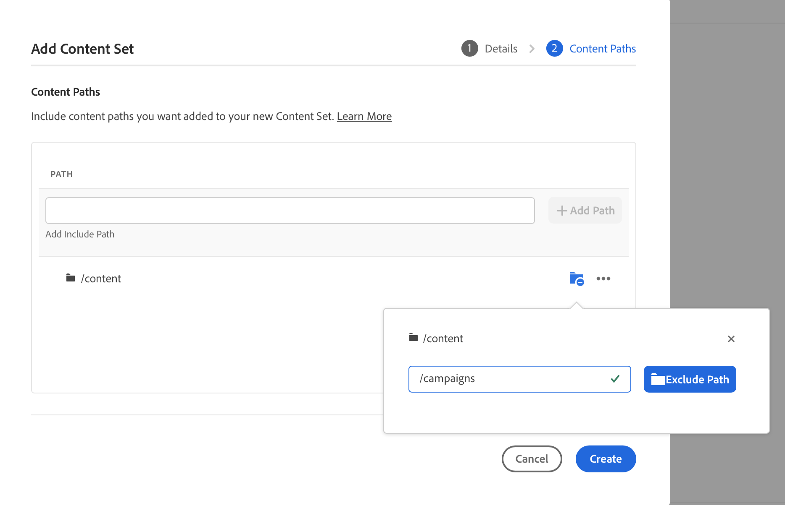
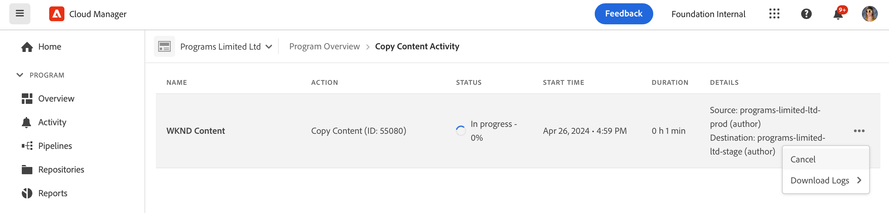

# A ferramenta de cópia de conteúdo {#content-copy}

A ferramenta de cópia de conteúdo permite que os usuários copiem conteúdo mutável sob demanda de seus ambientes de produção no AEM as a Cloud Service para ambientes inferiores para fins de teste.

>[!NOTE]
>Embora o fluxo de cópia do conteúdo principal seja de ambientes superiores para ambientes inferiores, um recurso adicional - **Fluxo de encaminhamento** - permite copiar de ambientes inferiores não relacionados à produção para ambientes superiores não relacionados à produção (por exemplo, Dev → Stage, RDE → Stage). Consulte [Limitações](#limitations) para obter detalhes, incluindo requisitos de disponibilidade.

## Introdução {#introduction}

Os dados atuais e reais são valiosos para fins de teste, validação e aceitação do usuário. A ferramenta de cópia de conteúdo permite copiar o conteúdo de um ambiente de produção do AEM as a Cloud Service para um ambiente de preparo, desenvolvimento ou [Ambiente de desenvolvimento rápido (RDE)](/help/implementing/developing/introduction/rapid-development-environments.md) para esses testes.

O conteúdo a ser copiado é definido por um conjunto de conteúdo. Um conjunto de conteúdo consiste em uma lista de caminhos JCR que contêm o conteúdo mutável a ser copiado de um ambiente de serviço de criação de origem para um ambiente de serviço de criação de destino no mesmo programa Cloud Manager. Os seguintes caminhos são permitidos em um conjunto de conteúdo.

```text
/content
/conf/**/settings/wcm
/conf/**/settings/dam/cfm/models
/conf/**/settings/graphql/persistentQueries
/etc/clientlibs/fd/themes
```

Ao copiar o conteúdo, o ambiente de origem é a fonte de verdade.

* Se o conteúdo tiver sido modificado no ambiente de destino, ele será substituído pelo conteúdo na origem, se os caminhos forem os mesmos.
* Se os caminhos forem diferentes, o conteúdo da origem será mesclado com o conteúdo do destino.

## Permissões {#permissions}

Para usar a ferramenta de cópia de conteúdo, determinadas permissões são necessárias nos ambientes de origem e de destino.

| Recurso de cópia de conteúdo | Grupo de administradores do AEM | Função de gerente de implantação |
|---|---|---|
| Criar e modificar [conjuntos de conteúdo](#create-content-set) | Não obrigatório | Obrigatório |
| Iniciar ou cancelar o [processo de cópia de conteúdo](#copy-content) | Obrigatório | Obrigatório |

Para obter mais detalhes sobre permissões e como defini-las, consulte [Perfis de produto e de equipe do AEM as a Cloud Service](/help/onboarding/aem-cs-team-product-profiles.md).

## Criação de um conjunto de conteúdo {#create-content-set}

Antes que qualquer conteúdo possa ser copiado, um conjunto de conteúdo deve ser definido. Depois de definido, os conjuntos de conteúdo podem ser reutilizados para copiar conteúdo. Siga estas etapas para criar um conjunto de conteúdo.

1. Faça logon no Cloud Manager em[my.cloudmanager.adobe.com](https://my.cloudmanager.adobe.com/) e selecione a organização e o programa apropriados.

1. Usando o painel de navegação lateral, navegue até a guia **Conjuntos de conteúdo** na página **Visão geral**.

1. Na parte superior direita da tela, clique em **Adicionar conjunto de conteúdo**.

   

1. Na guia **Detalhes** do assistente, forneça um nome e uma descrição para o conjunto de conteúdo e selecione **Continuar**.

   

1. Na guia **Caminhos de conteúdo** do assistente, especifique os caminhos do conteúdo mutável a ser incluído no conjunto de conteúdo.

   1. Insira o caminho no campo **Adicionar caminho de inclusão**.
   1. Clique no botão **Adicionar caminho** para adicionar o caminho ao conjunto de conteúdo.
   1. Clique em **Adicionar caminho** novamente, se necessário.
      * São permitidos até 50 caminhos.

   

1. Se você precisar refinar ou restringir seu conjunto de conteúdo, os subcaminhos poderão ser excluídos.

   1. Na lista de caminhos incluídos, clique em **Adicionar subcaminhos de exclusão** ao lado do caminho que você deseja restringir.
   1. Insira o subcaminho a ser excluído abaixo do caminho selecionado.
   1. Selecione **Excluir Caminho**.
   1. Selecione **Adicionar subcaminhos de exclusão** novamente para adicionar outros caminhos a serem excluídos conforme necessário.
      * Os caminhos excluídos devem ser relativos ao caminho incluído.
      * Não há limite para o número de caminhos excluídos.

   

1. É possível editar os caminhos especificados, se necessário.

   1. Clique no X ao lado dos subcaminhos excluídos para excluí-los.
   1. Clique no botão de reticências ao lado dos caminhos para que você possa revelar as opções **Editar** e **Excluir**.

   

1. Selecione **Criar** para criar o conjunto de conteúdo.

O conjunto de conteúdo agora pode ser usado para copiar conteúdo entre ambientes.

## Editar um conjunto de conteúdo {#edit-content-set}

Para esse processo, as etapas são semelhantes às da criação de conteúdo. Em vez de clicar em **Adicionar conjunto de conteúdo**, selecione um conjunto existente no console e selecione **Editar** no menu de reticências.


Ao editar o conjunto de conteúdo, você pode expandir os caminhos configurados para revelar os subcaminhos excluídos.

## Copiar conteúdo {#copy-content}

Após criar um conjunto de conteúdo, você pode usá-lo para copiar o conteúdo. Siga estas etapas para poder copiar o conteúdo.

>[!NOTE]
> Não use a cópia de conteúdo em um ambiente enquanto uma operação de [transferência de conteúdo](/help/journey-migration/content-transfer-tool/using-content-transfer-tool/overview-content-transfer-tool.md) estiver em execução nesse ambiente.

1. Faça logon no Cloud Manager em [my.cloudmanager.adobe.com](https://my.cloudmanager.adobe.com/) e selecione a organização e o programa apropriado.

1. Acesse a tela **Ambientes** a partir da página **Visão geral**.

1. Acesse a página **Conjuntos de conteúdo** na tela **Ambientes**.

1. Selecione um conjunto de conteúdo no console e clique em **Copiar conteúdo** no menu de reticências.

   

   >[!NOTE]
   >
   >Um ambiente pode não ser selecionável se:
   >
   >* O usuário não tiver as permissões apropriadas.
   >* O ambiente tiver um pipeline em execução ou uma operação de cópia de conteúdo em andamento.
   >* O ambiente está hibernando ou sendo inicializado.

1. Na caixa de diálogo **Copiar conteúdo**, especifique a origem e o destino da sua ação de cópia de conteúdo.

   

   * O conteúdo só pode ser copiado de um ambiente superior para um ambiente inferior ou entre ambientes de desenvolvimento/RDE, em que a hierarquia de ambientes é a seguinte (do mais alto para o mais baixo):
      * Produção
      * Estágios
      * Desenvolvimento/RDE
   * Por padrão, a cópia de conteúdo entre programas está desativada. No entanto, mediante solicitação do cliente, ele pode ser habilitado, o que disponibilizará um campo de entrada adicional **Programa de destino**.

1. Se necessário, você também pode optar por **Incluir listas de controle de acesso** no seu processo de cópia.

1. Selecione **Copiar**.

O processo de cópia será iniciado. O status do processo de cópia é exibido no console do conjunto de conteúdo selecionado.

## Atividade de cópia de conteúdo {#copy-activity}

Você pode monitorar o status dos processos de cópia na página **Atividade de cópia de conteúdo**.

1. Faça logon no Cloud Manager em [my.cloudmanager.adobe.com](https://my.cloudmanager.adobe.com/) e selecione a organização e o programa apropriado.

1. Acesse a tela **Ambientes** a partir da página **Visão geral**.

1. Acesse a página **Atividade de cópia de conteúdo** na tela **Ambientes**.


### Status da cópia de conteúdo {#statuses}

Depois de começar a copiar o conteúdo, o processo poderá ter um dos status a seguir.

| Status | Descrição |
|---|---|
| Em andamento | A operação de cópia de conteúdo está em andamento |
| Falhou | A operação de cópia de conteúdo falhou |
| Concluído | A operação de cópia de conteúdo foi concluída com sucesso |
| Cancelado | O usuário cancela uma operação de cópia de conteúdo após iniciá-la |

### Cancelando um Processo de Cópia {#canceling}

Se você precisar abortar uma operação de cópia de conteúdo após iniciá-la, é possível cancelá-la opcionalmente.

Para fazer isso, na página **Atividade de cópia de conteúdo**, selecione a ação **Cancelar** do menu de reticências do processo de cópia iniciado anteriormente.



>[!NOTE]
>
>Ao cancelar uma operação de cópia de conteúdo, pode resultar em uma cópia parcial do conteúdo no ambiente de destino. Essa situação pode deixar o ambiente de destino em um estado inutilizável.
>
>Se o ambiente estiver em tal estado devido ao cancelamento, entre em contato com o Atendimento ao cliente da Adobe para obter assistência.

### Acesso aos logs {#accessing-logs}

Você pode verificar os logs dos ambientes de origem e de destino para qualquer processo de cópia de conteúdo concluído.

Para fazer isso, na página **Atividade de Conteúdo de Cópia**, selecione a ação **Logs** no menu de reticências do processo de cópia para o qual você deseja revisar os logs e escolher para qual ambiente.


Os logs são baixados no computador local. Se o download não começar, verifique as configurações do bloqueador de pop-ups.

## Limitações {#limitations}

A ferramenta de cópia de conteúdo tem as seguintes limitações.

* A ferramenta de cópia de conteúdo é compatível com dois modos de fluxo:
   1. Fluxo de cima para baixo - o conteúdo pode ser copiado de ambientes superiores para ambientes inferiores (por exemplo, Produção → Preparo, Preparo → Desenvolvimento/RDE).
   2. Fluxo de encaminhamento (novo recurso) - O conteúdo também pode ser copiado de um ambiente de não produção inferior para um ambiente de não produção superior (por exemplo, Desenvolvimento → Preparo, RDE → Preparo). Esse recurso está disponível somente mediante solicitação explícita e permanece habilitado até que seja explicitamente solicitado que seja desabilitado. Os ambientes de produção nunca são destinos válidos para o Fluxo de encaminhamento.
* O conteúdo só pode ser copiado de e para os serviços de autoria.
* Não é possível executar operações de cópia de conteúdo simultâneas no mesmo ambiente.
* Até 50 caminhos podem ser especificados por conjunto de conteúdo. Não há limitação para os caminhos excluídos.
* Não use a ferramenta de cópia de conteúdo como uma ferramenta de clonagem ou de espelhamento porque ela não pode rastrear conteúdo movido ou excluído na origem.
* A ferramenta de cópia de conteúdo não tem recurso de controle de versão e não pode detectar automaticamente o conteúdo modificado ou criado no ambiente de origem em um conjunto de conteúdo desde a última operação de cópia de conteúdo.
   * Se quiser atualizar o ambiente de destino somente com alterações de conteúdo, você deverá criar um conjunto de conteúdo desde a última operação de cópia de conteúdo. Em seguida, especifique os caminhos na instância de origem em que as alterações foram feitas desde a última operação de cópia de conteúdo.
* As informações da versão não são incluídas em uma cópia de conteúdo.
* [Os modelos de fragmentos de conteúdo](/help/sites-cloud/administering/content-fragments/content-fragment-models.md#data-types) podem especificar campos de referência baseados em IDs universalmente exclusivas (UUID). Esses UUIDs são específicos do repositório, portanto, a ferramenta de cópia de conteúdo recalculará esses UUIDs no ambiente de destino ao copiar os fragmentos de conteúdo.
