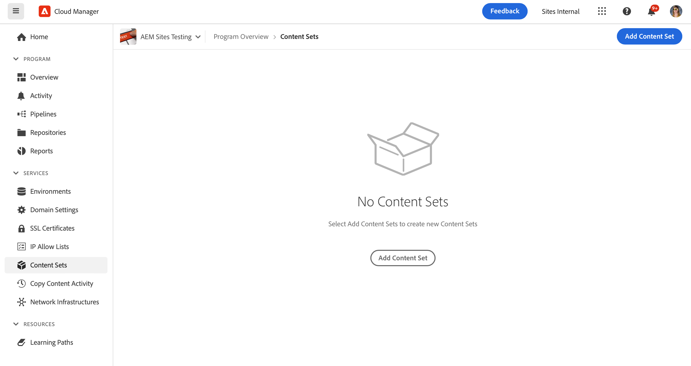

# A ferramenta de cópia de conteúdo {#content-copy}

A ferramenta de cópia de conteúdo permite que os usuários copiem conteúdo mutável sob demanda de seus ambientes de produção AEM as a Cloud Service para ambientes inferiores para fins de teste.

## Introdução {#introduction}

Os dados atuais e reais são valiosos para fins de teste, validação e aceitação do usuário. A ferramenta de cópia de conteúdo permite copiar o conteúdo de um ambiente de AEM de produção para um ambiente de preparo, desenvolvimento ou [Ambiente de desenvolvimento rápido (RDE)](/help/implementing/developing/introduction/rapid-development-environments.md) ambiente para esses testes.

O conteúdo a ser copiado é definido por um conjunto de conteúdo. Um conjunto de conteúdo consiste em uma lista de caminhos JCR que contêm o conteúdo mutável a ser copiado de um ambiente de serviço de criação de origem para um ambiente de serviço de criação de público-alvo no mesmo programa do Cloud Manager. Os seguintes caminhos são permitidos em um conjunto de conteúdo.

```text
/content
/conf/**/settings/wcm
/conf/**/settings/dam/cfm/models
/conf/**/settings/graphql/persistentQueries
/etc/clientlibs/fd/themes
```

Ao copiar o conteúdo, o ambiente de origem é a fonte de verdade.

* Se o conteúdo tiver sido modificado no ambiente de destino, ele será substituído pelo conteúdo da origem se os caminhos forem os mesmos.
* Se os caminhos forem diferentes, o conteúdo da origem será mesclado ao conteúdo do destino.

## Permissões {#permissions}

Para usar a ferramenta de cópia de conteúdo, certas permissões são necessárias nos ambientes de origem e de destino.

| Recurso de cópia de conteúdo | Grupo de administradores AEM | Função de gerente de implantação |
|---|---|---|
| Criar e modificar [conjuntos de conteúdo](#create-content-set) | Obrigatório | Não obrigatório |
| Iniciar ou cancelar o [processo de cópia de conteúdo](#copy-content) | Obrigatório | Obrigatório |

## Criação de um conjunto de conteúdo {#create-content-set}

Antes que qualquer conteúdo possa ser copiado, um conjunto de conteúdo deve ser definido. Depois de definidos, os conjuntos de conteúdo podem ser reutilizados para copiar o conteúdo. Siga estas etapas para criar um conjunto de conteúdo.

1. Faça logon no Cloud Manager em [my.cloudmanager.adobe.com](https://my.cloudmanager.adobe.com/) e selecione a organização e o programa apropriado.

1. Acesse a tela **Ambientes** a partir da página **Visão geral**.

1. Acesse a página **Conjuntos de conteúdo** na tela **Ambientes**.

1. Toque ou clique no botão **Adicionar conjunto de conteúdo** na parte superior direita da tela.

   

1. No **Detalhes** do assistente, forneça um nome e uma descrição para o conjunto de conteúdo e toque ou clique em **Continuar**.

   

1. Na guia **Caminhos de conteúdo** do assistente, especifique os caminhos do conteúdo mutável a ser incluído no conjunto de conteúdo.

   1. Insira o caminho no campo **Adicionar caminho de inclusão**.
   1. Toque ou clique no botão **Adicionar caminho** para adicionar o caminho ao conjunto de conteúdo.
   1. Toque ou clique no botão **Adicionar caminho** novamente, se necessário.
      * São permitidos até cinquenta caminhos.

   

1. Se você precisar refinar ou restringir o conjunto de conteúdo, os subcaminhos poderão ser excluídos.

   1. Na lista de caminhos incluídos, toque ou clique no ícone **Adicionar subcaminhos de exclusão** ao lado do caminho que deve ser restringido.
   1. Insira o subcaminho a ser excluído abaixo do caminho selecionado.
   1. Toque ou clique em **Excluir caminho**.
   1. Toque ou clique em **Adicionar subcaminhos de exclusão** novamente para adicionar caminhos adicionais a serem excluídos, se necessário.
      * Os caminhos excluídos devem ser relativos ao caminho incluído.
      * Não há limite no número de caminhos excluídos.

   

1. Você pode modificar os caminhos especificados, se necessário.

   1. Toque ou clique no X ao lado dos subcaminhos excluídos para apagá-los.
   1. Toque ou clique no botão de reticências ao lado dos caminhos para revelar as opções **Editar** e **Excluir**.

   

1. Toque ou clique em **Criar** para criar o conjunto de conteúdo.

O conjunto de conteúdo agora pode ser usado para copiar conteúdo entre ambientes.

## Editar um conjunto de conteúdo {#edit-content-set}

Para esse processo, as etapas são semelhantes às da criação de conteúdo. Porém, em vez de tocar ou clicar em **Adicionar conjunto de conteúdo**, selecione um conjunto existente no console e clique em **Editar** no menu de reticências.


Observe que, ao editar seu conjunto de conteúdo, talvez seja necessário expandir os caminhos configurados para revelar os subcaminhos excluídos.

## Copiar conteúdo {#copy-content}

Depois que um conjunto de conteúdo é criado, você pode usá-lo para copiar conteúdo. Siga estas etapas para copiar conteúdo.

1. Faça logon no Cloud Manager em [my.cloudmanager.adobe.com](https://my.cloudmanager.adobe.com/) e selecione a organização e o programa apropriado.

1. Acesse a tela **Ambientes** a partir da página **Visão geral**.

1. Acesse a página **Conjuntos de conteúdo** na tela **Ambientes**.

1. Selecione um conjunto de conteúdo no console e clique em **Copiar conteúdo** no menu de reticências.

   

   >[!NOTE]
   >
   >Um ambiente pode não ser selecionável se:
   >
   >* O usuário não tiver as permissões apropriadas.
   >* O ambiente tiver um pipeline em execução ou uma operação de cópia de conteúdo em andamento.
   >* O ambiente está hibernando ou iniciando.


1. Na caixa de diálogo **Copiar conteúdo**, especifique a origem e o destino da sua ação de cópia de conteúdo.

   

   * O conteúdo só pode ser copiado de um ambiente mais alto para um ambiente mais baixo ou entre ambientes de desenvolvimento/RDE, onde a hierarquia de ambientes é a seguinte (do mais alto ao mais baixo):
      * Produção
      * Estágios
      * Desenvolvimento / RDE

1. Se necessário, também é possível selecionar **Incluir Listas de Controle de Acesso** no processo de cópia.

1. Toque ou clique em **Copiar**.

O processo de cópia será iniciado. O status do processo de cópia é exibido no console do conjunto de conteúdo selecionado.

## Atividade de cópia de conteúdo {#copy-activity}

Você pode monitorar o status dos processos de cópia na página **Atividade de cópia de conteúdo**.

1. Faça logon no Cloud Manager em [my.cloudmanager.adobe.com](https://my.cloudmanager.adobe.com/) e selecione a organização e o programa apropriado.

1. Acesse a tela **Ambientes** a partir da página **Visão geral**.

1. Acesse a página **Atividade de cópia de conteúdo** na tela **Ambientes**.


### Status da cópia de conteúdo {#statuses}

Depois de começar a copiar o conteúdo, o processo poderá ter um dos status a seguir.

| Status | Descrição |
|---|---|
| Em andamento | A operação de cópia de conteúdo está em andamento |
| Falhou | A operação de cópia de conteúdo falhou |
| Concluído | A operação de cópia de conteúdo foi concluída com sucesso |
| Cancelado | O usuário cancela uma operação de cópia de conteúdo após iniciá-la |

### Cancelando um Processo de Cópia {#cancelling}

Se precisar abortar uma operação de cópia de conteúdo após iniciá-la, você terá a opção de cancelá-la.

Para fazer isso, no **Atividade Copiar conteúdo** selecione o **Cancelar** ação do menu reticências do processo de cópia iniciado anteriormente.


>[!NOTE]
>
>Ao cancelar uma operação de cópia de conteúdo, ela pode resultar em uma cópia parcial do conteúdo no ambiente de destino. Isso pode deixar o ambiente de destino em um estado inutilizável.
>
>Se seu ambiente estiver em tal estado devido ao cancelamento, entre em contato com o Atendimento ao cliente do Adobe para obter assistência.

## Limitações {#limitations}

A ferramenta de cópia de conteúdo tem as seguintes limitações.

* O conteúdo não pode ser copiado de um ambiente inferior para um ambiente superior.
* O conteúdo só pode ser copiado de e para os serviços de criação.
* Não é possível copiar conteúdo entre programas.
* Não é possível executar operações de cópia de conteúdo simultâneas no mesmo ambiente.
* É possível especificar até dez caminhos por conjunto de conteúdo. Não há limitação de caminhos excluídos.
* A ferramenta de cópia de conteúdo não deve ser usada como uma ferramenta de clonagem ou espelhamento, pois ela não pode rastrear os conteúdos movidos ou excluídos da origem.
* A ferramenta de cópia de conteúdo não tem nenhum recurso de controle de versão e não pode detectar automaticamente o conteúdo modificado ou recém-criado no ambiente de origem de um conjunto de conteúdo desde a última operação de cópia de conteúdo.
   * Se quiser atualizar seu ambiente de destino com alterações de conteúdo somente desde a última operação de cópia de conteúdo, será necessário criar um conjunto de conteúdo e especificar os caminhos na instância de origem onde as alterações foram feitas desde a última operação de cópia de conteúdo.
* As informações da versão não são incluídas em uma cópia de conteúdo.
