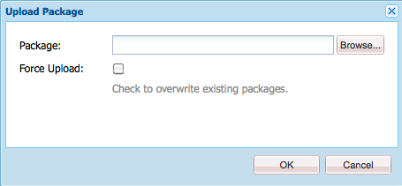

# Gerenciador de pacotes {#working-with-packages}

Os pacotes permitem importar e exportar conteúdo do repositório. Você pode usar pacotes para instalar novo conteúdo, transferir conteúdo entre instâncias e fazer backup do conteúdo do repositório.

Com o Gerenciador de pacotes, é possível transferir pacotes entre a instância do AEM e o sistema de arquivos local para fins de desenvolvimento.

## O que são pacotes? {#what-are-packages}

Um pacote é um arquivo zip que contém o conteúdo do repositório no formato de serialização de sistemas de arquivos, chamado de serialização do Vault, fornecendo uma representação fácil de usar e editar de arquivos e pastas. O conteúdo incluído no pacote é definido usando filtros.

Um pacote também contém informações meta do Vault, incluindo as definições de filtro e as informações de configuração de importação. As propriedades de conteúdo adicionais, que não são usadas para a extração de pacotes, podem ser incluídas no pacote, como uma descrição, uma imagem visual ou um ícone. Essas propriedades de conteúdo adicionais são apenas para o consumidor do pacote de conteúdo e para fins informativos.

>[!NOTE]
>
>Os pacotes representam a versão atual do conteúdo no momento em que o pacote é criado. Eles não incluem nenhuma versão anterior do conteúdo que o AEM mantém no repositório.

## Pacotes no AEM as a Cloud Service {#aemaacs-packages}

Os pacotes de conteúdo criados para aplicativos do AEM as a Cloud Service devem ter uma separação clara entre conteúdo imutável e mutável. Portanto, o Gerenciador de pacotes só pode ser usado para gerenciar pacotes com conteúdo. Qualquer código deve ser implantado por meio do Cloud Manager.

>[!NOTE]
>
>Os pacotes só podem conter conteúdo. Qualquer funcionalidade (por exemplo, conteúdo armazenado em `/apps`) deve ser [implantada usando seu pipeline de CI/CD no Cloud Manager](/help/implementing/cloud-manager/deploy-code.md).

>[!IMPORTANT]
>
>A interface do Gerenciador de pacotes pode retornar uma mensagem de erro **indefinida** se um pacote levar mais de 10 minutos para ser instalado.
>
>Isso não acontece devido a um erro na instalação, mas a um tempo limite que o Cloud Service tem para todas as solicitações.
>
>Não repita a instalação se esse erro aparecer. A instalação está ocorrendo corretamente em segundo plano. Se você reiniciar a instalação, alguns conflitos poderão ser introduzidos por vários processos de importação simultâneos.

Para obter mais detalhes sobre como gerenciar pacotes para o AEMaaCS, consulte [Implantação no AEM as a Cloud Service](/help/implementing/deploying/overview.md) no guia do usuário de implantação.

## Tamanho do pacote {#package-size}

O Adobe recomenda não criar pacotes grandes. Isso evita problemas de tempo limite ao carregar e baixar pacotes.

Regra geral, um pacote deve ser transmitido na íntegra no prazo de 60 segundos. Isso fornece a seguinte fórmula como guia.

```text
MaxPackageSize (in MB) = ConnectionSpeed (in MB/s) * 60 s
```

Como o tráfego de rede é variável e é sempre menor do que o valor teórico máximo anunciado, tente usar uma ferramenta de teste de velocidade de conexão de internet online.

As velocidades da Internet são quase sempre diferentes para uploads e downloads. Supondo que você precise carregar e baixar pacotes, você deve usar o valor mais baixo (geralmente a velocidade de upload) no seu cálculo.

### Exemplo {#example}

Usando uma ferramenta de teste de velocidade da Internet, vejo que minha velocidade de upload atual é de aproximadamente 100 Mbps.

```text
100 Mbps = 12.5 MB/s
12.5 MB/s * 60 s = 750 MB
```

Portanto, qualquer pacote que eu criar deverá ter menos de 750 MB.

>[!NOTE]
>
>As velocidades da rede estão sujeitas às condições locais atuais. Mesmo com um teste de velocidade recente, sua taxa de transferência real pode variar.
>
>Portanto, a fórmula fornecida é apenas uma diretriz e o tamanho máximo recomendado do pacote real pode variar.

## Gerenciador de pacotes {#package-manager}

O Gerenciador de pacotes gerencia os pacotes na instalação do AEM. Depois de [atribuir as permissões necessárias](#permissions-needed-for-using-the-package-manager), você poderá usar o Gerenciador de Pacotes para várias ações, incluindo configuração, compilação, download e instalação de pacotes.

### Permissões necessárias {#required-permissions}

Para criar, modificar, fazer upload e instalar pacotes, os usuários devem ter as permissões apropriadas nos seguintes nós:

* Direitos completos excluindo exclusão em `/etc/packages`
* O nó que contém o conteúdo do pacote

>[!CAUTION]
>
>A concessão de permissões para pacotes pode levar à divulgação de informações confidenciais e perda de dados.
>
>Para limitar esses riscos, é altamente recomendável conceder permissões de grupo específicas somente sobre subárvores dedicadas.

### Acessar o Gerenciador de pacotes {#accessing}

Você pode acessar o Gerenciador de pacotes de três maneiras:

1. No menu principal do AEM > **Ferramentas** > **Implantação** > **Pacotes**
1. De [CRXDE Lite](crxde.md) usando a barra do alternador superior
1. Acessando diretamente `http://<host>:<port>/crx/packmgr/`

### Interface do usuário do Gerenciador de pacotes {#ui}

O Gerenciador de pacotes está dividido em quatro áreas funcionais principais:

* **Painel de Navegação à Esquerda** - Esse painel permite filtrar e classificar a lista de pacotes.
* **Lista de Pacotes** - Esta é a lista de pacotes na sua instância filtrada e classificada de acordo com as seleções no Painel de Navegação Esquerdo.
* **Log de atividades** - Esse painel é minimizado no início e expande-se para detalhar a atividade do Gerenciador de Pacotes, por exemplo, quando um pacote é compilado ou instalado. Há botões adicionais na guia Registro de atividades para:
   * **Limpar Log**
   * **Mostrar/Ocultar**
* **Barra de Ferramentas** - A barra de ferramentas contém botões de atualização para o Painel de Navegação Esquerdo e a lista de Pacotes, além de botões para pesquisar, criar e carregar pacotes.


Clicar em uma opção no Painel de navegação esquerdo filtra imediatamente a Lista de pacotes.

Clicar em um nome de pacote expande a entrada na Lista de pacotes para mostrar mais detalhes sobre o pacote.


Há várias ações que podem ser executadas em um pacote por meio dos botões da barra de ferramentas disponíveis quando os detalhes do pacote são expandidos.

* [Editar](#edit-package)
* [Build](#building-a-package)
* [Reinstalar](#reinstalling-packages)
* [Download](#downloading-packages-to-your-file-system)

Outras ações estão disponíveis abaixo do botão **Mais**.

* [Excluir](#deleting-packages)
* [Abrangência](#package-coverage)
* [Conteúdo](#viewing-package-contents-and-testing-installation)
* [Reajustar](#rewrapping-a-package)
* [Outras versões](#other-versions)
* [Desinstalar](#uninstalling-packages)
* [Testar instalação](#viewing-package-contents-and-testing-installation)
* [Validar](#validating-packages)
* [Replicar](#replicating-packages)

### Status do pacote {#package-status}

Cada entrada na lista de pacotes tem um indicador de status para informar rapidamente o status do pacote. Passar o mouse sobre o status revela uma dica de ferramenta com os detalhes do status.


Se o pacote tiver sido alterado ou nunca tiver sido criado, o status será apresentado como um link para executar uma ação rápida para recriar ou instalar o pacote.

## Configurações do pacote {#package-settings}

Um pacote é essencialmente um conjunto de filtros e os dados do repositório com base nesses filtros. Usando a interface do usuário do Gerenciador de Pacotes, você pode clicar em um pacote e no botão **Editar** para exibir os detalhes de um pacote, incluindo as configurações a seguir.

* [Configurações gerais](#general-settings)
* [Filtros do pacote](#package-filters)
* [Dependências de pacote](#package-dependencies)
* [Configurações avançadas](#advanced-settings)
* [Capturas de tela do pacote](#package-screenshots)

### Configurações gerais {#general-settings}

É possível editar uma variedade de configurações de pacote para definir informações como descrição do pacote, dependências e detalhes do provedor.

A caixa de diálogo **Configurações de Pacote** está disponível por meio do botão **Editar** ao [criar](#creating-a-new-package) ou [editar](#viewing-and-editing-package-information) um pacote. Depois que as alterações forem feitas, clique em **Salvar**.


| Texto | Descrição |
|---|---|
| Nome | O nome do pacote |
| Grupo | Para organizar pacotes, digite o nome de um novo grupo ou selecione um grupo existente |
| Versão | Texto a ser usado para a versão |
| Descrição | Uma breve descrição do pacote que permite a marcação HTML para formatação |
| Miniatura  | O ícone que aparece com a lista de pacotes |

### Filtros do pacote {#package-filters}

Os filtros identificam os nós de repositório a serem incluídos no pacote. Uma **Definição de Filtro** especifica as seguintes informações:

* O **Caminho raiz** do conteúdo a ser incluído
* **Regras** que incluem ou excluem nós específicos abaixo do caminho raiz

Adicionar regras usando o botão **+**. Remova regras usando o botão **-**.

As regras são aplicadas de acordo com sua ordem, portanto, posicione-as conforme necessário usando os botões de seta **Para cima** e **Para baixo**.

Os filtros podem incluir zero ou mais regras. Quando nenhuma regra é definida, o pacote contém todo o conteúdo abaixo do caminho raiz.

É possível definir uma ou mais definições de filtro para um pacote. Use mais de um filtro para incluir conteúdo de vários caminhos raiz.


Ao criar regras, você define uma expressão regular (também conhecida como regex, regexp ou expressão racional) para especificar todos os nós que deseja incluir ou excluir.

| Tipo de regra | Descrição |
|---|---|
| include | Incluir incluirá todos os arquivos e pastas no diretório especificado que correspondam à expressão regular. Incluir **não** incluirá outros arquivos ou pastas do caminho raiz especificado. |
| excluir | Excluir excluirá todos os arquivos e pastas que correspondem à expressão regular. |

Os filtros de pacote geralmente são definidos quando você [cria o pacote pela primeira vez.](#creating-a-new-package) No entanto, eles também podem ser editados mais tarde, depois disso, o pacote deve ser recriado para atualizar seu conteúdo com base nas novas definições de filtro.

>[!TIP]
>
>Um pacote pode conter várias definições de filtro, para que nós de locais diferentes possam ser facilmente combinados em um pacote.

>[!TIP]
>
>Para obter informações de fundo, consulte a documentação do [Apache Jackrabbit - Filtro Workspace](https://jackrabbit.apache.org/filevault/filter.html).

### Dependências {#dependencies}


| Texto | Descrição | Exemplo/Detalhes |
|---|---|---|
| Testada com | O nome e a versão do produto com os quais este pacote é destinado ou compatível. | `AEMaaCS` |
| Problemas corrigidos | Um campo de texto que permite a listagem de detalhes de bugs corrigidos com este pacote, um bug por linha | - |
| Depende de | Lista outros pacotes necessários para que o pacote atual seja executado como esperado quando instalado | `groupId:name:version` |
| Substitui | Uma lista de pacotes obsoletos que este pacote substitui | `groupId:name:version` |

### Configurações avançadas {#advanced-settings}


| Texto | Descrição | Exemplo/Detalhes |
|---|---|---|
| Nome | O nome do provedor do pacote | `WKND Media Group` |
| URL | URL do provedor | `https://wknd.site` |
| Link | Link específico do pacote para uma página do provedor | `https://wknd.site/package/` |
| Exige | Define se há restrições ao instalar o pacote | **Administrador** - O pacote só deve ser instalado com privilégios de administrador <br>**Reiniciar** - o AEM deve ser reiniciado após a instalação do pacote |
| Reparação de AC | Especifica como as informações de controle de acesso definidas no pacote são tratadas quando o pacote é importado | **Ignorar** - Preservar ACLs no repositório <br>**Substituir** - Substituir ACLs no repositório <br>**Mesclar** - Mesclar ambos os conjuntos de ACLs <br>**MergePreserve** - Mesclar o controle de acesso no conteúdo com o fornecido com o pacote, adicionando as entradas de controle de acesso das entidades de segurança não presentes no conteúdo <br>**Limpar** - Limpar ACLs |

### Capturas de tela do pacote {#package-screenshots}

Você pode anexar várias capturas de tela ao seu pacote para fornecer uma representação visual de como o conteúdo aparece.


## Ações do pacote {#package-actions}

Há muitas ações que podem ser executadas em um pacote.

### Criação de um pacote {#creating-a-new-package}

1. [Acesse o Gerenciador de pacotes.](#accessing)

1. Clique em **Criar Pacote**.

   >[!TIP]
   >
   >Se a instância tiver muitos pacotes, talvez haja uma estrutura de pastas em vigor. Nesses casos, é mais fácil navegar até a pasta de destino necessária antes de criar o novo pacote.

1. Na caixa de diálogo **Novo Pacote**, insira os seguintes campos:

   

   * **Nome do Pacote** - Selecione um nome descritivo para ajudá-lo (e a outras pessoas) a identificar facilmente o conteúdo do pacote.

   * **Versão** - Este é um campo textual para que você indique uma versão. Ele é anexado ao nome do pacote para formar o nome do arquivo zip.

   * **Grupo** - Este é o nome do grupo (ou pasta) de destino. Os grupos ajudam a organizar seus pacotes. Uma pasta é criada para o grupo se ele ainda não existir. Se você deixar o nome do grupo em branco, ele criará o pacote na lista de pacotes principal.

1. Clique em **OK** para criar o pacote.

1. O AEM lista o novo pacote no topo da lista de pacotes.

   

1. Clique em **Editar** para definir o conteúdo do pacote [.](#package-contents) Clique em **Salvar** depois que terminar de editar as configurações.

1. Agora você pode [Criar](#building-a-package) seu pacote.

Não é obrigatório criar o pacote imediatamente após criá-lo. Um pacote não criado não tem conteúdo e consiste apenas nos dados de filtro e outros metadados do pacote.

>[!TIP]
>
>Para evitar tempos limite, o Adobe recomenda [não criar pacotes grandes.](#package-size)

### Criação de um pacote {#building-a-package}

Um pacote é frequentemente criado ao mesmo tempo em que você [cria o pacote](#creating-a-new-package), mas você pode retornar posteriormente para compilar ou recompilar o pacote. Isso pode ser útil se o conteúdo no repositório tiver sido alterado ou os filtros do pacote tiverem sido alterados.

1. [Acesse o Gerenciador de pacotes.](#accessing)

1. Abra os detalhes do pacote na lista de pacotes clicando no nome do pacote.

1. Clique em **Build**. Uma caixa de diálogo solicita a confirmação de que você deseja criar o pacote porque qualquer conteúdo existente do pacote será substituído.

1. Clique em **OK**. O AEM cria o pacote, listando todo o conteúdo adicionado ao pacote como faz na lista de atividades. Quando concluído, o AEM exibe uma confirmação de que o pacote foi criado e (quando você fecha a caixa de diálogo) atualiza as informações da lista de pacotes.

>[!TIP]
>
>Para evitar tempos limite, o Adobe recomenda [não criar pacotes grandes.](#package-size)

### Editar um pacote {#edit-package}

Depois que um pacote for carregado para AEM, você poderá modificar suas configurações.

1. [Acesse o Gerenciador de pacotes.](#accessing)

1. Abra os detalhes do pacote na lista de pacotes clicando no nome do pacote.

1. Clique em **Editar** e atualize as **[Configurações de Pacote](#package-settings)** conforme necessário.

1. Clique em **Salvar** para salvar.

Talvez seja necessário [recompilar o pacote](#building-a-package) para atualizar seu conteúdo com base nas alterações feitas.

### Reencapsulamento de um pacote {#rewrapping-a-package}

Depois que um pacote é criado, ele pode ser empacotado novamente. Reajustar altera as informações do pacote sem alterar a miniatura, a descrição etc., sem alterar o conteúdo do pacote.

1. [Acesse o Gerenciador de pacotes.](#accessing)

1. Abra os detalhes do pacote na lista de pacotes clicando no nome do pacote.

1. Clique em **Editar** e atualize as **[Configurações de Pacote](#package-settings)** conforme necessário.

1. Clique em **Salvar** para salvar.

1. Clique em **Mais** > **Reajustar** e uma caixa de diálogo pedirá confirmação.

### Exibindo Outras Versões do Pacote {#other-versions}

Como cada versão de um pacote aparece na lista como qualquer outro pacote, o Gerenciador de pacotes pode encontrar outras versões de um pacote selecionado.

1. [Acesse o Gerenciador de pacotes.](#accessing)

1. Abra os detalhes do pacote na lista de pacotes clicando no nome do pacote.

1. Clique em **Mais** > **Outras versões** e uma caixa de diálogo será aberta com uma lista de outras versões do mesmo pacote com informações de status.

### Visualizando o conteúdo do pacote e testando a instalação {#viewing-package-contents-and-testing-installation}

Depois que um pacote for criado, é possível visualizar o conteúdo.

1. [Acesse o Gerenciador de pacotes.](#accessing)

1. Abra os detalhes do pacote na lista de pacotes clicando no nome do pacote.

1. Para exibir o conteúdo, clique em **Mais** > **Conteúdo**, e o Gerenciador de Pacotes listará todo o conteúdo do pacote no log de atividades.

   

1. Para executar a instalação a seco, clique em **Mais** > **Testar Instalação** e nos relatórios do Gerenciador de Pacotes no log de atividades para exibir os resultados como se a instalação tivesse sido executada.

   

### Fazendo download de pacotes para seu sistema de arquivos {#downloading-packages-to-your-file-system}

1. [Acesse o Gerenciador de pacotes.](#accessing)

1. Abra os detalhes do pacote na lista de pacotes clicando no nome do pacote.

1. Clique no botão **Download** ou no nome de arquivo vinculado do pacote na área de detalhes do pacote.

1. O AEM baixa o pacote para o computador.

>[!TIP]
>
>Para evitar tempos limite, o Adobe recomenda [não criar pacotes grandes.](#package-size)

### Fazer upload de pacotes do seu sistema de arquivos {#uploading-packages-from-your-file-system}

1. [Acesse o Gerenciador de pacotes.](#accessing)

1. Selecione a pasta de grupo na qual deseja que o pacote seja carregado.

1. Clique no botão **Carregar pacote**.

1. Forneça as informações necessárias sobre o pacote carregado.

   

   * **Pacote** - Use o botão **Procurar...** para selecionar o pacote necessário no sistema de arquivos local.
   * **Forçar Carregamento** - Se um pacote com esse nome já existir, essa opção forçará o carregamento e substituirá o pacote existente.

1. Clique em **OK** e o pacote selecionado será carregado e a lista de pacotes será atualizada adequadamente.

O conteúdo do pacote agora existe no AEM, mas para disponibilizá-lo para uso, certifique-se de [instalar o pacote](#installing-packages).

>[!TIP]
>
>Para evitar tempos limite, o Adobe recomenda [não criar pacotes grandes.](#package-size)

### Validação de pacotes {#validating-packages}

Como os pacotes podem modificar o conteúdo existente, geralmente é útil validar essas alterações antes de instalar.

#### Opções de validação {#validation-options}

O Gerenciador de pacotes pode executar as seguintes validações:

* [Importações de pacote OSGi](#osgi-package-imports)
* [Sobreposições](#overlays)
* [ACLs](#acls)

##### Validar importações do pacote OSGi {#osgi-package-imports}

>[!NOTE]
>
>Como os pacotes não podem ser usados para implantar código no AEMaaCS, a validação **Importações de pacotes OSGi** é desnecessária.

**O que está marcado**

Essa validação inspeciona o pacote de todos os arquivos JAR (pacotes OSGi), extrai seus `manifest.xml` (que contêm as dependências com versão das quais o pacote OSGi depende) e verifica as exportações da instância AEM para essas dependências com as versões corretas.

**Como é Relatado**

Todas as dependências com versão que não podem ser satisfeitas pela instância AEM são listadas no Log de atividades do Gerenciador de pacotes.

**Estados de erro**

Se as dependências não forem satisfeitas, os pacotes OSGi no pacote com essas dependências não serão iniciados. Isso resulta em uma implantação de aplicativo com falha, pois qualquer item que depende do pacote OSGi não iniciado não funcionará corretamente.

**Resolução do Erro**

Para resolver erros devido a pacotes OSGi não satisfeitos, a versão de dependência no pacote com importações não satisfeitas deve ser ajustada.

##### Validar sobreposições {#overlays}

>[!NOTE]
>
>Como os pacotes não podem ser usados para implantar código no AEMaaCS, a validação de **Sobreposições** é desnecessária.

**O que está marcado**

Essa validação determina se o pacote que está sendo instalado contém um arquivo que já está sobreposto na instância AEM de destino.

Por exemplo, dada uma sobreposição existente em `/apps/sling/servlet/errorhandler/404.jsp`, um pacote que contém `/libs/sling/servlet/errorhandler/404.jsp`, tal que irá alterar o arquivo existente em `/libs/sling/servlet/errorhandler/404.jsp`.

**Como é Relatado**

Essas sobreposições são descritas no Log de atividades do Gerenciador de pacotes.

**Estados de erro**

Um estado de erro significa que o pacote está tentando implantar um arquivo que já está sobreposto, portanto, as alterações no pacote serão substituídas (e, portanto, &quot;ocultas&quot;) pela sobreposição e não terão efeito.

**Resolução do Erro**

Para resolver esse problema, o mantenedor do arquivo de sobreposição em `/apps` deve revisar as alterações no arquivo sobreposto em `/libs`, incorporar as alterações conforme necessário na sobreposição ( `/apps`) e reimplantar o arquivo sobreposto.

>[!NOTE]
>
>O mecanismo de validação não tem como reconciliar se o conteúdo sobreposto foi incorporado corretamente no arquivo de sobreposição. Portanto, essa validação continuará a relatar conflitos mesmo depois que as alterações necessárias forem feitas.

##### Validar ACLs {#acls}

**O que está marcado**

Essa validação verifica quais permissões estão sendo adicionadas, como elas são tratadas (mesclar/substituir) e se as permissões atuais são afetadas.

**Como é Relatado**

As permissões são descritas no Log de atividades do Gerenciador de pacotes.

**Estados de erro**

Nenhum erro explícito pode ser fornecido. A validação simplesmente indica se qualquer nova permissão de ACL é adicionada ou afetada pela instalação do pacote.

**Resolução do Erro**

Usando as informações fornecidas pela validação, os nós afetados podem ser revisados no CRXDE e as ACLs podem ser ajustadas no pacote conforme necessário.

>[!CAUTION]
>
>Como prática recomendada, os pacotes não devem afetar as ACLs fornecidas pelo AEM, pois isso pode resultar em um comportamento inesperado.

#### Executando validação {#performing-validation}

A validação de pacotes pode ser feita de duas maneiras diferentes:

* [Pela interface do usuário do Gerenciador de pacotes](#via-package-manager)
* [Por solicitação HTTP POST, como com cURL](#via-post-request)

A validação sempre deve ocorrer após o upload do pacote, mas antes de instalá-lo.

##### Validação De Pacote Via Gerenciador De Pacotes {#via-package-manager}

1. [Acesse o Gerenciador de pacotes.](#accessing)

1. Abra os detalhes do pacote na lista de pacotes clicando no nome do pacote.

1. Para validar o pacote, clique em **Mais** > **Validar**,

1. Na caixa de diálogo modal exibida, use as caixas de seleção para selecionar o(s) tipo(s) de validação e iniciar a validação clicando em **Validar**.

1. A(s) validação(s) escolhida(s) é/são executada(s) e os resultados são exibidos no Log de atividades do Gerenciador de pacotes.

##### Validação de pacote por meio de solicitação POST HTTP {#via-post-request}

A solicitação POST assume o seguinte formato.

```
https://<host>:<port>/crx/packmgr/service.jsp?cmd=validate&type=osgiPackageImports,overlays,acls
```

O parâmetro `type` pode ser qualquer lista não ordenada separada por vírgulas formada por:

* `osgiPackageImports`
* `overlays`
* `acls`

O valor padrão de `type` é `osgiPackageImports`, caso não seja explicitamente passado.

Ao usar cURL, execute uma instrução semelhante à seguinte:

```shell
curl -v -X POST --user admin:admin -F file=@/Users/SomeGuy/Desktop/core.wcm.components.all-1.1.0.zip 'http://localhost:4502/crx/packmgr/service.jsp?cmd=validate&type=osgiPackageImports,overlays,acls'
```

Ao validar por meio da solicitação POST, a resposta é enviada de volta como um objeto JSON.

### Visualizando a cobertura do pacote {#package-coverage}

Os pacotes são definidos por seus filtros. O Gerenciador de pacotes pode aplicar filtros de um pacote ao conteúdo existente do repositório para mostrar qual conteúdo do repositório é coberto pela definição de filtro do pacote.

1. [Acesse o Gerenciador de pacotes.](#accessing)

1. Abra os detalhes do pacote na lista de pacotes clicando no nome do pacote.

1. Clique em **Mais** > **Cobertura**.

1. Os detalhes da cobertura estão listados no Log de atividades.

### Instalação de pacotes {#installing-packages}

Fazer upload de um pacote adiciona somente o conteúdo do pacote ao repositório, mas ele não está acessível. Você deve instalar o pacote carregado para usar o conteúdo do pacote.

>[!CAUTION]
>
>A instalação de um pacote pode substituir ou excluir conteúdo existente. Carregue um pacote somente se tiver certeza de que ele não exclui nem substitui o conteúdo necessário.

Antes da instalação do pacote, o Gerenciador de pacotes cria automaticamente um pacote de instantâneos que contém o conteúdo que é substituído. Este snapshot será reinstalado se você desinstalar o pacote.

1. [Acesse o Gerenciador de pacotes.](#accessing)

1. Abra os detalhes do pacote que deseja instalar na lista de pacotes clicando no nome do pacote.

1. Clique no botão **Instalar** nos detalhes do item ou no link **Instalar** no status do pacote.

1. Uma caixa de diálogo solicitará confirmação e permitirá a especificação de opções adicionais.

   * **Extrair Somente** - Extraia o pacote somente para que nenhum instantâneo seja criado e, portanto, a desinstalação não seja possível
   * **Limite de Salvamento** - Número de nós transitórios até que o salvamento automático seja acionado (aumente se você encontrar exceções de modificação simultâneas)
   * **Extrair Subpacotes** - Habilitar a extração automática de subpacotes
   * **Manipulação de Controle de Acesso** - Especifica como as informações de controle de acesso definidas no pacote são tratadas quando o pacote é instalado (as opções são iguais às [configurações avançadas do pacote](#advanced-settings))
   * **Tratamento de Dependências** - Especifique como as dependências são tratadas durante a instalação

1. Clique em **Instalar**.

1. O Registro de atividades detalha o progresso da instalação.

Quando a instalação for concluída com êxito, a lista de pacotes será atualizada e a palavra **Instalado** aparecerá no status do pacote.

### Reinstalação de pacotes {#reinstalling-packages}

A reinstalação de pacotes executa as mesmas etapas em um pacote já instalado que são processadas quando o [instala inicialmente o pacote.](#installing-packages)

### Upload e instalação baseados no sistema de arquivos {#file-system-based-upload-and-installation}

Você pode abandonar o Gerenciador de pacotes completamente ao instalar pacotes. O AEM pode detectar pacotes colocados em um local específico no sistema de arquivos local da máquina host, carregá-los e instalá-los automaticamente.

1. Na pasta de instalação do AEM, há uma pasta `crx-quicksart` ao lado do jar e do arquivo `license.properties`. Crie uma pasta chamada `install` em `crx-quickstart`, resultando no caminho `<aem-home>/crx-quickstart/install`.

1. Nesta pasta, adicione seus pacotes. Eles serão carregados e instalados automaticamente na sua instância.

1. Quando o upload e a instalação estiverem concluídos, você poderá ver os pacotes no Gerenciador de pacotes como se tivesse usado a interface do usuário do Gerenciador de pacotes para instalá-los.

Se a instância estiver em execução, o carregamento e a instalação serão iniciados imediatamente quando você adicioná-los ao pacote na pasta `install`

Se a instância não estiver em execução, os pacotes colocados na pasta `install` serão instalados na inicialização em ordem alfabética.

### Desinstalando pacotes {#uninstalling-packages}

A desinstalação do pacote reverte o conteúdo do repositório para o instantâneo criado automaticamente pelo Gerenciador de Pacotes antes da instalação.

1. [Acesse o Gerenciador de pacotes.](#accessing)

1. Abra os detalhes do pacote que deseja desinstalar na lista de pacotes clicando no nome do pacote.

1. Clique em **Mais** > **Desinstalar** para remover o conteúdo deste pacote do repositório.

1. Uma caixa de diálogo solicitará confirmação e listará todas as alterações que estão sendo feitas.

1. O pacote é removido e o instantâneo é aplicado. O progresso do processo é mostrado no Log de atividades.

### Exclusão de pacotes {#deleting-packages}

A exclusão de um pacote exclui somente seus detalhes do Gerenciador de pacotes. Se esse pacote já tiver sido instalado, o conteúdo instalado não será excluído.

1. [Acesse o Gerenciador de pacotes.](#accessing)

1. Abra os detalhes do pacote que deseja excluir na lista de pacotes clicando no nome do pacote.

1. AEM solicita confirmação de que você deseja excluir o pacote. Clique em **OK** para confirmar a exclusão.

1. As informações do pacote são excluídas e os detalhes são relatados no Log de atividades.

### Replicação de pacotes {#replicating-packages}

Replicar o conteúdo de um pacote para instalá-lo na instância de publicação.

1. [Acesse o Gerenciador de pacotes.](#accessing)

1. Abra os detalhes do pacote que deseja replicar na lista de pacotes clicando no nome do pacote.

1. Clique em **Mais** > **Replicar**.

1. O pacote é replicado e os detalhes são relatados no Registro de atividades.

## Distribuição de software {#software-distribution}

Os pacotes AEM podem ser usados para criar e compartilhar conteúdo em ambientes AEMaaCS.

A [Distribuição de Software](https://downloads.experiencecloud.adobe.com) fornece pacotes AEM para uso no SDK AEM de desenvolvimento local. Os pacotes de AEM fornecidos na Distribuição de software não devem ser instalados em ambientes de nuvem do AEMaaCS, a menos que expressamente aprovado pelo Suporte do Adobe.

Para obter mais informações, consulte a [documentação de Distribuição de Software.](https://experienceleague.adobe.com/docs/experience-cloud/software-distribution/home.html?lang=pt-br)
