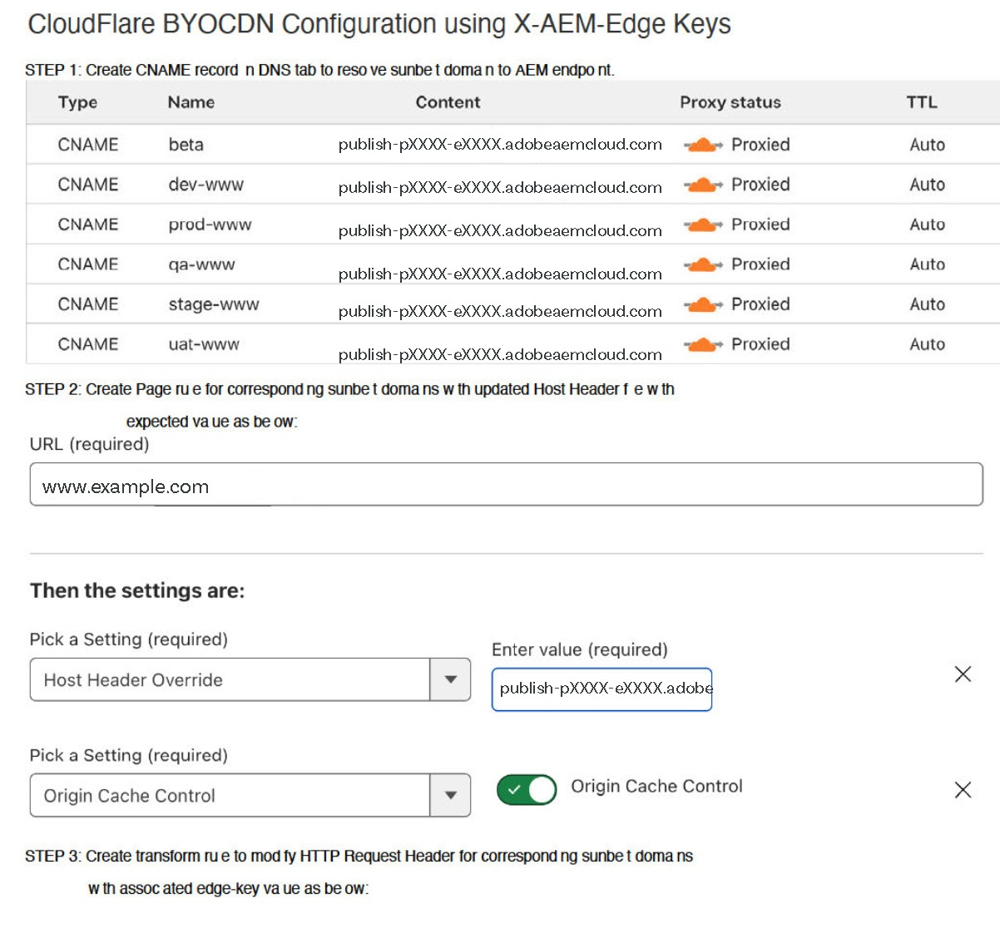

# CDN no AEM as a Cloud Service {#cdn}

>[!CONTEXTUALHELP]
>id="aemcloud_golive_cdn"
>title="CDN no AEM as a Cloud Service"
>abstract="O AEM as Cloud Service é enviado com uma CDN pré-criada. Seu principal objetivo é reduzir a latência, fornecendo conteúdo que pode ser armazenado em cache a partir dos nós CDN na borda, perto do navegador. Ele é totalmente gerenciado e configurado para obter o desempenho ideal dos aplicativos AEM."

O AEM as Cloud Service é enviado com uma CDN pré-criada. Seu principal objetivo é reduzir a latência, fornecendo conteúdo que pode ser armazenado em cache a partir dos nós CDN na borda, perto do navegador. Ele é totalmente gerenciado e configurado para obter o desempenho ideal dos aplicativos AEM.

A CDN gerenciada por AEM atende à maioria dos requisitos de desempenho e segurança do cliente. Para o nível de publicação, os clientes têm a opção de apontar para ela a partir de sua própria CDN, a qual precisarão gerenciar. Isso será permitido caso a caso, com base no cumprimento de certos pré-requisitos, incluindo, entre outros, uma integração herdada do cliente com seu fornecedor de CDN que seja difícil de abandonar.

<!-- ERROR: NEITHER URL IS FOUND (HTTP ERROR 404) Also, see the following videos [Cloud 5 AEM CDN Part 1](https://experienceleague.adobe.com/docs/experience-manager-learn/cloud-service/cloud-5/cloud5-aem-cdn-part1.html) and [Cloud 5 AEM CDN Part 2](https://experienceleague.adobe.com/docs/experience-manager-learn/cloud-service/cloud-5/cloud5-aem-cdn-part2.html) for additional information about CDN in AEM as a Cloud Service. -->

## CDN gerenciada por AEM  {#aem-managed-cdn}

Siga as seções abaixo para usar a interface de autoatendimento do Cloud Manager para se preparar para a entrega de conteúdo usando a CDN pronta para uso do AEM:

1. [Gerenciar certificados SSL](/help/implementing/cloud-manager/managing-ssl-certifications/introduction.md)
1. [Gerenciar nomes de domínio personalizados](/help/implementing/cloud-manager/custom-domain-names/introduction.md)

**Restringindo o tráfego**

Por padrão, para uma configuração de CDN gerenciada pelo AEM, todo o tráfego público pode chegar ao serviço de publicação para ambientes de produção e não produção (desenvolvimento e preparo). É possível limitar o tráfego para o serviço de publicação de um determinado ambiente (por exemplo, limitação de preparo por um intervalo de endereços IP) por meio da interface do usuário do Cloud Manager.

Consulte [Gerenciamento de listas de permissões de IP](/help/implementing/cloud-manager/ip-allow-lists/introduction.md) para saber mais.

>[!CAUTION]
>
>Somente as solicitações dos IPs permitidos são atendidas pelo CDN gerenciado pelo AEM. Se você apontar seu próprio CDN para o CDN gerenciado por AEM, verifique se os IPs do seu CDN estão incluídos no incluo na lista de permissões.

### Configuração do tráfego no CDN {#cdn-configuring-cloud}

Configure o tráfego na CDN de várias maneiras, incluindo:
* bloqueando tráfego mal-intencionado com [Regras de filtro de tráfego](/help/security/traffic-filter-rules-including-waf.md) (incluindo regras WAF avançadas opcionalmente licenciáveis)
* modificando a natureza da [solicitação e resposta](/help/implementing/dispatcher/cdn-configuring-traffic.md#request-transformations)
* aplicando [redirecionamentos do lado do cliente](/help/implementing/dispatcher/cdn-configuring-traffic.md#client-side-redirectors) do 301/302
* declarando [seletores de origem](/help/implementing/dispatcher/cdn-configuring-traffic.md#client-side-redirectors) para reverter uma solicitação de proxy para back-ends não-AEM

Saiba como configurar esses recursos usando arquivos YAML no Git e implantando-os usando o [Pipeline de configuração](/help/implementing/dispatcher/cdn-configuring-traffic.md) do Cloud Manager.

### Configuração de páginas de erro do CDN {#cdn-error-pages}

Uma página de erro CDN pode ser configurada para substituir a página padrão, sem marca, fornecida ao navegador no raro evento de não conseguir acessar o AEM. Para obter mais detalhes, consulte [Configurando páginas de erro da CDN](/help/implementing/dispatcher/cdn-error-pages.md).

### Limpar conteúdo em cache na CDN {#purge-cdn}

A definição do TTL usando o cabeçalho HTTP Cache-Control é uma abordagem eficaz para equilibrar o desempenho da entrega de conteúdo e a atualização de conteúdo. No entanto, em cenários em que é essencial fornecer imediatamente conteúdo atualizado, pode ser útil limpar diretamente o cache do CDN.

Leia sobre [configuração de um token de API de limpeza](/help/implementing/dispatcher/cdn-credentials-authentication.md/#purge-API-token) e [limpeza do conteúdo CDN em cache](/help/implementing/dispatcher/cdn-cache-purge.md).

### Autenticação básica na CDN {#basic-auth}

Para casos de uso de autenticação simples, incluindo partes interessadas de negócios que revisam o conteúdo, proteja o conteúdo exibindo uma caixa de diálogo de autenticação básica que requer um nome de usuário e senha. [Saiba mais](/help/implementing/dispatcher/cdn-credentials-authentication.md) e participe do programa de adoção antecipada.

## O cliente CDN aponta para o CDN gerenciado pelo AEM {#point-to-point-CDN}

>[!CONTEXTUALHELP]
>id="aemcloud_golive_byocdn"
>title="A CDN do cliente aponta para a CDN gerenciada pelo AEM"
>abstract="O AEM as a Cloud Service oferece uma opção para os clientes usarem sua CDN existente. Para o nível de publicação, os clientes têm a opção de apontar para ela a partir de sua própria CDN, a qual precisarão gerenciar. Isso será permitido caso a caso, com base no cumprimento de certos pré-requisitos, incluindo, entre outros, uma integração herdada do cliente com seu fornecedor de CDN que seja difícil de abandonar."

Se um cliente precisar usar sua CDN existente, ele poderá gerenciá-la e apontá-la para a CDN gerenciada pelo AEM, desde que:

* O cliente deve ter uma CDN existente que seria onerosa para substituir.
* O cliente deve gerenciá-lo.
* O cliente deve ser capaz de configurar a CDN para funcionar com a AEM as a Cloud Service - consulte as instruções de configuração apresentadas abaixo.
* O cliente deve ter especialistas em CDN de engenharia que estejam à disposição para o caso de surgirem problemas relacionados.
* O cliente deve executar e passar com êxito em um teste de carga antes de ir para a produção.

Instruções de configuração:

1. Aponte seu CDN para o ingresso do CDN do Adobe como seu domínio de origem. Por exemplo, `publish-p<PROGRAM_ID>-e<ENV-ID>.adobeaemcloud.com`.
1. Defina SNI para o ingresso do CDN do Adobe.
1. Defina o cabeçalho Host para o domínio de origem. Por exemplo: `Host:publish-p<PROGRAM_ID>-e<ENV-ID>.adobeaemcloud.com`.
1. Defina o cabeçalho `X-Forwarded-Host` com o nome de domínio para que o AEM possa determinar o cabeçalho do host. Por exemplo: `X-Forwarded-Host:example.com`.
1. Defina `X-AEM-Edge-Key`. O valor deve ser configurado usando um pipeline de configuração do Cloud Manager, conforme descrito em [este artigo.](/help/implementing/dispatcher/cdn-credentials-authentication.md#CDN-HTTP-value)

   * Necessário para que o CDN do Adobe possa validar a origem das solicitações e transmitir os cabeçalhos `X-Forwarded-*` para o aplicativo AEM. Por exemplo, `X-Forwarded-For` é usado para determinar o IP do cliente. Portanto, torna-se responsabilidade do chamador confiável (ou seja, a CDN gerenciada pelo cliente) garantir a exatidão dos cabeçalhos `X-Forwarded-*` (consulte a observação abaixo).
   * Opcionalmente, o acesso ao ingresso da CDN do Adobe pode ser bloqueado quando um `X-AEM-Edge-Key` não estiver presente. Informe o Adobe se precisar de acesso direto ao ingresso do CDN do Adobe (para ser bloqueado).

Consulte a seção [Configurações de exemplo de fornecedor de CDN](#sample-configurations) para obter exemplos de configuração dos principais fornecedores de CDN.

Antes de aceitar o tráfego ativo, você deve validar com o suporte ao cliente do Adobe se o roteamento de tráfego de ponta a ponta está funcionando corretamente.

Depois de configurar o `X-AEM-Edge-Key`, você pode testar se a solicitação é roteada corretamente da seguinte maneira.

No Linux®:

```
curl https://publish-p<PROGRAM_ID>-e<ENV-ID>.adobeaemcloud.com -H "X-Forwarded-Host: example.com" -H "X-AEM-Edge-Key: <PROVIDED_EDGE_KEY>"
```

No Windows:

```
curl https://publish-p<PROGRAM_ID>-e<ENV-ID>.adobeaemcloud.com --header "X-Forwarded-Host: example.com" --header "X-AEM-Edge-Key: <PROVIDED_EDGE_KEY>"
```

>[!NOTE]
>
>Ao usar seu próprio CDN, não é necessário instalar domínios e certificados no Cloud Manager. O roteamento no CDN Adobe é feito usando o domínio padrão `publish-p<PROGRAM_ID>-e<ENV-ID>.adobeaemcloud.com` que deve ser enviado no cabeçalho da solicitação `Host`. Substituir o cabeçalho da solicitação `Host` por um nome de domínio personalizado pode fazer com que a solicitação seja roteada incorretamente pelo CDN Adobe.


>[!NOTE]
>
>Os clientes que gerenciam seu próprio CDN devem garantir a integridade dos cabeçalhos enviados para o CDN do AEM. Por exemplo, é recomendável que os clientes limpem todos os cabeçalhos `X-Forwarded-*` e os definam como valores conhecidos e controlados. Por exemplo, `X-Forwarded-For` deve conter o endereço IP do cliente, enquanto `X-Forwarded-Host` deve conter o host do site.

>[!NOTE]
>
>Os ambientes dos programas de sandbox não são compatíveis com um CDN fornecido pelo cliente.

O salto extra entre o CDN do cliente e o CDN AEM só será necessário se houver uma falha de cache. Ao usar as estratégias de otimização de cache descritas neste artigo, a adição de uma CDN do cliente deve apresentar apenas uma latência insignificante.

Essa configuração de CDN do cliente tem suporte para o nível de publicação, mas não na frente do nível de criação.

### Configurações de exemplo de fornecedor de CDN {#sample-configurations}

Veja abaixo vários exemplos de configuração de vários dos principais fornecedores de CDN.

**Akamai**


**Amazon CloudFront**


**Cloudflare**




## Cabeçalhos de geolocalização {#geo-headers}

O CDN gerenciado pelo AEM adiciona cabeçalhos a cada solicitação com:

* código do país: `x-aem-client-country`
* código do continente: `x-aem-client-continent`

>[!NOTE]
>
>Se houver uma CDN gerenciada pelo cliente, esses cabeçalhos refletirão a localização do servidor proxy CDN do cliente em vez do cliente real. Portanto, para CDN gerenciada pelo cliente, os cabeçalhos de geolocalização devem ser gerenciados pela CDN do cliente.

Os valores para os códigos de países são os códigos Alpha-2 descritos [aqui](https://en.wikipedia.org/wiki/ISO_3166-1).

Os valores para os códigos de continente são:

* AF África
* AN Antártida
* AS Ásia
* UE Europa
* NA América do Norte
* Oceânia OC
* SA América do Sul

Essas informações podem ser úteis para casos de uso, como o redirecionamento para um url diferente com base na origem (país) da solicitação. Use o cabeçalho Vary para armazenar em cache respostas que dependem das informações geográficas. Por exemplo, os redirecionamentos para uma página de aterrissagem de país específico sempre devem conter `Vary: x-aem-client-country`. Se necessário, você pode usar `Cache-Control: private` para impedir o armazenamento em cache. Consulte também [Cache](/help/implementing/dispatcher/caching.md#html-text).
