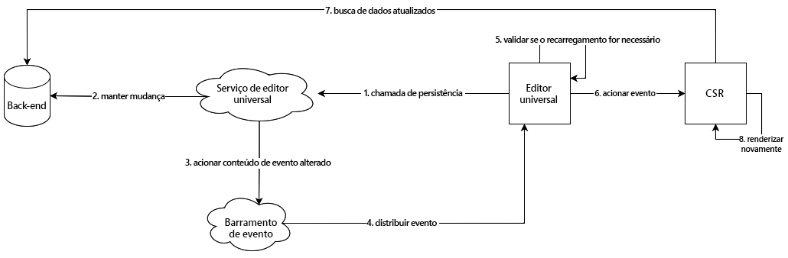

# Arquitetura do Editor universal {#architecture}

Saiba mais sobre a arquitetura do Editor universal e como os dados fluem entre seus serviços e camadas.

## Blocos de construção da arquitetura {#building-blocks}

O Editor universal é composto de quatro elementos essenciais que interagem para permitir que autores(as) de conteúdo editem qualquer aspecto do conteúdo das implementações, a fim de entregar experiências excepcionais, aumentar a velocidade do conteúdo e fornecer uma experiência de desenvolvimento de última geração.

1. [Editores](#editors)
1. [Aplicativo remoto](#remote-app)
1. [Camada de API](#api-layer)
1. [Camada de persistência](#persistence-layer)

Este documento descreve cada um desses blocos de construção e como eles trocam dados.

>[!TIP]
>
>Se quiser ver o Editor universal e sua arquitetura em ação, consulte o documento [Introdução ao Editor universal no AEM](getting-started.md) para saber como obter acesso a esse recurso e começar a instrumentar seu primeiro aplicativo do AEM para utilizá-lo.

### Editores {#editors}

* **Editor universal**: o Editor universal usa um DOM instrumentado para permitir a edição local do conteúdo. Consulte o documento [Atributos e tipos](attributes-types.md) para obter detalhes sobre os metadados necessários. Consulte o documento [Introdução ao Editor universal no AEM](getting-started.md) para obter um exemplo da instrumentação no AEM.
* **Painel Propriedades**: algumas propriedades dos componentes não podem ser editadas no contexto, por exemplo, o tempo de rotação de um carrossel ou qual guia de acordeão deve estar sempre aberta ou fechada. Para permitir a edição dessas informações de componente, um editor baseado em formulário é fornecido no painel lateral do editor.

### Aplicativo remoto {#remote-app}

Para tornar um aplicativo editável no contexto do Editor universal, o DOM deve ser instrumentado. O aplicativo remoto deve renderizar determinados atributos no DOM. Consulte o documento [Atributos e tipos](attributes-types.md) para obter detalhes sobre os metadados necessários. Consulte o documento [Introdução ao Editor universal no AEM](getting-started.md) para obter um exemplo da instrumentação no AEM.

O Editor universal busca manter um SDK simples, portanto, a instrumentação é de responsabilidade da implementação remota do aplicativo.

### Camada de API {#api-layer}

* **Dados de conteúdo**: para o Editor universal, nem os sistemas de origem dos dados de conteúdo nem a forma como são consumidos são importantes. É importante apenas definir e fornecer os atributos necessários usando dados editáveis no contexto.
* **Dados persistentes**: para cada dado editável, há um identificador de URN. Esse URN é usado para rotear a persistência para o sistema e recurso corretos.

### Camada de persistência {#persistence-layer}

* **Modelo de fragmento de conteúdo**: para que o painel permita a edição das propriedades de fragmentos de conteúdo, do Editor de fragmento de conteúdo e dos editores baseados em formulário, são necessários modelos por componente e fragmento de conteúdo.
* **Conteúdo**: o conteúdo pode ser armazenado em qualquer lugar, como no AEM, Magento etc.

## Serviço do editor universal e envio do sistema de back-end {#service}

O Editor universal envia todas as alterações de conteúdo para um serviço centralizado chamado Serviço do editor universal. Este serviço, que é executado no Adobe I/O Runtime, carrega plug-ins disponíveis no Registro de extensão com base no URN fornecido. O plug-in é responsável pela comunicação com o back-end e pelo retorno de uma resposta unificada.

## Renderizar pipelines {#rendering-pipelines}

### Renderização do lado do servidor {#server-side}

### Geração de site estático {#static-generation}

### Renderização do lado do cliente {#client-side}

## Recursos adicionais {#additional-resources}

Para saber mais sobre o Editor universal, consulte estes documentos.

* [Introdução ao Editor universal](introduction.md): saiba como o Editor universal permite editar qualquer aspecto do conteúdo das implementações, a fim de entregar experiências excepcionais, aumentar a velocidade do conteúdo e fornecer uma experiência de desenvolvimento de última geração.
* [Criação de conteúdo com o Editor universal](authoring.md): saiba como é fácil e intuitivo para os autores criarem conteúdo usando o Editor universal.
* [Publicação de conteúdo com o Editor universal](publishing.md): saiba como o Editor visual universal publica o conteúdo e como seus aplicativos podem lidar com esse conteúdo.
* [Introdução ao Editor universal no AEM](getting-started.md): saiba como obter acesso ao Editor universal e começar a instrumentar seu primeiro aplicativo do AEM para utilizá-lo.
* [Atributos e tipos](attributes-types.md): saiba mais sobre os atributos e tipos de dados exigidos pelo Editor universal.
* [Autenticação do Editor universal](authentication.md): saiba como funciona a autenticação do Editor universal.
