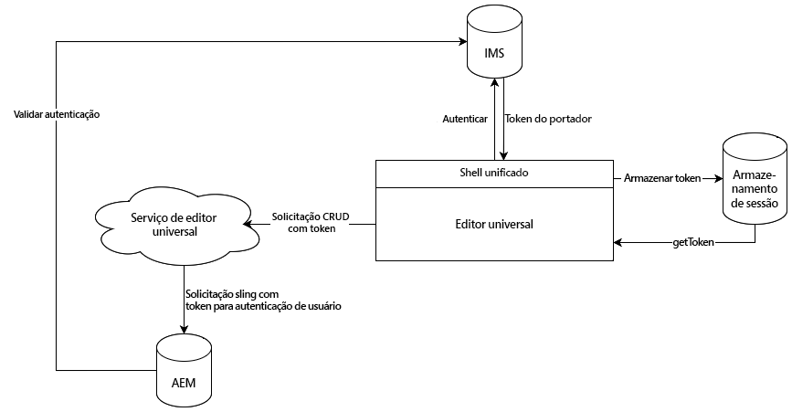

# Autenticação do editor universal {#authentication}

Saiba como o Editor Universal se autentica.

## Opções {#options}

O Editor Universal usa autenticação Adobe Identity Management System (IMS), que é fornecida por meio do Unified Shell.

Todos os aplicativos/páginas remotas são responsáveis pela autenticação de sistemas de back-end necessários. O serviço Universal Editor precisa dessa autenticação para os sistemas de backend realizarem operações de CRUD, pois é um serviço independente.

Dependendo de como você está usando o Editor Universal, há diferentes opções de implementação.

* [Fluxo padrão](#standard-flow) - Para AEM as a Cloud Service ou AMS usando IMS
* [Fluxo de terceiros](#third-party-flow) - Para AEM no local ou AMS sem IMS

## Fluxo padrão {#standard-flow}

Essa é a solução para AEM o as a Cloud Service e o AMS usando o IMS para usar o editor Universal.

Para usar o Editor Universal, o usuário deve estar conectado no Unified Shell, que se autentica no IMS. O token IMS fornecido é armazenado no armazenamento de sessão dos usuários.

Sempre que um usuário executa uma operação CRUD, uma chamada é enviada para o serviço do Editor Universal com o token portador IMS no cabeçalho HTTP. O serviço Editor Universal usa o token portador para autenticar a solicitação no sistema de back-end AEM para executar operações no nome do usuário.

## Recursos adicionais {#additional-resources}

Para saber mais sobre o Universal Editor, consulte estes documentos.

* [Introdução ao Editor Universal](introduction.md) - Saiba como o Editor Universal permite editar qualquer aspecto de qualquer conteúdo em qualquer implementação para fornecer experiências excepcionais, aumentar a velocidade do conteúdo e fornecer uma experiência de desenvolvedor de última geração.
* [Criação de conteúdo com o editor universal](authoring.md) - Saiba como é fácil e intuitivo para os autores de conteúdo criar conteúdo usando o Editor Universal.
* [Introdução ao Editor universal no AEM](getting-started.md) - Saiba como obter acesso ao Universal Editor e como começar a instrumentar seu primeiro aplicativo AEM para usá-lo.
* [Arquitetura do editor universal](architecture.md) - Saiba mais sobre a arquitetura do Editor Universal e como os dados fluem entre seus serviços e camadas.
* [Atributos e tipos](attributes-types.md) - Saiba mais sobre os atributos e tipos de dados exigidos pelo Editor Universal.
