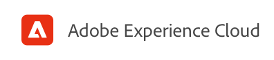

# Criação de conteúdo com o editor universal {#authoring}

Saiba como é fácil e intuitivo para os autores de conteúdo criar conteúdo usando o Editor Universal.

## Introdução {#introduction}

O Editor universal permite editar qualquer aspecto de qualquer conteúdo em qualquer implementação para fornecer experiências excepcionais, aumentar a velocidade do conteúdo e fornecer uma experiência de desenvolvedor de última geração.

Para fazer isso, ele fornece aos autores de conteúdo uma interface de usuário intuitiva que requer o mínimo de treinamento para simplesmente participar e começar a editar o conteúdo.

>[!TIP]
>
>Para obter uma introdução mais detalhada ao Editor Universal, consulte o documento [Introdução ao Editor Universal.](introduction.md)

>[!NOTE]
>
>O Editor Universal ainda está em desenvolvimento e atualmente não pode editar todos os tipos de conteúdo.

## Preparação do aplicativo {#prepare-app}

Para criar conteúdo para um aplicativo usando o Editor universal, o aplicativo deve ser instrumentado por um desenvolvedor para oferecer suporte ao editor.

>[!TIP]
>
>Consulte o documento [Introdução ao Editor universal no AEM](getting-started.md) para obter um exemplo de como configurar um aplicativo AEM para funcionar com o Editor Universal.

## Conectar {#sign-in}

Depois que o aplicativo for instrumentado para funcionar com o Editor universal, será necessário fazer logon no Editor universal. Você precisará de uma Adobe ID para fazer logon e [ter acesso ao Editor Universal.](getting-started.md#request-access)

Depois de fazer logon, insira o URL da página que deseja editar no [barra de endereços.](#address-bar) para iniciar [editar o conteúdo.](#edit-content)

## Entender a interface do usuário {#ui}

A interface do usuário é dividida em quatro áreas principais.

* [O cabeçalho Experience Cloud](#experience-cloud-header)
* [O cabeçalho do Editor Universal](#universal-editor-header)
* [O painel](#rail)
* [O editor](#editor)

### O Cabeçalho Experience Cloud {#experience-cloud-header}

O cabeçalho Experience Cloud está sempre presente na parte superior da tela. É uma âncora que informa onde você está no Experience Cloud e ajuda a navegar para outros aplicativos do Experience Cloud.

#### Experience Manager {#experience-manager}

Selecione o link do Adobe Experience Cloud à esquerda do cabeçalho para navegar até a raiz da solução Experience Manager para acessar ferramentas como [Cloud Manager,](/help/onboarding/cloud-manager-introduction.md) [Cloud Acceleration Manager,](/help/journey-migration/cloud-acceleration-manager/introduction/overview-cam.md) e [Distribuição de software.](https://experienceleague.adobe.com/docs/experience-cloud/software-distribution/home.html)

#### Organização {#organization}

Isso exibe a organização na qual você está conectado no momento. Toque ou clique em para alternar para outra organização se a Adobe ID estiver associada a várias.

#### Soluções {#solutions}

Tocar ou clicar no alternador de soluções permite que você vá rapidamente para outras soluções do Experience Cloud.

#### Ajuda {#help}

O ícone de ajuda fornece acesso rápido aos recursos de aprendizagem e suporte.

#### Notificações {#notifications}

Esse ícone exibirá o número de itens atribuídos incompletos no momento [notificações.](/help/implementing/cloud-manager/notifications.md)

#### Propriedades do usuário {#user-properties}

Toque ou clique no ícone que representa o usuário para acessar as configurações do usuário. Se você não tiver uma imagem do usuário configurada, um ícone será atribuído aleatoriamente.

### O cabeçalho do editor universal {#universal-editor-header}

O cabeçalho do Editor Universal está sempre presente na parte superior da tela logo abaixo [o cabeçalho Experience Cloud.](#experience-cloud-header) Fornece acesso rápido para navegar para outra página para editar, bem como para publicar a página atual.

#### O Menu Hamburger {#hamburger-menu}

O menu de hambúrguer ainda não foi implementado.

#### Barra de Localização {#Location-bar}

A barra de localização mostra o endereço da página que você está editando. Toque ou clique em para inserir o endereço de outra página para editar.

>[!TIP]
>
>Use a tecla de atalho `L` para abrir a barra de endereços.

>[!NOTE]
>
>Qualquer página que você deseja editar com o Editor Universal deve ser [instrumentado para oferecer suporte ao Universal Editor.](getting-started.md)

#### Abrir visualização do aplicativo {#open-app-preview}

Toque ou clique no ícone de visualização do aplicativo aberto para abrir a página que você está editando no próprio navegador, livre do editor para visualizar as alterações.

>[!TIP]
>
>Use a tecla de atalho `O` para abrir a visualização do aplicativo.

#### Publicação {#publish}

Toque ou clique no botão publicar para publicar as alterações no conteúdo ao vivo para consumo pelos seus leitores.

>[!TIP]
>
>Consulte o documento [Publicação de conteúdo com o Editor visual universal](publishing.md) para obter mais informações sobre publicação com o Universal Editor.

### O Trilho {#rail}

O painel está sempre presente no lado esquerdo do editor. Isso permite alternar facilmente o editor entre o modo de visualização e o modo de edição.

#### Modo de visualização {#preview-mode}

No modo de visualização, a página é renderizada no editor como seria vista em seu serviço publicado. Isso permite que o autor de conteúdo navegue pelo conteúdo clicando em links etc.

>[!TIP]
>
>Use a tecla de atalho `P` para alternar para o modo de visualização.

#### Modo de Edição {#edit-mode}

No modo de edição, a página é renderizada no editor, mas o autor de conteúdo pode clicar para selecionar o conteúdo para editá-la. Esse é o modo padrão do editor quando uma página é carregada.

Modo de

### O Editor {#editor}

O editor ocupa a maior parte da janela e é onde a página especificada em [a barra de endereços](#address-bar) é renderizado.

Dependendo de se o editor estiver em [modo de edição](#edit-mode) ou [modo de visualização,](#edit-mode) o conteúdo será editável ou navegável, respectivamente.

## Editar conteúdo {#editing-content}

A edição de conteúdo é simples e intuitiva. Em [modo de edição,](#edit-mode) ao passar o mouse sobre o conteúdo no editor, o conteúdo editável será destacado com uma caixa azul.

Basta tocar ou clicar no conteúdo na caixa azul para iniciar um editor no local para fazer as alterações. Pressione Enter ou return para salvar as alterações.

Observe que, no modo de edição, tocar ou clicar no conteúdo tenta selecioná-lo para edição. Se você deseja navegar pelo seu conteúdo através dos seguintes links, alterne para [modo de visualização.](#preview-mode)

## Visualização de conteúdo {#previewing-content}

Quando você terminar de editar o conteúdo, geralmente deseja navegá-lo para ver a aparência dele no conteúdo de outras páginas. Em [modo de visualização](#preview-mode) você pode clicar em links para navegar pelo conteúdo como um leitor faria. O conteúdo é renderizado no editor como seria publicado.

Observe que, no modo de visualização, tocar ou clicar no conteúdo reage como reagiria para um leitor do conteúdo. Se desejar selecionar o conteúdo para edição, alterne para [modo de edição.](#edit-mode)

## Recursos adicionais {#additional-resources}

Para saber mais sobre o Universal Editor, consulte estes documentos.

* [Introdução ao Editor Universal](introduction.md) - Saiba como o Editor Universal permite editar qualquer aspecto de qualquer conteúdo em qualquer implementação para fornecer experiências excepcionais, aumentar a velocidade do conteúdo e fornecer uma experiência de desenvolvedor de última geração.
* [Publicação de conteúdo com o editor universal](publishing.md) - Saiba como o Editor visual universal publica conteúdo e como seus aplicativos podem lidar com o conteúdo publicado.
* [Introdução ao Editor universal no AEM](getting-started.md) - Saiba como obter acesso ao Universal Editor e como começar a instrumentar seu primeiro aplicativo AEM para usá-lo.
* [Arquitetura do editor universal](architecture.md) - Saiba mais sobre a arquitetura do Editor Universal e como os dados fluem entre seus serviços e camadas.
* [Atributos e tipos](attributes-types.md) - Saiba mais sobre os atributos e tipos de dados exigidos pelo Editor Universal.
* [Autenticação do editor universal](authentication.md) - Saiba como o Editor Universal se autentica.
