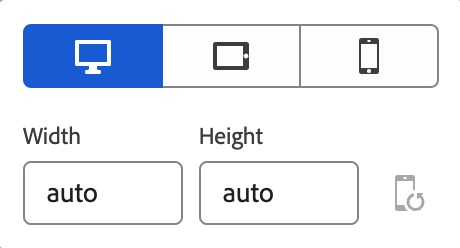
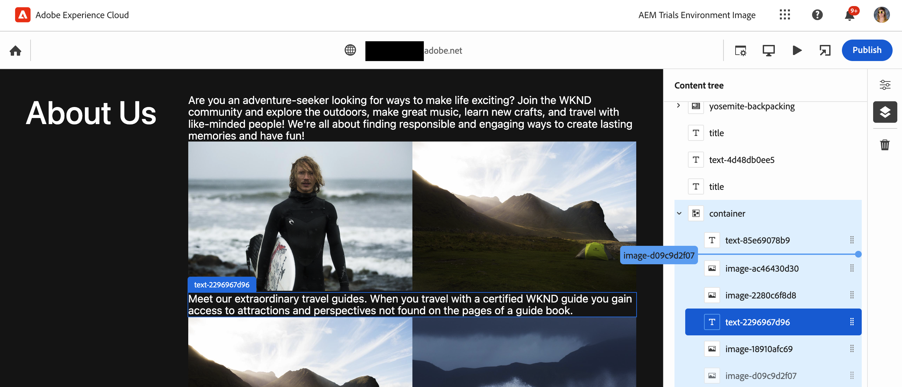

# Criação de conteúdo com o Editor universal {#authoring}

Saiba como é fácil e intuitivo para os autores criarem conteúdo utilizando o Editor universal.

## Introdução {#introduction}

O Editor universal permite a edição de qualquer aspecto de qualquer conteúdo em qualquer implementação, para que você possa oferecer experiências excepcionais, aumentar a velocidade do conteúdo e proporcionar uma experiência de desenvolvedor de última geração.

Para isso, o editor universal oferece aos autores de conteúdo uma interface intuitiva que exige apenas um treinamento mínimo para que eles possam simplesmente entrar e começar a editar o conteúdo. Este documento descreve a experiência de criação do Editor Universal.

>[!TIP]
>
>Para obter uma introdução mais detalhada do Editor universal, consulte o documento [Introdução ao Editor universal.](introduction.md)

>[!NOTE]
>
>O Editor Universal ainda está em desenvolvimento. No momento, não é possível editar todos os tipos de conteúdo.

## Preparação do aplicativo {#prepare-app}

Para criar conteúdo para um aplicativo usando o editor universal, o aplicativo precisa ser instrumentado por um desenvolvedor para oferecer suporte ao editor.

>[!TIP]
>
>Consulte o documento [Introdução ao Editor universal no AEM](getting-started.md) para obter um exemplo de como configurar um aplicativo do AEM para funcionar com o Editor universal.

## Fazer logon {#sign-in}

Após o aplicativo ser instrumentado para funcionar com o Editor universal, será necessário fazer logon no Editor universal. Você precisará de uma Adobe ID para fazer logon e [ter acesso ao Editor universal.](getting-started.md#request-access)

Após fazer logon, digite o URL da página que deseja editar na [barra de localização.](#location-bar) para poder começar a editar conteúdo como [conteúdo de texto](#text-mode) ou [conteúdo de mídia.](#media-mode)

## Noções básicas da interface {#ui}

A interface é dividida em cinco áreas principais.

* [O cabeçalho da Experience Cloud](#experience-cloud-header)
* [O cabeçalho do Editor universal](#universal-editor-header)
* [O painel de modo](#mode-rail)
* [O editor](#editor)
* [O painel de propriedades](#properties-rail)

### O cabeçalho da Experience Cloud {#experience-cloud-header}

O cabeçalho da Experience Cloud está sempre presente na parte superior da tela. É uma âncora que informa onde você está na Experience Cloud e o ajuda a navegar por outros aplicativos da Experience Cloud.

#### Experience Manager {#experience-manager}

Clique no link da Adobe Experience Cloud à esquerda do cabeçalho para navegar até a raiz da solução do Experience Manager e acessar ferramentas como o [Cloud Manager,](/help/onboarding/cloud-manager-introduction.md) o [Cloud Acceleration Manager](/help/journey-migration/cloud-acceleration-manager/introduction/overview-cam.md) e a [distribuição de softwares.](https://experienceleague.adobe.com/docs/experience-cloud/software-distribution/home.html?lang=pt-br)

#### Organização {#organization}

Exibe a organização na qual você está conectado no momento. Toque ou clique para alternar para outra organização se a Adobe ID estiver associada a mais do que uma.

#### Soluções {#solutions}

Tocar ou clicar no alternador de soluções permite que você vá rapidamente para outras soluções Experience Cloud.

#### Ajuda {#help}

O ícone de ajuda fornece acesso rápido aos recursos de aprendizagem e suporte.

#### Notificações {#notifications}

Esse ícone é marcado com o número de [notificações](/help/implementing/cloud-manager/notifications.md) incompletas atribuídas atualmente.

#### Propriedades do usuário {#user-properties}

Toque ou clique no ícone que representa seu usuário para acessar suas configurações de usuário. Se você não tiver uma imagem do usuário configurada, um ícone é atribuído aleatoriamente.

### O cabeçalho do Editor universal {#universal-editor-header}

O cabeçalho do Editor universal está sempre presente na parte superior da tela, logo abaixo [do cabeçalho da Experience Cloud.](#experience-cloud-header) Ele fornece acesso rápido para navegar para outra página a ser editada, bem como para publicar a página atual.

#### O Botão Início {#home-button}

O botão Home retorna à página inicial do Universal Editor

Na página inicial, você pode inserir o URL do site que deseja editar com o Editor universal.

>[!NOTE]
>
>Qualquer página que você deseja editar com o Editor universal deve ser [instrumentada para oferecer suporte ao Editor universal.](getting-started.md)

#### Barra de localização {#location-bar}

A barra de localização mostra o endereço da página que você está editando. Toque ou clique para inserir o endereço de outra página para editar.

>[!TIP]
>
>Use a tecla de atalho `L` para abrir a barra de endereços.

>[!NOTE]
>
>Qualquer página que você deseja editar com o Editor universal deve ser [instrumentada para oferecer suporte ao Editor universal.](getting-started.md)

#### Configurações do cabeçalho de autenticação {#authentication-settings}

Toque ou clique no ícone de configurações do cabeçalho de autenticação se precisar definir um segredo de autenticação.

#### Configurações do emulador {#emulator}

Toque ou clique no ícone de emulação para definir como o Editor universal renderiza a página.

Tocar ou clicar no ícone de emulação revelará as opções.

Por padrão, o editor será aberto no layout do desktop, onde a altura e a largura são definidas automaticamente pelo navegador.

Também é possível optar por emular um dispositivo móvel e, no editor universal:

* Definir sua orientação
* Definir largura e altura
* Alterar a orientação

#### Abrir visualização do aplicativo {#open-app-preview}

Toque ou clique no ícone de visualização do aplicativo aberto para abrir a página que você está editando no momento em sua própria guia do navegador, livre do editor para visualizar seu conteúdo.

>[!TIP]
>
>Use a tecla de atalho `O` (a letra O) para abrir a visualização do aplicativo.

#### Publicação {#publish}

Toque ou clique no botão Publicar para que as alterações sejam publicadas no conteúdo ativo para consumo de seus leitores.

>[!TIP]
>
>Consulte o documento [Publicação de conteúdo com o Editor universal](publishing.md) para obter mais informações sobre a publicação com o Editor universal.

### O painel de modo {#rail}

O painel de modo está logo abaixo do botão inicial e está sempre presente no lado esquerdo do editor. Ele permite alternar facilmente o editor entre diferentes modos de uso.

#### Modo de visualização {#preview-mode}

No modo de visualização, a página é renderizada no editor da maneira como seria vista em seu serviço publicado. Isso permite que o autor de conteúdo navegue pelo conteúdo clicando em links etc.

>[!TIP]
>
>Use a tecla de atalho `P` para alternar para o modo de visualização.

#### Modo de componentes {#component-mode}

No modo de componentes, o autor de conteúdo pode clicar em para selecionar componentes e editá-los, incluindo:

* [Edição de texto simples](#editing-content) em vigor.
* [Edição de rich text](#editing-rich-text) no local com opções adicionais de formatação exibidas no painel de propriedades.
* [Edição de conteúdo de mídia](#editing-media)
* [Edição de fragmentos de conteúdo](#edit-content-fragment)

Quando você seleciona um componente, os detalhes do seu conteúdo são exibidos no [painel de propriedades.](#properties-rail) Dependendo do tipo de conteúdo, você pode editar no local ou no painel de propriedades.

>[!TIP]
>
>Usar a tecla de atalho `C` para alternar para o modo de componentes.

### O editor {#editor}

O editor ocupa a maior parte da janela e é onde a página especificada na [barra de localização](#location-bar) é renderizada.

* Se o editor estiver em [modo componentes,](#component-mode) o conteúdo será editável, mas não será possível seguir os links.
* Se o editor estiver em [modo de visualização,](#preview-mode) o conteúdo será navegável e você poderá seguir os links, mas não poderá editar o conteúdo.

### Painel Propriedades {#properties-rail}

O painel de propriedades está sempre presente no lado direito do editor. Dependendo do modo, podem ser exibidos detalhes de um componente selecionado no conteúdo ou na hierarquia do conteúdo da página.

#### Modo de propriedades {#properties-mode}

No modo de propriedades, o painel mostra as propriedades do componente atualmente selecionado no editor. Esse é o modo padrão do painel de propriedades quando uma página é carregada.

Dependendo do tipo de componente selecionado, os detalhes podem ser exibidos e modificados no painel de propriedades.

Observe que nem todos os componentes têm detalhes que podem ser mostrados e/ou editados.

>[!TIP]
>
>Use a tecla de atalho `D` para alternar para o modo de propriedades.

#### Modo de árvore de conteúdo {#content-tree-mode}

No modo de árvore de conteúdo, o painel mostra a hierarquia do conteúdo da página.

Ao selecionar um item na árvore de conteúdo, o editor rola até esse conteúdo e o seleciona.

>[!TIP]
>
>Use a tecla de atalho `F` para alternar para o modo de árvore de conteúdo.

##### Editar {#edit}

Quando em [modo componentes,](#component-mode) as opções de edição do componente selecionado são exibidas no painel de propriedades. No painel de propriedades, é possível editar o componente selecionado. Se o componente selecionado for um Fragmento de conteúdo, você também poderá tocar ou clicar no botão Editar.

Tocar ou clicar no botão de edição abre o [Editor de fragmento de conteúdo](/help/assets/content-fragments/content-fragments-managing.md#opening-the-fragment-editor) em uma nova guia. Isso permite acessar todo o potencial do Editor de fragmento de conteúdo para editar o fragmento de conteúdo associado.

Dependendo das necessidades do fluxo de trabalho, talvez você queira editar o Fragmento de conteúdo no Editor universal ou diretamente no editor de Fragmento de conteúdo.

>[!TIP]
>
>Use a tecla de atalho `E` para editar um componente selecionado.

##### Adicionar {#add}

Se você selecionar um componente de contêiner na árvore de conteúdo ou no editor, a opção adicionar aparecerá no painel de propriedades.

Tocar ou clicar no botão adicionar abre um menu suspenso de componentes disponíveis para [adicionar ao contêiner selecionado.](#adding-components)

>[!TIP]
>
>Usar a tecla de atalho `A` para adicionar um componente a um componente de contêiner selecionado.

##### Excluir {#delete}

Se você selecionar um componente em um componente de contêiner na árvore de conteúdo ou no editor, a opção de exclusão aparecerá no painel de propriedades.

Tocar ou clicar no botão Excluir [exclui o componente.](#deleting-components)

>[!TIP]
>
>Usar a tecla de atalho `Shift+Backspace` para excluir um componente selecionado de um container.

## Editar o conteúdo {#editing-content}

A edição de conteúdo é simples e intuitiva. Entrada [modo componentes](#component-mode), à medida que você passa o mouse sobre o conteúdo no editor, o conteúdo editável é realçado com uma caixa azul.

>[!TIP]
>
>Observe que no modo de componentes, tocar ou clicar em um conteúdo o seleciona para edição. Se você deseja navegar pelo seu conteúdo utilizando os links, alterne para o [modo de visualização.](#preview-mode)

Dependendo do conteúdo selecionado, você pode ter diferentes opções de edição no local e outras informações e opções para o conteúdo na [painel de propriedades.](#properties-rail)

### Edição de Texto sem Formatação {#edit-plain-text}

Se você estiver em [modo componentes](#component-mode) e selecionar um componente de texto simples, você pode editar o texto no local clicando duas vezes ou tocando duas vezes no componente.

Pressione enter/return ou toque ou clique fora da caixa de texto para salvar as alterações.

Ao tocar ou clicar para selecionar o componente de texto, os detalhes são mostrados no painel de propriedades. Também é possível editar o texto no painel.

Além disso, os detalhes do seu texto estão disponíveis no painel de propriedades. As alterações são salvas automaticamente quando o foco sai do campo editado no painel de propriedades.

### Edição de Rich Text {#edit-rich-text}

Se você estiver em [modo componentes](#component-mode) e selecionar um componente de rich text, é possível editar o texto no local clicando duas vezes ou tocando duas vezes no componente.

Pressione enter/return ou toque ou clique fora da caixa de texto para salvar as alterações.

Além disso, as opções de formatação e os detalhes do texto estão disponíveis no painel de propriedades. As alterações são salvas automaticamente quando o foco sai do campo editado no painel de propriedades.

### Editando mídia {#edit-media}

Se você estiver em [modo componentes](#component-mode) e selecionar uma imagem, você poderá exibir seus detalhes no painel de propriedades.

Toque ou clique no **Substituir** botão abaixo da visualização da imagem selecionada no painel de propriedades para substituir a imagem por outra de sua biblioteca de ativos.

1. A variável [seletor de ativos](/help/assets/asset-selector.md#using-asset-selector) é aberta para permitir que você selecione um ativo.
1. Toque ou clique para selecionar um novo ativo.
1. Toque ou clique **Selecionar** para retornar ao painel de propriedades onde o ativo foi substituído.

As alterações são salvas no conteúdo automaticamente.

>[!TIP]
>
>Usar a tecla de atalho `R` para abrir o seletor de ativos e substituir a imagem selecionada.

### Edição de fragmentos de conteúdo {#edit-content-fragment}

Se você estiver em [modo componentes](#component-mode) e você selecionar um [Fragmento de conteúdo,](/help/sites-cloud/administering/content-fragments/overview.md) você pode editar os detalhes no painel propriedades.

Os campos definidos no modelo de conteúdo do fragmento de conteúdo selecionado são exibidos e editáveis no painel de propriedades.

Se você selecionar um campo relacionado a um Fragmento de conteúdo, ele será carregado no painel Componentes e o campo será rolado automaticamente para o.

As alterações são salvas automaticamente quando o foco sai do campo editado no painel de propriedades.

Se quiser editar o fragmento de conteúdo na caixa [Editor de fragmento de conteúdo](/help/sites-cloud/administering/content-fragments/authoring.md) clique no link [botão editar](#edit) no painel de modos.

Dependendo das necessidades do fluxo de trabalho, talvez você queira editar o Fragmento de conteúdo no Editor universal ou diretamente no editor de Fragmento de conteúdo.

### Adicionar componentes a contêineres {#adding-components}

1. Selecione um componente de container na árvore de conteúdo ou no editor.
1. Em seguida, toque ou clique no ícone adicionar no painel de propriedades.

   

O componente é inserido no container e pode ser editado no editor.

>[!TIP]
>
>Usar a tecla de atalho `A` para adicionar um componente ao container selecionado.

### Exclusão de componentes de contêineres {#deleting-components}

1. Selecione um componente de container na árvore de conteúdo ou no editor.
1. Toque ou clique no ícone de divisa do contêiner para expandir seu conteúdo na árvore de conteúdo.
1. Em seguida, na árvore de conteúdo, selecione um componente no contêiner.
1. Toque ou clique no ícone excluir no painel de propriedades.

   

O componente selecionado foi excluído.

>[!TIP]
>
>Usar a tecla de atalho `Shift+Backspace` para excluir o componente selecionado de seu contêiner.

### Reorganização de componentes em contêineres {#reordering-components}

1. Selecione um componente de container na árvore de conteúdo ou no editor.
1. Se ainda não estiver em [modo de árvore de conteúdo,](#content-tree-mode) mude para ele.
1. Toque ou clique no ícone de divisa do contêiner para expandir seu conteúdo na árvore de conteúdo.
1. Arraste os ícones de alça ao lado dos componentes dentro do contêiner para mostrar que você pode reorganizá-los. Arraste os componentes para reordená-los no contêiner.

   

1. O componente arrastado fica cinza na árvore de componentes, enquanto o ponto de inserção é representado por uma linha azul. Libere o componente para colocá-lo em seu novo local.

Os componentes são reordenados na árvore de conteúdo e no editor

## Visualização de conteúdo {#previewing-content}

Ao terminar de editar o conteúdo, você geralmente deseja navegar por ele e observar como ele é exibido em outras páginas. No [modo de visualização](#preview-mode), é possível clicar em links e navegar pelo conteúdo, como um leitor faria. O conteúdo é renderizado no editor como seria publicado.

Note que, no modo de visualização, a ação de tocar ou clicar no conteúdo funciona da mesma forma que para um leitor do conteúdo. Se desejar selecionar o conteúdo para edição, alterne para [modo de componentes.](#component-mode)

## Recursos adicionais {#additional-resources}

Para saber mais sobre o Editor universal, consulte estes documentos.

* [Introdução ao Editor universal](introduction.md): saiba como o Editor universal permite editar qualquer aspecto do conteúdo das implementações, a fim de entregar experiências excepcionais, aumentar a velocidade do conteúdo e fornecer uma experiência de desenvolvimento de última geração.
* [Publicação de conteúdo com o Editor universal](publishing.md): saiba como o Editor universal publica o conteúdo e como seus aplicativos podem lidar com esse conteúdo.
* [Introdução ao Editor universal no AEM](getting-started.md): saiba como obter acesso ao Editor universal e começar a instrumentar seu primeiro aplicativo do AEM para utilizá-lo.
* [Arquitetura do Editor universal](architecture.md): saiba mais sobre a arquitetura do Editor universal e como os dados fluem entre seus serviços e camadas.
* [Atributos e tipos](attributes-types.md): saiba mais sobre os atributos e tipos de dados exigidos pelo Editor universal.
* [Autenticação do Editor universal](authentication.md): saiba como funciona a autenticação do Editor universal.
