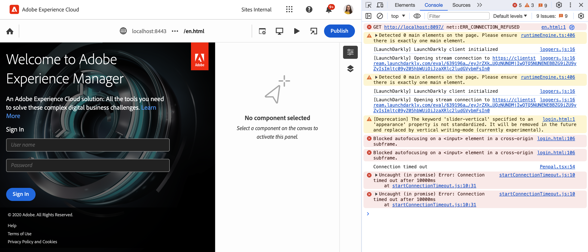
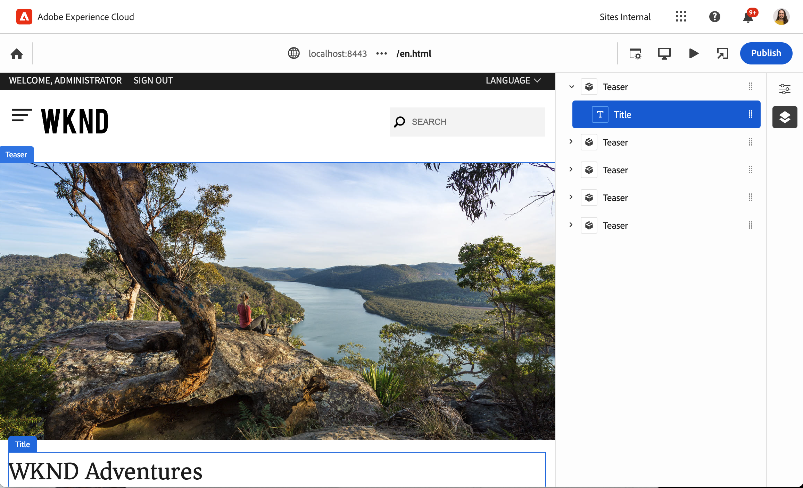

# Visão geral do editor universal para desenvolvedores do AEM {#developer-overview}

Se você for um desenvolvedor do AEM interessado em como o Editor universal funciona e como usá-lo no seu projeto, este documento fornecerá uma introdução completa, orientando você pela instrumentação do projeto WKND para trabalhar com o Editor universal.

## Propósito {#purpose}

Este documento serve como uma introdução do desenvolvedor sobre como o Universal Editor funciona e como instrumentar seu aplicativo para trabalhar com ele.

Ele faz isso tomando um exemplo padrão com o qual a maioria dos desenvolvedores do AEM está familiarizada, os Componentes principais e o site WKND, e instrumenta alguns componentes de exemplo para serem editáveis usando o editor universal.

>[!TIP]
>
>Este documento contém etapas extras para ilustrar como o Universal Editor funciona e tem como objetivo aprofundar a compreensão do desenvolvedor sobre o editor. Portanto, não é preciso a rota mais direta para instrumentar um aplicativo, mas o mais ilustrativo do Editor universal e como ele funciona.
>
>Se quiser começar a usar o mais rápido possível, consulte o documento [Introdução ao Universal Editor no AEM](/help/implementing/universal-editor/getting-started.md).

## Pré-requisitos {#prerequisites}

Para acompanhar essa visão geral, você precisa do seguinte disponível.

* [Uma instância de desenvolvimento local do AEM as a Cloud Service](https://experienceleague.adobe.com/docs/experience-cloud/software-distribution/home.html?lang=pt-br)
   * Sua instância de desenvolvimento local deve ser [configurada com HTTPS para fins de desenvolvimento em `localhost`](https://experienceleague.adobe.com/docs/experience-manager-learn/foundation/security/use-the-ssl-wizard.html?lang=pt-BR).
   * [O site de demonstração do WKND deve estar instalado](https://github.com/adobe/aem-guides-wknd).
* [Acesso ao Editor Universal](/help/implementing/universal-editor/getting-started.md#onboarding).
* [Um serviço do Editor Universal local](/help/implementing/universal-editor/local-dev.md) que está sendo executado para fins de desenvolvimento.
   * Direcione seu navegador para [aceitar o certificado autoassinado dos serviços locais](/help/implementing/universal-editor/local-dev.md#editing).

Além da familiaridade geral com o desenvolvimento para web, este documento presume a familiaridade básica com o desenvolvimento para AEM. Se você não tiver experiência com o desenvolvimento do AEM, considere revisar [o tutorial do WKND antes de continuar](/help/implementing/developing/introduction/develop-wknd-tutorial.md).

## Iniciar o AEM e fazer logon no editor universal {#sign-in}

Caso ainda não o tenha feito, você deve ter sua instância de desenvolvimento local do AEM em execução com o WKND instalado e o HTTPS habilitado como [detalhado nos pré-requisitos](#prerequisites). Esta visão geral pressupõe que sua instância está em execução em `https://localhost:8443`.

1. Abra a página principal em inglês do WKND no Editor do AEM.

   ```text
   https://localhost:8443/editor.html/content/wknd/language-masters/en.html
   ```

1. No menu do editor **Informações da página**, selecione **Exibir como Publicado**. Essa ação abre a mesma página em uma nova guia com o Editor do AEM desativado.

   ```text
   https://localhost:8443/content/wknd/language-masters/en.html?wcmmode=disabled
   ```

1. Copie este link.

1. Agora, entre no Editor universal.

   ```text
   https://experience.adobe.com/#/aem/editor
   ```

1. Cole o link copiado anteriormente do conteúdo WKND no campo **URL do Site** do Universal Editor e clique em **Abrir**.

   

## O Editor Universal Tenta Carregar o Conteúdo {#sameorigin}

O Editor universal carrega o conteúdo a ser editado em um quadro. As configurações padrão do AEM para opções de X-Frame impedem isso, que pode ser visto claramente no navegador como um erro e detalhado na saída do console ao tentar carregar sua cópia local do WKND.


A opção X-Frame `sameorigin` impede a renderização de páginas AEM dentro de um quadro. Você deve remover esse cabeçalho para permitir que as páginas sejam carregadas no Universal Editor.

1. Abra o Gerenciador de configurações.

   ```text
   https://localhost:8443/system/console/configMgr
   ```

1. Editar a configuração OSGi `org.apache.sling.engine.impl.SlingMainServlet`

   

1. Exclua a propriedade `X-Frame-Options=SAMEORIGIN` da propriedade **Cabeçalhos de resposta adicionais**.

1. Salve as alterações.

Agora, ao recarregar o Editor universal, você verá que a página do AEM é carregada.

>[!TIP]
>
>* Consulte o documento [Introdução ao Universal Editor no AEM](/help/implementing/universal-editor/getting-started.md#sameorigin) para obter mais detalhes sobre essa configuração OSGi.
>* Consulte o documento [Configuração de OSGi para Adobe Experience Manager as a Cloud Service](/help/implementing/deploying/configuring-osgi.md) para obter detalhes sobre OSGi no AEM.

## Manipular cookies do mesmo site {#samesite-cookies}

Quando o Editor universal carrega sua página, ele é carregado para a página de logon da AEM para garantir que você esteja autenticado para fazer alterações.

No entanto, você não pode fazer logon com êxito. Ao mostrar o console do navegador, você pode ver que o navegador bloqueou a entrada no quadro



O cookie do token de logon é enviado para a AEM como um domínio de terceiros. Portanto, os cookies do mesmo site devem ser permitidos no AEM.

1. Abra o Gerenciador de configurações.

   ```text
   https://localhost:8443/system/console/configMgr
   ```

1. Editar a configuração OSGi `com.day.crx.security.token.impl.impl.TokenAuthenticationHandler`

   

1. Altere a propriedade **atributo SameSite do cookie de token de logon** para `Partitioned`.

1. Salve as alterações.

Agora, se você recarregar o Editor universal, poderá fazer logon no AEM e a página de destino será carregada.

>[!TIP]
>
>* Consulte o documento [Introdução ao Universal Editor no AEM](/help/implementing/universal-editor/getting-started.md#samesite-cookies) para obter mais detalhes sobre essa configuração OSGi.
>* Consulte o documento [Configuração de OSGi para Adobe Experience Manager as a Cloud Service](/help/implementing/deploying/configuring-osgi.md) para obter detalhes sobre OSGi no AEM.

## O Editor Universal Conecta-se ao Quadro Remoto {#ue-connect-remote-frame}

Com a página carregada no Editor universal e você conectado ao AEM, o Editor universal tenta se conectar ao quadro remoto. Isso é feito por meio de uma biblioteca JavaScript que deve ser carregada no quadro remoto. Se a biblioteca do JavaScript não estiver presente, a página criará um erro de tempo limite no console.


Você deve adicionar a biblioteca JavaScript necessária ao componente Página do aplicativo WKND.

1. Abra o CRXDE Lite.

   ```text
   https://localhost:8443/crx/de
   ```

1. Em `/apps/wknd/components/page`, edite o arquivo `customheaderlibs.html`.

   

1. Adicione a biblioteca do JavaScript ao final do arquivo.

   ```html
   <script src="https://universal-editor-service.adobe.io/cors.js" async></script>
   ```

1. Clique em **Salvar tudo** e recarregue o Editor Universal.

A página agora é carregada com a biblioteca JavaScript adequada para permitir que o Editor universal se conecte à sua página e o erro de tempo limite não é mais exibido no console.

>[!TIP]
>
>* A biblioteca pode ser carregada no cabeçalho ou no rodapé.

>[!NOTE]
>
>O método recomendado anteriormente para incluir a biblioteca do JavaScript, `<script src="https://universal-editor-service.experiencecloud.live/corslib/LATEST"></script>` ou via npmjs.com, não é mais recomendado, pois o pacote foi descontinuado.
>
>Se um aplicativo ainda usar o pacote obsoleto, o Editor universal exibirá um aviso na interface do usuário de que um pacote desatualizado foi detectado.

## Definição de uma Conexão para Persistir Alterações {#connection}

A página WKND agora é carregada com sucesso no Editor universal, e a biblioteca do JavaScript é carregada para conectar o editor ao seu aplicativo.

No entanto, você provavelmente notou que não é possível interagir com a página no Editor universal. O Editor universal não pode realmente editar sua página. Para que o Editor universal possa editar seu conteúdo, é necessário definir uma conexão para que ele saiba onde escrever o conteúdo. Para desenvolvimento local, você precisa gravar na sua instância de desenvolvimento local do AEM em `https://localhost:8443`.

1. Abra o CRXDE Lite.

   ```text
   https://localhost:8443/crx/de
   ```

1. Em `/apps/wknd/components/page`, edite o arquivo `customheaderlibs.html`.

   

1. Adicione os metadados necessários para a conexão com sua instância local do AEM ao final do arquivo.

   ```html
   <meta name="urn:adobe:aue:system:aem" content="aem:https://localhost:8443">
   ```

   * A versão mais recente da biblioteca é sempre recomendada. Se você precisar de uma versão anterior, consulte o documento [Introdução ao Editor Universal no AEM](/help/implementing/universal-editor/getting-started.md#alternative).

1. Adicione os metadados necessários para a conexão com o serviço local do Universal Editor ao final do arquivo.

   ```html
   <meta name="urn:adobe:aue:config:service" content="https://localhost:8000">
   ```

1. Clique em **Salvar tudo** e recarregue o Editor Universal.

Agora, o Universal Editor não só pode carregar seu conteúdo com êxito da instância de desenvolvimento local do AEM, como também sabe onde persistir qualquer alteração feita usando o serviço local do Universal Editor. Esta é a primeira etapa na instrumentação do aplicativo para que ele seja editável com o Editor universal.

>[!TIP]
>
>* Consulte o documento [Introdução ao Universal Editor no AEM](/help/implementing/universal-editor/getting-started.md#connection) para obter mais detalhes sobre os metadados de conexão.
>* Consulte o documento [Arquitetura do Editor Universal](/help/implementing/universal-editor/architecture.md#service) para obter mais detalhes sobre a estrutura do Editor Universal.
>* Consulte o documento [Desenvolvimento local do AEM com o Universal Editor](/help/implementing/universal-editor/local-dev.md) para obter mais detalhes sobre como se conectar a uma versão auto-hospedada do Universal Editor.

## Componentes de instrumentação {#instrumenting-components}

No entanto, você provavelmente percebe que ainda pode fazer pouco com o Editor universal. Se você tentar clicar no teaser na parte superior da página WKND no Editor universal, não será possível realmente selecioná-lo (ou qualquer outra coisa na página).

Seus componentes também devem ser instrumentados para serem editados com o Editor universal. Para fazer isso, edite o componente de teaser. Portanto, é necessário sobrepor os Componentes Principais, pois os Componentes Principais estão em `/libs`, que é imutável.

1. Abra o CRXDE Lite.

   ```text
   https://localhost:8443/crx/de
   ```

1. Selecione o nó `/libs/core/wcm/components` e clique em **Sobrepor Nó** na barra de ferramentas.

1. Com `/apps/` selecionado como **Local de Sobreposição**, clique em **OK**.

   

1. Selecione o nó `teaser` em `/libs/core/wcm/components` e clique em **Copiar** na barra de ferramentas.

1. Selecione o nó sobreposto em `/apps/core/wcm/components` e clique em **Colar** na barra de ferramentas.

1. Clique duas vezes no arquivo `/apps/core/wcm/components/teaser/v2/teaser/teaser.html` para editá-lo.

   

1. No final do primeiro `div`, aproximadamente na linha 26, adicione os detalhes de instrumentação do componente.

   ```text
   data-aue-resource="urn:aem:${resource.path}"
   data-aue-type="component"
   data-aue-label="Teaser"
   ```

1. Clique em **Salvar tudo** na barra de ferramentas e recarregue o Editor Universal.

1. No Editor universal, clique no componente Teaser na parte superior da página e veja que agora você pode selecioná-lo.

1. Se você clicar no ícone **Árvore de conteúdo** no painel de propriedades do Editor universal, verá que o editor reconheceu todos os teasers da página agora que você os instrumentou. O teaser selecionado é o que está destacado.

   

>[!TIP]
>
>Consulte o documento [Uso da Sling Resource Merger no Adobe Experience Manager as a Cloud Service](/help/implementing/developing/introduction/sling-resource-merger.md) para obter mais detalhes sobre a sobreposição de nós.

## Subcomponentes de instrumento do teaser {#subcomponents}

Agora é possível selecionar o teaser, mas ainda não editá-lo. Isso ocorre porque o teaser é composto de diferentes componentes, como o componente de imagem e título. Você deve instrumentar esses subcomponentes para editá-los.

1. Abra o CRXDE Lite.

   ```text
   https://localhost:8443/crx/de
   ```

1. Selecione o nó `/apps/core/wcm/components/teaser/v2/teaser/` e clique duas vezes no arquivo `title.html`.

   

1. Insira as seguintes propriedades no final da marca `h2` (próximo à linha 17).

   ```text
   data-aue-prop="jcr:title"
   data-aue-type="text"
   data-aue-label="Title"
   ```

1. Clique em **Salvar tudo** na barra de ferramentas e recarregue o Editor Universal.

1. Clique no título do mesmo componente de teaser na parte superior da página e veja que agora você pode selecioná-lo. A árvore de conteúdo também mostra o título como parte do componente de teaser selecionado.

   

Agora você pode editar o título do componente de teaser!

## O que tudo isso significa? {#what-does-it-mean}

Agora que você pode editar o título do teaser, vamos analisar o que você realizou e como.

Você identificou o componente de teaser para o Editor universal ao instrumentá-lo.

* `data-aue-resource` identifica o recurso no AEM que está sendo editado.
* `data-aue-type` define que os itens devem ser tratados como um componente de página (em vez de um contêiner).
* `data-aue-label` exibe um rótulo amigável na interface do usuário para o teaser selecionado.

Você também instrumentou o componente de título dentro do componente de teaser.

* `data-aue-prop` é o atributo JCR que está gravado.
* `data-aue-type` é como o atributo deve ser editado. Nesse caso, com o editor de texto, pois é um título (em vez de dizer, o editor de rich text).

## Definindo Cabeçalhos de Autenticação {#auth-header}

Agora é possível editar o título do teaser em linha e as alterações são persistentes no navegador.


No entanto, se você recarregar o navegador, o título anterior será recarregado. Isso ocorre porque, embora o Editor universal saiba como se conectar à instância do AEM, ele ainda não pode se autenticar na instância do AEM para gravar alterações no JCR.

Se você exibir a guia rede das ferramentas de desenvolvedor do navegador e pesquisar por `update`, verá que há um erro 401 ao tentar editar o título.


Ao usar o Editor universal para editar o conteúdo de produção do AEM, o Editor universal usa o mesmo token IMS usado para fazer logon no editor e autenticar no AEM para facilitar a gravação no JCR.

Quando você está desenvolvendo localmente, não é possível usar o provedor de identidade da AEM, pois os tokens IMS são passados apenas para domínios de propriedade da Adobe. Você precisa fornecer manualmente uma maneira de autenticar, definindo explicitamente um cabeçalho de autenticação.

1. Na interface do Universal Editor, clique no ícone **Cabeçalhos de Autenticação** na barra de ferramentas.

1. Copie no cabeçalho de autenticação necessário para autenticar na instância do AEM local e clique em **Salvar**.

   

1. Recarregue o Editor universal e edite o título do teaser.

Não há mais erros relatados no console do navegador e as alterações são persistentes de volta na instância de desenvolvimento local do AEM.

Se você investigar o tráfego nas ferramentas de desenvolvedor do navegador e procurar os eventos `update`, poderá ver os detalhes da atualização.


```json
{
  "connections": [
    {
      "name": "aem",
      "protocol": "aem",
      "uri": "https://localhost:8443"
    }
  ],
  "target": {
    "resource": "urn:aem:/content/wknd/language-masters/en/jcr:content/root/container/carousel/item_1571954853062",
    "type": "text",
    "prop": "jcr:title"
  },
  "value": "Tiny Toon Adventures"
}
```

* `connections` é a conexão com sua instância local do AEM
* `target` é o nó exato e as propriedades atualizadas no JCR
* `value` é a atualização que você fez.

Você pode ver a alteração persistida no JCR.


>[!TIP]
>
>Há muitas ferramentas disponíveis online para gerar os cabeçalhos de autenticação necessários para fins de teste e desenvolvimento.
>
>O exemplo de cabeçalho de autenticação básica `Basic YWRtaW46YWRtaW4=` é para a combinação usuário/senha de `admin:admin`, como é comum para o desenvolvimento local do AEM.

## Instrumentação do aplicativo para o painel Propriedades {#properties-rail}

Agora você tem um aplicativo que é instrumentado para ser editável usando o Editor universal!

Atualmente, a edição está limitada à edição em linha do título do teaser. No entanto, há casos em que a edição no local não é suficiente. Texto como o título do teaser pode ser editado onde estiver com a entrada do teclado. No entanto, itens mais complicados precisam ser capazes de exibir e permitir a edição de dados estruturados separados de como é renderizado no navegador. É para isso que serve o painel de propriedades.

Para atualizar seu aplicativo para usar o painel de propriedades para edição, retorne ao arquivo de cabeçalho do componente Página do seu aplicativo. É aqui que você já estabeleceu as conexões com a instância de desenvolvimento local do AEM e o serviço local do Editor universal. Aqui, você deve definir os componentes editáveis no aplicativo e seus modelos de dados.

1. Abra o CRXDE Lite.

   ```text
   https://localhost:8443/crx/de
   ```

1. Em `/apps/wknd/components/page`, edite o arquivo `customheaderlibs.html`.

   

1. Ao final do arquivo, adicione o script necessário para definir os componentes.

   ```html
   <script type="application/vnd.adobe.aue.component+json">
   {
     "groups": [
       {
         "title": "General Components",
         "id": "general",
         "components": [
           {
             "title": "Teaser",
             "id": "teaser",
             "plugins": {
               "aem": {
                 "page": {
                   "resourceType": "wknd/components/teaser"
                 }
               }
             }
           },
           {
             "title": "Title",
             "id": "title",
             "plugins": {
               "aem": {
                 "page": {
                   "resourceType": "wknd/components/title"
                 }
               }
             }
           }
         ]
       }
     ]
   }
   </script>
   ```

1. Abaixo disso, ao final do arquivo adicione o script necessário para definir o modelo.

   ```html
   <script type="application/vnd.adobe.aue.model+json">
   [
     {
       "id": "teaser",
       "fields": [
         {
           "component": "text-input",
           "name": "jcr:title",
           "label": "Title",
           "valueType": "string"
         },
         {
           "component": "text-area",
           "name": "jcr:description",
           "label": "Description",
           "valueType": "string"
         }
       ]
     },
     {
       "id": "title",
       "fields": [
         {
           "component": "select",
           "name": "type",
           "value": "h1",
           "label": "Type",
           "valueType": "string",
           "options": [
             { "name": "h1", "value": "h1" },
             { "name": "h2", "value": "h2" },
             { "name": "h3", "value": "h3" },
             { "name": "h4", "value": "h4" },
             { "name": "h5", "value": "h5" },
             { "name": "h6", "value": "h6" }
           ]
         }
       ]
     }
   ]
   </script>
   ```

1. Clique em **Salvar tudo** na barra de ferramentas.

## O que tudo isso significa? {#what-does-it-mean-2}

Para serem editáveis usando o painel de propriedades, os componentes devem ser atribuídos a `groups`, de modo que cada definição comece como uma lista de grupos contendo os componentes.

* `title` é o nome do grupo.
* `id` é o identificador exclusivo do grupo, neste caso, componentes gerais que compõem o conteúdo da página em oposição a componentes avançados para o layout da página, por exemplo.

Cada grupo tem uma matriz de `components`.

* `title` é o nome do componente.
* `id` é o identificador exclusivo do componente, neste caso, um teaser.

Cada componente tem uma definição de plug-in que define como o componente é mapeado para o AEM.

* `aem` é o plug-in que gerencia a edição. Isso pode ser considerado o serviço que processa o componente.
* `page` define que tipo de componente é, neste caso um componente de página padrão.
* `resourceType` é o mapeamento para o componente real do AEM.

Cada componente deve ser mapeado para um `model` para definir os campos editáveis individuais.

* `id` é o identificador exclusivo do modelo, que deve corresponder à identificação do componente.
* `fields` é uma matriz de campos individuais.
* `component` é o tipo de entrada, como texto ou área de texto.
* `name` é o nome do campo no JCR para o qual o campo está mapeado.
* `label` é a descrição do campo que aparece na interface do usuário do editor.
* `valueType` é o tipo de dados.

## Instrumentação do componente para o painel Propriedades {#properties-rail-component}

Você também precisa definir no nível do componente, qual modelo o componente deve usar.

1. Abra o CRXDE Lite.

   ```text
   https://localhost:8443/crx/de
   ```

1. Clique duas vezes no arquivo `/apps/core/wcm/components/teaser/v2/teaser/teaser.html` para editá-lo.

   

1. No final do primeiro `div`, aproximadamente na linha 32, depois das propriedades adicionadas anteriormente, adicione os detalhes de instrumentação do modelo que o componente de teaser usará.

   ```text
   data-aue-model="teaser"
   ```

1. Clique em **Salvar tudo** na barra de ferramentas e recarregue o Editor Universal.

Agora você está pronto para testar o painel de propriedades instrumentado para seu componente.

1. No Editor universal, clique no título do teaser para editá-lo mais uma vez.

1. Clique no painel de propriedades para mostrar a guia de propriedades e ver os campos que você acabou de instrumentar.

   

Agora é possível editar o título do teaser em linha, como anteriormente, ou no painel de propriedades. Em ambos os casos, as alterações são persistentes de volta na instância de desenvolvimento local do AEM.

## Adicionar campos adicionais ao painel Propriedades {#add-fields}

Usando a estrutura básica do modelo de dados para o componente que você já implementou, é possível adicionar campos adicionais, seguindo o mesmo modelo.

Por exemplo, é possível adicionar um campo para ajustar o estilo do componente.

1. Abra o CRXDE Lite.

   ```text
   https://localhost:8443/crx/de
   ```

1. Em `/apps/wknd/components/page`, edite o arquivo `customheaderlibs.html`.

   

1. No script de definição de modelo, adicione um item adicional à matriz `fields` para o campo de estilo. Lembre-se de adicionar uma vírgula após o último campo antes de inserir o novo.

   ```json
   {
      "component": "select",
      "name": "cq:styleIds",
      "label": "Style",
      "valueType": "string",
        "multi": true,
      "options": [
        {"name": "hero", "value":"1555543212672"},
        {"name": "card", "value":"1605057868937"}
      ]
   }
   ```

1. Clique em **Salvar tudo** na barra de ferramentas e recarregue o Editor Universal.

1. Clique no título do teaser para editá-lo mais uma vez.

1. Clique no painel de propriedades e veja se há um novo campo para ajustar o estilo do componente.

   

Qualquer campo no JCR do componente pode ser exposto no Editor universal dessa maneira.

## Resumo {#summary}

Parabéns! Agora você pode instrumentar seus próprios aplicativos do AEM para funcionar com o Editor universal.

Ao começar a instrumentar seu próprio aplicativo, lembre-se das etapas básicas executadas neste exemplo.

1. [Você configurou seu ambiente de desenvolvimento](#prerequisites).
   * AEM executado localmente em HTTPS com WKND instalado
   * Serviço do Editor Universal executado localmente em HTTPS
1. Você atualizou as configurações OSGi do AEM para permitir que o conteúdo seja carregado remotamente.
   * [&quot;org.apache.sling.engine.impl.SlingMainServlet&quot;](#sameorigin)
   * [&quot;com.day.crx.security.token.impl.impl.TokenAuthenticationHandler&quot;](#samesite-cookies)
1. [Você adicionou a biblioteca `universal-editor-embedded.js` ao arquivo `customheaderlibs.html` do componente de página do aplicativo](#ue-connect-remote-frame).
1. [Você definiu uma conexão para manter as alterações no arquivo `customheaderlibs.html` do componente de página do aplicativo](#connection).
   * Você definiu uma conexão com a instância de desenvolvimento local do AEM.
   * Você também definiu uma conexão com o serviço local do Universal Editor.
1. [Você instrumentou o componente de teaser](#instrumenting-components).
1. [Você instrumentou os subcomponentes do teaser](#subcomponents).
1. [Você definiu um cabeçalho de autenticação personalizado para poder salvar as alterações usando o serviço local do Universal Editor](#auth-header).
1. [Você instrumentou o aplicativo para usar o painel de propriedades](#properties-rail).
1. [Você instrumentou o componente de teaser para usar o painel de propriedades](#properties-rail-component).

Você pode seguir essas mesmas etapas para instrumentar seu próprio aplicativo para uso com o Editor universal. Qualquer propriedade no JCR pode ser exposta ao Editor universal.

## Recursos adicionais {#additional-resources}

Consulte os seguintes documentos para obter mais informações e detalhes sobre os recursos do Universal Editor.

* Se quiser começar a usar o mais rápido possível, consulte o documento [Introdução ao Universal Editor no AEM](/help/implementing/universal-editor/getting-started.md).
* Consulte o documento [Introdução ao Universal Editor no AEM](/help/implementing/universal-editor/getting-started.md#sameorigin) para obter mais detalhes sobre as configurações OSGi necessárias.
* Consulte o documento [Introdução ao Universal Editor no AEM](/help/implementing/universal-editor/getting-started.md#connection) para obter mais detalhes sobre os metadados de conexão.
* Consulte o documento [Arquitetura do Editor Universal](/help/implementing/universal-editor/architecture.md#service) para obter mais detalhes sobre a estrutura do Editor Universal.
* Consulte o documento [Desenvolvimento local do AEM com o Universal Editor](/help/implementing/universal-editor/local-dev.md) para obter mais detalhes sobre como se conectar a uma versão auto-hospedada do Universal Editor.
* Consulte o documento [Uso da Sling Resource Merger no Adobe Experience Manager as a Cloud Service](/help/implementing/developing/introduction/sling-resource-merger.md) para obter mais detalhes sobre a sobreposição de nós.

