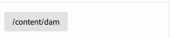

# Definições de modelo, campos e tipos de componentes {#field-types}

Saiba mais sobre campos e os tipos de componentes que o Editor universal pode editar no painel de propriedades com exemplos. Entenda como você pode instrumentar seu próprio aplicativo criando uma definição de modelo e vinculando ao componente.

## Visão geral {#overview}

Ao adaptar seus próprios aplicativos para uso com o Universal Editor, você deve instrumentar os componentes e definir quais campos e tipos de componentes eles podem manipular no painel de propriedades do editor. Você faz isso criando um modelo e vinculando a ele a partir do componente.

Este documento fornece uma visão geral de uma definição de modelo e dos campos e dos tipos de componentes disponíveis para você, juntamente com exemplos de configurações.

>[!TIP]
>
>Se você não estiver familiarizado com como instrumentar seu aplicativo para o Universal Editor, consulte o documento [Visão geral do Universal Editor para desenvolvedores AEM](/help/implementing/universal-editor/developer-overview.md).

## Estrutura de definição do modelo {#model-structure}

Para configurar um componente por meio do painel de propriedades no Universal Editor, uma definição de modelo deve existir e estar vinculada ao componente.

A definição do modelo é uma estrutura JSON, que começa com uma matriz de modelos.

```json
[
  {
    "id": "model-id",        // must be unique
    "fields": []             // array of fields which shall be rendered in the properties panel
  }
]
```

Consulte a seção **[Campos](#fields)** deste documento para obter mais informações sobre como definir a matriz `fields`.

Para usar a definição de modelo com um componente, o atributo `data-aue-model` pode ser usado.

```html
<div data-aue-resource="urn:datasource:/content/path" data-aue-type="component"  data-aue-model="model-id">Click me</div>
```

## Carregando uma Definição de Modelo {#loading-model}

Depois que um modelo é criado, ele pode ser referenciado como um arquivo externo.

```html
<script type="application/vnd.adobe.aue.model+json" src="<url-of-model-definition>"></script>
```

Como alternativa, também é possível definir o modelo em linha.

```html
<script type="application/vnd.adobe.aue.model+json">
  { ... model definition ... }
</script>
```

## Campos {#fields}

Um objeto de campo tem a seguinte definição de tipo.

| Configuração | Tipo de valor | Descrição | Obrigatório |
|---|---|---|---|
| `component` | `ComponentType` | Renderizador do componente | Sim |
| `name` | `string` | Propriedade em que os dados devem ser mantidos | Sim |
| `label` | `FieldLabel` | Rótulo do campo | Sim |
| `description` | `FieldDescription` | Descrição do campo | Não |
| `placeholder` | `string` | Espaço reservado para o campo | Não |
| `value` | `FieldValue` | Valor padrão | Não |
| `valueType` | `ValueType` | Validação padrão, pode ser `string`, `string[]`, `number`, `date`, `boolean` | Não |
| `required` | `boolean` | O campo é obrigatório? | Não |
| `readOnly` | `boolean` | O campo é somente leitura | Não |
| `hidden` | `boolean` | O campo está oculto por padrão? | Não |
| `condition` | `RulesLogic` | Regra para mostrar ou ocultar o campo com base em uma [condição](/help/implementing/universal-editor/customizing.md#conditionally-hide) | Não |
| `multi` | `boolean` | O campo é um campo múltiplo? | Não |
| `validation` | `ValidationType` | Regra ou regras de validação para o campo | Não |
| `raw` | `unknown` | Dados brutos que podem ser usados pelo componente | Não |

### Tipos de componentes {#component-types}

A seguir estão os tipos de componentes possíveis para usar em campos de renderização.

| Descrição | Tipo de componente |
|---|---|
| [Marca AEM](#aem-tag) | `aem-tag` |
| [Conteúdo do AEM](#aem-content) | `aem-content` |
| [Booleano](#boolean) | `boolean` |
| [Grupo de caixas de seleção](#checkbox-group) | `checkbox-group` |
| [Container](#container) | `container` |
| [Fragmento do conteúdo](#content-fragment) | `aem-content-fragment` |
| [Data e hora](#date-time) | `date-time` |
| [Fragmento de experiência](#experience-fragment) | `aem-experience-fragment` |
| [Multisseleção](#multiselect) | `multiselect` |
| [Número](#number) | `number` |
| [Grupo de opções](#radio-group) | `radio-group` |
| [Referência](#reference) | `reference` |
| [Rich Text](#rich-text) | `richtext` |
| [Selecionar](#select) | `select` |
| [Guia](#tab) | `tab` |
| [Texto](#text) | `text` |

#### Tag AEM {#aem-tag}

Um tipo de componente de tag AEM habilita um seletor de tags AEM, que pode ser usado para anexar tags ao componente.

>[!BEGINTABS]

>[!TAB Amostra]

```json
{
  "id": "aem-tag-picker",
  "fields": [
    {
      "component": "aem-tag",
      "label": "AEM Tag Picker",
      "name": "cq:tags",
      "valueType": "string"
    }
  ]
}
```

>[!TAB Captura de tela]


>[!ENDTABS]

#### Conteúdo AEM {#aem-content}

Um tipo de componente de conteúdo do AEM permite um seletor de conteúdo do AEM, que pode ser usado para selecionar qualquer recurso do AEM. Ao contrário do [componente de referência](#reference), que só pode selecionar ativos, o componente de conteúdo AEM pode fazer referência a qualquer conteúdo AEM. Ele oferece um tipo de validação adicional.

| Tipo de validação | Tipo de valor | Descrição | Obrigatório |
|---|---|---|---|
| `rootPath` | `string` | Caminho que o seletor de conteúdo abrirá para o usuário selecionar o conteúdo AEM, limitando a seleção a esse diretório e subdiretórios | Não |

>[!BEGINTABS]

>[!TAB Amostra]

```json
{
  "id": "aem-content-picker",
  "fields": [
    {
      "component": "aem-content",
      "name": "reference",
      "value": "",
      "label": "AEM Content Picker",
      "valueType": "string",
      "validation": {
            "rootPath": "/content/refresh"
        }
    }
  ]
}
```

>[!TAB Captura de tela]



>[!ENDTABS]

#### Booleano {#boolean}

Um tipo de componente booleano armazena um valor simples true/false renderizado como alternância. Ele oferece um tipo de validação adicional.

| Tipo de validação | Tipo de valor | Descrição | Obrigatório |
|---|---|---|---|
| `customErrorMsg` | `string` | Mensagem que será exibida se o valor inserido não for um valor booleano | Não |

>[!BEGINTABS]

>[!TAB Amostra 1]

```json
{
  "id": "boolean",
  "fields": [
    {
      "component": "boolean",
      "label": "Boolean",
      "name": "boolean",
      "valueType": "boolean"
    }
  ]
}
```

>[!TAB Amostra 2]

```json
{
  "id": "another-boolean",
  "fields": [
    {
      "component": "boolean",
      "label": "Boolean",
      "name": "boolean",
      "valueType": "boolean",
      "validation": {
        "customErrorMsg": "Think, McFly. Think!"
      }
    }
  ]
}
```

>[!TAB Captura de tela]


>[!ENDTABS]

#### Grupos de caixa de seleção {#checkbox-group}

Semelhante a um booleano, um tipo de componente Grupo de caixas de seleção permite a seleção de vários itens true/false, renderizados como várias caixas de seleção.

>[!BEGINTABS]

>[!TAB Amostra]

```json
{
  "id": "checkbox-group",
  "fields": [
    {
      "component": "checkbox-group",
      "label": "Checkbox Group",
      "name": "checkbox",
      "valueType": "string[]",
      "options": [
        { "name": "Option 1", "value": "option1" },
        { "name": "Option 2", "value": "option2" }
      ]
    }
  ]
}
```

>[!TAB Captura de tela]


>[!ENDTABS]

#### Contêiner {#container}

Um tipo de componente de contêiner permite o agrupamento de componentes. Ela oferece uma configuração adicional.

| Configuração | Tipo de valor | Descrição | Obrigatório |
|---|---|---|---|
| `collapsible` | `boolean` | O contêiner é recolhível | Não |

>[!BEGINTABS]

>[!TAB Amostra]

```json
 {
  "id": "container",
  "fields": [
    {
      "component": "container",
      "label": "Container",
      "name": "container",
      "valueType": "string",
      "collapsible": true,
      "fields": [
        {
          "component": "text-input",
          "label": "Simple Text 1",
          "name": "text",
          "valueType": "string"
        },
        {
          "component": "text-input",
          "label": "Simple Text 2",
          "name": "text2",
          "valueType": "string"
        }
      ]
    }
  ]
}
```

>[!TAB Captura de tela]


>[!ENDTABS]

#### Fragmento de conteúdo {#content-fragment}

O seletor de Fragmento de Conteúdo pode ser usado para selecionar um [Fragmento de Conteúdo](/help/sites-cloud/authoring/fragments/content-fragments.md) e suas variações (se necessário). Ela oferece uma configuração e validação adicionais.

| Configuração | Tipo de valor | Descrição | Obrigatório |
|---|---|---|---|
| `variationName` | `string` | Nome da variável para armazenar a variação selecionada. Se não estiver definido, nenhum seletor de variação será exibido | Não |

| Tipo de validação | Tipo de valor | Descrição | Obrigatório |
|---|---|---|---|
| `rootPath` | `string` | Caminho que o seletor de conteúdo abrirá para o usuário selecionar o fragmento de conteúdo, limitando a seleção a esse diretório e subdiretórios | Não |

>[!NOTE]
>
>O Editor Universal [valida campos de Fragmento de Conteúdo com base em seus modelos](/help/assets/content-fragments/content-fragments-models.md#validation), permitindo que você imponha regras de integridade de dados, como padrões de regex e restrições de exclusividade.
>
>Isso garante que seu conteúdo atenda às necessidades específicas dos negócios antes de ser publicado.

>[!BEGINTABS]

>[!TAB Amostra 1]

```json
[
  {
    "id": "aem-content-fragment",
    "fields": [
      {
        "component": "aem-content-fragment",
        "name": "picker",
        "label": "Content Fragment Picker",
        "valueType": "string",
        "variationName": "contentFragmentVariation",
        "validation": {
            "rootPath": "/content/refresh"
        }
      }
    ]
  }
]
```

>[!TAB Captura de tela]


>[!ENDTABS]

#### Data e hora {#date-time}

Um tipo de componente de data e hora permite a especificação de uma data, hora ou combinação destas. Ele oferece configurações adicionais.

| Configuração | Tipo de valor | Descrição | Obrigatório |
|---|---|---|---|
| `displayFormat` | `string` | Formato com o qual exibir a cadeia de caracteres de data | Sim |
| `valueFormat` | `string` | Formato no qual armazenar a cadeia de caracteres de data | Sim |

Também oferece um tipo de validação adicional.

| Tipo de validação | Tipo de valor | Descrição | Obrigatório |
|---|---|---|---|
| `customErrorMsg` | `string` | Mensagem que será exibida se `valueFormat` não for atendida | Não |

>[!BEGINTABS]

>[!TAB Amostra 1]

```json
{
  "id": "date-time",
  "fields": [
    {
      "component": "date-time",
      "label": "Date & Time",
      "name": "date",
      "valueType": "date"
    }
  ]
}
```

>[!TAB Amostra 2]

```json
{
  "id": "another-date-time",
  "fields": [
    {
      "component": "date-time",
       "valueType": "date-time",
      "name": "field1",
      "label": "Date Time",
      "description": "This is a date time field that stores both date and time.",
      "required": true,
      "placeholder": "YYYY-MM-DD HH:mm:ss",
      "displayFormat": null,
      "valueFormat": null,
      "validation": {
        "customErrorMsg": "Marty! You have to come back with me!"
      }
    },
    {
      "component": "date-time",
      "valueType": "date",
      "name": "field2",
      "label": "Another Date Time",
      "description": "This is another date time field that only stores the date.",
      "required": true,
      "placeholder": "YYYY-MM-DD",
      "displayFormat": null,
      "valueFormat": null,
      "validation": {
        "customErrorMsg": "Back to the future!"
      }
    },
    {
      "component": "date-time",
      "valueType": "time",
      "name": "field3",
      "label": "Yet Another Date Time",
      "description": "This is another date time field that only stores the time.",
      "required": true,
      "placeholder": "HH:mm:ss",
      "displayFormat": null,
      "valueFormat": null,
      "validation": {
        "customErrorMsg": "Great Scott!"
      }
    }
  ]
}
```

>[!TAB Captura de tela]


>[!ENDTABS]

#### Fragmento de experiência {#experience-fragment}

O seletor de Fragmento de experiência pode ser usado para selecionar um [Fragmento de experiência](/help/sites-cloud/authoring/fragments/experience-fragments.md) e suas variações (se necessário). Ela oferece uma configuração e validação adicionais.

| Configuração | Tipo de valor | Descrição | Obrigatório |
|---|---|---|---|
| `variationName` | `string` | Nome da variável para armazenar a variação selecionada. Se não estiver definido, nenhum seletor de variação será exibido | Não |

| Tipo de validação | Tipo de valor | Descrição | Obrigatório |
|---|---|---|---|
| `rootPath` | `string` | Caminho que o seletor de conteúdo abrirá para o usuário selecionar o Fragmento de experiência, limitando a seleção a esse diretório e subdiretórios | Não |

>[!BEGINTABS]

>[!TAB Amostra 1]

```json
[
  {
    "id": "experience-fragment",
    "fields": [
      {
        "component": "aem-experience-fragment",
        "valueType": "string",
        "name": "experience-fragment",
        "label": "experience-fragment",
        "variationName": "experienceFragmentVariation",
        "validation": {
            "rootPath": "/content/refresh"
        }
      }
    ]
  }
]
```

>[!TAB Captura de tela]


>[!ENDTABS]


#### Multisseleção {#multiselect}

Um tipo de componente de seleção múltipla apresenta vários itens para seleção em uma lista suspensa, incluindo a capacidade de agrupar os elementos selecionáveis.

>[!BEGINTABS]

>[!TAB Amostra 1]

```json
{
  "id": "multiselect",
  "fields": [
    {
      "component": "multiselect",
      "name": "multiselect",
      "label": "Multi Select",
      "valueType": "string",
      "options": [
        { "name": "Option 1", "value": "option1" },
        { "name": "Option 2", "value": "option2" }
      ]
    }
  ]
}
```

>[!TAB Amostra 2]

```json
{
  "id": "multiselect-grouped",
  "fields": [
    {
      "component": "multiselect",
      "name": "property",
      "label": "Multiselect field",
      "valueType": "string",
      "required": true,
      "maxSize": 2,
      "options": [
        {
          "name": "Theme",
          "children": [
            { "name": "Light", "value": "light" },
            { "name": "Dark",  "value": "dark" }
          ]
        },
        {
          "name": "Type",
          "children": [
            { "name": "Alpha", "value": "alpha" },
            { "name": "Beta", "value": "beta" },
            { "name": "Gamma", "value": "gamma" }
          ]
        }
      ]
    }
  ]
}
```

>[!TAB Capturas de tela]


>[!ENDTABS]

#### Número {#number}

Um tipo de componente numérico permite a entrada de um número. Ela oferece tipos de validação adicionais.

| Tipo de validação | Tipo de valor | Descrição | Obrigatório |
|---|---|---|---|
| `numberMin` | `number` | Número mínimo permitido | Não |
| `numberMax` | `number` | Número máximo permitido | Não |
| `customErrorMsg` | `string` | Mensagem que será exibida se `numberMin` ou `numberMax` não for atendido | Não |

>[!BEGINTABS]

>[!TAB Amostra 1]

```json
{
  "id": "number",
  "fields": [
    {
      "component": "number",
      "name": "number",
      "label": "Number",
      "valueType": "number",
      "value": 0
    }
  ]
}
```

>[!TAB Amostra 2]

```json
{
  "id": "another-number",
  "fields": [
   {
      "component": "number",
      "valueType": "number",
      "name": "field1",
      "label": "Number Field",
      "description": "This is a number field.",
      "required": true,
      "placeholder": null,
      "validation": {
        "numberMin": 0,
        "numberMax": 88,
        "customErrorMsg": "You also need 1.21 gigawatts."
      }
    }
  ]
}
```

>[!TAB Captura de tela]


>[!ENDTABS]

#### Grupo radial {#radio-group}

Um tipo de componente Grupo de opções permite uma seleção mutuamente exclusiva de várias opções renderizadas como um grupo semelhante a um grupo de caixas de seleção.

>[!BEGINTABS]

>[!TAB Amostra]

```json
{
  "id": "radio-group",
  "fields": [
    {
      "component": "radio-group",
      "label": "Radio Group",
      "name": "radio",
      "valueType": "string",
      "options": [
        { "name": "Option 1", "value": "option1" },
        { "name": "Option 2", "value": "option2" }
      ]
    }
  ]
}
```

>[!TAB Captura de tela]


>[!ENDTABS]

#### Referência {#reference}

Um tipo de componente de referência permite um seletor de ativos AEM, que pode ser usado para selecionar qualquer ativo AEM para referência. Ao contrário do [componente de conteúdo do AEM](#aem-content), que pode selecionar qualquer recurso AEM, o componente de referência só pode fazer referência a ativos. Ele oferece um tipo de validação adicional.

Um tipo de componente de referência permite uma referência a outro objeto de dados do objeto atual.

>[!BEGINTABS]

>[!TAB Amostra]

```json
{
  "id": "reference",
  "fields": [
    {
      "component": "reference",
      "label": "Reference",
      "name": "reference",
      "valueType": "string"
    }
  ]
}
```

>[!TAB Captura de tela]


>[!ENDTABS]

#### Texto formatado {#rich-text}

Rich text permite entrada de rich text com várias linhas. Ela oferece tipos de validação adicionais.

| Tipo de validação | Tipo de valor | Descrição | Obrigatório |
|---|---|---|---|
| `maxSize` | `number` | Número máximo de caracteres permitido | Não |
| `customErrorMsg` | `string` | Mensagem que será exibida se `maxSize` for excedido | Não |

>[!BEGINTABS]

>[!TAB Amostra 1]

```json
{
  "id": "richtext",
  "fields": [
    {
      "component": "richtext",
      "name": "rte",
      "label": "Rich Text",
      "valueType": "string"
    }
  ]
}
```

>[!TAB Amostra 2]

```json
{
  "id": "another-richtext",
  "fields": [
    {
      "component": "richtext",
      "name": "rte",
      "label": "Rich Text",
      "valueType": "string",
      "validation": {
        "maxSize": 1000,
        "customErrorMsg": "That's about as funny as a screen door on a battleship."
      }
    }
  ]
}
```

>[!TAB Captura de tela]


>[!ENDTABS]

#### Selecionar {#select}

Um tipo de componente de seleção permite selecionar uma única opção em uma lista de opções predefinidas em um menu suspenso.

>[!BEGINTABS]

>[!TAB Amostra]

```json
{
  "id": "select",
  "fields": [
    {
      "component": "select",
      "label": "Select",
      "name": "select",
      "valueType": "string",
      "options": [
        { "name": "Option 1", "value": "option1" },
        { "name": "Option 2", "value": "option2" }
      ]
    }
  ]
}
```

>[!TAB Captura de tela]


>[!ENDTABS]

#### Guia {#tab}

Um tipo de componente de guia permite agrupar outros campos de entrada em várias guias para melhorar a organização do layout dos autores.

Uma definição `tab` pode ser considerada como um separador na matriz de `fields`. Tudo que vem após um `tab` será colocado nessa guia até que um novo `tab` seja encontrado, após o qual os itens a seguir serão colocados na nova guia.

Se desejar que itens sejam exibidos acima de todas as guias, eles deverão ser definidos antes de qualquer guia.

>[!BEGINTABS]

>[!TAB Amostra]

```json
{
  "id": "tab",
  "fields": [
    {
      "component": "tab",
      "label": "Tab 1",
      "name": "tab1"
    },
    {
      "component": "text-input",
      "label": "Text 1",
      "name": "text1",
      "valueType": "string"
    },
    {
      "component": "tab",
      "label": "Tab 2",
      "name": "tab2"
    },
    {
      "component": "text-input",
      "label": "Text 2",
      "name": "text2",
      "valueType": "string"
    }
  ]
}
```

>[!TAB Captura de tela]


>[!ENDTABS]

#### Texto {#text}

O texto permite uma única linha de entrada de texto.  Inclui tipos de validação adicionais.

| Tipo de validação | Tipo de valor | Descrição | Obrigatório |
|---|---|---|---|
| `minLength` | `number` | Número mínimo de caracteres permitidos | Não |
| `maxLength` | `number` | Número máximo de caracteres permitidos | Não |
| `regExp` | `string` | Expressão regular à qual o texto de entrada deve corresponder | Não |
| `customErrorMsg` | `string` | Mensagem que será exibida se `minLength`, `maxLength` e/ou `regExp` for/forem violado(s) | Não |

>[!BEGINTABS]

>[!TAB Amostra 1]

```json
{
  "id": "simpletext",
  "fields": [
    {
      "component": "text",
      "name": "text",
      "label": "Simple Text",
      "valueType": "string"
    }
  ]
}
```

>[!TAB Amostra 2]

```json
{
  "id": "another simpletext",
  "fields": [
    {
      "component": "text",
      "name": "text",
      "label": "Simple Text",
      "valueType": "string",
      "description": "This is a text input with validation.",
      "required": true,
      "validation": {
        "minLength": 1955,
        "maxLength": 1985,
        "regExp": "^foo:.*",
        "customErrorMsg": "Why don't you make like a tree and get outta here?"
      }
    }
  ]
}
```

>[!TAB Captura de tela]


>[!ENDTABS]
