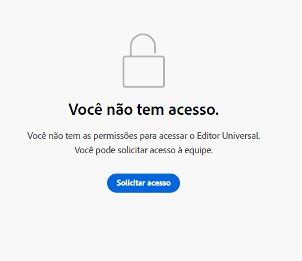

# Introdução ao Editor universal no AEM {#getting-started}

Saiba como obter acesso ao Editor universal e começar a instrumentar seu primeiro aplicativo do AEM para utilizá-lo.

>[!TIP]
>
>Se preferir ir direto para o exemplo, você pode consultar o [aplicativo de demonstração do Editor universal no GitHub.](https://github.com/adobe/universal-editor-sample-editable-app)

{{universal-editor-status}}

## Etapas de integração {#onboarding}

Embora o Editor universal possa editar conteúdo de qualquer fonte, este documento usará um aplicativo do AEM como exemplo.

Há várias etapas para integrar seu aplicativo AEM e instrumentá-lo para usar o Editor universal.

1. [Solicitar acesso ao Editor universal.](#request-access)
1. [Incluir a biblioteca principal do Editor universal.](#core-library)
1. [Adicionar a configuração OSGi necessária.](#osgi-configurations)
1. [Instrumentar a página.](#instrument-page)

Este documento o orientará por essas etapas.

## Solicitar acesso ao Editor universal {#request-access}

Primeiro, é necessário solicitar acesso ao Editor universal. Abertura [`https://experience.adobe.com/#/aem/editor&quot;](https://experience.adobe.com/#/aem/editor), faça logon e valide se você tiver acesso ao Universal Editor.

Caso não possua acesso, solicite-o por meio de um formulário encontrado nessa mesma página.



Clique em **Solicitar acesso** e preencha o formulário conforme indicado para solicitar o acesso. Um representante da Adobe verificará sua solicitação e entrará em contato para discutir o caso de uso.

## Incluir a biblioteca principal do Editor universal {#core-library}

Antes que seu aplicativo possa ser instrumentado para uso com o Universal Editor, ele deve incluir a seguinte dependência.

```javascript
@adobe/universal-editor-cors
```

Para ativar a instrumentação, a seguinte importação deve ser adicionada ao seu `index.js`.

```javascript
import "@adobe/universal-editor-cors";
```

### Alternativa para aplicativos que não utilizam React {#alternative}

Se você não estiver implementando um aplicativo React e/ou exigir renderização do lado do servidor, um método alternativo será incluir o seguinte no corpo do documento.

```html
<script src="https://universal-editor-service.experiencecloud.live/corslib/LATEST" async></script>
```

A versão mais recente é sempre recomendada, mas versões anteriores do serviço podem ser referenciadas em caso de alterações importantes.

* `https://universal-editor-service.experiencecloud.live/corslib/LATEST` - A biblioteca UE CORS mais recente
* `https://universal-editor-service.experiencecloud.live/corslib/2/LATEST` - A biblioteca UE CORS mais recente na versão 2.x
* `https://universal-editor-service.experiencecloud.live/corslib/2.1/LATEST` - A biblioteca UE CORS mais recente na versão 2.1.x
* `https://universal-editor-service.experiencecloud.live/corslib/2.1.1`- O UE CORS lib exato versão 2.1.1

## Adicionar as configurações OSGi necessárias {#osgi-configurations}

Para poder editar o conteúdo do AEM com seu aplicativo utilizando o Editor universal, as configurações de CORS e cookies devem ser definidas no AEM.

As configurações [OSGi a seguir devem ser definidas na instância de criação do AEM.](/help/implementing/deploying/configuring-osgi.md)

* `SameSite Cookies = None` em `com.day.crx.security.token.impl.impl.TokenAuthenticationHandler`
* Remova o cabeçalho X-FRAME-OPTIONS: SAMEORIGIN em `org.apache.sling.engine.impl.SlingMainServlet`

### com.day.crx.security.token.impl.impl.TokenAuthenticationHandler {#samesite-cookies}

O cookie do token de logon deve ser enviado para o AEM como um domínio de terceiros. Portanto, o cookie SameSite deve ser definido explicitamente como `None`.

Essa propriedade deve ser definida na configuração OSGi `com.day.crx.security.token.impl.impl.TokenAuthenticationHandler`.

```xml
<?xml version="1.0" encoding="UTF-8"?>
<jcr:root xmlns:sling="http://sling.apache.org/jcr/sling/1.0"
          xmlns:jcr="http://www.jcp.org/jcr/1.0" jcr:primaryType="sling:OsgiConfig"
          token.samesite.cookie.attr="None" />
```

### org.apache.sling.engine.impl.SlingMainServlet {#sameorigin}

X-Frame-Options: SAMEORIGIN impede a renderização de páginas do AEM dentro de um iFrame. Remover o cabeçalho permite que as páginas sejam carregadas.

Essa propriedade deve ser definida na configuração OSGi `org.apache.sling.engine.impl.SlingMainServlet`.

```xml
<?xml version="1.0" encoding="UTF-8"?>
<jcr:root xmlns:sling="http://sling.apache.org/jcr/sling/1.0"
          xmlns:jcr="http://www.jcp.org/jcr/1.0"
          jcr:primaryType="sling:OsgiConfig"
          sling.additional.response.headers="[X-Content-Type-Options=nosniff]"/>
```

## Instrumentar a página {#instrument-page}

O serviço do Editor universal exige um [nome uniforme de recurso (URN)](https://en.wikipedia.org/wiki/Uniform_Resource_Name) para identificar e utilizar o sistema de back-end correto para o conteúdo no aplicativo que está sendo editado. Portanto, um esquema URN é necessário para mapear o conteúdo de volta para os recursos de conteúdo.

### Criação de conexões {#connections}

As conexões usadas no aplicativo são armazenadas como tags de `<meta>` no `<head>` da página.

```html
<meta name="urn:adobe:aue:<category>:<referenceName>" content="<protocol>:<url>">
```

* `<category>` - Esta é uma classificação da conexão com duas opções.
   * `system` - Para pontos de extremidade de conexão
   * `config` - Para [definição de definições de configuração opcionais](#configuration-settings)
* `<referenceName>`: este é um nome curto que é reutilizado no documento para identificar a conexão. Por exemplo: `aemconnection`
* `<protocol>`: isso indica qual plug-in do serviço de persistência do Editor universal deve ser utilizado. Por exemplo: `aem`
* `<url>`: esta é a URL do sistema no qual as alterações devem ser mantidas. Por exemplo: `http://localhost:4502`

O identificador `urn:adobe:aue:system` representa a conexão do Editor universal da Adobe.

`data-aue-resource`s usarão o prefixo `urn` para encurtar o identificador.

```html
data-aue-resource="urn:<referenceName>:<resource>"
```

* `<referenceName>`: esta é a referência de nome mencionada na tag `<meta>`. Por exemplo: `aemconnection`
* `<resource>`: este é um indicador do recurso no sistema de destino. Por exemplo: um caminho de conteúdo do AEM, como `/content/page/jcr:content`

>[!TIP]
>
>Consulte o documento [Atributos e tipos](attributes-types.md) para obter mais detalhes sobre os atributos e tipos de dados exigidos pelo Editor universal.

### Exemplo de conexão {#example}

```html
<meta name="urn:adobe:aue:system:<referenceName>" content="<protocol>:<url>">

<html>
<head>
    <meta name="urn:adobe:aue:system:aemconnection" content="aem:https://localhost:4502">
    <meta name="urn:adobe:aue:system:fcsconnection" content="fcs:https://example.franklin.adobe.com/345fcdd">
</head>
<body>
        <aside>
          <ul data-aue-resource="urn:aemconnection:/content/example/list" data-aue-type="container">
            <li data-aue-resource="urn:aemconnection/content/example/listitem" data-aue-type="component">
              <p data-aue-prop="name" data-aue-type="text">Jane Doe</p>
              <p data-aue-prop="title" data-aue-type="text">Journalist</p>
              
            </li>

...

            <li data-aue-resource="urn:fcsconnection:/documents/mytext" data-aue-type="component">
              <p data-aue-prop="name" data-aue-type="text">John Smith</p>
              <p data-aue-resource="urn:aemconnection/content/example/another-source" data-aue-prop="title" data-aue-type="text">Photographer</p>
              
            </li>
          </ul>
        </aside>
</body>
</html>
```

### Definições de configuração {#configuration-settings}

Você pode usar o `config` prefixo na URN da conexão para definir os pontos de extremidade de serviço e extensão, se necessário.

Se você não quiser usar o Universal Editor Service, que é hospedado pelo Adobe, mas sua própria versão hospedada, poderá defini-lo em uma meta tag. Para substituir o ponto de extremidade de serviço padrão fornecido pelo Editor Universal, defina seu próprio ponto de extremidade de serviço:

* Meta name - `urn:adobe:aue:config:service`
* Conteúdo meta - `content="https://adobe.com"` (exemplo)

```html
<meta name="urn:adobe:aue:config:service" content="<url>">
```

Se você quiser que apenas determinadas extensões sejam ativadas para uma página, poderá definir isso em uma meta tag. Para buscar extensões, defina os pontos de extremidade da extensão:

* Nome meta: `urn:adobe:aue:config:extensions`
* Conteúdo meta: `content="https://adobe.com,https://anotherone.com,https://onemore.com"` (exemplo)

```html
<meta name="urn:adobe:aue:config:extensions" content="<url>,<url>,<url>">
```

## Você está pronto para usar o Editor universal {#youre-ready}

Seu aplicativo agora está pronto para utilizar o Editor universal.

Consulte [Criação de conteúdo com o Editor universal](/help/sites-cloud/authoring/universal-editor/authoring.md) para ver como é fácil e intuitivo criar conteúdo utilizando o Editor universal.

## Recursos adicionais {#additional-resources}

Para saber mais sobre o Editor universal, consulte estes documentos.

* [Introdução ao Editor universal](introduction.md): saiba como o Editor universal permite editar qualquer aspecto do conteúdo das implementações, a fim de entregar experiências excepcionais, aumentar a velocidade do conteúdo e fornecer uma experiência de desenvolvimento de última geração.
* [Criação de conteúdo com o Editor universal](/help/sites-cloud/authoring/universal-editor/authoring.md): saiba como é fácil e intuitivo para os autores criarem conteúdo usando o Editor universal.
* [Publicar conteúdo com o editor universal](/help/sites-cloud/authoring/universal-editor/publishing.md) - Saiba como o Editor Universal publica conteúdo e como seus aplicativos podem lidar com o conteúdo publicado.
* [Arquitetura do Editor universal](architecture.md): saiba mais sobre a arquitetura do Editor universal e como os dados fluem entre seus serviços e camadas.
* [Atributos e tipos](attributes-types.md): saiba mais sobre os atributos e tipos de dados exigidos pelo Editor universal.
* [Autenticação do Editor universal](authentication.md): saiba como funciona a autenticação do Editor universal.
