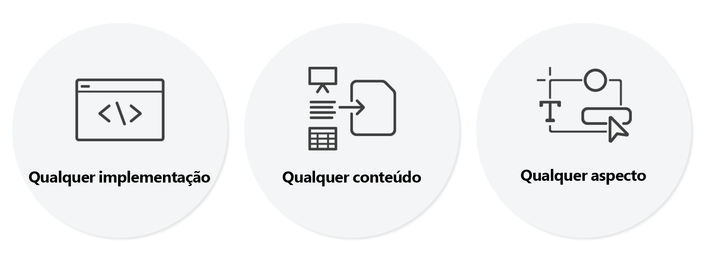

# Introdução ao Editor universal {#introduction}

Saiba como o Editor universal habilita a edição &quot;o que você vê é o que você obtém&quot; (WYSIWYG) de qualquer experiência headless e headful. Entenda como ele pode ajudar criadores de conteúdo a entregar experiências excepcionais, aumentar a velocidade do conteúdo e como ele oferece uma experiência de desenvolvedor de última geração.

## Segundo plano {#background}

O editor de páginas tem sido uma ferramenta poderosa para criadores de conteúdo do AEM. O editor de páginas oferece uma experiência intuitiva, visual e com contexto no estilo “WYSIWYG”, exigindo o mínimo de treinamento possível e permitindo que os autores visualizem exatamente como o conteúdo será exibido.

Entretanto, o editor de páginas pode editar somente o conteúdo, a estrutura e os componentes do AEM que estão contidos na página. O conteúdo atual, no entanto, raramente é proveniente de um único local. O Editor universal oferece a mesma experiência de edição local que o editor de páginas, porém, para qualquer aspecto de qualquer conteúdo de implementação.

## É realmente universal {#universal}

O Editor universal pode ser utilizado em qualquer implementação, para qualquer aspecto de qualquer conteúdo.

### Qualquer implementação {#any-implementation}

Visto que é possível criar experiências de diferentes maneiras, qualquer implementação pode utilizar o Editor Universal para que os autores possam realizar edições com contexto.

Muitos usuários acreditam que uma implementação headless limita a edição de todo o conteúdo dos autores a uma interface baseada em formulários, mas isso não acontece no Editor Universal

Os requisitos para uma implementação utilizar o Editor Universal são bastante simples e são compatíveis com:

* **Qualquer arquitetura**: renderização do lado do servidor, do lado da borda, do lado do cliente etc.
* **Qualquer estrutura**: AEM básico ou qualquer estrutura de terceiros, como React, Next.js, Angular etc.
* **Qualquer hospedagem**: é possível hospedar localmente no AEM ou em um domínio remoto

### Qualquer conteúdo {#any-content}

Um autor de conteúdo deve ter a mesma experiência avançada oferecida no editor de páginas do AEM. Mas o Editor universal permite que os autores editem **qualquer** conteúdo de forma visual e com contexto, o que abrange:

* **Estruturas de página do AEM**: `cq:Components` aninhados de `cq:Pages`, incluindo fragmentos de experiência.
* **Fragmentos de conteúdo do AEM**: é possível editar o conteúdo dos fragmentos de conteúdo conforme aparecem no contexto da experiência.
* **Documentos**: a prova de conceitos mostrou que os documentos do Word, Excel, Google Docs ou Markdown também podem ser editados da mesma maneira (trata-se do WIP).

### Qualquer aspecto {#any-aspect}

Para um autor, o conteúdo não envolve apenas as informações contidas, mas também a forma como elas são apresentadas e recebidas. O conteúdo vem com metadados e regras de instrumentação adicionais, que o Editor universal pode entender e editar, incluindo:

* **Aplicação de layout e estilo**: utilizando um sistema de estilos, o profissional de marketing e o autor de conteúdo podem aplicar estilos diferentes ao conteúdo e criar layouts distintos, como colunas, carrosséis, guias, acordeões etc.

## Valor {#value}

Ao separar a experiência de edição de conteúdo de qualquer sistema de entrega de conteúdo específico, o editor se torna realmente universal e flexível, permitindo que o autor de conteúdo entregue experiências excepcionais, aumente a velocidade do conteúdo e forneça uma experiência de desenvolvimento de última geração.

* **Entrega de experiências excepcionais**: com o objetivo de habilitar os profissionais a criar um experiência atrativa para os visitantes, o Editor Universal permite a criação e a edição do conteúdo no contexto da visualização. Isso permite que eles criem um conteúdo que se ajuste ao design, possibilitando uma experiência significativa para os visitantes.
* **Aumento da velocidade do conteúdo**: para simplificar a administração do fluxo de trabalho, o Editor universal permite editar o conteúdo da visualização a fim de orientar os profissionais, mostrando apenas as opções que são relevantes para o contexto e tornando o fluxo de trabalho independente das fontes de conteúdo.
* **Experiência de desenvolvedor de última geração**: para se adequar ao atual cenário heterogêneo dos aplicativos, o Editor universal é completamente independente e não favorece tecnologias específicas, permitindo que os desenvolvedores utilizem sua tecnologia preferida para implementar a experiência.

## Editor universal e o Editor de fragmento de conteúdo {#universal-editor-content-fragment-editor}

Em uma primeira análise, pode parecer que o Editor universal e o Editor de fragmento de conteúdo fornecem recursos de edição semelhantes. No entanto, esses editores oferecem recursos muito diferentes e cuidam de tarefas distintas do profissional de marketing.

### Editor de fragmento de conteúdo {#content-fragment-editor}

Para um profissional de marketing que deseja criar conteúdo sem precisar se preocupar com o layout, de maneira que ele possa ser reutilizado em vários contextos da experiência.

* O foco é dimensionar a estratégia de conteúdo.

### Editor universal {#universal-editor}

Para um profissional de marketing que deseja criar um conteúdo adaptado ao layout de um contexto específico, a fim de fornecer uma experiência excepcional.

* O foco é estabelecer uma conexão convincente com os leitores.

## Roteiro {#road-map}

É importante observar que o Editor universal está em constante mudança, por isso, alguns recursos presentes neste documento podem apresentar uma visão do editor final, a qual pode não representar seus recursos atuais.

Fale com seu contato da Adobe para obter detalhes sobre os próximos recursos planejados para o editor universal.

## Recursos adicionais {#additional-resources}

Para saber mais sobre o Editor universal, consulte estes documentos.

* [Criação de conteúdo com o Editor universal](authoring.md): saiba como é fácil e intuitivo para os autores criarem conteúdo utilizando o Editor universal.
* [Publicação de conteúdo com o Editor universal](publishing.md): saiba como o Editor universal publica o conteúdo e como seus aplicativos podem lidar com esse conteúdo.
* [Introdução ao Editor universal no AEM](getting-started.md): saiba como obter acesso ao Editor universal e começar a instrumentar seu primeiro aplicativo do AEM para utilizá-lo.
* [Arquitetura do Editor universal](architecture.md): saiba mais sobre a arquitetura do Editor universal e como os dados fluem entre seus serviços e camadas.
* [Atributos e tipos](attributes-types.md): saiba mais sobre os atributos e tipos de dados exigidos pelo Editor universal.
* [Autenticação do Editor universal](authentication.md): saiba como funciona a autenticação do Editor universal.
