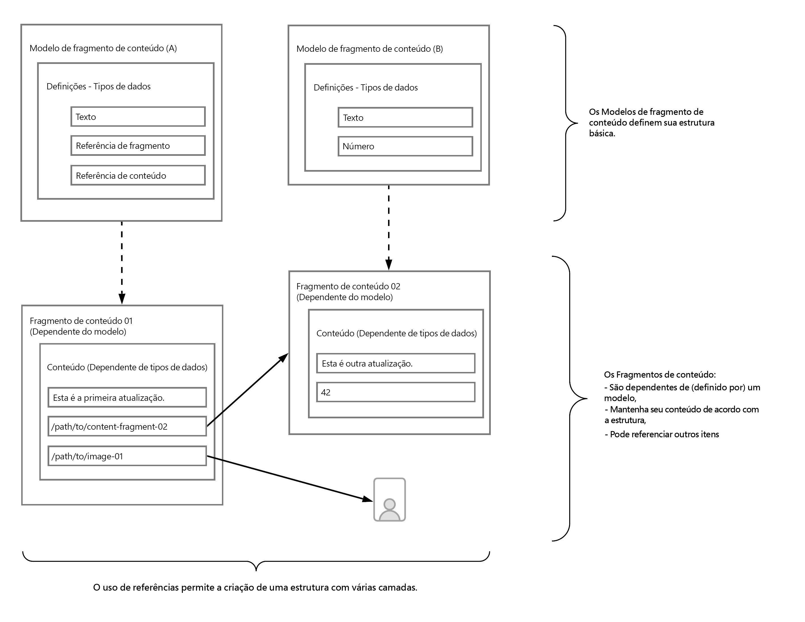

# Saiba o básico sobre a modelagem de conteúdo para headless com o AEM {#content-modeling-headless-basics}

## A história até agora {#story-so-far}

No início da [jornada do arquiteto de conteúdo headless do AEM](overview.md), a [Introdução](introduction.md) abordou os conceitos básicos e as terminologias relevantes para a modelagem de conteúdo para headless.

Este artigo se baseia nesses conceitos para que você entenda como modelar o conteúdo do seu projeto headless do AEM.

## Objetivo {#objective}

* **Público-alvo**: iniciante
* **Objetivo**: apresentar os conceitos de modelagem de conteúdo de um CMS headless.

## Modelagem de conteúdo com modelos de fragmento de conteúdo {#architect-content-fragment-models}

A modelagem de conteúdo (dados) é um conjunto de técnicas estabelecidas e frequentemente usadas ao desenvolver bancos de dados de relacionamento. Então, o que a modelagem de conteúdo significa para o AEM Headless?

### Por quê? {#why}

Para garantir que seu aplicativo possa solicitar e receber o conteúdo necessário do AEM de forma consistente e eficiente, esse conteúdo deve ser estruturado.

Isso significa que o aplicativo sabe antecipadamente a forma de resposta e, portanto, como processá-la. Isso é muito mais fácil do que receber conteúdo de forma livre, que deve ser analisado para determinar o que ele contém e, portanto, como pode ser usado.

### Introdução a como? {#how}

O AEM usa Fragmentos de conteúdo para fornecer as estruturas necessárias para a entrega headless do conteúdo aos seus aplicativos.

A estrutura do modelo de conteúdo é:

* realizada pela definição do Modelo de fragmento de conteúdo,
* usada como base dos Fragmentos de conteúdo usados para a geração de conteúdo.

>[!NOTE]
>
>Os modelos de fragmento de conteúdo também são usados como a base dos esquemas GraphQL do AEM, os quais são usados para recuperar seu conteúdo. Falaremos mais sobre isso na jornada do desenvolvedor.

As solicitações de conteúdo são feitas usando a API GraphQL do AEM, uma implementação personalizada da API GraphQL padrão. A API GraphQL do AEM permite que os aplicativos realizem consultas (complexas) em seus fragmentos de conteúdo, sendo que cada consulta está de acordo com um tipo de modelo específico.

O conteúdo retornado pode ser usado pelos seus aplicativos.

## Criar a estrutura com Modelos de fragmento de conteúdo {#create-structure-content-fragment-models}

Os Modelos de fragmentos de conteúdo fornecem vários mecanismos que permitem definir a estrutura do conteúdo.

Um Modelo de fragmento de conteúdo descreve uma entidade.

>[!NOTE]
>A funcionalidade dos fragmentos de conteúdo deve estar ativada no navegador de configuração para que você possa criar novos modelos.

>[!TIP]
>
>O modelo deve ser nomeado para que o autor de conteúdo saiba qual modelo selecionar ao criar um Fragmento de conteúdo.

Dentro de um modelo:

1. **Tipos de dados** permitem definir os atributos individuais.
Por exemplo, defina o campo com o nome de um professor como **Texto** e seus anos de serviço como **Número**.
1. Os tipos de dados **Referência de conteúdo** e **Referência de fragmento** permitem criar relações com outro conteúdo no AEM.
1. A variável **Referência do fragmento** O tipo de dados permite que você realize vários níveis de estrutura aninhando os fragmentos de conteúdo (de acordo com o tipo de modelo). Isso é essencial para a modelagem de conteúdo.

Por exemplo:

## Tipos de dados {#data-types}

O AEM fornece os seguintes tipos de dados para você modelar o conteúdo:

* Texto em linha única
* Texto multilinha
* Número
* Booleano
* Data e hora
* Lista discriminada
* Tags
* Referência de conteúdo
* Referência de fragmento
* Objeto JSON

>[!NOTE]
>
>Mais detalhes estão disponíveis em Modelos de fragmento de conteúdo - Tipos de dados.

## Referências e conteúdo aninhado {#references-nested-content}

Dois tipos de dados fornecem referências ao conteúdo fora de um fragmento específico:

* **Referência de conteúdo**
Isso fornece uma referência simples a outro conteúdo de qualquer tipo.
Por exemplo, você pode fazer referência a uma imagem em um local especifico.

* **Referência de fragmento**
Isso fornece referências a outros Fragmentos de conteúdo.
Esse tipo de referência é usado para criar conteúdo aninhado, introduzindo as relações necessárias para modelar o conteúdo.
O tipo de dados pode ser configurado para permitir que os autores de fragmento:
   * Editem o fragmento referenciado diretamente.
   * Criem um novo fragmento de conteúdo, com base no modelo apropriado

>[!NOTE]
>
>Você também pode criar referências ad hoc usando links dentro de blocos de texto.

## Níveis de estrutura (fragmentos aninhados) {#levels-of-structure-nested-fragments}

Para modelagem de conteúdo, a variável **Referência do fragmento** O tipo de dados permite criar vários níveis de estrutura e relacionamentos.

Com essa referência, você pode *conectar* vários modelos de fragmentos de conteúdo para representar as inter-relações. Isso permite que o aplicativo headless siga as conexões e acesse o conteúdo conforme necessário.

>[!NOTE]
>
>Isso deve ser usado com cautela e a prática recomendada pode ser definida como *aninhar o necessário, mas o mínimo possível*.

As referências de fragmento fazem exatamente isso: permitem que você faça referência a outro fragmento.

Por exemplo, você pode ter os seguintes modelos de fragmento de conteúdo definidos:

* Cidade
* Empresa
* Pessoa
* Prêmios

Parece muito simples, porém é claro que uma empresa conta com um CEO, mas também com funcionários....e todos são definidos como uma Pessoa.

E uma pessoa pode ter um prêmio (ou talvez dois).

* Minha empresa - Empresa
   * CEO - Pessoa
   * Funcionário(s) - Pessoa
      * Prêmios pessoais - Prêmio

E isso é só para começar. Dependendo da complexidade, um prêmio pode ser específico da empresa ou uma empresa pode ter seu escritório principal em uma cidade específica.

A representação dessas inter-relações pode ser alcançada com as Referências de fragmento, já que elas são entendidas por você (o arquiteto), pelo autor do conteúdo e pelos aplicativos headless.

## O que vem a seguir {#whats-next}

Agora que você aprendeu o básico, o próximo passo é [Saber mais sobre como criar Modelos de fragmento de conteúdo no AEM](model-structure.md). Essa seção introduzirá e discutirá as várias referências disponíveis e como criar níveis de estrutura com as Referências de fragmento, uma parte essencial da modelagem headless.

## Recursos adicionais {#additional-resources}

* [Modelos de fragmentos do conteúdo](/help/sites-cloud/administering/content-fragments/content-fragments-models.md)

   * [Modelos de fragmento de conteúdo - Tipos de dados](/help/sites-cloud/administering/content-fragments/content-fragments-models.md#data-types)

* [Conceitos de criação](/help/sites-cloud/authoring/getting-started/concepts.md)

* [Manuseio básico](/help/sites-cloud/authoring/getting-started/basic-handling.md) - esta página se baseia principalmente no console **Sites**, mas muitos/a maioria dos recursos também são relevantes para a criação de **Fragmentos de conteúdo** no console **Ativos**.

* [Trabalho com Fragmentos de conteúdo](/help/sites-cloud/administering/content-fragments/content-fragments.md)
