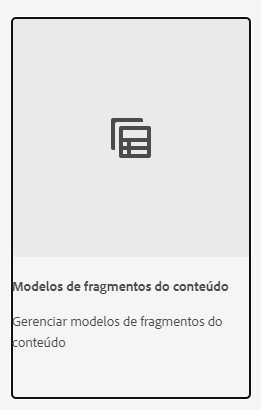

# Saiba mais sobre criação de Modelos de fragmento de conteúdo no AEM {#architect-headless-content-fragment-models}

## A história até agora {#story-so-far}

No início da [Jornada do autor de conteúdo do AEM Headless](overview.md), o artigo [Noções básicas da modelagem de conteúdo para headless com AEM](basics.md) abordou os conceitos básicos e a terminologia relevantes à criação para headless.

Este artigo se baseia neles para que você entenda como criar seus próprios Modelos de fragmentos de conteúdo para seu projeto AEM headless.

## Objetivo {#objective}

* **Público-alvo**: iniciante
* **Objetivo**: os conceitos e mecanismos de modelagem de conteúdo para o seu CMS headless usando Modelos de fragmentos de conteúdo.

<!-- which persona does this? -->
<!-- and who allows the configuration on the folders? -->

<!--
## Enabling Content Fragment Models {#enabling-content-fragment-models}

At the very start you need to enable Content Fragment Models for your site, this is done in the Configuration Browser; under Tools > General > Configuration Browser. You can either select to configure the global entry, or create a configuration. For example:

>[!NOTE]
>
>See Additional Resources - Content Fragments in the Configuration Browser
-->

## Criar Modelos de fragmentos do conteúdo {#creating-content-fragment-models}

Em seguida, os Modelos de fragmentos de conteúdo podem ser criados e a estrutura definida. Isso pode ser feito em **Ferramentas** > **Geral** > **Modelos de fragmentos do conteúdo**.

Após selecionar isso, navegue até o local do modelo e selecione **Criar**. Aqui você pode inserir vários detalhes principais.

A opção **Ativar modelo** é ativada por padrão. Isso significa que seu modelo estará disponível para uso (na criação de fragmentos de conteúdo) assim que você salvá-lo. Você pode desativá-la se desejar — há oportunidades depois para ativar (ou desativar) um modelo existente.

Confirme em **Criar** e você pode então **Abrir** seu modelo para começar a definir a estrutura.

## Definição de Modelos de fragmentos de conteúdo {#defining-content-fragment-models}

Ao abrir um novo modelo pela primeira vez, você verá um grande espaço em branco à esquerda e uma longa lista de **Tipos de dados** à direita:

Então, o que deve ser feito?

Você pode arrastar as instâncias dos **tipos de dados** para o espaço à esquerda; com isso, você já está definindo seu modelo.

Após adicionar um tipo de dados, você deve definir a variável **Propriedades** para esse campo. Eles dependem do tipo que está sendo usado. Por exemplo:

Adicione quantos campos precisar. Por exemplo:

### Autores de conteúdo {#your-content-authors}

Autores(as) de conteúdo não veem os tipos de dados e propriedades reais usados para criar seus modelos. Isso significa que talvez seja necessário fornecer ajuda e informações sobre como eles preenchem campos específicos. Para obter informações básicas, use o Rótulo do campo e o Valor padrão, mas em casos mais complexos talvez seja necessário considerar a documentação específica do projeto.

>[!NOTE]
>
>Consulte Recursos adicionais - Modelos de fragmento de conteúdo.

## Gerenciamento de Modelos de fragmentos de conteúdo {#managing-content-fragment-models}

<!-- needs more details -->

O gerenciamento dos modelos de fragmentos de conteúdo envolve:

* Ativá-los (ou desativá-los): isso os torna disponíveis para autores ao criar Fragmentos de conteúdo.
* Excluir: a exclusão sempre é necessária, mas é preciso estar ciente de excluir um modelo que já é usado para os Fragmentos de conteúdo, em particular os fragmentos que já foram publicados.

## Publicação {#publishing}

<!-- needs more details -->

Os modelos de fragmento de conteúdo precisam ser publicados quando/antes de qualquer fragmento de conteúdo dependente ser publicado.

>[!NOTE]
>
>Se um(a) autor(a) tentar publicar um fragmento de conteúdo cujo modelo ainda não foi publicado, uma lista de seleção indicará isso e o modelo será publicado com o fragmento.

Assim que um modelo é publicado, ele é *bloqueado* em um modo SOMENTE LEITURA no autor. Isso tem como objetivo impedir alterações que resultariam em erros nos esquemas e consultas existentes da GraphQL, especialmente no ambiente de publicação. É indicado no console por **Bloqueado**.

Quando o modelo está **Bloqueado** (no modo SOMENTE LEITURA ), é possível visualizar o conteúdo e a estrutura dos modelos, mas você não pode editá-los diretamente; embora seja possível gerenciar modelos **Bloqueados** a partir do console ou do editor de modelo.

## O que vem a seguir {#whats-next}

Agora que você aprendeu as noções básicas, o próximo passo é começar a criar seus próprios Modelos de fragmentos de conteúdo.

## Recursos adicionais {#additional-resources}

* [Conceitos de criação](/help/sites-cloud/authoring/author-publish.md)

* [Manuseio básico](/help/sites-cloud/authoring/basic-handling.md): esta página se baseia principalmente no console do **Sites**, mas muitos/a maioria dos recursos também são relevantes para navegar e executar ações em **Modelos de fragmentos de conteúdo** dentro do console **Geral**.

* [Trabalho com fragmentos de conteúdo](/help/sites-cloud/administering/content-fragments/overview.md)

   * [Modelos de fragmentos do conteúdo](/help/sites-cloud/administering/content-fragments/content-fragment-models.md)

      * [Definição do Modelo de fragmento de conteúdo](/help/sites-cloud/administering/content-fragments/content-fragment-models.md#defining-your-content-fragment-model)

      * [Ativar ou desativar um Modelo de fragmento de conteúdo](/help/sites-cloud/administering/content-fragments/content-fragment-models.md#enabling-disabling-a-content-fragment-model)

      * [Permitir Modelos de fragmentos de conteúdo na pasta de Ativos](/help/sites-cloud/administering/content-fragments/content-fragment-models.md#allowing-content-fragment-models-assets-folder)

      * [Exclusão de um Modelo de fragmento de conteúdo](/help/sites-cloud/administering/content-fragments/content-fragment-models.md#deleting-a-content-fragment-model)

      * [Publicação de um Modelo de fragmento de conteúdo](/help/sites-cloud/administering/content-fragments/content-fragment-models.md#publishing-a-content-fragment-model)

      * [Desfazer a publicação de um Modelo de fragmento de conteúdo](/help/sites-cloud/administering/content-fragments/content-fragment-models.md#unpublishing-a-content-fragment-model)

      * [Modelos de fragmentos de conteúdo bloqueados (publicados)](/help/sites-cloud/administering/content-fragments/content-fragment-models.md#locked-published-content-fragment-models)

* Guias de introdução

   * [Criação de configuração headless de Modelos de fragmentos do conteúdo](/help/headless/setup/create-content-model.md)
