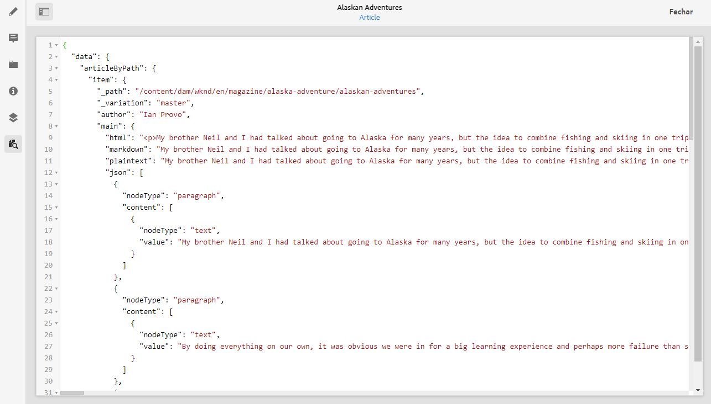
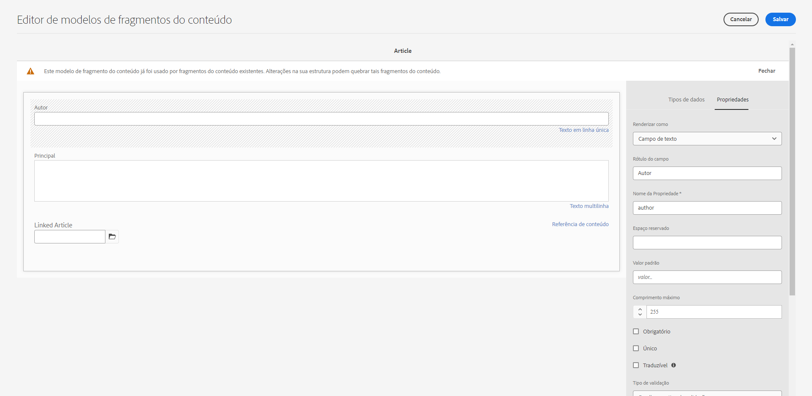
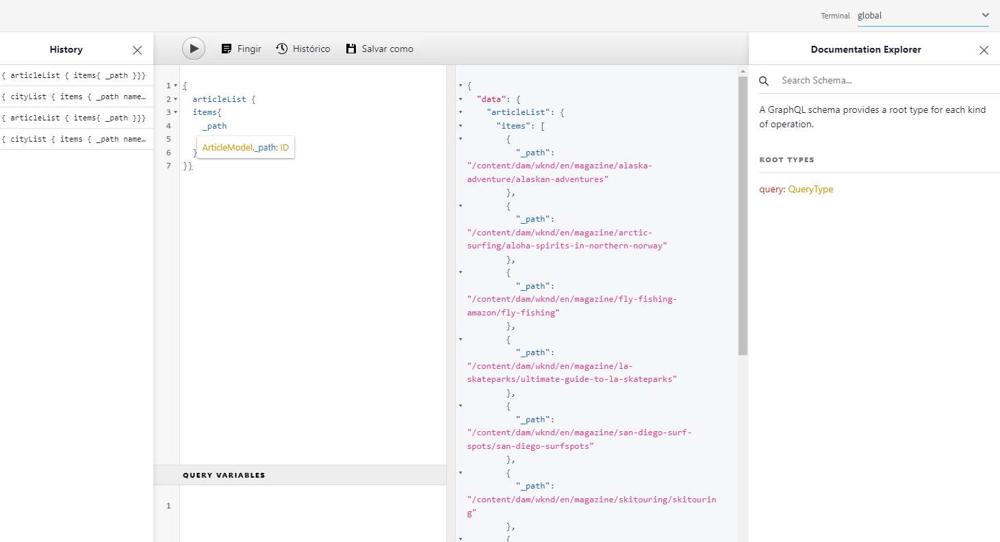

# Como acessar seu conteúdo por meio AEM APIs de entrega {#access-your-content}

Nesta parte do [AEM Jornada de desenvolvedor sem periféricos,](overview.md) você pode aprender a usar consultas GraphQL para acessar o conteúdo dos Fragmentos de conteúdo e alimentá-lo em seu aplicativo (entrega sem cabeçalho).

>[!NOTE]
>
>Parte da funcionalidade desse recurso está disponível no canal de pré-lançamento. Especificamente, a funcionalidade relacionada às consultas persistentes.
> 
>Consulte a [Documentação do canal de pré-lançamento](https://experienceleague.adobe.com/docs/experience-manager-cloud-service/content/release-notes/prerelease.html?lang=pt-BR#enable-prerelease) para obter informações sobre como habilitar o recurso no seu ambiente.

## A História Até Agora {#story-so-far}

No documento anterior da jornada sem cabeçalho AEM, [Como modelar seu conteúdo](model-your-content.md) você aprendeu as noções básicas da modelagem de conteúdo no AEM, então agora deve entender como modelar sua estrutura de conteúdo e, em seguida, perceber essa estrutura usando AEM Modelos de fragmento de conteúdo e Fragmentos de conteúdo:

* Reconhecer os conceitos e a terminologia relacionados à modelagem de conteúdo.
* Entenda por que a modelagem de conteúdo é necessária para a entrega de conteúdo sem interface.
* Entenda como realizar essa estrutura usando AEM Modelos de fragmento de conteúdo (e criar conteúdo com Fragmentos de conteúdo).
* Entenda como modelar o conteúdo; princípios com amostras básicas.

Este artigo se baseia nesses fundamentos para que você entenda como acessar o conteúdo headless existente no AEM usando a API GraphQL AEM.

* **Público**: Iniciante
* **Objetivo**: Saiba como acessar o conteúdo dos Fragmentos de conteúdo usando AEM consultas GraphQL:
   * Apresente GraphQL e a API GraphQL AEM.
   * Saiba mais sobre os detalhes da API GraphQL da AEM.
   * Observe algumas consultas de amostra para ver como as coisas funcionam na prática.

## Então, gostaria de acessar seu conteúdo? {#so-youd-like-to-access-your-content}

Então...você tem todo esse conteúdo, perfeitamente estruturado (em Fragmentos de conteúdo) e apenas esperando para alimentar seu novo aplicativo. A questão é: como chegar lá?

O que você precisa é de uma maneira de direcionar conteúdo específico, selecionar o que precisa e retorná-lo ao seu aplicativo para processamento adicional.

Com o Adobe Experience Manager (AEM) as a Cloud Service, é possível acessar seletivamente os Fragmentos de conteúdo, usando a API GraphQL AEM, para retornar somente o conteúdo necessário. Isso significa que você pode realizar a entrega sem interface de conteúdo estruturado para uso em seus aplicativos.

>[!NOTE]
>
>AEM API GraphQL é uma implementação personalizada, com base na especificação da API GraphQL padrão.

## GraphQL - Uma introdução {#graphql-introduction}

GraphQL é uma especificação de código aberto que fornece:

* um idioma de consulta que permite selecionar conteúdo específico de objetos estruturados.
* um tempo de execução para realizar essas consultas com seu conteúdo estruturado.

GraphQL é um *strong* API digitada. Isso significa que *all* o conteúdo deve ser claramente estruturado e organizado por tipo, de modo que GraphQL *entendimento* o que acessar e como. Os campos de dados são definidos em esquemas GraphQL, que definem a estrutura dos objetos de conteúdo.

Os pontos de extremidade GraphQL fornecem os caminhos que respondem às consultas GraphQL.

Tudo isso significa que seu aplicativo pode selecionar com precisão, confiabilidade e eficiência o conteúdo de que precisa - exatamente o que você precisa quando usado com o AEM.

>[!NOTE]
>
>Consulte *GraphQL*.org e *GraphQL*.com.

<!--
## AEM and GraphQL {#aem-graphql}

GraphQL is used in various locations in AEM; for example:

* Content Fragments
  * A customized API has been developed for this use-case (Headless Delivery to your app).
    * This is the AEM GraphQL API.
* Commerce
  * AEM Commerce consumes data from a Commerce platform via GraphQL.
  * There are GraphQL integrations between AEM and various third-party commerce solutions, used with the extension hooks provided by the CIF Core Components.
    * This does not use the AEM GraphQL API.

>[!NOTE]
>
>This step of the Headless Journey is only concerned with the AEM GraphQL API and Content Fragments.
-->

## AEM API GraphQL {#aem-graphql-api}

A API GraphQL da AEM é uma versão personalizada baseada na especificação GraphQL da API padrão, especialmente configurada para permitir a execução de consultas (complexas) nos Fragmentos de conteúdo.

Fragmentos de conteúdo são usados, pois o conteúdo é estruturado de acordo com Modelos de fragmento de conteúdo. Isso atende a um requisito básico do GraphQL.

* Um Modelo de fragmento de conteúdo é composto de um ou mais campos.
   * Cada campo é definido de acordo com um Tipo de dados.
* Os Modelos de Fragmento de conteúdo são usados para gerar os Esquemas GraphQL AEM correspondentes.

Para realmente acessar GraphQL para AEM (e o conteúdo), um ponto de extremidade é usado para fornecer o caminho de acesso.

O conteúdo retornado, por meio da API GraphQL da AEM, pode ser usado pelos seus aplicativos.

Para ajudá-lo a inserir diretamente e testar consultas, uma implementação da interface GraphiQL padrão também está disponível para uso com AEM GraphQL (isso pode ser instalado com AEM). Ele fornece recursos como realce de sintaxe, preenchimento automático, sugestão automática, juntamente com um histórico e documentação online.

>[!NOTE]
>
>A implementação AEM da API GraphQL é baseada nas bibliotecas GraphQL Java.

<!--
### Use Cases for Author and Publish Environments {#use-cases-author-publish-environments}

The use cases for the AEM GraphQL API can depend on the type of AEM as a Cloud Service environment:

* Publish environment; used to: 
  * Query content for JS application (standard use-case)

* Author environment; used to: 
  * Query content for "content management purposes":
    * GraphQL in AEM as a Cloud Service is currently a read-only API.
    * The REST API can be used for CR(u)D operations.
-->

## Fragmentos de conteúdo para uso com a API GraphQL da AEM {#content-fragments-use-with-aem-graphql-api}

Os Fragmentos de conteúdo podem ser usados como base para GraphQL para AEM schemas e consultas como:

* Eles permitem que você crie, crie, prepare e publique conteúdo independente de página que possa ser entregue sem periféricos.
* Elas são baseadas em um Modelo de fragmento de conteúdo, que predefine a estrutura do fragmento resultante usando uma seleção de tipos de dados.
* É possível obter camadas adicionais de estrutura com o tipo de dados Referência de fragmento , disponível ao definir um modelo.

### Modelos de fragmentos do conteúdo {#content-fragments-models}

Esses modelos de fragmentos de conteúdo:

* São usados para gerar os Esquemas, uma vez **Ativado**.
* Forneça os tipos de dados e campos necessários para GraphQL. Eles garantem que seu aplicativo solicite apenas o que é possível e receba o que é esperado.
* O tipo de dados **Referências de fragmento** O pode ser usado no modelo para fazer referência a outro Fragmento de conteúdo e, portanto, introduzir níveis adicionais de estrutura.

### Referências de fragmento {#fragment-references}

O **Referência do fragmento**:

* É um tipo de dados específico disponível ao definir um Modelo de fragmento de conteúdo.
* Faz referência a outro fragmento, dependendo de um modelo de fragmento de conteúdo específico.
* Permite criar e recuperar dados estruturados.

   * Quando definido como um **multifeed**, vários subfragmentos podem ser referenciados (recuperados) pelo fragmento principal.

### Visualização JSON {#json-preview}

Para ajudar na criação e desenvolvimento dos Modelos de fragmento de conteúdo, é possível visualizar a saída JSON no Editor de fragmento de conteúdo.



<!--
## GraphQL Schema Generation from Content Fragments {#graphql-schema-generation-content-fragments}

GraphQL is a strongly typed API, which means that content must be clearly structured and organized by type. The GraphQL specification provides a series of guidelines on how to create a robust API for interrogating content on a certain instance. To do this, a client needs to fetch the Schema, which contains all the types necessary for a query. 

For Content Fragments, the GraphQL schemas (structure and types) are based on **Enabled** Content Fragment Models and their data types.

>[!CAUTION]
>
>All the GraphQL schemas (derived from Content Fragment Models that have been **Enabled**) are readable through the GraphQL endpoint.
>
>This means that you need to ensure that no sensitive content is available, to ensure that no sensitive data is exposed via GraphQL endpoints; for example, this includes information that could be present as field names in the model definition.

For example, if a user created a Content Fragment Model called `Article`, then AEM generates the object `article` that is of a type `ArticleModel`. The fields within this type correspond to the fields and data types defined in the model.

1. A Content Fragment Model:

   

1. The corresponding GraphQL schema (output from GraphiQL automatic documentation):
   

   This shows that the generated type `ArticleModel` contains several [fields](#fields). 
   
   * Three of them have been controlled by the user: `author`, `main` and `referencearticle`.

   * The other fields were added automatically by AEM, and represent helpful methods to provide information about a certain Content Fragment; in this example, `_path`, `_metadata`, `_variations`. These [helper fields](#helper-fields) are marked with a preceding `_` to distinguish between what has been defined by the user and what has been auto-generated.

1. After a user creates a Content Fragment based on the Article model, it can then be interrogated through GraphQL. For examples, see the Sample Queries.md#graphql-sample-queries) (based on a sample Content Fragment structure for use with GraphQL.

In GraphQL for AEM, the schema is flexible. This means that it is auto-generated each and every time a Content Fragment Model is created, updated or deleted. The data schema caches are also refreshed when you update a Content Fragment Model.

The Sites GraphQL service listens (in the background) for any modifications made to a Content Fragment Model. When updates are detected, only that part of the schema is regenerated. This optimization saves time and provides stability.

So for example, if you:

1. Install a package containing `Content-Fragment-Model-1` and `Content-Fragment-Model-2`:
 
   1. GraphQL types for `Model-1` and `Model-2` will be generated.

1. Then modify `Content-Fragment-Model-2`:

   1. Only the `Model-2` GraphQL type will get updated.

   1. Whereas `Model-1` will remain the same. 

>[!NOTE]
>
>This is important to note in case you want to do bulk updates on Content Fragment Models through the REST api, or otherwise.

The schema is served through the same endpoint as the GraphQL queries, with the client handling the fact that the schema is called with the extension `GQLschema`. For example, performing a simple `GET` request on `/content/cq:graphql/global/endpoint.GQLschema` will result in the output of the schema with the Content-type: `text/x-graphql-schema;charset=iso-8859-1`.

### Schema Generation - Unpublished Models {#schema-generation-unpublished-models}

When Content Fragments are nested it can happen that a parent Content Fragment Model is published, but a referenced model is not.

>[!NOTE]
>
>The AEM UI prevents this happening, but if publishing is made programmatically, or with content packages, it can occur.

When this happens, AEM generates an *incomplete* Schema for the parent Content Fragment Model. This means that the Fragment Reference, which is dependent on the unpublished model, is removed from the schema.

## AEM GraphQL Endpoints {#aem-graphql-endpoints}

An endpoint is the path used to access GraphQL for AEM. Using this path you (or your app) can:

* access the GraphQL schemas,
* send your GraphQL queries,
* receive the responses (to your GraphQL queries).

AEM allows for:

* A global endpoint - available for use by all sites.
* Endpoints for specific Sites configurations - that you can configure (in the Configuration Browser), specific to a specified site/project.

## Permissions {#permissions}

The permissions are those required for accessing Assets.

## The AEM GraphiQL Interface {#aem-graphiql-interface}

To help you directly input, and test queries, an implementation of the standard GraphiQL interface is available for use with AEM GraphQL. This can be installed with AEM.

>[!NOTE]
>
>GraphiQL is bound the global endpoint (and does not work with other endpoints for specific Sites configurations).

It provides features such as syntax-highlighting, auto-complete, auto-suggest, together with a history and online documentation.


-->

## Na verdade, usando a API GraphQL AEM {#actually-using-aem-graphiql}

### Configuração inicial {#initial-setup}

Antes de começar com queries no seu conteúdo, você precisa:

* Ativar o terminal
   * Use Ferramentas -> Geral -> GraphQL
   * [Habilitação do seu endpoint de GraphQL](/help/headless/graphql-api/graphql-endpoint.md)

* Instalar GraphiQL (se necessário)
   * Instalado como um pacote dedicado
   * [Instalação da interface GraphiQL AEM](/help/headless/graphql-api/graphiql-ide.md)

### Estrutura de exemplo {#sample-structure}

Para realmente usar a API GraphQL AEM em uma consulta, podemos usar as duas estruturas muito básicas do Modelo de fragmento de conteúdo:

* Empresa
   * Nome - Texto
   * CEO (Pessoa) - Referência do fragmento
   * Funcionários (Pessoas) - Referência(ões) aos fragmentos
* Pessoa
   * Nome - Texto
   * Nome - Texto

Como é possível ver, os campos CEO e Employees fazem referência aos fragmentos Pessoa.

Os modelos de fragmento serão usados:

* ao criar o conteúdo no Editor de fragmento de conteúdo
* para gerar os esquemas GraphQL que você consultará

### Onde testar suas consultas {#where-to-test-your-queries}

As consultas podem ser inseridas na interface GraphiQL. Você pode acessar o editor de consultas por meio de:

* **Ferramentas** -> **Geral** -> **Editor de consultas GraphQL**
* Diretamente; por exemplo, `http://localhost:4502/aem/graphiql.html`


### Introdução a Consultas {#getting-Started-with-queries}

Uma consulta simples é retornar o nome de todas as entradas no schema Empresa. Aqui você solicita uma lista de todos os nomes de empresas:

```xml
query {
  companyList {
    items {
      name
    }
  }
}
```

Uma consulta um pouco mais complexa é selecionar todas as pessoas que não têm o nome de &quot;Trabalhos&quot;. Isso filtrará todas as pessoas para qualquer pessoa que não tenha o nome Trabalhos. Isso é feito com o operador EQUALS_NOT (há muito mais):

```xml
query {
  personList(filter: {
    name: {
      _expressions: [
        {
          value: "Jobs"
          _operator: EQUALS_NOT
        }
      ]
    }
  }) {
    items {
      name
      firstName
    }
  }
}
```

Você também pode criar consultas mais complexas. Por exemplo, consulte todas as empresas que tenham pelo menos um funcionário com o nome de &quot;Smith&quot;. Esta consulta ilustra a filtragem de qualquer pessoa com o nome &quot;Smith&quot;, retornando informações de todos os fragmentos aninhados:

```xml
query {
  companyList(filter: {
    employees: {
      _match: {
        name: {
          _expressions: [
            {
              value: "Smith"
            }
          ]
        }
      }
    }
  }) {
    items {
      name
      ceo {
        name
        firstName
      }
      employees {
        name
        firstName
      }
    }
  }
}
```

<!-- need code / curl / cli examples-->

Para obter todos os detalhes sobre o uso da API GraphQL da AEM, juntamente com a configuração dos elementos necessários, é possível fazer referência a:

* Aprendendo a usar GraphQL com AEM
* A estrutura do fragmento de conteúdo de amostra
* Saiba como usar o GraphQL com o AEM - Exemplos de conteúdo e consultas

## O que vem a seguir {#whats-next}

Agora que você aprendeu a acessar e consultar o conteúdo sem periféricos usando a API GraphQL AEM, agora é possível [saiba como usar a REST API para acessar e atualizar o conteúdo dos Fragmentos de conteúdo](update-your-content.md).

## Recursos adicionais {#additional-resources}

* [GraphQL.org](https://graphql.org)
   * [Esquema](https://graphql.org/learn/schema/)
   * [Variáveis](https://graphql.org/learn/queries/#variables)
   * [Bibliotecas GraphQL Java](https://graphql.org/code/#java)
* [GraphiQL](https://graphql.org/learn/serving-over-http/#graphiql)
* [Aprendendo a usar GraphQL com AEM](/help/headless/graphql-api/content-fragments.md)
   * [Habilitação do seu endpoint de GraphQL](/help/headless/graphql-api/graphql-endpoint.md)
   * [Instalação da interface GraphiQL AEM](/help/headless/graphql-api/graphiql-ide.md)
* [A estrutura do fragmento de conteúdo de amostra](/help/headless/graphql-api/sample-queries.md#content-fragment-structure-graphql)
* [Saiba como usar o GraphQL com o AEM - Exemplos de conteúdo e consultas](/help/headless/graphql-api/sample-queries.md)
   * [Exemplo de consulta - Um único fragmento de cidade específico](/help/headless/graphql-api/sample-queries.md#sample-single-specific-city-fragment)
   * [Exemplo de consulta para metadados - listar os metadados para prêmios denominados GB](/help/headless/graphql-api/sample-queries.md#sample-metadata-awards-gb)
   * [Exemplo de consulta - Todas as cidades com uma variação nomeada](/help/headless/graphql-api/sample-queries.md#sample-cities-named-variation)
* [Ativar a funcionalidade de fragmento de conteúdo no navegador de configuração](/help/assets/content-fragments/content-fragments-configuration-browser.md#enable-content-fragment-functionality-in-configuration-browser)
* [Trabalho com fragmentos de conteúdo](/help/assets/content-fragments/content-fragments.md)
   * [Modelos de fragmentos do conteúdo](/help/assets/content-fragments/content-fragments-models.md)
   * [Saída JSON](/help/assets/content-fragments/content-fragments-json-preview.md)
* [Entenda o CORS (Cross-Origin Resource Sharing, Compartilhamento de recursos entre origens)](https://experienceleague.adobe.com/docs/experience-manager-learn/foundation/security/understand-cross-origin-resource-sharing.html?lang=en#understand-cross-origin-resource-sharing-(cors))
* [Geração de tokens de acesso para APIs do lado do servidor](/help/implementing/developing/introduction/generating-access-tokens-for-server-side-apis.md)
* [Introdução ao AEM Headless](https://experienceleague.adobe.com/docs/experience-manager-learn/getting-started-with-aem-headless/graphql/overview.html?lang=pt-BR) - Uma pequena série de tutoriais em vídeo que fornece uma visão geral do uso de AEM recursos headless, incluindo modelagem de conteúdo e GraphQL.
