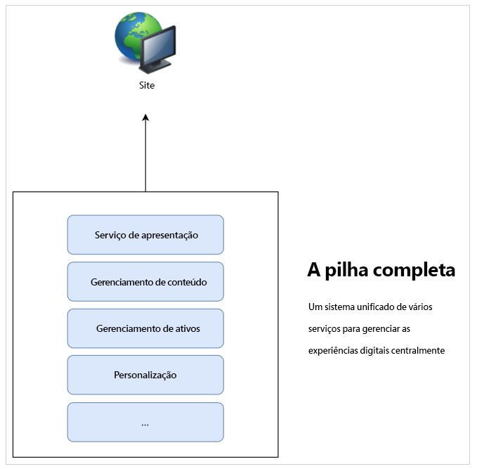
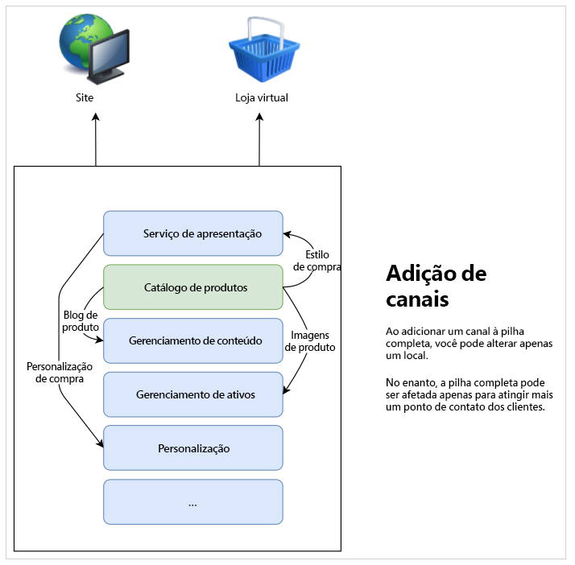
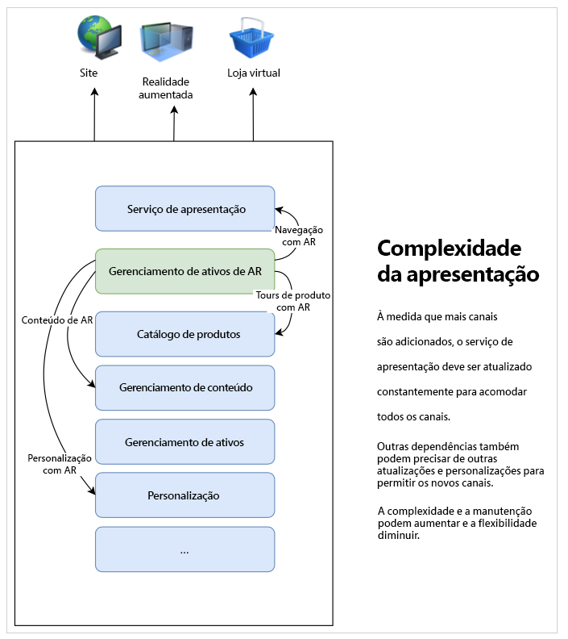
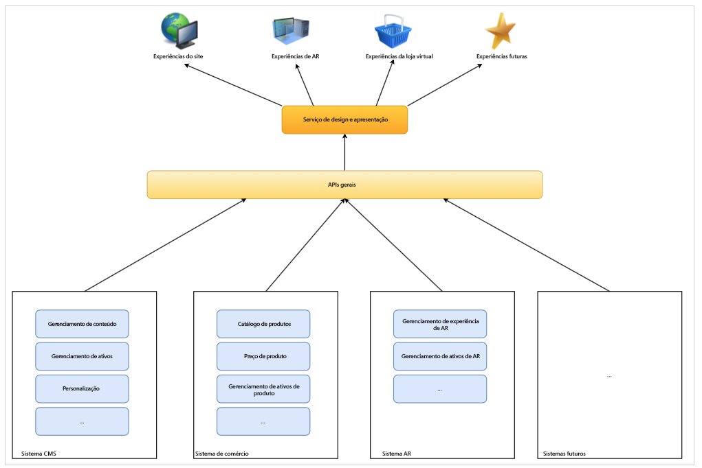

# Saiba mais sobre o desenvolvimento headless do CMS {#learn-about}

Nesta parte da [Jornada do AEM Headless Developer](overview.md), conheça a tecnologia headless e por que usá-la.

## Objetivo {#objective}

Este documento ajuda você a entender a entrega de conteúdo headless e por que ela deve ser usada. Depois de ler esse documento, você deverá:

* Entender os conceitos básicos e a terminologia da entrega de conteúdo headless
* Entender por que e quando a tecnologia headless é necessária
* Saber em nível avançado como os conceitos headless são usados e como eles se relacionam

## Entregar conteúdo em pilha completa {#full-stack}

Desde a ascensão dos sistemas de gerenciamento de conteúdo (CMS) de larga escala e fácil utilização, as organizações estão usando-os como um local central para gerenciar mensagens, comunicações e a identidade visual de sua marca. Usar o CMS como ponto central para administrar experiências melhorou a eficiência, eliminando a necessidade de duplicar tarefas em sistemas diferentes.

Em uma CMS de pilha completa, a funcionalidade para manipular o conteúdo está no CMS. Os recursos do sistema constituem componentes diferentes da pilha do CMS. A solução de pilha completa tem muitas vantagens.

* Você tem um sistema para manter.
* O conteúdo é gerenciado centralmente.
* Todos os serviços do sistema estão integrados.
* A criação de conteúdo é contínua.

Portanto, se quiser adicionar um novo canal ou oferecer suporte a novos tipos de experiências, você poderá inserir um (ou mais) novo(s) componente(s) à pilha e fazer alterações em apenas um local.

A complexidade das dependências na pilha rapidamente se torna aparente, pois você vê que outros itens na pilha podem precisar ser ajustados para acomodar as alterações.

## Limites da entrega em pilha completa {#limits}

A abordagem de pilha completa cria inerentemente um silo em que todas as experiências acabam em um sistema. As alterações ou adições a um componente do silo exigem alterações em outros componentes que podem fazer mudanças demoradas e caras.

Isso é particularmente verdadeiro para o sistema de apresentação, que em configurações tradicionais costuma estar fortemente vinculado ao CMS. Qualquer novo canal geralmente significa uma atualização do sistema de apresentação, que pode afetar todos os outros canais.

As limitações desse silo natural podem se tornar evidentes à medida que você se esforça para coordenar as alterações em todos os componentes da pilha.

Os usuários esperam engajamento independentemente da plataforma ou do ponto de contato, o que requer agilidade na maneira como você apresenta suas experiências.  Essa abordagem multicanal é o padrão das experiências digitais e uma abordagem de pilha completa pode, em determinadas circunstâncias, revelar-se inflexível.

## A interface no headless {#the-head}

A interface de qualquer sistema é geralmente o renderizador de saída, normalmente na forma de uma GUI ou outra saída gráfica.

Um servidor headless, por exemplo, provavelmente está em um rack em uma sala de servidores em algum lugar e não tem nenhum monitor conectado. Para acessá-lo, você precisa se conectar remotamente a ele. Nesse caso, o monitor é a interface, à medida que resolve a renderização da saída do servidor. Como consumidor do serviço, forneça sua própria interface (o monitor) ao se conectar remotamente a ele.

Quando falamos de um CMS headless, o CMS gerencia o conteúdo e continua a entregá-lo aos consumidores. No entanto, apenas entregando o **conteúdo** de forma padronizada, um CMS headless omite a renderização final de saída, deixando a **apresentação** do conteúdo para o serviço de consumo.

Os serviços de consumo, sejam experiências de RA, um webshop, experiências móveis, aplicativos web progressivos (PWAs) e assim por diante, recebem conteúdo do CMS headless e fornecem sua própria renderização. Eles fornecem suas próprias interfaces para o conteúdo.

Omitir a interface simplifica o CMS ao remover a complexidade. Isso também altera a responsabilidade de renderizar o conteúdo para os serviços que realmente precisam do conteúdo e que geralmente são mais adequados para essa renderização.

## Dissociação {#decoupling}

A entrega headless é possível expondo um conjunto de interfaces de programação de aplicativo (APIs) robustas e flexíveis que todas as suas experiências podem selecionar. A API atua como um idioma comum entre os serviços, vinculando-os no nível de conteúdo por meio de uma entrega de conteúdo padronizada, mas proporcionando flexibilidade para implementar suas próprias soluções.

Headless é um exemplo de dissociação do conteúdo de sua apresentação. Ou, em um sentido mais genérico, significa dissociar o front-end do back-end na sua pilha de serviço. Em uma configuração headless, o sistema de apresentação (a interface) é dissociado do gerenciamento de conteúdo (o tail). Os dois só interagem por meio de chamadas de API.

Essa dissociação significa que cada serviço de consumo (o front-end) pode criar sua experiência com base no mesmo conteúdo fornecido sobre as APIs, garantindo a reutilização e a consistência do conteúdo. Os serviços de consumo podem, então, implementar seus próprios sistemas de apresentação, permitindo que a pilha de gerenciamento de conteúdo (o back-end) seja facilmente dimensionada horizontalmente.

## Base tecnológica {#technology}

Uma abordagem headless permite criar uma pilha de tecnologia que pode se adaptar fácil e rapidamente às futuras demandas de experiência digital.

No passado, as APIs para CMS normalmente eram baseadas em REST. A transferência de estado representacional (REST) fornece recursos no formato de texto “stateless” (sem salvamento de estado). Isso permite que os recursos sejam lidos e modificados com um conjunto predefinido de operações. O REST permitia uma grande interoperabilidade entre serviços na Web, garantindo a representação do conteúdo sem salvamento de estado.

Ainda há necessidade de APIs REST robustas. No entanto, as solicitações REST podem ser grandes e detalhadas. Se você tiver vários consumidores fazendo chamadas REST para todos os seus canais, esse excesso de detalhes se acumula e o desempenho pode ser afetado.

A entrega de conteúdo headless geralmente usa APIs GraphQL. O GraphQL permite uma transferência sem estado semelhante, mas possibilita consultas mais direcionadas, reduzindo o número total de consultas necessárias e melhorando o desempenho. É comum ver soluções que usam uma mistura de REST e GraphQL, escolhendo a melhor ferramenta de acordo com a tarefa.

Independentemente da API escolhida, ao definir um sistema headless com base em APIs comuns, você pode aproveitar o navegador mais recente e outras tecnologias da web, como aplicativos web progressivos (PWA). As APIs criam uma interface padrão que é facilmente extensível e adaptável.

Normalmente, o conteúdo é renderizado no lado do cliente. Isso normalmente significa que alguém chama seu conteúdo em um dispositivo móvel, o CMS fornece o conteúdo e, em seguida, o dispositivo móvel (do cliente) é responsável pela renderização do conteúdo que você disponibilizou. Se o dispositivo for antigo ou estiver lento, sua experiência digital também será lenta.

A dissociação do conteúdo da apresentação significa que pode haver mais controle sobre essas preocupações de desempenho do lado do cliente. A renderização do lado do servidor (SSR) transfere a responsabilidade de renderizar o conteúdo do navegador do cliente para o servidor. Isso permite que você, como provedor do conteúdo, possa oferecer um nível de desempenho garantido para o seu público-alvo, se isso for necessário.

## Desafios organizacionais {#organization}

O headless abre um mundo de flexibilidade para fornecer suas experiências digitais. Mas esta flexibilidade pode também apresentar seus próprios desafios.

Ter muitos canais diferentes pode significar que cada um tem seus próprios sistemas de apresentação. Mesmo que todos consumam o mesmo conteúdo por meio das mesmas APIs, a experiência pode não ser a mesma por causa das diferentes apresentações. Preocupação e cuidado devem ser dados para assegurar a consistência da experiência do cliente.

Ao implementar sistemas de design cuidadosos, compartilhar bibliotecas de padrões e usar componentes de design reutilizáveis e estruturas estabelecidas e abertas do lado do cliente, experiências consistentes podem ser garantidas, mas isso deve ser planejado.

## O futuro é headless e o futuro é agora {#future}

As experiências digitais continuarão a definir como as marcas interagem com os clientes. O que é empolgante sobre o design headless é a flexibilidade que ele fornece para responder às expectativas do cliente em evolução.

É impossível prever o futuro, mas a tecnologia headless fornece a agilidade para reagir ao que quer que esse futuro traga.

## AEM e Headless {#aem-and-headless}

À medida que você avança nesta jornada de desenvolvedor, aprenderá como a AEM oferece suporte à entrega headless, juntamente com seus recursos de entrega de pilha completa.

Como líder da indústria em gerenciamento de experiência digital, a Adobe percebe que a solução ideal para os desafios do mundo real que os criadores de experiências enfrentam raramente é uma escolha binária. É por isso que o AEM não apenas oferece suporte a ambos os modelos, mas também permite de forma única a combinação híbrida perfeita dos dois, misturando as vantagens da pilha completa e da tecnologia headless, para ajudá-lo a atender melhor os consumidores do seu conteúdo, onde quer que estejam.

Essa jornada se concentra exclusivamente no modelo headless de entrega de conteúdo. No entanto, uma vez que tenha esse conhecimento fundamental, você poderá explorar ainda mais como utilizar o potencial de ambos os modelos.

## O que vem a seguir {#what-is-next}

Obrigado por começar a sua jornada headless do AEM. Agora que leu este documento, você deve:

* Entender os conceitos básicos e a terminologia da entrega de conteúdo headless.
* Entender por que e quando o headless é necessário.
* Possuir um conhecimento de alto nível sobre o uso dos conceitos headless e como eles se relacionam.

Desenvolva esse conhecimento e prossiga com sua jornada do AEM headless revisando a seguir o documento [Introdução ao AEM headless as a Cloud Service](getting-started.md), onde você aprende a configurar as ferramentas necessárias e como começar a pensar sobre como o AEM aborda a entrega de conteúdo headless e seus pré-requisitos.

## Recursos adicionais {#additional-resources}

Embora seja recomendável seguir para a próxima parte da jornada de desenvolvimento headless revisando o documento [Introdução ao AEM Headless as a Cloud Service](getting-started.md), a seguir estão alguns recursos adicionais e opcionais que aprofundam alguns conceitos mencionados neste documento, mas não são necessários para continuar na jornada headless.

* [Uma Introdução à Arquitetura do Adobe Experience Manager as a Cloud Service](/help/overview/architecture.md) - Compreender a estrutura do AEM as a Cloud Service
* Uma [Introdução ao AEM as a Headless CMS](/help/headless/introduction.md)
* O [Portal do Desenvolvedor do AEM](https://experienceleague.adobe.com/landing/experience-manager/headless/developer.html?lang=pt-BR)
* [Tutoriais AEM Headless](https://experienceleague.adobe.com/docs/experience-manager-learn/getting-started-with-aem-headless/overview.html?lang=pt-BR) - Use esses tutoriais práticos para explorar como utilizar as várias opções para fornecer conteúdo a endpoints headless com o AEM e escolha o que é certo para você.
