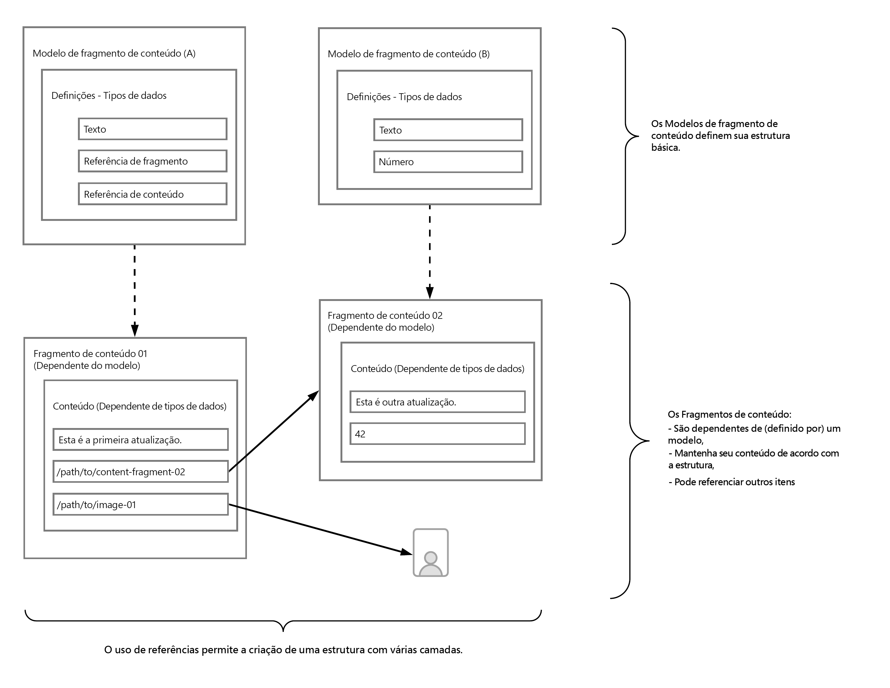
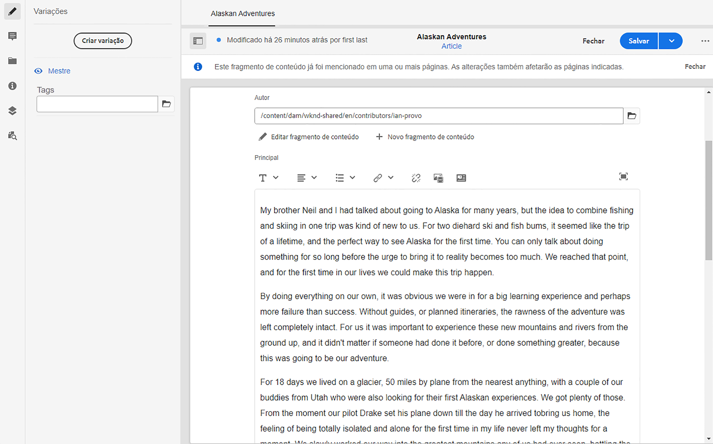

# Como modelar seu conteúdo {#model-your-content}

Nesta parte da [AEM Jornada do desenvolvedor headless](overview.md), você pode aprender a modelar sua estrutura de conteúdo. Em seguida, perceba essa estrutura do Adobe Experience Manager (AEM) usando Modelos de fragmentos de conteúdo e Fragmentos de conteúdo, para reutilização em canais.

## A História Até Agora {#story-so-far}

No início, [Saiba mais sobre o CMS Headless Development](learn-about.md) cobriu a entrega de conteúdo sem cabeçalho e por que ele deve ser usado. Em seguida, [Introdução ao AEM Headless como um Cloud Service](getting-started.md) descrito AEM Headless no contexto de seu próprio projeto.

No documento anterior da jornada sem cabeçalho AEM, [Caminho para sua primeira experiência usando AEM headless](path-to-first-experience.md), você aprendeu as etapas necessárias para implementar seu primeiro projeto. Depois de lê-lo, você deve:

* Entender considerações importantes de planejamento para projetar seu conteúdo
* Entenda as etapas para implementar sem periféricos dependendo dos requisitos de nível de integração.
* Configure as ferramentas e as configurações de AEM necessárias.
* Conheça as práticas recomendadas para tornar sua jornada sem interface suave, manter a geração de conteúdo eficiente e garantir que o conteúdo seja entregue rapidamente.

Este artigo se baseia nesses fundamentos para que você entenda como preparar seu próprio projeto sem periféricos AEM.

## Objetivo {#objective}

* **Público-alvo**: Iniciante
* **Objetivo**: Saiba como modelar sua estrutura de conteúdo e, em seguida, perceber essa estrutura usando AEM Modelos de fragmento de conteúdo e Fragmentos de conteúdo:
   * Introduza conceitos e terminologia relacionados à modelagem de dados/conteúdo.
   * Saiba por que a modelagem de conteúdo é necessária para a entrega de conteúdo sem interface.
   * Saiba como realizar essa estrutura usando AEM Modelos de fragmento de conteúdo (e criar conteúdo com Fragmentos de conteúdo).
   * Saiba como modelar seu conteúdo; princípios com amostras básicas.

>[!NOTE]
>
>A Modelagem de Dados é um campo muito grande, pois é usado ao desenvolver Bancos de Dados Relacionais. Há muitos livros, e fontes de informação online, disponíveis.
>
>Somente consideraremos os aspectos que são de interesse ao modelar dados para uso com AEM Headless.

## Modelagem de conteúdo {#content-modeling}

*É um mundo grande e ruim lá* fora.

Talvez, talvez não, mas é certamente um grande ***complicado*** mundo afora e a modelagem de dados é usada para definir uma representação simplificada de uma subseção muito (muito) pequena, usando as informações específicas necessárias para um certo propósito.

>[!NOTE]
>
>Como AEM trata do conteúdo, referimos a Modelagem de dados como a Modelagem de conteúdo.

Por exemplo:

Há muitas escolas, mas todas têm várias coisas em comum:

* Uma localização
* Professor Chefe
* Muitos professores
* Muitos membros do pessoal não docente
* Muitos alunos
* Muitos ex-professores
* Muitos ex-alunos
* Muitas salas de aula
* Muitos (muitos) livros
* Muitos (muitos) equipamentos
* Muitas atividades extrapatrimoniais
* e assim por diante....

Mesmo num exemplo tão pequeno, a lista pode parecer interminável. Mas se você simplesmente quiser que seu aplicativo execute uma tarefa simples, precisará limitar as informações ao essencial.

Por exemplo, a publicidade de eventos especiais para todas as escolas da área:

* Nome da escola
* Local da escola
* Professor principal
* Tipo de evento
* Data do evento
* Professor organizando o evento

### Conceitos  {#concepts}

O que você deseja descrever é chamado de **Entities** - basicamente os &quot;itens&quot; sobre os quais queremos armazenar informações.

As informações que queremos armazenar sobre eles são os **Atributos** (propriedades), como Nome e Qualificações para os professores.

Em seguida, há vários **Relacionamentos** entre as entidades. Por exemplo, geralmente uma escola tem apenas um professor titular e muitos professores (e geralmente o professor principal também é professor).

O processo de análise e definição dessas informações, juntamente com as relações entre elas, é chamado de **Modelagem de Conteúdo**.

### Básico {#basics}

Frequentemente, é necessário começar elaborando um **Esquema Conceitual** que descreva as entidades e seus relacionamentos. Geralmente, isso é de alto nível (conceitual).

Depois que isso estiver estável, você poderá traduzir os modelos em um **Esquema lógico** que descreve as entidades, juntamente com os atributos, e os relacionamentos. Nesse nível, você deve examinar as definições cuidadosamente para eliminar a duplicação e otimizar o design.

>[!NOTE]
>
>Às vezes, essas duas etapas são mescladas, frequentemente dependendo da complexidade do seu cenário.

Por exemplo, você precisa de entidades separadas para `Head Teacher` e `Teacher`, ou simplesmente um atributo adicional no modelo `Teacher`?

### Garantia da integridade dos dados {#data-integrity}

A integridade dos dados é necessária para garantir a precisão e a consistência do conteúdo durante todo o ciclo de vida. Isso inclui garantir que os autores de conteúdo possam entender facilmente o que armazenar, para que os itens a seguir sejam vitais:

* uma estrutura clara
* uma estrutura o mais concisa possível (sem sacrificar a precisão)
* validação de campos individuais
* se for caso disso, restringir o conteúdo de campos específicos ao que é significativo

### Eliminação da redundância de dados {#data-redundancy}

A redundância de dados ocorre quando as mesmas informações são armazenadas duas vezes na estrutura de conteúdo. Isso deve ser evitado, pois pode gerar confusão ao criar o conteúdo e erros ao consultar; já para não falar do uso indevido do espaço de armazenamento.

### Otimização e desempenho {#optimization-and-performance}

Ao otimizar sua estrutura, você pode melhorar o desempenho, tanto para criação de conteúdo quanto para consultas.

Tudo é um ato de equilíbrio, mas a criação de uma estrutura demasiado complexa, ou com demasiados níveis, pode:

* Seja confuso para os autores que geram o conteúdo.

* Afete bastante o desempenho se a consulta tiver que acessar vários Fragmentos de conteúdo aninhados (referenciados) para recuperar o conteúdo necessário.

## Modelagem de conteúdo para AEM headless {#content-modeling-for-aem-headless}

A modelagem de dados é um conjunto de técnicas estabelecidas, geralmente usadas quando bancos de dados de relacionamento desenvolvidos, portanto, o que a modelagem de conteúdo significa para AEM headless?

### Por quê? {#why}

Para garantir que seu aplicativo possa solicitar e receber o conteúdo necessário de AEM de forma consistente e eficiente, esse conteúdo deve ser estruturado.

Isso significa que o aplicativo sabe antecipadamente a forma de resposta e, portanto, como processá-la. Isso é muito mais fácil do que receber conteúdo de forma livre, que deve ser analisado para determinar o que contém e, portanto, como ele pode ser usado.

### Introdução a Como? {#how}

O AEM usa Fragmentos de conteúdo para fornecer as estruturas necessárias para a entrega sem cabeçalho do conteúdo aos seus aplicativos.

A estrutura do modelo de conteúdo é:

* realizado pela definição do modelo de fragmento de conteúdo,
* usado como base dos Fragmentos de conteúdo usados para a geração de conteúdo.

>[!NOTE]
>
>Os Modelos do Fragmento de conteúdo também são usados como a base dos Esquemas GraphQL de AEM, usados para recuperar o conteúdo - mais sobre isso em uma sessão posterior.

As solicitações de conteúdo são feitas usando a API GraphQL AEM, uma implementação personalizada da API GraphQL padrão. A API GraphQL AEM permite executar consultas (complexas) nos Fragmentos de conteúdo, sendo que cada consulta é feita de acordo com um tipo de modelo específico.

O conteúdo retornado pode ser usado pelos seus aplicativos.

## Criar a estrutura com modelos de fragmento de conteúdo {#create-structure-content-fragment-models}

Os Modelos de fragmentos do conteúdo fornecem vários mecanismos que permitem definir a estrutura do conteúdo.

Um Modelo de fragmento de conteúdo descreve uma entidade.

>[!NOTE]
>Você deve ativar a funcionalidade de Fragmento de conteúdo no Navegador de configuração para criar novos modelos.

>[!TIP]
>
>O modelo deve ser nomeado para que o autor de conteúdo saiba qual modelo selecionar ao criar um Fragmento de conteúdo.

Dentro de um modelo:

1. **Os** Tipos de dados permitem definir os atributos individuais.
Por exemplo, defina o campo com o nome de um professor como **Text** e seus anos de serviço como **Number**.
1. Os tipos de dados **Referência de conteúdo** e **Referência de fragmento** permitem criar relacionamentos com outro conteúdo no AEM.
1. O tipo de dados **Referência do fragmento** permite que você atinja vários níveis de estrutura aninhando seus Fragmentos de conteúdo (de acordo com o tipo de modelo). Isso é essencial para a modelagem de conteúdo.

Por exemplo:

### Tipos de dados {#data-types}

AEM fornece os seguintes tipos de dados para você modelar o conteúdo:

* Texto em linha única
* Texto multilinha
* Número
* Booleano
* Data e hora
* Enumeração
* Tags
* Referência de conteúdo
* Referência do fragmento
* Objeto JSON

### Referências e conteúdo aninhado {#references-nested-content}

Dois tipos de dados fornecem referências ao conteúdo fora de um fragmento específico:

* ****
Referência de conteúdoFornece uma referência simples a outro conteúdo de qualquer tipo.
Por exemplo, você pode fazer referência a uma imagem em um local especificado.

* **Referência**
de fragmentoFornece referências a outros Fragmentos de conteúdo.
Esse tipo de referência é usado para criar conteúdo aninhado, introduzindo as relações necessárias para modelar seu conteúdo.
O tipo de dados pode ser configurado para permitir que os autores de fragmento:
   * Edite o fragmento referenciado diretamente.
   * Crie um novo fragmento de conteúdo, com base no modelo apropriado

### Criação de modelos de fragmentos do conteúdo {#creating-content-fragment-models}

No início, é necessário ativar os Modelos de fragmento de conteúdo para o site, isso é feito no Navegador de configuração; em Ferramentas -> Geral -> Navegador de configuração. Você pode optar por configurar a entrada global ou criar uma nova configuração. Por exemplo:

>[!NOTE]
>
>Consulte Recursos adicionais - Fragmentos de conteúdo no navegador de configuração

Em seguida, os Modelos de fragmentos de conteúdo podem ser criados e a estrutura definida. Isso pode ser feito em Ferramentas -> Ativos -> Modelos de fragmento de conteúdo. Por exemplo:

>[!NOTE]
>
>Consulte Recursos adicionais - Modelos de fragmento de conteúdo.

## Uso do modelo para criar conteúdo com fragmentos de conteúdo {#use-content-to-author-content}

Fragmentos de conteúdo são sempre baseados em um Modelo de fragmento de conteúdo. O modelo fornece a estrutura, o fragmento retém o conteúdo.

### Seleção do modelo apropriado {#select-model}

A primeira etapa para realmente criar o conteúdo é criar um Fragmento do conteúdo. Isso é feito usando Criar -> Fragmento de conteúdo na pasta necessária em Ativos -> Arquivos. O assistente o guiará pelas etapas.

Um Fragmento de conteúdo é baseado em um Modelo de fragmento de conteúdo específico, que pode ser selecionado como a primeira etapa do processo de criação.

### Criação e edição de conteúdo estruturado {#create-edit-structured-content}

Após a criação do fragmento, é possível abri-lo no Editor de fragmento do conteúdo. Aqui você pode:

* Edite o conteúdo no modo normal ou em tela cheia.
* Formate o conteúdo como Texto completo, Texto simples ou Marcação.
* Crie e gerencie Variações de seu conteúdo.
* Conteúdo associado.
* Editar os metadados.
* Mostrar a estrutura da árvore.
* Visualize a representação JSON.

### Criação de fragmentos de conteúdo {#creating-content-fragments}

Após selecionar o modelo apropriado, um Fragmento de conteúdo é aberto para edição no Editor de fragmento de conteúdo:

>[!NOTE]
>
>Consulte Recursos adicionais - Como trabalhar com fragmentos de conteúdo.

## Introdução a alguns exemplos {#getting-started-examples}

<!--
tbc...
...and/or see the structures covered for the GraphQL samples...
...will those (ever) be delivered as an official sample package?
-->

Para obter uma estrutura básica como amostra, consulte A estrutura do fragmento do conteúdo de amostra.

## O que vem a seguir {#whats-next}

Agora que você aprendeu a modelar sua estrutura e criar conteúdo dependente disso, a próxima etapa é [Saiba como usar consultas GraphQL para acessar e recuperar o conteúdo dos Fragmentos de conteúdo](access-your-content.md). Isso introduzirá e discutirá o GraphQL e, em seguida, observará algumas consultas de amostra para ver como as coisas funcionam na prática.

## Recursos adicionais {#additional-resources}

* [Trabalhar com fragmentos de conteúdo](/help/assets/content-fragments/content-fragments.md)  - a página principal dos fragmentos de conteúdo
   * [Fragmentos de conteúdo no navegador de configuração](/help/assets/content-fragments/content-fragments-configuration-browser.md)  - ative a funcionalidade Fragmento de conteúdo no navegador de configuração
   * [Modelos de fragmentos do conteúdo](/help/assets/content-fragments/content-fragments-models.md)  - criação e edição dos modelos de fragmentos do conteúdo
   * [Gerenciamento de fragmentos de conteúdo](/help/assets/content-fragments/content-fragments-managing.md)  - criação e criação de fragmentos de conteúdo; esta página o levará a outras seções detalhadas
* [AEM esquemas GraphQL](access-your-content.md)  - como o GraphQL realiza modelos
* [A estrutura do fragmento de conteúdo de amostra](/help/assets/content-fragments/content-fragments-graphql-samples.md#content-fragment-structure-graphql)
* [Introdução ao AEM Headless](https://experienceleague.adobe.com/docs/experience-manager-learn/getting-started-with-aem-headless/graphql/overview.html)  - Uma pequena série de tutoriais em vídeo que fornece uma visão geral do uso de AEM recursos headless, incluindo modelagem de conteúdo e GraphQL.
   * [Noções básicas sobre a modelagem GraphQL](https://experienceleague.adobe.com/docs/experience-manager-learn/getting-started-with-aem-headless/graphql/video-series/modeling-basics.html)  - saiba como definir e usar os Fragmentos de conteúdo no Adobe Experience Manager (AEM) para usar com GraphQL.
